## 🌟 引言
AdaGen: Workload-Adaptive Cluster Scheduler for Latency-Optimal LLM Inference Serving 是一篇 EuroSys 2026 系统论文，关注 LLM 推理服务中的集群级调度问题。它要解决的并不是单个 serving engine 内部如何做 continuous batching 或 KV cache 管理，而是多个 LLM serving instance 之间应该如何分配请求，才能让更多请求满足 TTFT/TBT SLO。

论文的核心判断很直接：现有多实例 LLM cluster scheduler 过度依赖负载均衡，尤其是 token 数或 KV cache 使用量的均衡。但 LLM 请求天然有不同的 prompt length 和 response length，同样的负载均衡结果可能形成完全不同的 compute layout，而 compute layout 才直接决定 TTFT 和 TBT。

> 一句话总结：AdaGen 把 LLM serving 的集群调度从“负载均衡”推进到“compute layout 优化”，通过长度/分布感知调度、layout simulation 和 selective distributed execution，在真实 trace 上实现最高 3.6x TTFT SLO attainment 提升，并达到约 2x cost-efficiency。

论文链接：[ACM DOI: 10.1145/3767295.3769345](https://doi.org/10.1145/3767295.3769345)

## 📌 论文基本信息
- 标题：AdaGen: Workload-Adaptive Cluster Scheduler for Latency-Optimal LLM Inference Serving
- 作者：Sudipta Saha Shubha, Ayush Goel, Diman Zad Tootaghaj, Khaled Diab, Hardik Soni, K. K. Ramakrishnan, Puneet Sharma, Haiying Shen
- 会议：EuroSys 2026
- 页码：1111-1127
- 研究领域：LLM Inference Serving、AI Infra、Cluster Scheduling、Distributed Systems
- 核心问题：在多实例 LLM serving 集群中，如何利用请求的 prefill/decode 长度差异优化 compute layout，从而提升 TTFT SLO attainment 并降低满足目标 SLO 所需的 GPU 成本。

## 🧩 背景与动机
LLM 推理通常分为两个阶段：

- Prefill：并行处理 prompt tokens，并生成 KV cache。
- Decode：自回归生成输出 tokens，每个请求每轮通常只能生成一个 decode token。

这两个阶段对调度的影响并不对称。Prefill 更像一次较大的并行计算，decode 则在多轮 iteration 中不断占用 batch slot 和 KV cache。Serving instance 内部的 scheduler 会在每一轮形成一个 batch，也就是论文所说的 compute layout：哪些 tokens 在第几轮、哪个 slot 被执行。

传统 cluster scheduler 主要关心负载均衡，比如把 token 数或内存压力均匀分到不同 instance。论文用图 1 说明了一个关键反例：两个调度方案都做到每个 instance 12 个 token，但 TTFT 不一样。

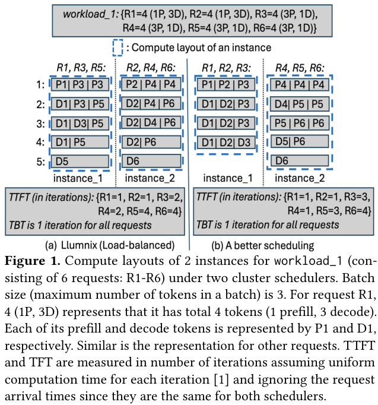

🔍 图 1 的重点不在于数值本身，而在于结构：Llumnix 式负载均衡把请求按 token 总量摊平，但不同 prefill/decode 组合在 decode-prioritizing instance scheduler 下会挤占不同位置。右侧方案没有改变总 token 负载，却让部分请求的 prefill 更早完成，从而降低平均 TTFT。

论文进一步通过真实 trace 做 exhaustive search。对于 Llama3-8B 和 Mixtral-8x7B，最优调度相比已有 scheduler 可获得 1.5x-1.9x 更低的 P90 TTFT；如果以最优策略的 P90 TTFT 作为 SLO，round-robin 和 Llumnix 的 SLO attainment 只有约 25% 和 45%，对应 2x-3.6x 改善空间。

这给出 AdaGen 的基本动机：LLM cluster scheduling 不能只问“哪个 instance 更空”，还要问“这个请求放进去之后会形成怎样的 token execution layout”。

## 🛠️ 方法详解
AdaGen 的设计可以拆成四个层次：

- 用 simulator 快速近似每个 instance 的 compute layout。
- 先按 prefill/decode 长度做 workload-adaptive scheduling。
- 如果 layout 出现不均衡，再按分布进行 reassignment。
- 最后对少量请求执行 selective distributed execution，把同一请求的 prefill 或 decode 放到不同 instance，以进一步改善 layout。

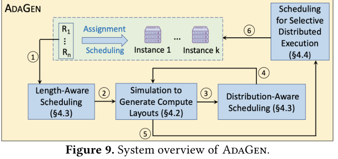

🧠 图 9 是论文的核心架构图。AdaGen 不再逐个请求做局部路由，而是在每个 scheduling time unit 中联合调度一个请求集合 `S_t`。每一步调度后，它都会用 simulator 生成候选 compute layout，再决定是否进入下一步优化。

### ⚙️ Compute Layout Simulator
真正执行每个候选调度方案显然不现实，因此 AdaGen 设计了一个 simulation-based estimator。它模拟 instance-level scheduler 的行为，例如 chunked-prefill-based decode-prioritizing scheduler 会优先填入 decode tokens，再用 prefill tokens 填剩余 batch slot。

难点在于可用显存不是静态值。LLM serving 的显存占用包括模型参数、KV cache 和其他运行时开销，其中 KV cache 会随着 active tokens 动态变化。AdaGen 通过维护 active token count 来估计 KV cache 大小，并结合 profile 得到模型参数与其他开销，从而估算每轮是否还能容纳更多 token。

如果预测 decode length 带来误差，AdaGen 会在实际执行结束后比较估计 active token count 和真实值；当误差超过 5% 时，后续调度会重新计算。这一点很重要，因为 scheduler 的判断依赖 predicted decode length，而论文中 DistillBERT predictor 在实验数据上的准确率约为 76.4%。

### ⚙️ 长度与分布感知调度
AdaGen 的第一步是 length-aware scheduling。直观地说，它会尽量避免把 long prefill 和 long decode 请求堆在同一个 instance 中，因为 decode-prioritizing scheduler 会让长 decode 不断抢占 batch slot，使长 prefill 更晚完成。

具体做法是：

- 将 prefill length 大于当前请求集合 P75 的阶段视为 long prefill。
- 将 predicted decode length 大于 P75 的阶段视为 long decode。
- 将 long prefill 尽量与 short decode 放在一类 instance。
- 将 short prefill 尽量与 long decode 放在另一类 instance。
- 如果一个请求的 prefill 和 decode 都长，或都短，AdaGen 可以把两个阶段放到不同 instance，并通过 KV cache migration 连接。

但只看长度仍然不够。如果某一类请求数量太多，可能导致某些 instance 的 compute layout iteration 数明显更长。于是 AdaGen 第二步做 distribution-aware reassignment：根据 simulator 生成的 layout，找出 iteration 数高于平均值的 overloaded instances 和低于平均值的 underloaded instances，再优先移动 sequence length 更长的请求，以更快缓解不均衡。

### ⚙️ Selective Distributed Execution
论文最有意思的机制是 selective distributed execution。传统系统通常只有在某个 instance 内存不够时才迁移请求；AdaGen 则认为，即使内存足够，也可以有选择地把某些请求的 prefill 或 decode 分配到不同 instance，因为这样可能让 source instance 的 layout 更紧凑。

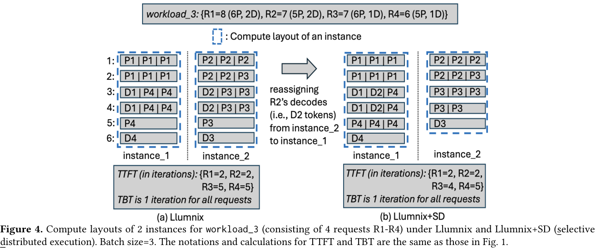

🖼️ 图 4 展示了一个简化例子。Llumnix 的调度已经没有内存溢出问题，但把 R2 的 decode 从 instance_2 转移到 instance_1 后，instance_2 中 R3 的 prefill 可以更早获得 slot，平均 TTFT 从 3.5 降到 3.25 iterations，而 TBT 不变。

这个机制的挑战在于组合空间很大：要选 source/destination instance pair，还要选哪些 request phase 迁移。AdaGen 采用两层近似：

- Instance pair selection：根据总 prefill tokens、总 decode tokens、请求最后一个 prefill iteration 中的平均 prefill tokens 等 layout 特征打分，高分 instance 更像 source，低分 instance 更像 destination。
- Request selection：对请求的 prefill/decode phase 分别构造 layout feature vector，用 DBSCAN 聚类，只评估每个 cluster 的代表请求。

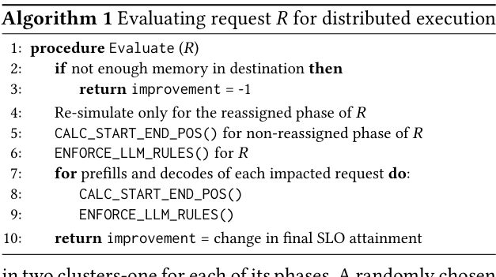

Algorithm 1 的关键是避免完整 re-simulation。AdaGen 只对被迁移的 phase 在 destination 上做局部模拟，然后直接根据 layout 中 token 位置的移动计算受影响请求的新 TTFT/TBT。

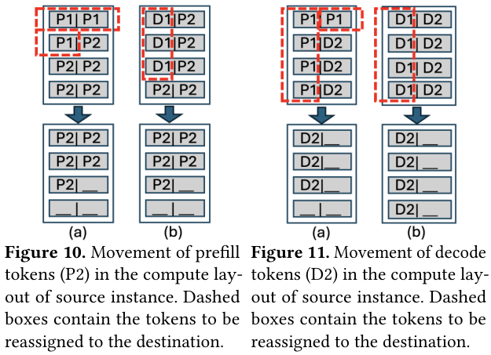

🔍 图 10 和图 11 解释了这个 heuristic 为什么可行。Prefill tokens 可以连续向左移动以填补空位；decode tokens 则受到自回归约束，同一请求每个 iteration 只能有一个 decode token。因此，AdaGen 必须分别处理 prefill 和 decode 的 start/end position，并通过 `ENFORCE_LLM_RULES` 保证 decode 发生在 prefill 完成之后，同时计入 KV cache migration 的通信延迟。

## 📈 实验结果
AdaGen 基于 vLLM 实现，新增 3407 行 Python 代码，使用 Ray 管理多个 instances，FlashAttention 作为 attention backend，NCCL 负责 KV cache migration 以及 pipeline/tensor parallelism 相关通信。

实验集群包含 2 台服务器、8 张 NVIDIA H100-80GB GPU，每台 4 张 GPU 通过 NVLink 互联，跨服务器带宽约 70Gbps。论文评估了 3 类模型和 3 个真实/公开 trace。

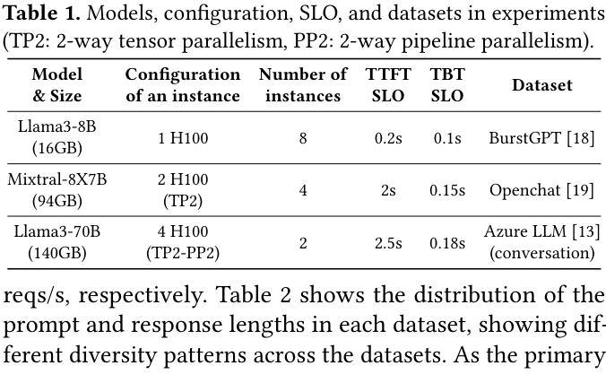

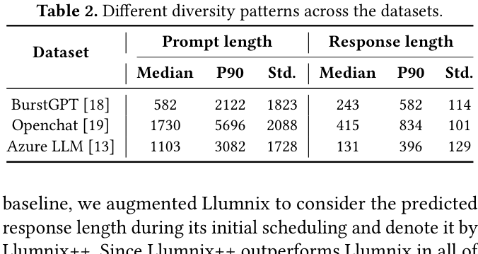

📊 表 1 和表 2 说明实验覆盖了不同模型规模、并行策略和 workload diversity pattern。Llama3-8B 每个 instance 使用 1 张 H100；Mixtral-8x7B 每个 instance 使用 TP2；Llama3-70B 每个 instance 使用 TP2-PP2。数据集的 prompt 和 response 长度分布差异明显，这正是 AdaGen 试图利用的调度信号。

### 📊 端到端 TTFT SLO Attainment
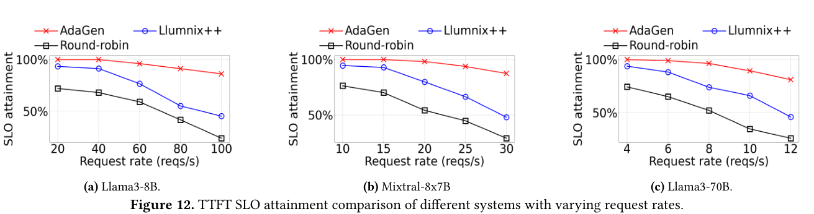

图 12 是最重要的端到端结果。随着 request rate 增加，所有系统的 SLO attainment 都会下降，因为固定 GPU 资源要处理更多请求。但 AdaGen 的下降更慢，并且在 Llama3-8B、Mixtral-8x7B、Llama3-70B 三种设置上都稳定领先。论文报告 AdaGen 相比 Llumnix++ 最高提升 2x，相比 round-robin 最高提升 3.6x。

这组结果支持论文的核心论点：同样的 GPU 利用率并不代表同样的用户体验。AdaGen 提升的是更多请求能否在 TTFT SLO 内完成，而不是单纯提高瞬时 GPU utilization。

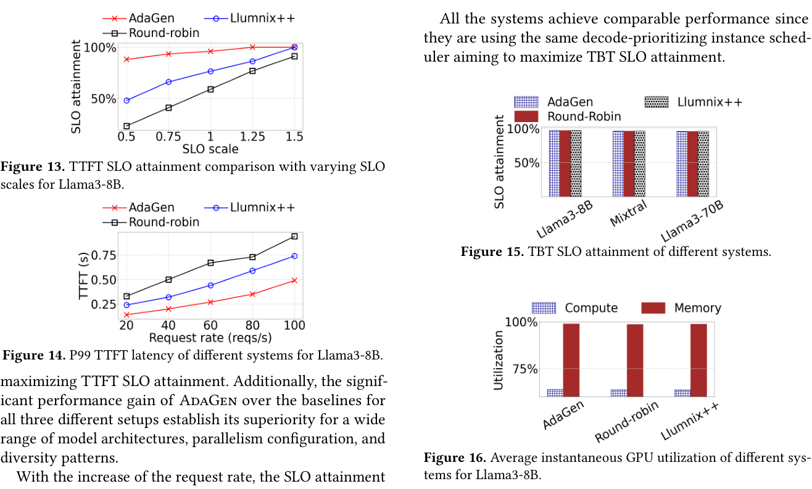

图 13 显示，当 TTFT SLO scale 变小，也就是 SLO 更严格时，AdaGen 的 SLO attainment 下降更缓，说明它更适合 latency-sensitive 服务。图 14 则从 P99 TTFT 角度确认 AdaGen 降低了尾延迟。图 15 表明 TBT SLO attainment 在不同系统间接近，因为它们使用相同的 decode-prioritizing instance scheduler。图 16 进一步说明 AdaGen 并不是靠牺牲 GPU utilization 换取低延迟，而是在近似相同 utilization 下优化了 layout。

### 📊 接近 Exhaustive Search，但调度时间可接受
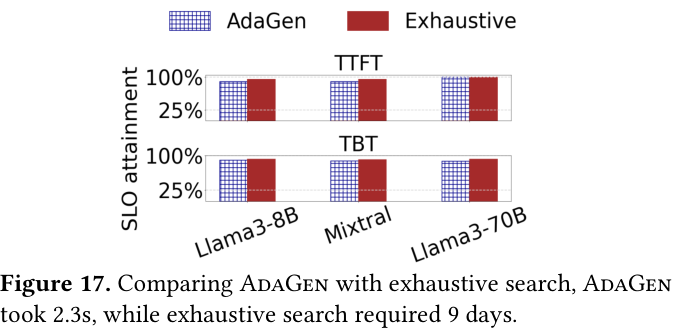

图 17 对比了 AdaGen 和 exhaustive search。由于 exhaustive search 是指数复杂度，实验只用 20 个请求和 2 个 instance，仍然需要 9 天。AdaGen 只用 2.3 秒，并且 TTFT/TBT SLO attainment 接近最优搜索结果。

这部分实验的价值在于证明 AdaGen 的 heuristic 并不是随意拼出来的工程规则，而是确实抓住了 workload diversity 和 compute layout 的主要结构。

### 📊 成本效率与规模扩展
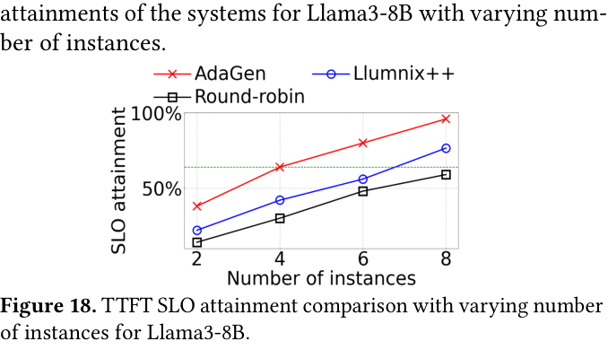

图 18 从成本角度衡量系统。对于 Llama3-8B，当 AdaGen 使用 4 个 instance 达到约 64% SLO attainment 时，其他系统需要 1.7x-2x 更多 instance 才能达到类似水平。也就是说，AdaGen 的收益可以转化为更少 GPU 资源，而不只是 benchmark 上的曲线更好看。

论文还做了 500 instance 的压力测试，用 offline profiling + sleep 替代真实 GPU 执行，验证调度逻辑在高请求率下仍然可扩展。结果显示 AdaGen 相比 Llumnix++ 最高 1.9x、相比 round-robin 最高 3.6x TTFT SLO attainment。

### 🧪 消融：Simulator 与各模块贡献
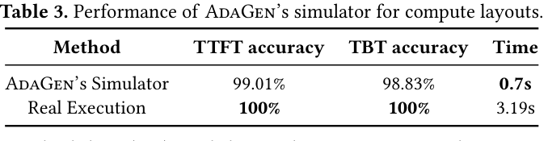

表 3 显示，AdaGen simulator 对 TTFT 和 TBT 的估计准确率分别为 99.01% 和 98.83%，生成 layout 的时间为 0.7 秒，而真实执行需要 3.19 秒，约快 4.6x。这是整个系统能在线调度的基础。

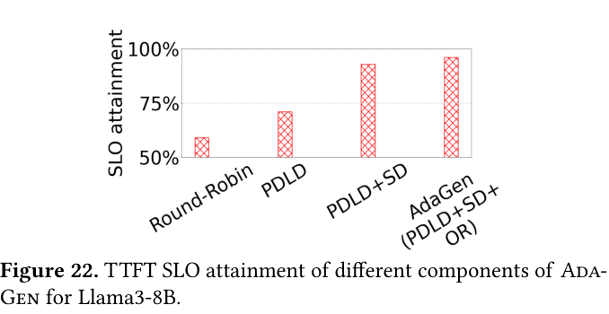

图 22 则展示了组件级消融。随着 length-aware scheduling、distribution-aware reassignment 和 selective distributed execution 逐步加入，TTFT SLO attainment 逐步上升，其中 selective distributed execution 贡献尤其明显。这说明 AdaGen 的收益不是单一技巧带来的，而是多个 layout-aware 步骤叠加形成的。

## 💡 亮点总结
- ✨ 问题定义很准：论文指出 LLM serving 的集群调度不能只看负载均衡，还要看 token 在 iteration/slot 上形成的 compute layout。
- ✨ 把 prefill/decode 差异显式纳入调度：AdaGen 同时考虑长度和分布，而不是只用总 token 数或 KV cache pressure。
- ✨ Selective distributed execution 很有启发：即使没有内存压力，也可以为了优化 layout 主动跨 instance 执行同一请求的不同阶段。
- ✨ Simulator 是系统可用性的关键：99% 左右的 TTFT/TBT 估计准确率让 AdaGen 能在线评估候选 layout。
- ✨ 实验比较完整：覆盖不同模型规模、不同并行配置、不同 request rate、不同 SLO scale、exhaustive search 对比、成本效率和消融。

## ⚖️ 局限性与思考
AdaGen 的贡献很清晰，但也有一些值得注意的边界。

首先，它依赖 predicted decode length。论文使用 fine-tuned DistillBERT 得到约 76.4% 准确率，并通过 on-demand rescheduling 修正误差。但在开放域应用、agentic workloads 或 response length 分布快速漂移时，预测误差可能更大，调度收益也可能变得不稳定。

其次，selective distributed execution 依赖 KV cache migration。论文采用 Llumnix 的 multi-stage migration policy 并尽量将跨阶段请求放到高带宽连接上。如果集群互联较弱，或者跨服务器迁移频繁，通信成本可能抵消 layout 收益。

第三，AdaGen 当前主要优化 TTFT，同时保持 TBT 基本不变。对于某些应用，TBT、吞吐、成本、fairness、priority、tenant isolation 可能同样重要。如何把这些目标放入同一个 scheduler objective，论文没有展开。

第四，实验平台是 8 张 H100 的真实集群，500 instance 实验使用模拟执行。虽然这种做法在系统论文中合理，但超大规模真实集群中的噪声、故障、异构硬件和多租户干扰仍需要进一步验证。

最后，论文没有把 prefix caching 作为优化目标。作者也提到，prefix caching 与 AdaGen 正交，未来可以扩展。我的理解是，如果真实线上有大量 shared prefix 或 RAG template，layout-aware scheduling 和 cache-aware routing 之间可能存在新的 trade-off。

## ✅ 结语
AdaGen 的价值在于，它把 LLM serving 调度中的一个隐含变量显式化了：真正影响用户侧延迟的不是“负载是否均匀”，而是每个 instance 内 token 被组织成怎样的 compute layout。

对 AI Infra 来说，这篇论文给我的启发是：随着 LLM serving 系统从单机 engine 优化走向集群级调度，scheduler 不能停留在传统资源视角。Prefill、decode、KV cache、batch slot、migration bandwidth 和 SLO 都会共同塑造最终延迟。AdaGen 的方法不一定是最终形态，但它很好地说明了下一代 LLM serving scheduler 应该具备的能力：理解 workload 结构，并根据结构动态生成更适合当前请求分布的执行布局。
