## 🌟 引言
High Throughput and Low Latency LLM Serving via Adaptive KV Caching 是一篇 EuroSys 2026 论文，提出了 LLM serving 系统 eLLM。它关注一个很现实的推理系统瓶颈：GPU 显存被模型权重和 KV cache 挤满，但 GPU SM 计算资源却经常没有被充分利用。

现有系统通常在显存不足时把 KV cache 整个请求级别地 offload 到 CPU，或者把整个请求的 KV cache 丢弃后再恢复/重算。这类方法简单，但粒度太粗。eLLM 的核心思路更细：不是“整个请求保留或丢弃 KV”，而是在 decoding 阶段只缓存部分 token、部分 layer 的 KV cache，其余 token 在需要时动态重算，并通过 layer-wise communication-computation overlap 与 kernel fusion 把重算开销隐藏或压低。

> 一句话总结：eLLM 通过 adaptive token-wise/layer-wise KV caching，在 GPU 显存与 SM 计算之间做动态交换，用部分 KV 常驻 + 部分 KV 重算的方式提升并发度，并在 ShareGPT/L-Eval 上实现最高 3.03x throughput、2.63x TTFT 降低，同时保持 TPOT SLO。

论文链接：[ACM DOI: 10.1145/3767295.3803570](https://doi.org/10.1145/3767295.3803570)

## 📌 论文基本信息
- 标题：High Throughput and Low Latency LLM Serving via Adaptive KV Caching
- 作者：Wenyan Chen, Chengzhi Lu, Huanle Xu, Kejiang Ye, Chengzhong Xu
- 会议：EuroSys 2026
- 研究领域：LLM Serving、KV Cache Management、AI Infra、GPU Systems
- 核心问题：如何在显存受限但计算资源未充分利用的 LLM serving 场景中，通过自适应 KV cache 管理同时提高吞吐并降低延迟。

## 🧩 背景与动机
LLM 推理分为 prefill 和 decode 两个阶段。Prefill 阶段并行处理 prompt tokens，适合矩阵计算；decode 阶段逐 token 自回归生成，每一步都需要访问历史 token 的 KV cache。

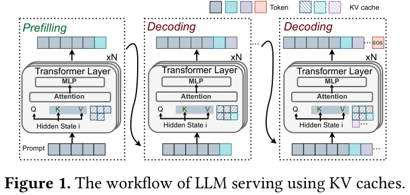

🧠 图 1 展示了 KV cache 为什么会变成核心资源：每层 attention 都会为 token 生成 K/V，并在后续 decode 中反复读取。随着上下文和输出长度增长，KV cache 线性增长，显存很快成为 bottleneck。

论文用 Llama2-13B 在 A100-80GB 上的实验进一步说明这个瓶颈。

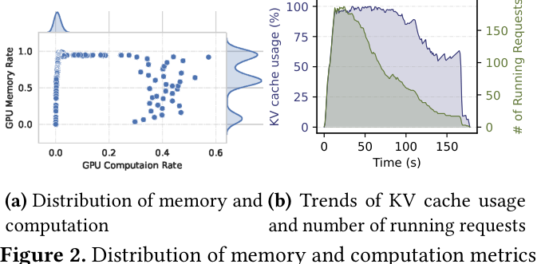

📊 图 2(a) 显示，显存使用长期处在 50%-100% 区间，而计算利用率主要集中在 0%-10%；图 2(b) 则显示 KV cache usage 随运行请求增长快速升高，即使部分请求结束，剩余长请求的 KV cache 仍让显存维持高压。论文还补充，使用 MLA 的 DeepSeek-V2-Lite 虽然压缩了 KV cache，但在相同条件下仍有 97.4% memory occupancy 和约 35% median GPU utilization。

这说明问题不是单纯“KV cache 太大”，而是 memory 与 compute 之间严重不均衡。eLLM 的基本思想就是把一部分显存压力转化为可控计算，把闲置 SM 用起来。

## 🛠️ 方法详解
eLLM 的系统设计有两层：

- Request level：动态决定 batch size 和 uncached token ratio，也就是每轮处理多少请求、每个请求有多少历史 token 不缓存而重算。
- Layer level：对未缓存 token 的重算、host-GPU swap 和当前 token decoding 做 overlap 与 kernel fusion，降低 token-wise caching 带来的额外计算/通信开销。

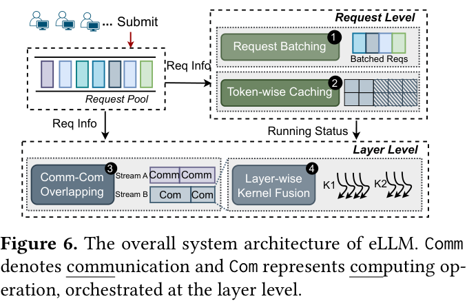

⚙️ 图 6 是 eLLM 的系统总览。Request Pool 接收请求后，Request Batching 决定 batch size，Token-wise Caching 决定每个请求的 cache ratio。Layer level 的 Comm-Com Overlapping 和 Layer-wise Kernel Fusion 则负责把重算、传输、decode 尽可能并行化。

### 🔍 Partial Token-wise Caching
传统 offloading/recompute 方法多以请求为单位：要么整个请求的 KV cache 被 swap，要么整个请求的 KV cache 被丢弃后恢复。eLLM 改成 token-wise 粒度：一个请求中较早的一部分 tokens 可以不缓存 KV，而在 decode 当前 token 时临时重算；较新的 tokens 仍保留 KV cache。

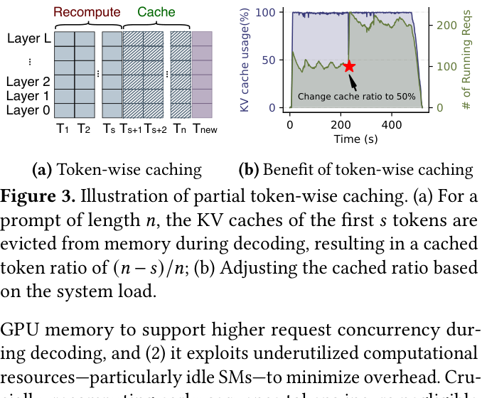

🖼️ 图 3(a) 展示了这种机制：对于长度为 `n` 的 prompt，前 `s` 个 tokens 的 KV cache 在 decoding 阶段被 evict，只保留后面 tokens 的 KV cache。图 3(b) 则展示动态调整 cache ratio 后的效果：在 200 秒处将 cache ratio 调到 50% 后，并发 running requests 近乎翻倍，TTFT 降低 48.05%，SM utilization 提升 8.7%。

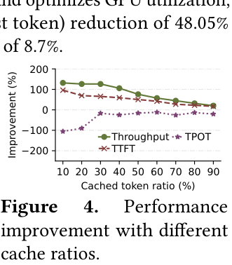

📈 图 4 说明了 trade-off：缓存更少 KV 可以提升 throughput 和 TTFT，因为显存释放后可以容纳更多请求；但如果缓存过少，TPOT 会因重算增加而变差。eLLM 要解决的正是这个动态选择问题：在 TPOT SLO 不被破坏的前提下，尽量提升吞吐并降低 TTFT。

### ⚙️ Layer-wise Kernel Fusion
Token-wise recomputation 会引入额外计算。论文观察到，decode kernel 往往偏 memory-bound，而 recomputation kernel 更偏 compute-bound。如果把二者融合，可以同时利用不同类型资源。

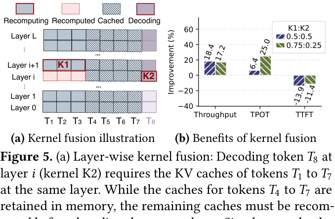

图 5(a) 中，当前层 `i` 正在 decode 新 token `T8`，它需要 `T1` 到 `T7` 的 KV。与此同时，下一层 `i+1` 中较早 tokens 的 KV 可以通过 recomputation kernel `K1` 并行准备。图 5(b) 显示，在不同线程分配下，kernel fusion 可带来最高约 18% throughput 提升和 25% TPOT 降低。不过它也会占用额外临时显存，因此可能对部分 prefill 请求的 TTFT 有负面影响。这也是为什么 eLLM 必须联合优化 cache ratio 和 fusion 配置，而不是固定策略。

### 🧩 新的 KV 管理机制
vLLM 的 PagedAttention 已经用 block 管理 KV cache，但它默认以“token 全层 KV”作为更粗粒度单位。eLLM 为了支持 token-wise 和 layer-wise 的部分缓存，需要重新设计映射结构。

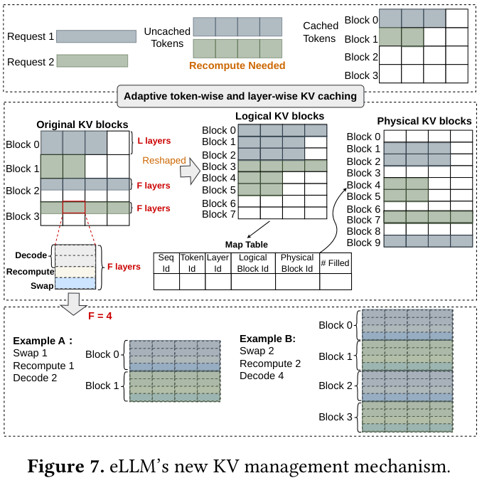

🧠 图 7 展示了 eLLM 的核心数据结构。它把原来的 KV blocks 重新 reshape 为更细的 logical/physical blocks，每个 block 只覆盖连续的 `F` 层，而不是所有层。Map table 记录 `seq_id`、`token_id`、`layer_id`、`logical_block_id`、`physical_block_id` 和 `#filled`，用于在非连续内存中定位某个 token、某个 layer 的 KV。

这个设计的意义在于：如果只需要暂存少数 layer 的重算结果或 swap 结果，不必浪费一个完整全层 block，从而降低内部碎片。

### ⚙️ Request-level Optimization
eLLM 将在线决策形式化为一个优化问题：给定等待队列中的 `B` 个请求，选择 batch size `b`、uncached token ratio `r` 和 kernel fusion 的线程配置 `δ`，最大化 output token throughput，同时满足 TPOT SLO 和 GPU 显存约束。

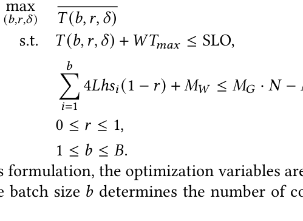

公式 1 中，目标 `b / T(b,r,δ)` 表示每轮输出 token throughput。第一个约束要求 batch processing time 加上最大等待时间不超过 SLO；第二个约束要求被缓存 tokens 的 KV、模型权重和 overlap/fusion 所需额外内存都放进集群总显存。

直接求解这个混合整数非线性问题太慢。eLLM 将其拆成 request-level 和 layer-level 两部分：

- Request level 先忽略 `δ`，用 FLOPs 模型估计 recomputation 与 decoding latency，求解 `b` 和 `r`。
- Layer level 再根据重算/交换/融合配置更新额外内存 `M_o`，反馈给 request-level 进一步调整 batch size 和 uncached ratio。

实现上，eLLM 使用 SciPy 的 SLSQP solver 在线求解简化后的优化问题。

### ⚙️ Layer-level Overlap 与 Fusion
除了部分 token 重算，eLLM 还会把部分 uncached token 的某些 layer KV 暂存在 host memory，再在需要时 swap 回 GPU。为了避免 swap 和 recomputation 互相等待，eLLM 在 layer 级别选择重算哪些层、swap 哪些层，使二者耗时尽量匹配。

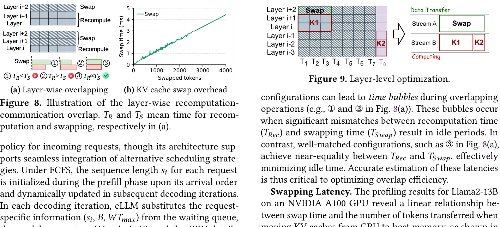

图 8(a) 说明，如果 recomputation time `T_R` 和 swap time `T_S` 不匹配，就会出现 bubble；只有二者接近时 overlap 才有效。图 9 则展示了最终 layer-level optimization：两条 CUDA stream 分别处理 data transfer 和 computing，并把 `K1` recomputation 与 `K2` decoding 做融合。

论文还给出 swap latency 与 swapped tokens 数量近似线性关系，并用 profile 得到的常数估计不同 layer 配置下的 swap/recompute 开销。为了减少搜索开销，eLLM 限制 recomputation 最多 2 层、swapping 最多 3 层，因此候选组合只有 6 种。

## 📈 实验结果
eLLM 基于 vLLM 实现，包含约 3500 行 Python 代码和 1700 行 CUDA kernel 优化。实验在 4 张 NVIDIA A100-80GB GPU 的服务器上进行，GPU 间为 PCIe4.0 x16，无 NVLink。

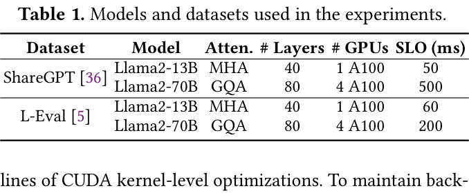

📊 表 1 展示了实验设置：Llama2-13B 用 1 张 A100，Llama2-70B 用 4 张 A100 TP；数据集包括 ShareGPT 和长上下文的 L-Eval paper assistant subset。ShareGPT 平均 input/output 长度为 222/1346，L-Eval 则达到 35956/5189，更能考验长上下文 KV cache 管理。

### 📊 ShareGPT 端到端结果
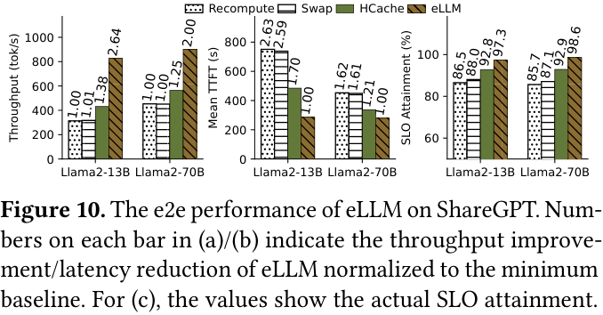

图 10 是 ShareGPT 上的主结果。相比 vLLM-Recompute、vLLM-Swap 和 HCache：

- Llama2-13B：eLLM throughput 相比 vLLM-Recompute 提升 2.64x，相比 vLLM-Swap 提升 2.61x，相比 HCache 提升 1.91x。
- Llama2-70B：eLLM 分别达到 2.0x、2.0x 和 1.6x throughput 提升。
- TTFT：eLLM 在 Llama2-13B 上最高降低 2.63x，在 Llama2-70B 上也保持 1.21x-1.62x 的降低。
- SLO attainment：eLLM 达到 97.3% 和 98.6%，高于 HCache 与 vLLM baseline。

这说明 eLLM 并不是牺牲 TPOT 换取吞吐，而是在满足 TPOT SLO 的同时提升吞吐和 TTFT。

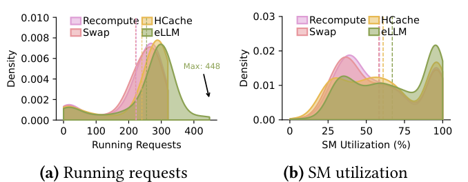

图 11 解释了性能提升来源。eLLM 的 average running requests 达到 254.64，最大达到 448，高于其他系统；平均 cached ratio 为 0.64，相当于节省超过 36% KV memory。同时 eLLM 的平均 SM utilization 为 67.02%，相比 vLLM-Recompute/vLLM-Swap/HCache 的 58.65%、58.20%、61.20% 更高，约提升 15%。这正好对应论文动机：把显存瓶颈转化为可控计算后，SM 被用得更充分。

### 📊 长上下文 L-Eval 结果
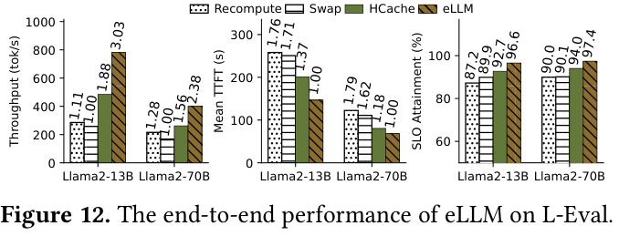

L-Eval 的平均上下文更长，因此 KV cache 压力更明显。图 12 显示，eLLM 在 L-Eval 上的优势更大：通过平均只缓存 0.53 的 prefix length，节省超过 47% memory，最高实现 3.03x throughput 提升，并将 TTFT 降低到 baseline 的约 1/1.79，同时保持 96.6% 和 97.4% 的 SLO attainment。

这组结果说明，eLLM 的适用场景非常偏向 long-context serving、高并发和显存受限环境。上下文越长，细粒度 KV 管理的收益越明显。

### 🧪 模块消融
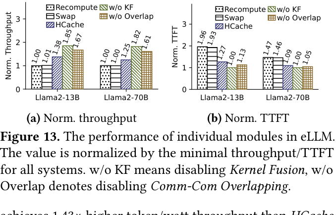

图 13 分别禁用 Layer-wise Kernel Fusion 和 Comm-Com Overlapping。结果显示，即便禁用其中一个模块，eLLM 仍优于 baseline，说明 request-level token-wise caching 本身就有贡献；但完整 eLLM 仍是最优，说明 overlap 和 fusion 对进一步降低 TPOT/TTFT 很关键。

论文中特别提到，禁用 Comm-Com Overlapping 后，swap 必须等待当前层 recomputation 完成，会增加 TPOT；禁用 Kernel Fusion 后，uncached token recomputation 与新 token decode 变成顺序执行，SM 利用率下降。这两个消融共同支持了系统的双层优化设计。

### 📈 不同负载下的稳定性与 Goodput
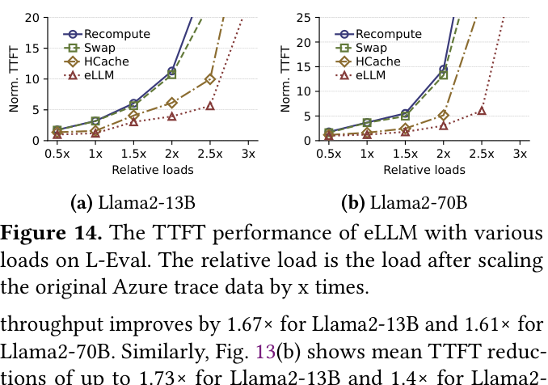

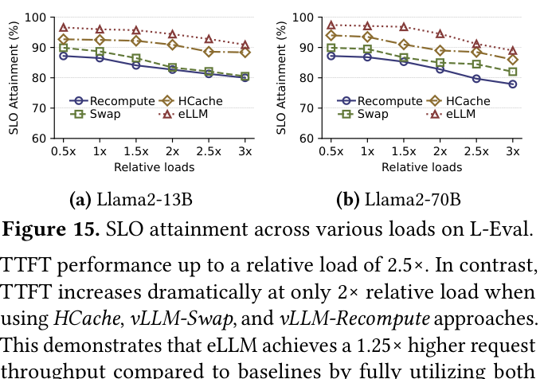

图 14 和图 15 关注 scale load。随着 Azure trace 被放大到 0.5x-3x，各系统 TTFT 都会升高，但 eLLM 的拐点更晚。对于 Llama2-70B，eLLM 在 2.5x relative load 前仍维持较稳定 TTFT，而 HCache、vLLM-Swap 和 vLLM-Recompute 在 2x 左右就出现明显恶化。

按 DistServe 的 goodput 定义，即满足至少 90% SLO attainment 的最大 request rate，eLLM 在 3x 负载下仍能让 Llama2-13B 维持约 90% SLO compliance，相比 HCache 提升 1.5x，相比 vLLM-Swap/Recompute 提升 6x；Llama2-70B 上相对 HCache 为 1.67x，相对 vLLM baseline 超过 5x。

### 📊 参数 F 与系统开销
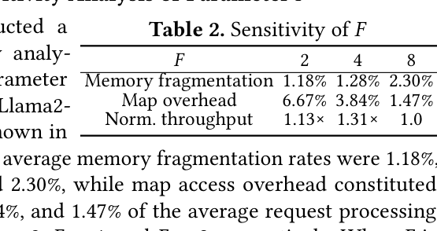

表 2 讨论 KV block layer granularity `F`。`F` 越小，内存碎片更低但 map overhead 更高；`F` 越大，map overhead 更低但碎片更高。实验显示 `F=4` 在 Llama2-70B 上吞吐最好，相比 `F=2` 和 `F=8` 分别达到更好的平衡。

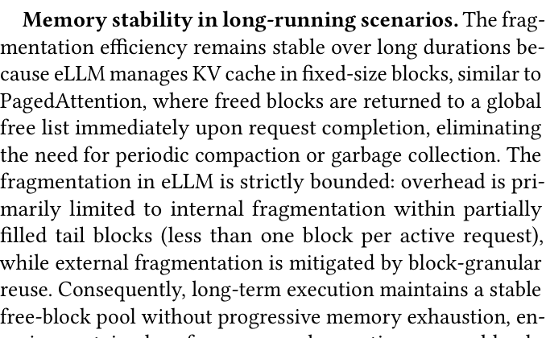

图 16 显示在线优化开销可控。Request-level 求解 `b` 和 `r` 的开销均低于 21ms，90% 小于 10ms；layer-level map 查询平均低于 0.015ms，线程配置计算约 0.03ms。对于一个在线 serving 系统来说，这个开销没有淹没收益。

## 💡 亮点总结
- ✨ 粒度更细：从 request-level KV swap/recompute 推进到 token-wise 和 layer-wise 的部分 KV caching。
- ✨ 抓住资源互补：把显存压力转化为 recomputation，并用闲置 SM 承接这部分计算。
- ✨ 联合优化而非单点技巧：batch size、uncached token ratio、overlap layer config、kernel thread allocation 形成闭环。
- ✨ 长上下文收益明显：L-Eval 上最高 3.03x throughput，说明该方法很适合长 prompt/长生成场景。
- ✨ 兼容性较好：实现基于 vLLM，保持核心 API，并讨论了与 KV quantization、MoE、distributed serving 的关系。

## ⚖️ 局限性与思考
首先，eLLM 的收益依赖于一个前提：系统存在显存紧张但 SM 未充分利用的资源失衡。如果某些模型或硬件上 compute 已经饱和，继续重算 token KV 可能不再划算，甚至会拉高 TPOT。

其次，论文主要评估 A100 PCIe 环境。作者讨论了 NVLink、scale-out 和不同模型架构的可迁移性，但真实多节点生产环境中的网络干扰、pipeline parallelism bubble、tenant isolation 和调度优先级仍需要更多验证。

第三，eLLM 保持 exact attention semantics：被 evict 的历史 token 会重算，而不是永久丢弃。因此它与 KV quantization 更兼容，但与 importance-based token pruning 的组合更复杂，因为 pruning 会改变 attention context。论文也把 pruning-aware attention 或显式误差预算留作未来工作。

第四，在线优化依赖 latency model 和 profile 常数。论文在 V100 与 ±20% 参数扰动上验证了鲁棒性，但如果部署到 H100/B200 或新 attention kernel，仍需要重新 profile 硬件与模型参数，否则 operating point 可能不是最优。

最后，eLLM 主要围绕 TPOT SLO、TTFT、throughput 展开。实际线上系统还可能需要考虑公平性、多租户隔离、请求优先级、缓存复用、prefix sharing、RAG session locality 等目标。eLLM 可以作为底层 KV memory manager，但上层调度策略还需要配合。

## ✅ 结语
eLLM 的核心价值在于，它重新定义了 KV cache 的管理粒度：KV cache 不必以整个请求、整个 token 序列或全层 block 为单位保留，也不必在显存不足时粗暴 offload。通过 token-wise 和 layer-wise 的自适应策略，系统可以在“显存容量”和“SM 计算”之间动态换算资源。

我的理解是，这篇论文对 LLM serving 的启发很直接：长上下文推理的瓶颈不只是 attention kernel 快不快，也不是单纯 KV cache 压缩多少，而是系统能否把显存、重算、host-GPU 传输和 kernel fusion 放进同一个闭环里做协同优化。eLLM 给出了一个很清楚的方向：未来的 serving engine 会越来越像一个细粒度资源调度器，而不只是一个 batch executor。
