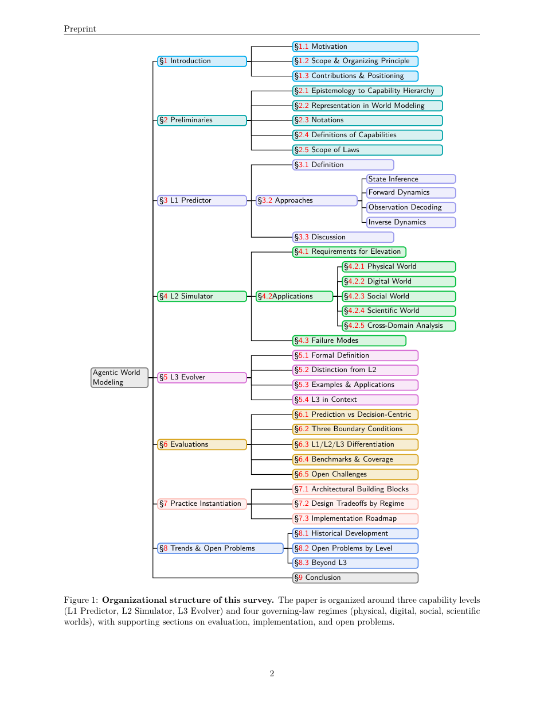
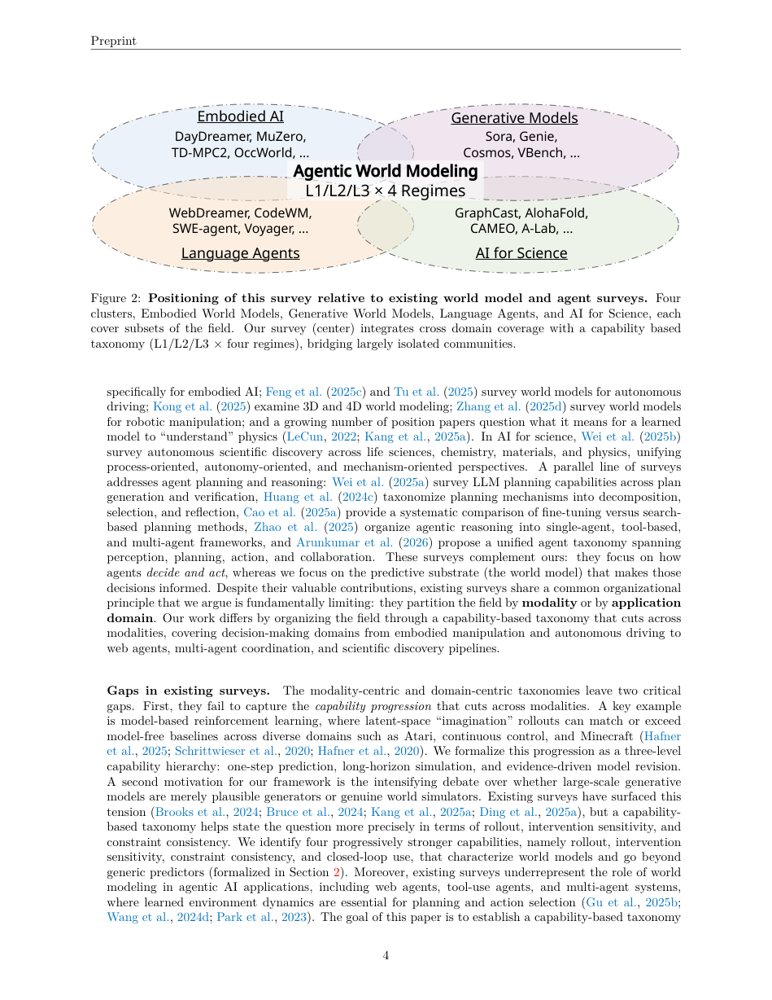
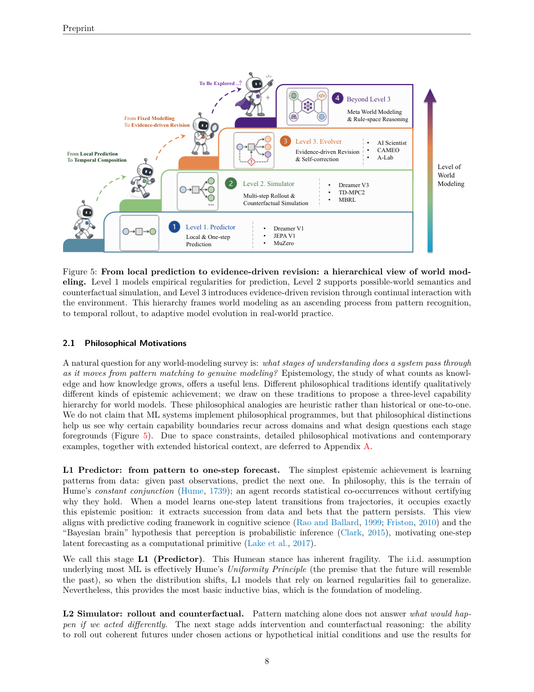
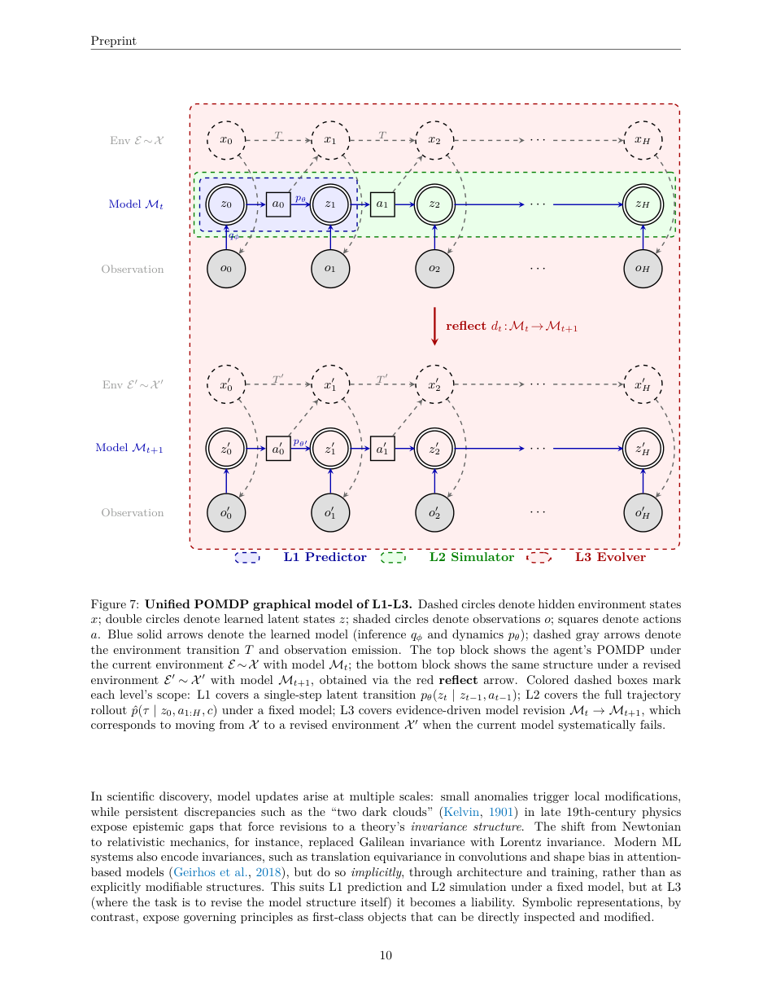
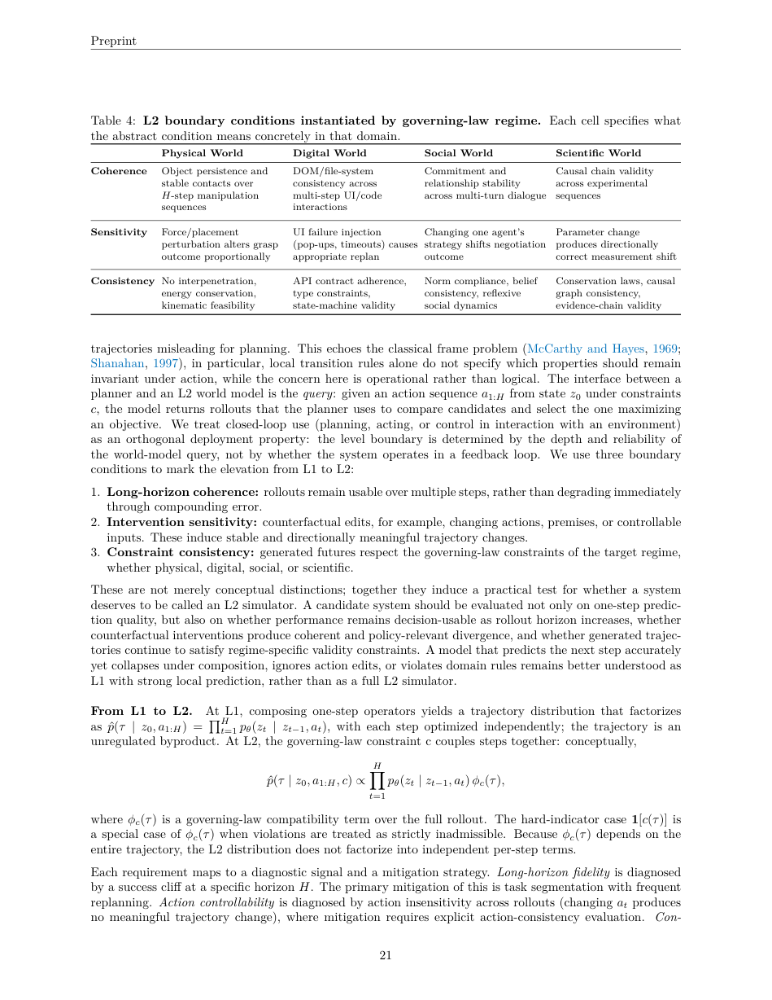
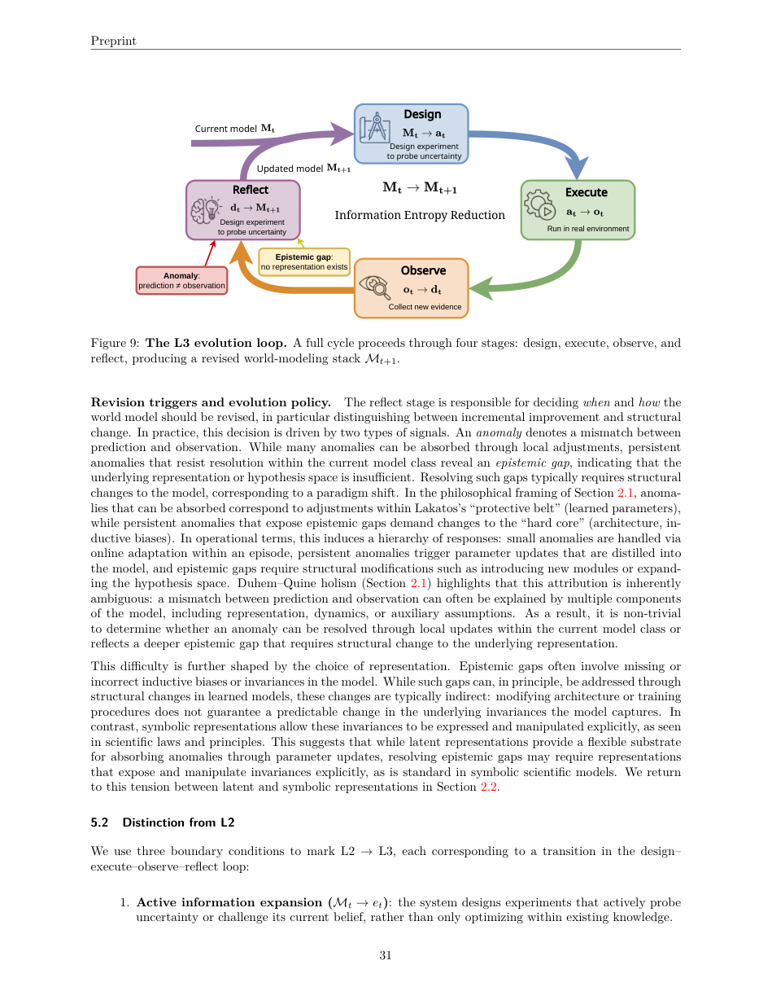
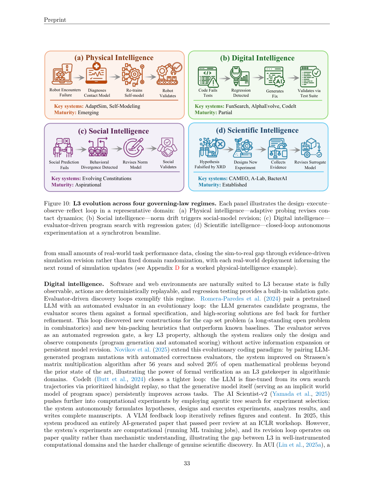
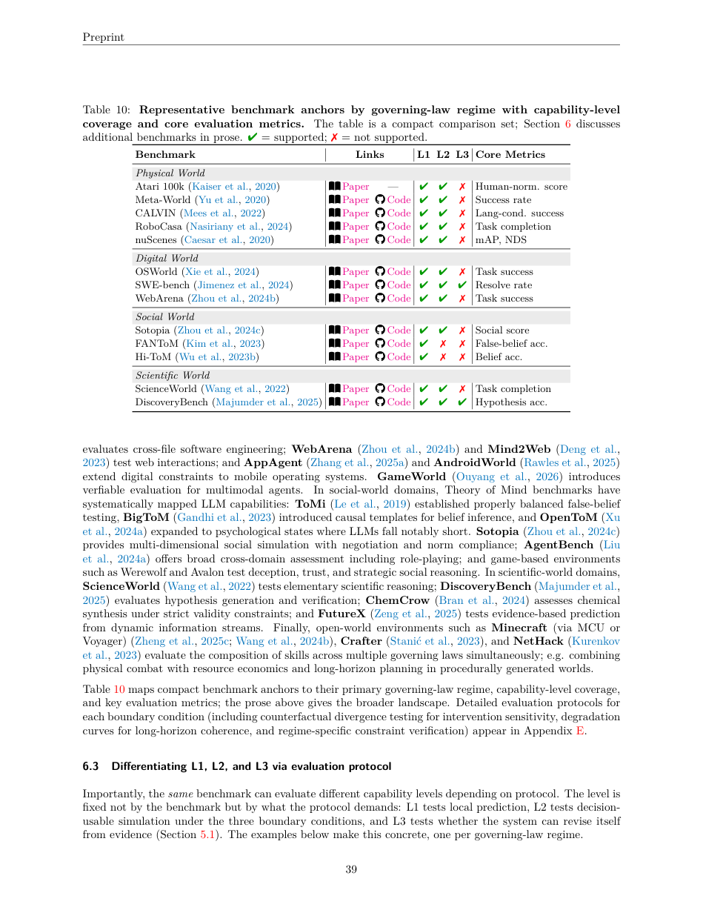
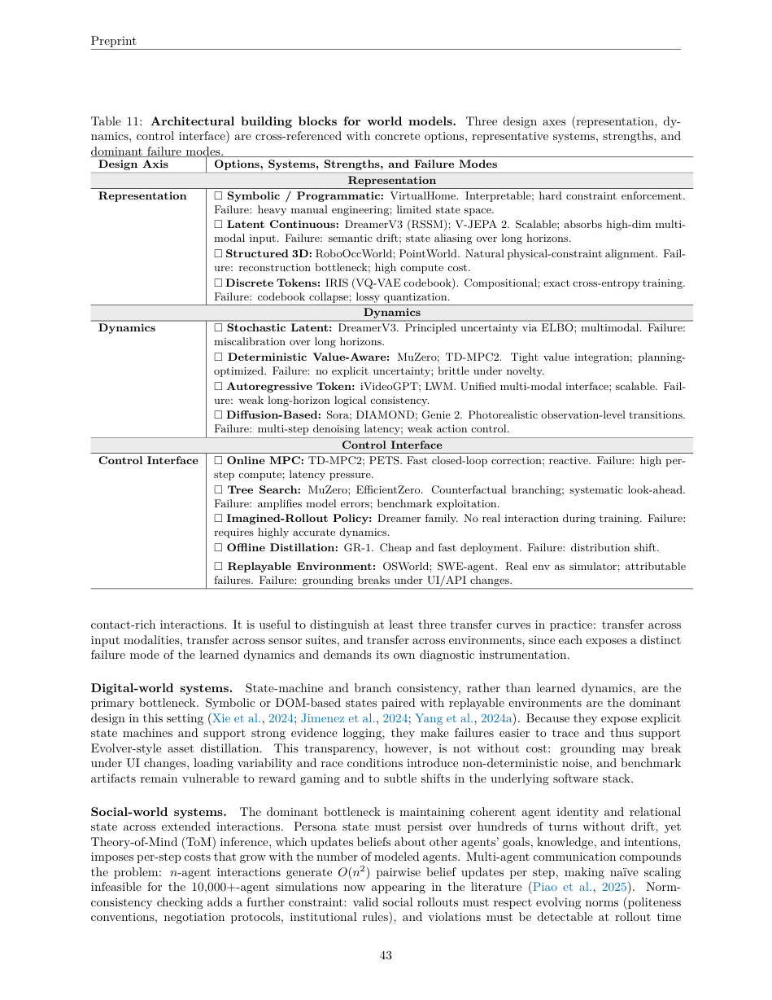
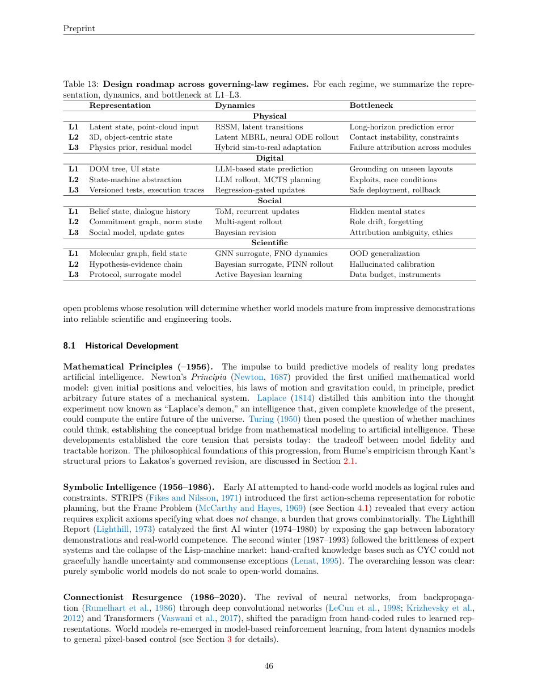

# Agentic World Modeling 论文解析：从预测器到可自我演化的世界模型

> 论文：[Agentic World Modeling: Foundations, Capabilities, Laws, and Beyond](https://arxiv.org/abs/2604.22748)  
> 作者：Meng Chu, Xuan Billy Zhang, Kevin Qinghong Lin, Lingdong Kong, Jize Zhang, Teng Tu, Weijian Ma 等  
> 发表：arXiv:2604.22748，2026-04-24，early-access preprint  
> 领域：Agentic AI、World Model、Model-Based RL、AI Agents、AI for Science、Evaluation  
> 核心问题：当 AI 从“生成答案”走向“持续交互并完成目标”时，我们应该如何定义、评估和构建能够预测、模拟并自我修正环境动态的 agentic world model？

## 🌟 引言：为什么 Agent 时代需要重新定义 World Model

这篇论文是一篇大规模综述，但它不是普通的文献罗列。作者试图解决一个越来越明显的问题：**world model** 这个词在不同社区里已经变得过于宽泛。强化学习研究者说 world model，可能指 Dreamer/MuZero 式的 latent dynamics；视觉生成研究者说 world model，可能指 Sora/Genie/Cosmos 式的视频或交互环境生成；语言 Agent 社区说 world model，可能指 Web/GUI/code 环境的状态预测；AI for Science 社区说 world model，则可能是天气、分子、蛋白或实验系统的 surrogate model。

论文的核心贡献，是提出一个统一的 **“levels × laws”** 框架：用三种能力层级刻画 world model 的成熟度，用四类 governing-law regimes 刻画不同环境中的约束来源。这个框架的价值在于，它把“模型生成得像不像”这个问题，推进为“模型是否能支持 Agent 做出更好的决策”。



## 📌 1. 论文基本信息

- 标题：Agentic World Modeling: Foundations, Capabilities, Laws, and Beyond
- 形式：Survey / Position-style roadmap，early-access preprint，尚未 peer review
- 时间：2026 年 4 月
- 规模：综合 400+ 篇工作，总结 100+ 个代表性系统
- 覆盖领域：model-based reinforcement learning、video generation、web/GUI agents、multi-agent social simulation、AI-driven scientific discovery
- 一句话概括：这篇论文提出 L1 Predictor、L2 Simulator、L3 Evolver 三层能力和 physical/digital/social/scientific 四类法则域，用来统一理解 agentic world modeling 的定义、方法、评估和开放问题。

## 🔍 2. 研究背景与动机

### 2.1 World Model 的概念已经碎片化

论文开篇指出，world model 的价值与 Agent 的行为能力密切相关。Agent 需要选择动作，而选择动作的前提是能够预测动作后果。问题在于，不同领域对“预测世界”有完全不同的理解：

- 在 RL 中，world model 用于 imagined rollout 和 planning。
- 在视觉生成中，world model 常被理解为保持视觉时序一致的视频/3D 生成器。
- 在语言 Agent 中，它可能是对网页、GUI、代码仓库或工具状态的预测。
- 在科学发现中，它可能是对自然系统机制的 surrogate 或 hypothesis model。

如果没有统一语言，就会出现一个尴尬局面：A 论文说自己有 world model，是因为视频生成很逼真；B 论文说自己没有 world model，是因为无法 action-conditioned rollout；C 论文在软件环境中其实有状态转移预测，但不属于传统 RL 语境。本文就是要给这些社区建立可比较的坐标系。



### 2.2 从“看起来真实”转向“对决策有用”

作者强调，world model 的评价不能只看生成结果是否逼真。一个视频模型可以生成非常真实的画面，但如果改变动作后未来不发生合理变化，它就不能支持 counterfactual planning；一个 GUI Agent 可以准确预测下一步按钮状态，但如果连续操作后状态机崩坏，它也不能算 L2 Simulator。

因此论文提出一个更严格的判据：**world model 的价值应由它支持下游 Agent 决策的质量来衡量。** 这也是后文 decision-centric evaluation 的基础。

## 🧠 3. 方法框架：Levels × Laws

论文最重要的贡献是二维分类框架。

第一维是 **capability level**：

- L1 Predictor：局部一步预测器。
- L2 Simulator：可用于决策的多步、动作条件模拟器。
- L3 Evolver：能根据新证据诊断失败并持久更新自身模型的演化器。

第二维是 **governing-law regime**：

- Physical World：受物理规律约束，如接触、碰撞、重力、运动学可行性。
- Digital World：受程序语义约束，如 API contract、DOM 状态机、文件系统逻辑。
- Social World：受信念、目标、承诺、规范和制度约束。
- Scientific World：受需要从经验中发现的自然机制约束，如气象、分子、蛋白、实验系统。

这两个维度叠加后，论文不再问“这个模型属于哪个应用领域”，而是问：它处在哪个能力层级？它要遵守哪类世界法则？它的失败模式和评估方式是什么？

## 🧱 4. L1 Predictor：局部转移算子

L1 是最基础的 world model。它回答的问题是：给定当前状态和动作，下一步状态是什么？论文将 L1 factorize 成最多四类局部算子：

- State inference / filtering：从历史观测和动作推断 latent state。
- Forward dynamics：预测下一个 latent state。
- Observation decoder：从 latent state 解码观测。
- Inverse dynamics：从相邻状态反推动作。

形式上，L1 的核心是类似：

```text
p_theta(z_t | z_{t-1}, a_t)
```

但作者反复强调：**一步预测准确，不等于可用于规划。** L1 的问题在于，它通常只在训练分布下优化短期预测；一旦把它递归调用很多步，误差可能迅速累积，状态可能漂移，动作变化也可能无法产生正确的长期影响。



## 🧭 5. L2 Simulator：可决策的多步模拟器

L2 是论文中最关键的分界线。L2 不只是把 L1 重复 H 次，而是要支持 action-conditioned, constraint-consistent rollout。论文给出形式：

```text
p_hat(tau | z_0, a_{1:H}, c)
```

其中 `tau = (z_1, ..., z_H)` 是未来轨迹，`a_{1:H}` 是动作序列，`c` 是 governing-law constraint。

作者提出 L1 到 L2 的三个边界条件：

1. Long-horizon coherence：多步 rollout 不能很快崩坏。
2. Intervention sensitivity：改变动作或前提，未来应发生方向合理的变化。
3. Constraint consistency：生成未来必须满足目标 regime 的约束。



### 5.1 为什么 L2 不能只是“多步 L1”

论文用一个很重要的公式解释 L2 和 L1 的差别。L1 多步组合可以写成逐步乘积：

```text
p_hat(tau | z_0, a_{1:H}) = Π p_theta(z_t | z_{t-1}, a_t)
```

但 L2 还需要一个 trajectory-level compatibility term：

```text
p_hat(tau | z_0, a_{1:H}, c) ∝ Π p_theta(z_t | z_{t-1}, a_t) * phi_c(tau)
```

这里的 `phi_c(tau)` 不是单步约束，而是对整个轨迹是否满足法则的判断。例如：物理世界中不能穿模、不能违反能量守恒；数字世界中不能调用不存在的 API；社会世界中不能前一轮承诺后一轮无后果地遗忘；科学世界中不能产生违反证据链或因果机制的解释。



### 5.2 四类世界法则的差异

论文的一个重要观点是：不同世界不是只是数据模态不同，而是“有效轨迹”的定义不同。

- Physical World 的主要失败是物理不可能：物体穿透、接触不稳定、动力学不连续。
- Digital World 的主要失败是程序语义错误：状态机不一致、API contract 违规、race condition。
- Social World 的主要失败是社会状态漂移：承诺丢失、角色/人格漂移、信念更新不一致。
- Scientific World 的主要失败是机制不成立：相关性冒充因果、违反实验事实、无法被证伪。

这意味着一个通用 world model benchmark 很难覆盖所有能力。对世界模型的评价必须同时说明能力层级和所在 law regime。

## 🔁 6. L3 Evolver：从模拟世界到修正自身

L3 是本文最有前瞻性的部分。L2 的模型是固定的：它可以模拟未来，但不会因为失败而永久改变自己。L3 则要求模型形成完整的 **design–execute–observe–reflect** 循环：

```text
M_t -> design experiment/action -> execute -> observe -> distill evidence -> M_{t+1}
```

也就是说，模型不再只是 planning 的工具，而是 Agent 可以改进的对象。



### 6.1 L3 的三个边界条件

论文提出 L2 到 L3 的关键边界：

1. Active information expansion：系统主动设计实验来探测不确定性，而不是被动等数据。
2. Autonomous execution and observation：系统能执行实验并获得新证据。
3. Belief revision under challenge：系统能用证据更新参数、结构或模型资产。

更严格地说，L3 更新不能只是 in-context patch。它必须产生持久、可复用、经过验证的资产，例如新规则、新测试、新技能、新 parser、新模块或更新后的 surrogate model。这个要求很重要，因为很多 Agent 现在可以“反思一下再试”，但反思只停留在上下文里，任务结束后不会形成可审计的模型改进。



### 6.2 哪些领域最接近 L3？

论文认为，当前最接近完整 L3 的领域是自动化科学发现，因为实验设计、执行、观测和模型修正天然构成闭环。CAMEO、A-Lab 这类系统能在高仪器化环境中进行实验选择和模型更新。

相比之下：

- 机器人/物理智能中的 L3 仍处于 emerging 状态，难点在真实交互成本和 failure attribution。
- 数字世界有潜力，因为软件测试和 regression gate 天然适合验证更新，但系统性评测还不足。
- 社会世界最困难，因为社会规范、信念和关系状态难以客观验证，且涉及伦理问题。

## 📊 7. 实验与评估：从预测指标转向决策中心评估

这篇论文是 survey，没有传统意义上的“实验结果表”。但它提出了非常重要的评估主张：world model 的评价应当从 prediction-centric 走向 decision-centric。

作者指出，常见的视觉指标、一步预测误差或平均成功率会掩盖 world model 的真实问题。一个模型可能短期预测准确，但长程 rollout 失效；可能画面逼真，但对动作不敏感；可能平均成功率高，但在 tail cases 上灾难性失败。

论文提出两个聚合指标：

- Action Success Rate, ASR：使用 world model 选择动作后，真实环境任务成功的比例。
- Counterfactual Outcome Deviation, COD：改变动作后，rollout 结果是否发生任务相关变化。

这两个指标分别回答：模型是否帮助 Agent 做出好决策？模型是否真的理解动作干预？



### 7.1 当前评估的主要缺口

论文给出的诊断比较尖锐：目前多数系统仍主要在 L1 层面评估。即使报告 end-to-end success rate，也经常没有明确测试 long-horizon coherence、intervention sensitivity 和 constraint consistency。

L2 评估需要 counterfactual injection、degradation curve、constraint-violation detection 等协议。L3 评估更难，需要 regression suite、asset validation gate、cross-episode improvement tracking。这些基础设施目前除 autonomous science 和部分 software engineering 场景外，基本还不成熟。

论文提出的 MREP（Minimal Reproducible Evaluation Package）可以看成一个最低限度的实验记录标准：版本锁定、trace logging、failure taxonomy、tail statistics、boundary-condition mapping。它不仅用于复现实验，也为 L3 的持久更新和回滚提供证据基础。

## 🏗️ 8. 架构设计：Representation、Dynamics、Control Interface

论文第 7 节把 world model 系统拆成三类 building blocks：

1. Representation：状态如何表示。
2. Dynamics：状态如何演化。
3. Control interface：Agent 如何查询或使用模型。



### 8.1 Representation：latent、symbolic、3D、discrete token 的取舍

不同表示适合不同 regime：

- Symbolic/programmatic state 可解释、可验证，但需要大量人工设计，覆盖范围有限。
- Latent continuous representation 易扩展、适合高维多模态输入，但长程容易 semantic drift。
- Structured 3D representation 更贴近物理约束，但重建和计算成本高。
- Discrete token representation 有组合性，适合 autoregressive dynamics，但存在量化损失和 codebook collapse。

一个关键观点是：**表示必须服务 planner 的 query。** 如果表示看起来很真实，但不暴露 planner 需要的变量，比如 free space、permission state、reaction rate，那它对 Agent 决策反而不如低保真但结构正确的表示。

### 8.2 Dynamics：不同动态模型适配不同任务

论文总结了几类 dynamics：

- Stochastic latent dynamics：如 Dreamer 系列，适合不确定性和多模态，但长程可能失准。
- Deterministic value-aware dynamics：如 MuZero、TD-MPC2，面向价值预测和规划优化，但不显式建模不确定性。
- Autoregressive token dynamics：接口统一、可扩展，但长程逻辑一致性较弱。
- Diffusion-based dynamics：视觉质量高，但多步 denoising 造成延迟，action controllability 也常较弱。

### 8.3 Control Interface：模型如何进入决策循环

控制接口包括 MPC、tree search、imagined-rollout policy optimization、offline policy distillation 和 replayable-environment interface。不同接口的风险不同：MPC 快速纠错但每步计算重；tree search 能做 counterfactual branching 但会放大模型误差；replayable environment 在数字世界中很强，因为真实环境本身可以作为模拟器，但 UI/API 变化会破坏 grounding。



## ✨ 9. 创新点总结

这篇论文的创新不是提出新模型，而是提出一套具有操作性的组织语言。我认为主要贡献有四点。

第一，提出 L1/L2/L3 三层能力层级，把 world model 从“一步预测”推进到“决策可用模拟”和“证据驱动自我修正”。

第二，提出 physical/digital/social/scientific 四类 governing-law regimes。这个划分比按应用领域或数据模态划分更有解释力，因为它直接决定什么叫有效 rollout、什么叫约束违反、什么证据可以验证模型。

第三，强调 decision-centric evaluation。论文不再问生成结果是否逼真，而是问模型是否改变 Agent 选择，并提升真实任务结果。

第四，给出架构路线图，将 representation、dynamics、control interface 与不同 regime 的约束和工程瓶颈联系起来。

## ⚠️ 10. 局限性与我的思考

### 10.1 这是一篇框架型 survey，不是实证型系统论文

论文覆盖很广，组织能力很强，但它不是提出一个新模型并在 benchmark 上验证。因此它的价值主要在概念统一和研究路线图，而不是某个具体技术结论。读者不应该期待它给出“哪个模型最好”的答案。

### 10.2 L3 的定义很有启发，但当前落地仍然稀缺

L3 Evolver 是最吸引人的部分，但也是最难落地的部分。持久更新、回归验证、rollback、canary deployment、failure attribution，这些要求比普通 Agent self-reflection 高得多。现实中很多系统只是“反思后重试”，离论文定义的 L3 还有明显距离。

### 10.3 Social World 的法则最难形式化

Physical 和 Digital regimes 至少有较明确的验证机制；Scientific regime 可以依赖实验数据；但 Social World 的规范、信念、承诺和关系状态难以机械验证。论文把它纳入统一框架很有意义，但也留下了最大的不确定性：如何避免把社会模拟中的偏见和幻觉当作规律？

### 10.4 Neural latent 与 symbolic law revision 的张力很关键

论文结论中特别强调，L1/L2 可以主要依赖 latent representation，但 L3 的 law revision 可能需要更显式、可组合、可修改的 symbolic substrate。这个判断很重要。真正的科学发现不是只把异常吸收到参数里，而是可能修改变量、机制和假设空间。未来 world model 也许需要神经表示和符号机制的深度结合。

## 🧭 11. 如何阅读这篇论文

如果时间有限，我建议按以下顺序阅读：

1. 先读 Introduction 和 Figure 1/2，理解论文为什么要统一 world model 概念。
2. 读 Section 2.4，抓住 L1/L2/L3 的正式定义。
3. 读 Table 4，理解 L2 三个边界条件如何映射到不同世界法则。
4. 读 Section 5 和 Figure 9/10，理解 L3 为什么不等于普通 closed-loop planning。
5. 读 Section 6，特别是 ASR、COD 和 benchmark coverage。
6. 最后读 Table 11/13，把它作为设计 world model 系统的 checklist。

这篇论文最适合用作“概念地图”。如果你正在做 Agent、具身智能、自动驾驶、GUI/Web Agent、AI for Science 或多智能体模拟，它能帮你回答一个很基础但经常被忽略的问题：你的系统到底是在预测、模拟，还是在自我演化？

## ✅ 12. 一句话总结

Agentic World Modeling 的核心价值在于把 world model 从“生成逼真未来”的模糊概念，重新定义为 Agent 决策系统中的可评估能力阶梯：先学会局部预测，再学会遵守世界法则的多步模拟，最终学会用证据主动修正自身模型。
