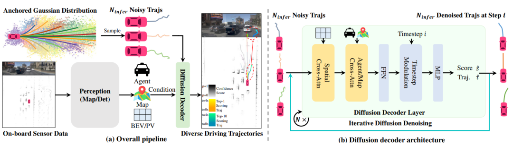
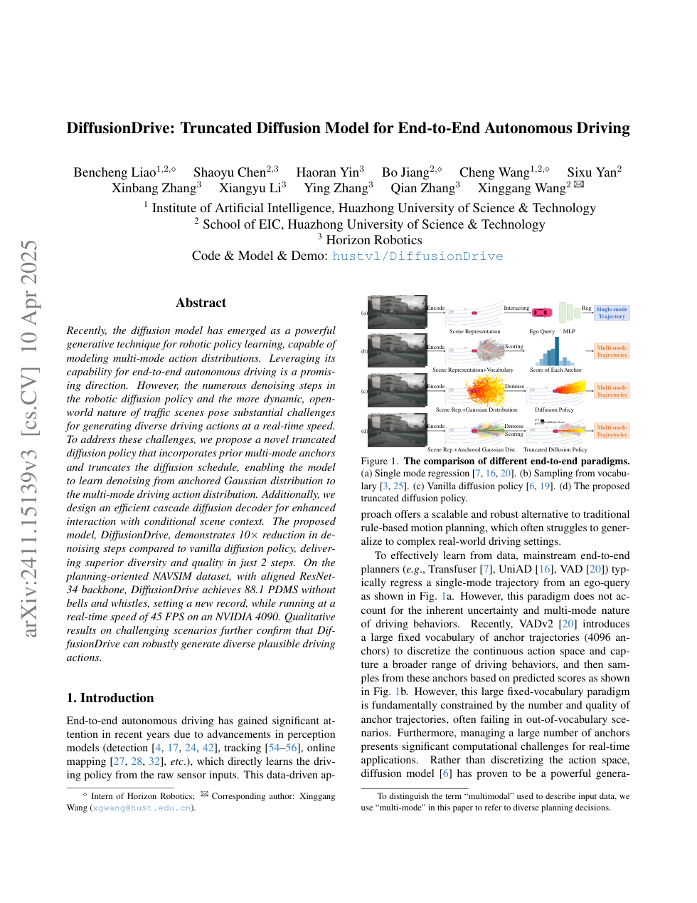
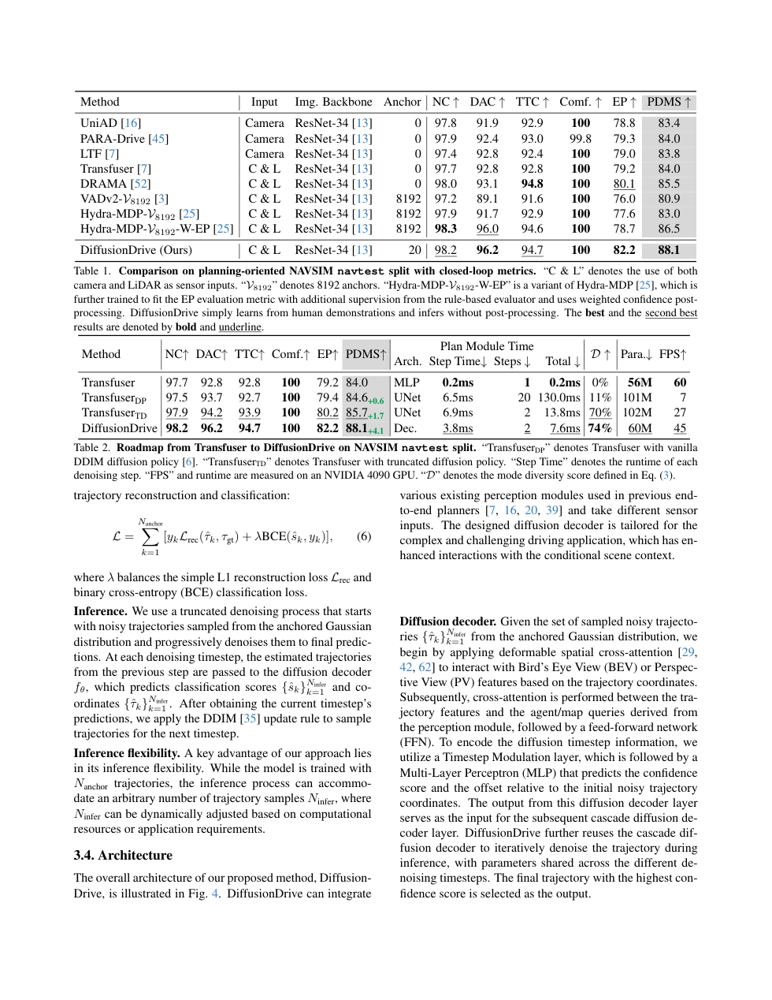

# DiffusionDrive 论文解析：截断扩散如何让生成式轨迹规划实时可用

> 论文：[DiffusionDrive: Truncated Diffusion Model for End-to-End Autonomous Driving](https://huggingface.co/papers/2411.15139)  
> 作者：Bencheng Liao, Shaoyu Chen, Haoran Yin, Bo Jiang 等  
> 发表：CVPR 2025 Highlight / arXiv 2024  
> 关键词：扩散模型、轨迹生成、端到端驾驶、实时规划、nuScenes

## 🌟 引言

DiffusionDrive 试图回答一个很自然的问题：扩散模型擅长建模多模态分布，能不能用于自动驾驶轨迹规划？复杂驾驶场景往往不只有一条合理轨迹，比如路口让行、变道、绕障都可能存在多种可行解。传统确定性回归容易输出平均轨迹，造成“看起来平滑但实际不可驾驶”的结果。

问题在于，扩散模型通常推理慢，而自动驾驶规划需要实时。DiffusionDrive 的关键贡献就是 truncated diffusion：不从纯随机噪声开始一步步去噪，而是从带先验的锚定高斯分布开始，减少去噪步骤，在保留多模态性的同时实现实时推理。

## 🧩 背景与核心问题

🔍 端到端规划中常见两类方法：回归式方法直接输出单条轨迹，速度快但容易 mode collapse；候选选择式方法从预定义轨迹集合中选最优，安全可控但表达能力受候选库限制。扩散模型提供了第三种可能：从连续分布中生成多样化轨迹。

论文 Figure 1 展示了整体 pipeline：感知特征作为条件，扩散解码器生成规划轨迹。为了避免扩散采样过慢，作者引入 anchor distribution，把采样起点限制在合理轨迹附近。

## 🛠️ 方法详解

⚙️ DiffusionDrive 的核心由两部分组成。第一是 truncated diffusion decoder。普通扩散模型从高斯噪声开始逐步去噪，而截断扩散从 anchor Gaussian 开始，减少无意义的早期去噪阶段。anchor 代表驾驶先验，例如常见轨迹模式或粗规划结果，使模型把计算集中在可行解附近。

第二是 cascade decoder。它把轨迹生成分成由粗到细的过程，先生成较粗的候选，再逐步细化轨迹。这一设计让模型既能表达多模态选择，也能控制最终轨迹精度。

🧠 我的理解是，DiffusionDrive 的工程关键在于承认自动驾驶不需要“无限自由生成”。规划需要多样性，但多样性必须受道路结构、交通规则和实时性约束。截断扩散就是把生成模型的自由度限制在驾驶合理空间中。

## 📈 实验结果与图表分析

📊 论文在 nuScenes 端到端驾驶基准上报告了强结果，并强调约 45 FPS 的实时推理速度。它的实验意义在于证明扩散模型并非只能做离线生成，只要有合适先验和截断策略，也能进入实时规划链路。

消融实验通常围绕 truncation、anchor design、cascade decoder 等组件展开。若去掉截断策略，推理效率会下降；若去掉多模态生成能力，复杂场景中的规划质量会受损。这说明论文的贡献不是简单“把 diffusion 放进驾驶”，而是围绕车端规划做了专门改造。

## 💡 亮点总结

✨ DiffusionDrive 的亮点包括：

- 用扩散模型表达驾驶轨迹的多模态分布，缓解单轨迹回归的 mode collapse。
- 用 truncated diffusion 显著减少采样成本，使生成式规划具备实时潜力。
- 用 cascade decoder 平衡粗粒度决策和细粒度轨迹质量。

## ⚖️ 局限性与思考

⚠️ 扩散模型生成多样轨迹不等于天然安全。规划还需要硬约束、碰撞检查、交通规则和闭环反馈。另一个问题是，生成模型可能在训练分布外给出看似合理但不可执行的轨迹。因此，DiffusionDrive 更适合作为端到端规划器中的生成核心，而不是完整安全系统。

## 🔬 进一步拆解：扩散规划为什么需要截断

标准扩散采样从纯噪声开始，需要多步去噪才能得到合理动作。对图像生成来说，这可以接受；对自动驾驶规划来说，几十步采样可能已经太慢。DiffusionDrive 的截断扩散把采样起点放在更接近合理轨迹的 anchor distribution 附近，相当于跳过了“从完全无意义噪声恢复到大致轨迹”的阶段。

这样做有两个效果。第一，速度更快，因为去噪步数减少。第二，输出更受驾驶先验约束，因为模型不是在整个轨迹空间自由生成，而是在可行模式附近细化。它保留了扩散模型表达多模态的能力，同时降低了生成不可用轨迹的概率。

需要注意的是，截断扩散依赖 anchor 的质量。如果 anchor 设计过窄，模型会失去多样性；如果 anchor 太宽，实时性和稳定性又会下降。因此这篇论文真正的技术难点在于多样性、可行性和速度三者之间的平衡。

## 🧭 阅读建议：读这篇论文时应关注什么

如果把这篇论文作为精读材料，我建议不要只看 abstract 和主结果表，而是按三条线阅读。第一条线是表示：论文如何把原始传感器、地图、agent 状态或语言信息转成模型可处理的内部变量；这决定了方法的归纳偏置。第二条线是训练信号：模型到底从 imitation、reinforcement、world model、diffusion objective 还是多任务监督中获得能力；这决定了它能否处理分布偏移和长尾状态。第三条线是评测：开环误差、闭环驾驶分数、碰撞率、违规率、FPS 和消融实验分别回答不同问题，不能只看一个指标。

对自动驾驶论文来说，最值得警惕的是“指标漂亮但系统边界不清”。一篇真正有价值的工作，应该能说明它在哪些场景有效、依赖哪些输入假设、失败时可能来自哪个模块，以及它离真实部署还有哪些距离。按照这个标准看，上述论文都不是最终答案，但它们各自在表示、训练或系统架构上推进了端到端自动驾驶的一块拼图。

还需要看到，DiffusionDrive 的实时性结论对生成式规划很关键。过去扩散模型常被认为适合离线、多样化生成，不适合车端控制；截断扩散说明只要把先验设计好，生成模型也可以被压缩到实时决策预算内。

这也提醒我们，端到端规划的评价不能只看平均 L2 误差。真正关键的是在交互密集和决策分叉的场景中，模型能否给出多样、稳定且可执行的轨迹，并在实时预算内完成推理。

## ✅ 结语

DiffusionDrive 的核心价值在于让扩散模型从“能生成轨迹”走向“能实时生成可用轨迹”，为多模态端到端规划提供了重要范式。
