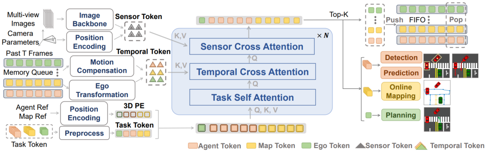

# DriveTransformer 论文解析：无 BEV、任务并行的可扩展端到端驾驶框架

> 论文：[DriveTransformer: Unified Transformer for Scalable End-to-End Autonomous Driving](https://proceedings.iclr.cc/paper_files/paper/2025/hash/a7afc9957f1190223763b6ea93218f98-Abstract-Conference.html)  
> 作者：Xiaosong Jia, Junqi You, Zhiyuan Zhang, Junchi Yan  
> 发表：ICLR 2025，2025  
> 领域：端到端自动驾驶、规划、强化学习/多模态模型相关方向

## 🌟 引言

当前端到端驾驶框架即使叫 end-to-end，内部仍常按 perception-prediction-planning 串行执行，并依赖 dense BEV 表示。DriveTransformer 的核心问题是：如何把系统复杂度降下来，让任务协同更自然，同时降低长距离/长时间建模的计算负担。

## 🧩 背景与动机

🔍 这篇工作的背景可以放在自动驾驶范式迁移中理解：从模块化流水线，到多任务联合，再到更强的端到端训练。它要解决的不是单一 perception 指标，而是驾驶系统在闭环规划、长尾场景、实时推理或可扩展训练上的瓶颈。

我的理解是，这类论文最值得关注的地方不在“端到端”这个标签本身，而在它具体选择了什么中间表示、训练信号和系统接口。真正有价值的端到端方法，应该让信息流更顺、更贴近规划目标，而不是简单把模块边界藏进一个大网络里。

## 🛠️ 方法详解

⚙️ DriveTransformer 强调三点：任务并行，让 agent、map、planning query 在每个 block 内直接交互；稀疏表示，让任务 query 直接通过 sensor cross-attention 读取原始传感器特征，而不是先构造 dense BEV；流式处理，将历史 query 作为 temporal memory 传递。整体只保留 task self-attention、sensor cross-attention、temporal cross-attention 三类统一操作。

从图 1 可以看出，论文的核心设计通常围绕输入表示、任务交互和规划输出展开。相比传统流水线，这类方法更强调跨任务共享、闭环反馈或统一 token/query 表示；相比纯黑盒控制，它又尽量保留可解释的结构，让模型失败时能追踪原因。

## 📈 实验结果

📊 ICLR 页面摘要显示，DriveTransformer 在 Bench2Drive 闭环基准和 nuScenes 开环基准上取得 SOTA 并保持高 FPS。其意义在于性能来自更简化、可扩展的结构，而不是继续加深串行流水线。

实验分析时我更关注两个问题：第一，指标提升是否直接对应驾驶安全和规划质量；第二，方法是否把计算、延迟、训练成本也纳入讨论。自动驾驶论文如果只在开环误差上好看，但闭环碰撞、违规或实时性不稳定，工程价值会明显打折。

## 💡 亮点总结

✨ 这篇论文的主要亮点可以概括为三点：

- 它围绕自动驾驶的核心瓶颈提出了明确的结构设计，而不是只做模型规模扩展。
- 它把表示学习、任务协同和规划目标联系起来，体现了端到端系统设计的整体性。
- 它通过关键图表和实验结果说明该设计确实影响了驾驶质量、效率或泛化能力。

## ⚖️ 局限性与思考

⚠️ 无 BEV 并不意味着没有空间建模成本，而是把空间交互转移到 query-attention 中；当场景极其拥挤或传感器输入更复杂时，query 设计和 temporal memory 容量仍会影响上限。

更进一步看，自动驾驶里的端到端路线仍需要面对三类问题：数据覆盖是否足够、闭环训练是否可靠、部署时能否满足安全与实时约束。因此，这篇论文更适合作为理解某条技术路线的关键节点，而不是最终答案。

## ✅ 结语

DriveTransformer 的价值在于用统一 Transformer 把端到端驾驶推向更简洁、更并行、更可扩展的系统形态。
