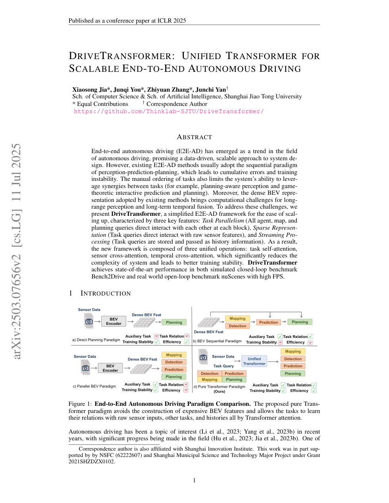
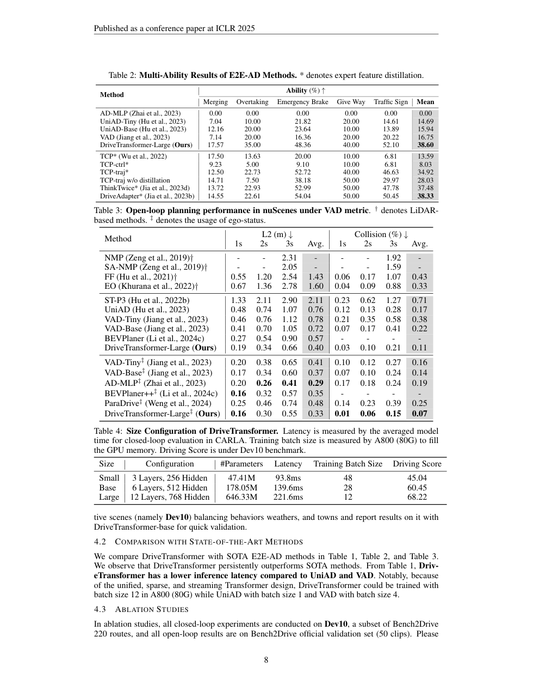

# DriveTransformer 论文解析：无 BEV、任务并行的可扩展端到端驾驶框架

> 论文：[DriveTransformer: Unified Transformer for Scalable End-to-End Autonomous Driving](https://proceedings.iclr.cc/paper_files/paper/2025/hash/a7afc9957f1190223763b6ea93218f98-Abstract-Conference.html)  
> 作者：Xiaosong Jia, Junqi You, Zhiyuan Zhang, Junchi Yan  
> 发表：ICLR 2025  
> 关键词：统一 Transformer、BEV-free、任务并行、流式处理、Bench2Drive、nuScenes

## 🌟 引言

DriveTransformer 是对 UniAD 这类统一端到端框架的进一步简化和扩展。很多端到端自动驾驶方法虽然共享一个网络，但内部仍然按 perception -> prediction -> planning 串行执行，并依赖 dense BEV 表示。这样会带来误差累积、训练不稳定、任务协同受限和长距离/长时序计算成本高等问题。

DriveTransformer 的目标是构建一个更易 scaling 的统一 Transformer。它的三个关键词是 task parallelism、sparse representation 和 streaming processing。简化来说：所有任务 token 并行交互，不再先构建 dense BEV；历史 token 作为 temporal memory 流式传递。

## 🧩 背景与核心问题

🔍 dense BEV 是自动驾驶深度学习中的主流表示，但它并不总是最经济。远距离感知和长时间融合会让 BEV 网格迅速变大，计算和内存压力上升。同时，如果 perception、prediction、planning 被手动排序，任务间关系就只能沿固定方向传递，难以表达 planning-aware perception 或交互式预测规划。

DriveTransformer 的核心问题是：能否用统一的 token/query 交互替代串行任务流水线和 dense BEV，使端到端驾驶更适合扩大模型规模？

## 🛠️ 方法详解

⚙️ DriveTransformer 的结构由三类统一操作组成。

第一是 task self-attention。agent query、map query 和 ego planning query 在每一层直接交互，而不是感知完成后再预测、预测完成后再规划。第二是 sensor cross-attention。任务 query 直接从原始传感器特征中读取信息，避免先构造 dense BEV。第三是 temporal cross-attention。历史 query 被存储并作为 memory 参与当前帧推理，实现流式时序建模。

🧠 这个设计的关键是“把任务变成 token，把系统变成统一 attention”。它没有否定 agent、map、planning 这些语义对象，而是让它们在同一个 Transformer 层内并行协同。相比固定流水线，模型有机会学习更自由的任务依赖关系。

## 📈 实验结果与图表分析

📊 ICLR 摘要显示，DriveTransformer 在 simulated closed-loop benchmark Bench2Drive 和 real-world open-loop benchmark nuScenes 上取得 SOTA，并保持较高 FPS。论文中的 scaling study 也显示，扩大统一 Transformer 结构和使用更强图像 backbone 会带来规划收益。

实验结论有两层。第一，无 BEV 并不意味着放弃空间理解，而是通过 sparse query 与传感器特征交互来减少密集计算。第二，任务并行有助于训练稳定和任务协同，特别是规划任务能更直接影响感知和预测表示。

## 💡 亮点总结

✨ DriveTransformer 的亮点包括：

- 用任务并行替代 perception-prediction-planning 的手动串行顺序。
- 用 sparse query 和 sensor cross-attention 替代 dense BEV，提升可扩展性。
- 用 streaming query memory 处理时序信息，适合长时间驾驶场景。

## ⚖️ 局限性与思考

⚠️ BEV-free 并不等于没有空间建模成本。query 数量、attention 范围、历史 memory 长度都会影响计算量和效果。其次，统一 Transformer 更依赖大规模训练和良好初始化；如果数据不足，任务并行也可能导致表示学习混乱。最后，Bench2Drive 和 nuScenes 仍不能完全替代真实闭环道路验证。

## 🔬 进一步拆解：无 BEV 并不是反对空间表示

DriveTransformer 的 BEV-free 容易被误解为“不建模空间”。更准确地说，它是不再显式构建 dense BEV feature map，而是让任务 query 直接从传感器特征中按需读取信息。空间关系仍然存在，只是通过 query attention 和 token 交互来表达。

这种设计适合 scaling。dense BEV 的成本随空间范围和分辨率增长很快，而 sparse query 可以更集中地表示 agent、map 和 ego planning 相关对象。任务并行还让 planning query 可以在每层与 agent/map query 互动，理论上更容易学习交互式预测与规划。

但这也提高了 query 设计的重要性。如果 query 数量不足，复杂场景中的对象和道路结构可能表示不完整；如果 query 太多，attention 成本又会上升。因此 DriveTransformer 的贡献不是简单取消 BEV，而是提出一种更可扩展的稀疏空间建模方式。

## 🧭 阅读建议：读这篇论文时应关注什么

如果把这篇论文作为精读材料，我建议不要只看 abstract 和主结果表，而是按三条线阅读。第一条线是表示：论文如何把原始传感器、地图、agent 状态或语言信息转成模型可处理的内部变量；这决定了方法的归纳偏置。第二条线是训练信号：模型到底从 imitation、reinforcement、world model、diffusion objective 还是多任务监督中获得能力；这决定了它能否处理分布偏移和长尾状态。第三条线是评测：开环误差、闭环驾驶分数、碰撞率、违规率、FPS 和消融实验分别回答不同问题，不能只看一个指标。

对自动驾驶论文来说，最值得警惕的是“指标漂亮但系统边界不清”。一篇真正有价值的工作，应该能说明它在哪些场景有效、依赖哪些输入假设、失败时可能来自哪个模块，以及它离真实部署还有哪些距离。按照这个标准看，上述论文都不是最终答案，但它们各自在表示、训练或系统架构上推进了端到端自动驾驶的一块拼图。

## ✅ 结语

DriveTransformer 的核心价值在于把端到端驾驶系统进一步抽象为统一、稀疏、流式的 Transformer 框架，为自动驾驶基础模型化和规模化提供了清晰方向。
