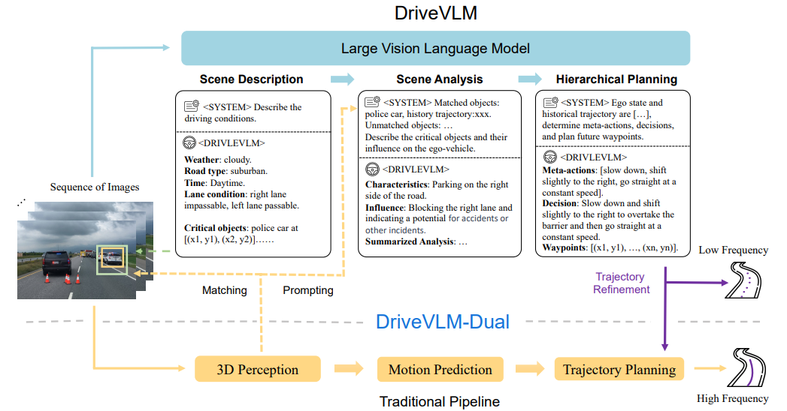
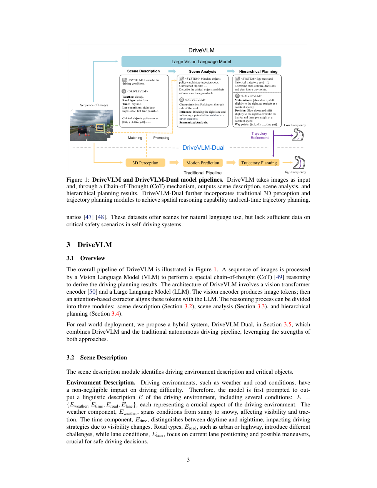
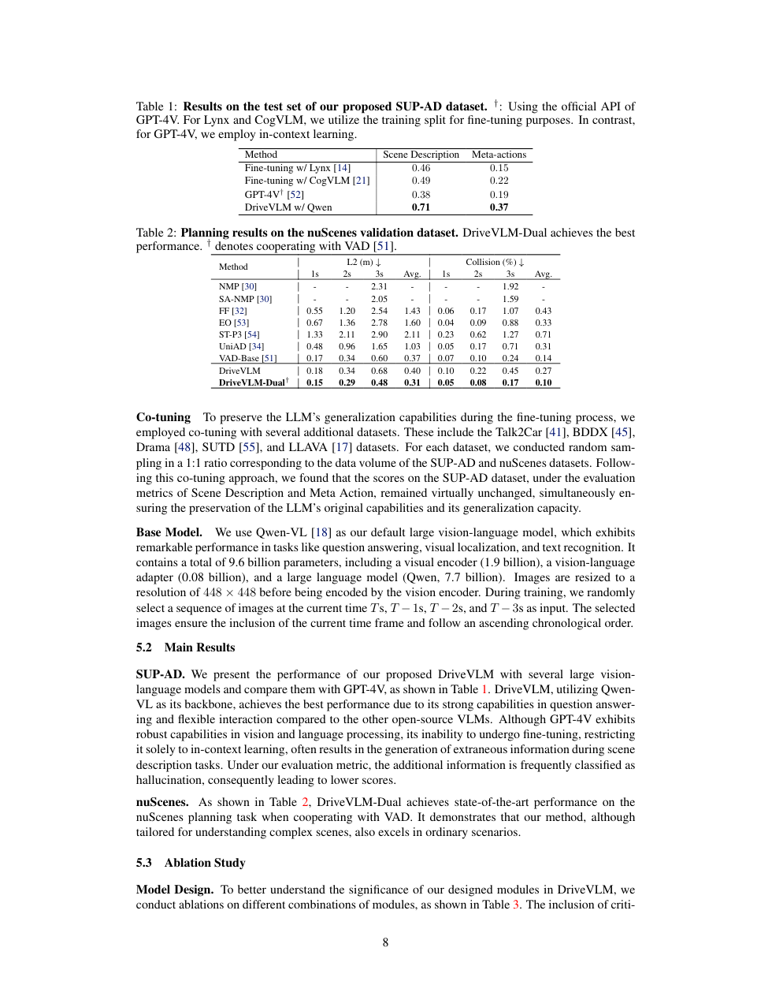

# DriveVLM 论文解析：让视觉语言模型参与自动驾驶场景理解与规划

> 论文：[DriveVLM: The Convergence of Autonomous Driving and Large Vision-Language Models](https://huggingface.co/papers/2402.12289)  
> 作者：Xiaoyu Tian, Junru Gu, Bailin Li, Yicheng Liu, Chenxu Hu, Yang Wang, Kun Zhan, Peng Jia, Xianpeng Lang, Hang Zhao  
> 发表：arXiv 2024  
> 关键词：视觉语言模型、链式思维、自动驾驶规划、快慢系统、nuScenes

## 🌟 引言

DriveVLM 的出发点是：自动驾驶不仅需要识别物体，还需要理解复杂交通语义。施工引导、异常障碍物、行人意图、非标准道路行为等长尾场景，往往需要常识和语言级推理。传统几何感知系统擅长 3D 定位，但不一定擅长解释“为什么此时应该减速或绕行”。

DriveVLM 尝试把 VLM 引入自动驾驶规划。它通过 chain-of-thought 模块进行场景描述、场景分析和层级规划，同时提出 DriveVLM-Dual，把 VLM 与传统自动驾驶流水线结合，形成快慢双系统。

## 🧩 背景与核心问题

🔍 VLM 的优势是语义理解和常识推理，劣势是空间定位不够精确、推理开销较高、输出稳定性不足。自动驾驶系统恰恰需要二者兼得：既要能理解复杂语义，又要能实时输出几何上可靠的规划。

因此 DriveVLM 不是简单让 VLM 直接控制车辆，而是把它嵌入规划流程。DriveVLM 负责较高层的语义推理，DriveVLM-Dual 则结合传统 3D 感知与规划模块，弥补空间和实时性短板。

## 🛠️ 方法详解

⚙️ DriveVLM 的 CoT 流程包括三个层次。第一，scene description，把视觉输入转成可读的场景描述。第二，scene analysis，分析潜在风险、交通参与者关系和驾驶约束。第三，hierarchical planning，从高层行为决策到低层轨迹规划逐步生成驾驶方案。

DriveVLM-Dual 是论文更工程化的部分。它将 VLM 看作慢系统，负责语义和逻辑推理；传统 3D pipeline 看作快系统，负责精确空间理解和实时反应。这个设计类似人类驾驶：直觉反应需要快，复杂情境判断需要慢。

🧠 我的理解是，DriveVLM 的关键价值不在“VLM 能否完全替代驾驶栈”，而在提出一种更合理的集成方式：让大模型处理它擅长的语义推理，让几何模块处理它擅长的实时控制。

## 📈 实验结果与图表分析

📊 论文在 nuScenes 和 SUP-AD 数据集上评估，强调在复杂和不可预测驾驶场景中 DriveVLM 及 DriveVLM-Dual 相比基线更有效。实验结果支持一个务实结论：VLM 对复杂语义场景有帮助，但与传统 3D 系统结合后更稳健。

结果表明，纯 VLM 路线在空间精度和实时性上有短板，而 Dual 架构能更好兼顾语义理解与几何约束。消融实验也能说明 CoT 模块不是形式化提示，而是对复杂场景推理有实际贡献。

## 💡 亮点总结

✨ DriveVLM 的亮点包括：

- 将 CoT 推理引入自动驾驶场景理解与规划。
- 提出 DriveVLM-Dual 快慢双系统，避免盲目用 VLM 替代所有模块。
- 构建/使用更关注复杂长尾语义的评测设置，凸显 VLM 的适用位置。

## ⚖️ 局限性与思考

⚠️ VLM 在自动驾驶中的风险仍然很高：hallucination、响应延迟、空间数值不准、对罕见视觉模式不稳定，都可能带来安全问题。因此 DriveVLM 更适合作为高层推理模块或辅助规划模块，而不是单独承担低层控制。未来更可行的方向可能是 VLM + 可验证规划约束 + 闭环评估的组合。

## 🔬 进一步拆解：快慢双系统比纯 VLM 更现实

DriveVLM-Dual 的价值在于它没有把 VLM 神化。自动驾驶需要毫秒级反应和精确 3D 空间判断，而当前 VLM 在这些方面并不稳定。让 VLM 直接输出低层控制，风险很高；让它负责复杂场景的语义解释和高层规划，则更符合其能力边界。

快系统可以由传统感知、跟踪、预测和规划模块承担，处理常规道路几何和实时避障。慢系统由 VLM 负责，处理施工标识、异常物体、复杂交通意图等语义问题。两者结合后，系统既不会失去工程可控性，也能获得大模型的世界知识。

这对未来自动驾驶大模型很有启发：真正可用的大模型驾驶系统，可能不是一个端到端黑盒，而是一个带有明确职责分工的混合智能系统。VLM 的输出还需要经过几何约束、规则检查和闭环验证，才能进入安全关键决策。

## 🧭 阅读建议：读这篇论文时应关注什么

如果把这篇论文作为精读材料，我建议不要只看 abstract 和主结果表，而是按三条线阅读。第一条线是表示：论文如何把原始传感器、地图、agent 状态或语言信息转成模型可处理的内部变量；这决定了方法的归纳偏置。第二条线是训练信号：模型到底从 imitation、reinforcement、world model、diffusion objective 还是多任务监督中获得能力；这决定了它能否处理分布偏移和长尾状态。第三条线是评测：开环误差、闭环驾驶分数、碰撞率、违规率、FPS 和消融实验分别回答不同问题，不能只看一个指标。

对自动驾驶论文来说，最值得警惕的是“指标漂亮但系统边界不清”。一篇真正有价值的工作，应该能说明它在哪些场景有效、依赖哪些输入假设、失败时可能来自哪个模块，以及它离真实部署还有哪些距离。按照这个标准看，上述论文都不是最终答案，但它们各自在表示、训练或系统架构上推进了端到端自动驾驶的一块拼图。

因此，DriveVLM 更像是在回答“VLM 应该放在驾驶系统哪里”这个问题。它没有回避大模型的缺陷，而是通过 Dual 架构给出职责划分：语义推理由慢系统承担，几何与控制由快系统兜底。这个思路比单纯追求端到端大模型更稳。

这也提醒我们，端到端规划的评价不能只看平均 L2 误差。真正关键的是在交互密集和决策分叉的场景中，模型能否给出多样、稳定且可执行的轨迹，并在实时预算内完成推理。

这也是它区别于普通 VQA 驾驶论文的地方：目标不是回答图中有什么，而是把语义理解转化为可执行规划。

## ✅ 结语

DriveVLM 的核心价值在于提出一种现实的大模型自动驾驶集成路径：让 VLM 负责复杂语义推理，让传统几何系统保证空间精度与实时性。
