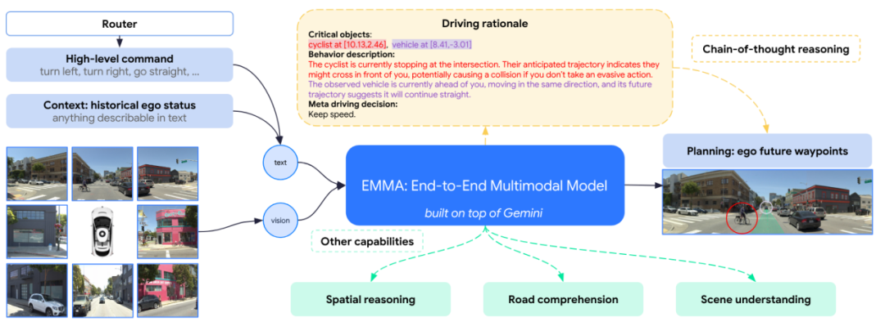
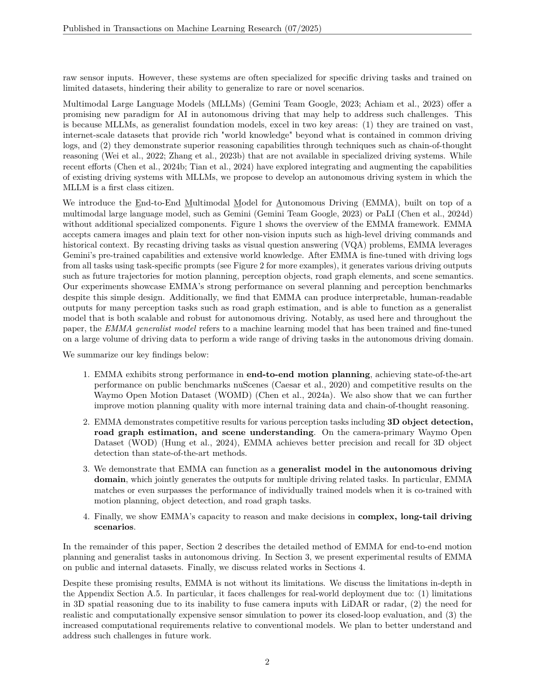
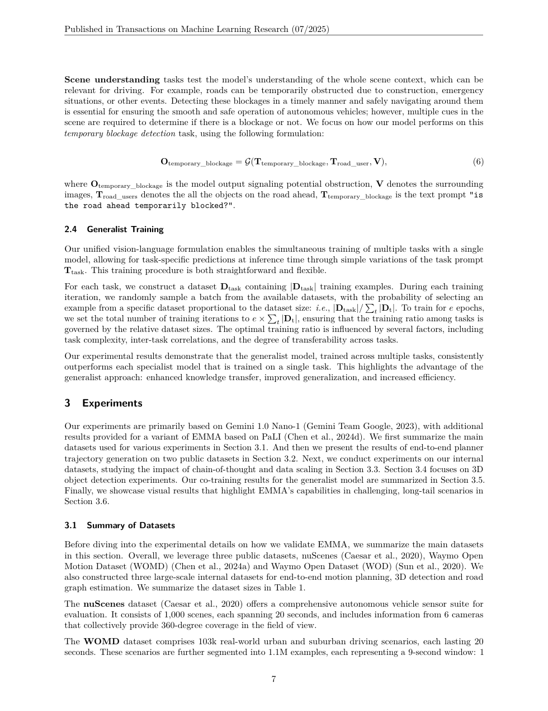

# EMMA 论文解析：Waymo 如何把多模态大模型接入端到端驾驶

> 论文：[EMMA: End-to-End Multimodal Model for Autonomous Driving](https://waymo.com/research/emma/)  
> 作者：Jyh-Jing Hwang, Runsheng Xu, Hubert Lin, Wei-Chih Hung 等  
> 发表：arXiv 2024 / Waymo Research  
> 关键词：多模态大模型、端到端自动驾驶、VQA、轨迹规划、3D 检测、道路图生成

## 🌟 引言

EMMA 是 Waymo 对“大模型能否成为自动驾驶系统一等公民”的一次探索。它不是把 VLM 当作旁路解释器，也不是只让大模型回答驾驶场景问题，而是尝试用一个多模态大模型统一处理规划、3D 检测、道路图生成等驾驶任务。

这篇论文的思想很激进：将非传感器输入如导航指令、自车状态，以及输出如轨迹、3D box、road graph elements 都转成自然语言文本表示，让模型在统一语言空间中完成驾驶任务。这样做的直接好处是可以最大化利用预训练大模型的世界知识和推理能力。

## 🧩 背景与核心问题

🔍 模块化自动驾驶系统可解释、可控，但面对新奇场景时扩展性有限。端到端神经网络可以减少手工接口，但纯视觉轨迹回归又缺少常识推理。EMMA 关注的是第三条路线：让多模态大模型承担统一任务接口，直接从摄像头视频和文本化任务提示生成驾驶输出。

论文 Figure 1 展示了 EMMA 的基本思想：多帧多摄像头图像作为视觉输入，导航和自车状态被文本化，任务以 prompt 形式给出，输出也被格式化为文本序列。它把自动驾驶任务改写成一种“视觉条件下的结构化语言生成”。

## 🛠️ 方法详解

🧠 EMMA 建立在预训练 MLLM 之上。它并不单独为 planning、detection、road graph generation 设计完全不同的 head，而是通过任务 prompt 和文本格式统一输出。例如轨迹可以被表示为一串离散化坐标，3D 目标检测可以表示为类别和 box 参数，道路图元素也可以被序列化为文本。

这种设计的关键是输入输出统一化。对于大模型来说，所有任务都变成“看图 + 读 prompt + 生成结构化答案”。这让不同驾驶任务之间可以共享视觉理解和语言推理能力，也使得模型具备一定链式推理和解释能力。

⚙️ 但 EMMA 并不是没有代价。将连续几何问题文本化，会带来量化误差和格式约束；MLLM 处理多帧多摄像头输入的计算成本也很高。因此论文更多是在验证可行性，而不是宣称已经可以直接替代生产系统。

## 📈 实验结果与图表分析

📊 EMMA 在 nuScenes、Waymo Open Motion Dataset 和 Waymo Open Dataset 上评估规划、3D 目标检测和道路图生成。论文报告其在运动规划上取得强结果，在 3D 检测和道路图任务上也具备竞争力。

实验的重点不是某一个指标，而是多任务统一建模是否成立。结果说明，MLLM 的通用视觉语言能力可以迁移到驾驶任务中，尤其在需要语义理解和推理的场景中有潜力。但结果也提醒我们：检测和几何定位这类高精度任务，并不天然适合完全语言化，需要更强的空间表示或与传统模块结合。

## 💡 亮点总结

✨ EMMA 的贡献可以概括为三点。

- 把驾驶任务统一成 MLLM 可处理的文本输入输出格式，降低多任务接口复杂度。
- 将规划、检测、道路图生成放入同一个模型框架，探索大模型作为驾驶核心的可能性。
- 明确展示了 MLLM 在驾驶中的优势和局限，为后续 OpenEMMA、DriveVLM 等路线提供参照。

## ⚖️ 局限性与思考

⚠️ EMMA 的局限也很明显。Waymo 自己指出，模型难以高效纳入 LiDAR/radar 等 3D 传感器，能处理的图像帧数有限，计算成本高。此外，大模型 hallucination 和精确几何能力不足是自动驾驶安全场景里的硬问题。

我的理解是，EMMA 更像一个研究信号：它证明 MLLM 可以成为驾驶任务的统一接口，但短期内更可能作为高层语义推理和复杂场景解释模块，而不是完全替代实时安全控制链。

## 🔬 进一步拆解：为什么 EMMA 要把驾驶输出文本化

EMMA 最反直觉的地方是把连续驾驶输出变成文本。这样做看似绕远，但对 MLLM 有两个好处。第一，预训练模型原本就擅长序列生成，文本化可以复用其语言建模能力。第二，规划、检测、道路图这些异构任务可以共享统一输出接口，不必为每个任务设计完全不同的 decoder。

当然，这种统一接口有明显代价。轨迹坐标和 3D box 参数是连续几何量，文本化后需要离散化和格式约束；模型一旦输出格式错误或数值不稳定，后处理就会变复杂。因此 EMMA 的贡献更像是“证明统一语言接口可行”，而不是说明文本一定是驾驶系统的最终表示形式。

从研究趋势看，EMMA 可能启发两类后续路线：一类继续扩大 MLLM，在更多驾驶任务上统一建模；另一类则把 MLLM 作为高层语义推理器，再连接可验证的几何规划模块。后者短期内可能更适合安全关键系统。

## 🧭 阅读建议：读这篇论文时应关注什么

如果把这篇论文作为精读材料，我建议不要只看 abstract 和主结果表，而是按三条线阅读。第一条线是表示：论文如何把原始传感器、地图、agent 状态或语言信息转成模型可处理的内部变量；这决定了方法的归纳偏置。第二条线是训练信号：模型到底从 imitation、reinforcement、world model、diffusion objective 还是多任务监督中获得能力；这决定了它能否处理分布偏移和长尾状态。第三条线是评测：开环误差、闭环驾驶分数、碰撞率、违规率、FPS 和消融实验分别回答不同问题，不能只看一个指标。

对自动驾驶论文来说，最值得警惕的是“指标漂亮但系统边界不清”。一篇真正有价值的工作，应该能说明它在哪些场景有效、依赖哪些输入假设、失败时可能来自哪个模块，以及它离真实部署还有哪些距离。按照这个标准看，上述论文都不是最终答案，但它们各自在表示、训练或系统架构上推进了端到端自动驾驶的一块拼图。

补充一点，EMMA 的价值还在于它把多任务数据组织问题暴露出来：如果未来自动驾驶大模型要持续扩展，如何把轨迹、检测、道路拓扑、交通规则和自然语言解释放到同一训练语料中，会成为和模型结构同样重要的问题。

## ✅ 结语

EMMA 的核心价值在于把多模态大模型从“驾驶问答工具”推进为“统一驾驶任务生成器”，但实时性、几何精度和安全可靠性仍是落地前必须解决的问题。
