## 🌟 引言
Efficient and Adaptable Overlapping for Computation and Communication via Signaling and Reordering 是一篇 EuroSys 2026 论文，系统名为 FlashOverlap。它关注多 GPU 生成模型中的一个经典瓶颈：GEMM 计算之后往往紧跟 AllReduce、ReduceScatter 或 All-to-All 等通信操作，而这些通信会在 tensor parallelism、expert parallelism、data parallelism 中频繁出现。

已有方法大致分成两类：decomposition-based 方法把 GEMM 拆成多个小块，让小块计算和通信交错执行；fusion-based 方法把通信逻辑写进自定义 GEMM kernel。前者易用但 overlap 粒度粗、会破坏 GEMM 性能；后者更细粒度，但需要为不同通信 primitive 手写/调优 kernel，工程负担高。

> 一句话总结：FlashOverlap 用 signaling 在不打断 GEMM main loop 的情况下触发已完成 tile/wave group 的通信，再通过 pre/post reordering 让数据满足 NCCL 连续地址要求，实现 tile-wise、interference-free、communication-agnostic 的计算通信重叠，operator 级最高 1.65x 加速，端到端任务带来 1.05-1.13x speedup。

论文链接：[arXiv:2504.19519](https://arxiv.org/abs/2504.19519)

## 📌 论文基本信息
- 标题：Efficient and Adaptable Overlapping for Computation and Communication via Signaling and Reordering
- 作者：Ke Hong, Xiuhong Li, Minxu Liu, Qiuli Mao, Tianqi Wu, Zixiao Huang, Lufang Chen, Zhong Wang, Yichong Zhang, Zhenhua Zhu, Guohao Dai, Yu Wang
- 会议：EuroSys 2026
- 代码：[FlashOverlap](https://github.com/infinigence/FlashOverlap)
- 研究领域：AI Infra、Multi-GPU Systems、Communication-Compute Overlap、LLM Training/Inference
- 核心问题：如何在不改写通信 primitive、不显著干扰 GEMM 原始性能的前提下，以足够细的粒度重叠计算与通信。

## 🧩 背景与动机
生成模型规模持续增大，多 GPU 已经是训练和推理的常态。模型并行或专家并行会让 GEMM 后面出现大量通信：TP 中常见 GEMM+AllReduce 或 GEMM+ReduceScatter，MoE expert parallelism 中则会出现 GEMM+All-to-All。

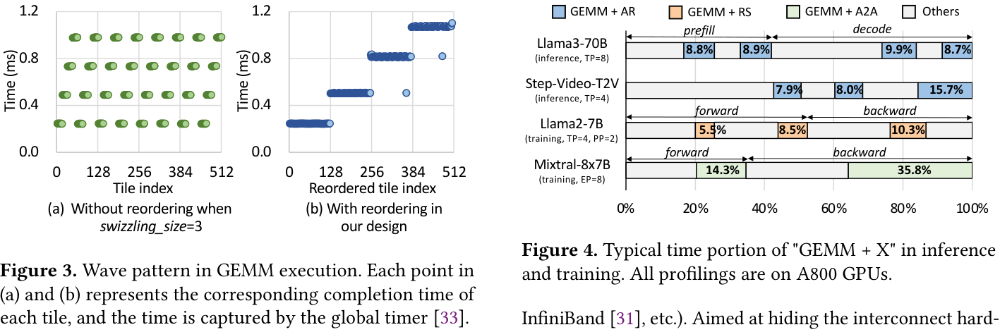

📊 图 4 展示了为什么这件事重要。在 Llama3-70B 推理、Mixtral-8x7B 训练、Step-Video-T2V 推理、Llama2-7B 训练等场景中，GEMM+AR、GEMM+RS、GEMM+A2A 都占据了显著比例，其中 MoE training 的 GEMM+A2A 可超过 40% latency。通信不是边角开销，而是端到端性能的重要组成。

图 3 则展示了 FlashOverlap 的关键观察：GEMM 输出 tile 的完成时间呈现 wave pattern。多个 tile 会近乎同时完成，而 wave 数大致与 tile 数除以 SM 数相关。这意味着“逐 tile 通信”虽然理论上 overlap 机会最大，但未必必要；以 wave 或 wave group 为单位触发通信，可能在几乎不损失 overlap 机会的情况下提高通信带宽利用率。

论文对已有方案的判断可以浓缩为三条设计目标：

- Tile-wise overlapping：通信应该尽早从已完成 tile 或 tile group 开始，而不是等大块 GEMM 完成。
- Interference-free computation：不能为了 overlap 把高性能 GEMM main loop 拆坏或改慢。
- Communication agnosticism：不能为 AllReduce、ReduceScatter、All-to-All 分别手写一套通信 kernel，最好能直接复用 NCCL/HCCL 等库。

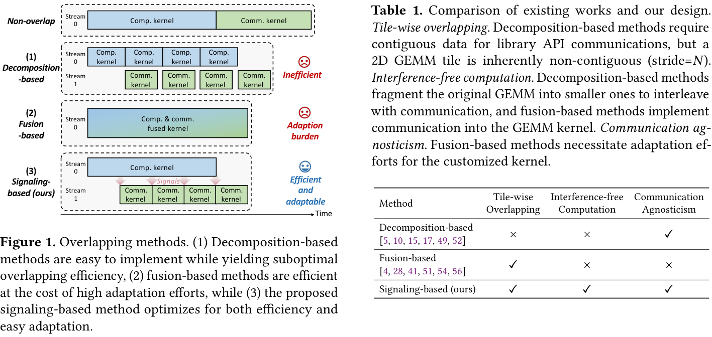

🔍 图 1 和表 1 是论文问题定义的核心。Decomposition-based 方法容易调用 cuBLAS/NCCL，但无法 tile-wise overlap，也会把 GEMM 拆小导致计算效率下降；fusion-based 方法能 tile-wise overlap，却需要自定义通信并可能干扰 GEMM tiling。FlashOverlap 的目标就是同时拿到三项：tile-wise、interference-free、communication-agnostic。

## 🛠️ 方法详解
FlashOverlap 的总体设计由两部分组成：

- Signaling：GEMM kernel 内部在某个 tile/wave group 完成后写 signal，另一个 stream 中的 signaling kernel 监听计数并触发通信。
- Reordering：通信前把已完成 tiles 重排到连续地址，使 NCCL API 可以直接通信；通信后再重排回正确顺序，或把重排融合进后续 element-wise kernel。

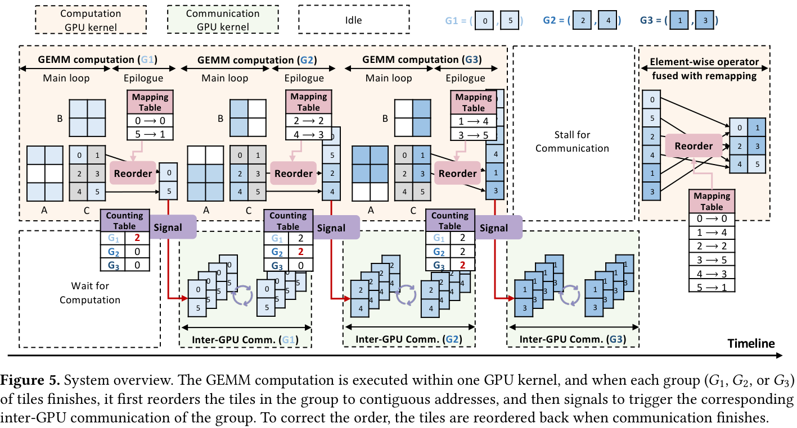

🧠 图 5 展示了完整流程。GEMM 仍然作为一个 GPU kernel 执行，main loop 不被切碎。每个 group `G1/G2/G3` 的 tiles 完成后，先在 epilogue 中做 pre-communication reordering，把数据放到连续 buffer；随后写 signal 触发该 group 的 inter-GPU communication。通信结束后，再通过 post-communication reordering 修正顺序。

这个设计的漂亮之处在于：依赖关系由 signal 串起来，但通信仍然通过 NCCL 等库实现；GEMM 的核心计算逻辑尽量不被侵入。

### ⚙️ Signaling：从 Tile 到 Wave Group
如果每个 tile 完成后立刻通信，理论上最细粒度，但通信会极度碎片化。论文在图 8 中展示了带宽随 data size 的曲线，小数据通信带宽显著下降。例如 4 张 RTX 4090 上 AllReduce 一个 192KB tile 只有约 13% bandwidth utilization。

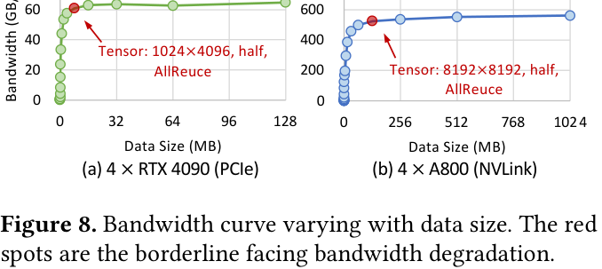

因此 FlashOverlap 不直接逐 tile 通信，而是利用 GEMM 的 wave pattern：一个 wave 内的 tile 近乎同时完成。它进一步把若干 wave 组成 wave group，在 group 完成后统一通信。

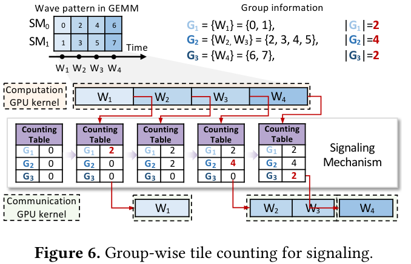

图 6 展示了实现方式。FlashOverlap 维护一个 counting table，每个 group 对应一个计数器。某个 tile 完成时，GEMM kernel 原子增加所属 group 的计数；当计数达到 group 的 tile 数量，该 group 的 signal 条件满足，通信 stream 中对应通信可以开始。

这里的关键 trade-off 是：

- group 太小：overlap 机会更早，但通信碎片化，带宽差。
- group 太大：通信更高效，但启动太晚，overlap 机会减少。

因此 FlashOverlap 把 wave grouping 做成可调策略，并设计实时预测搜索。

### ⚙️ Reordering：让已完成数据变成 NCCL 可通信的连续地址
NCCL 等通信库通常要求 send/receive buffer 是连续地址。但 GEMM tile 在二维矩阵中天然不连续；再加上 block swizzling，tile 完成顺序和内存顺序也可能不一致。

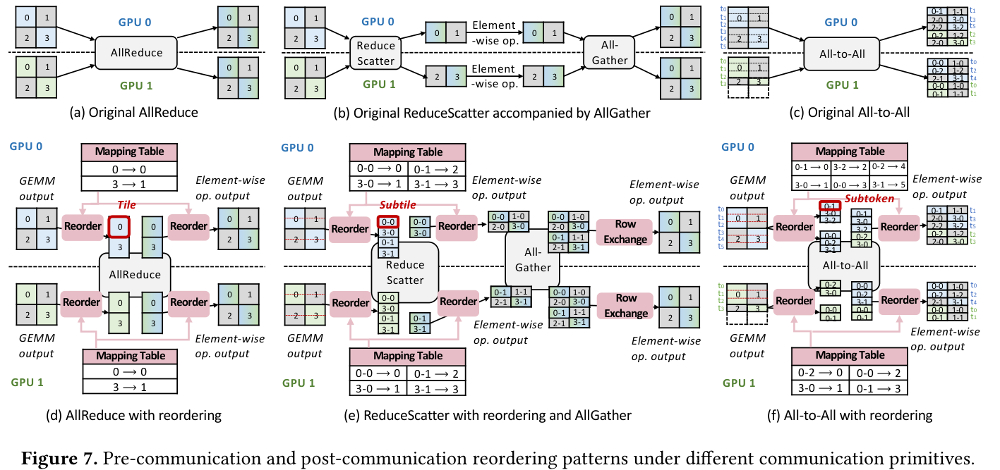

图 7 是论文中最关键也最细的系统图之一。它说明 FlashOverlap 对不同通信 primitive 采用不同 reordering 规则：

- AllReduce：只要所有 GPU 使用一致的 tile 顺序即可，通信顺序可以不同于原始 GEMM 输出顺序。通信后再根据 mapping table 还原。
- ReduceScatter：需要保证每一行完整地落在某个 GPU 上，因此 tile 会先按 row 方向拆成 subtile，再以 subtile 为重排单位。后续 AllGather 可以聚合并恢复行顺序。
- All-to-All：以 token/row 为通信粒度，FlashOverlap 为每个目标 GPU 维护独立 memory pool，并在 pool 内按执行顺序重排。

论文的一个重要洞察是：通信过程本身不一定需要“原始顺序正确”，只需要满足通信 primitive 的语义约束。只要通信前后通过 mapping table 修正顺序，就可以用错误的中间顺序换取连续地址和更早通信。

### ⚙️ Wave Group Tuning：实时选择通信粒度
wave group 的划分空间是指数级的。如果 GEMM 有 `T` 个 wave，每个 wave 后都可以选择“立即通信”或“继续累积”，设计空间为 `2^(T-1)`。

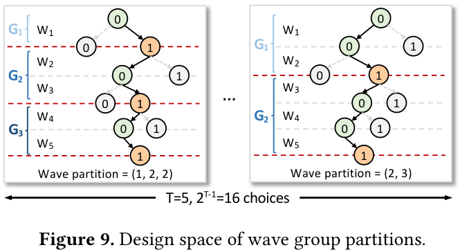

图 9 展示了这种二进制决策。例如 5 个 wave 可以划成 `(1,2,2)`，也可以划成 `(2,3)`。不同划分会改变通信启动时间、通信分段大小和尾部等待。

直接在线 profile 所有候选不可行。论文举例，一个典型 GEMM 在 RTX 4090 上有 8 个 wave，128 个候选；如果每个候选都做 10 次 warm-up 和 100 次 timing，调优时间超过 1 分钟，远大于模型 forward latency。

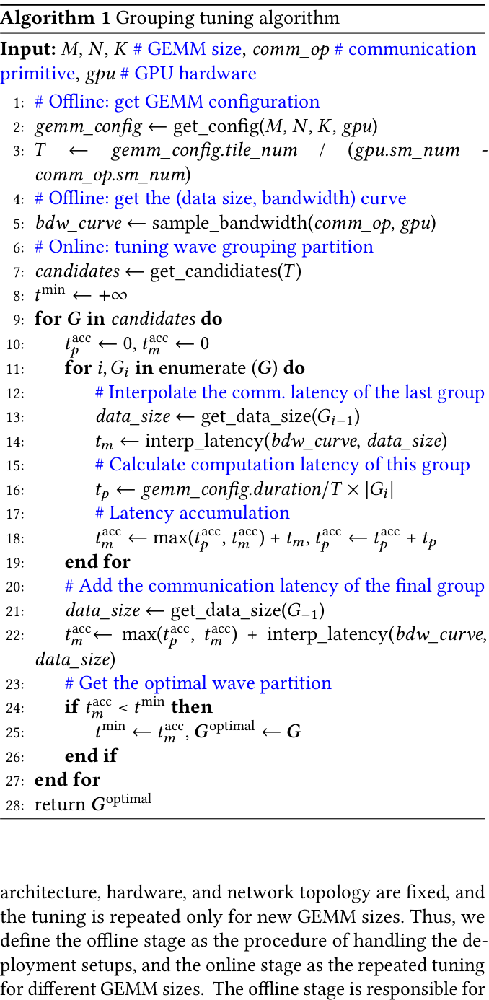

Algorithm 1 的做法是 predictive search：

- Offline：获取 GEMM configuration、tile 数、swizzling、duration、通信 bandwidth curve，以及通信 primitive 占用的 SM 数。
- Online：生成剪枝后的候选 group partitions。
- 对每个候选，分别估计 group 的 computation latency 和 communication latency。
- 用 accumulated compute/communication timeline 模拟 overlap 后总 latency，选 latency 最小的 partition。

剪枝依据来自一个简单但实用的判断：first group 太大会造成 cold start，last group 太大会造成 long tail，因此约束首尾 group size，例如论文实验中使用 `|G1| <= 2`、`|Gp| <= 4`。

## 📈 实验结果
FlashOverlap 基于 CUTLASS templated GEMM 实现，pre-communication reordering 集成在 GEMM epilogue 中，通信调用 NCCL API。实验覆盖 NVIDIA A800、RTX 4090，以及 HUAWEI Ascend 910B。通信 primitive 包括 GEMM+AllReduce、GEMM+ReduceScatter 和 GEMM+All-to-All。

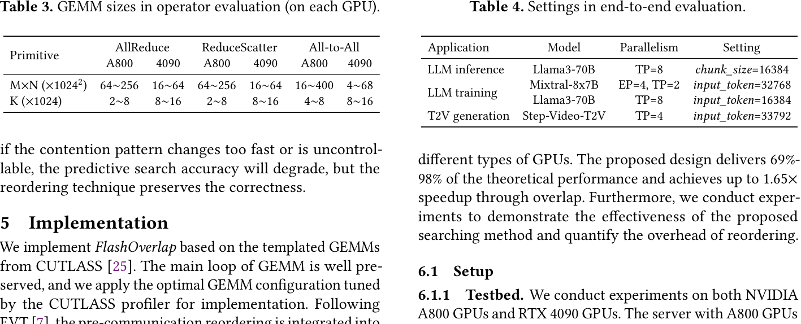

📊 表 3 说明 operator evaluation 覆盖了不同通信 primitive、GPU 类型、并行规模和 GEMM sizes。表 4 则展示端到端任务：Llama3-70B 推理、Mixtral-8x7B/Llama3-70B 训练，以及 Step-Video-T2V 推理。

### 📊 Operator-level：多数场景优于 decomposition/fusion baseline
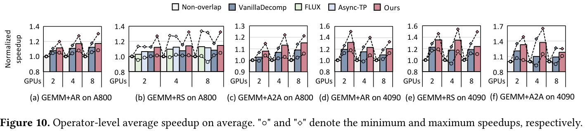

图 10 比较了 Non-overlap、VanillaDecomp、FLUX、Async-TP 和 FlashOverlap。整体上，FlashOverlap 在 A800 和 4090 上的 GEMM+AR、GEMM+RS、GEMM+A2A 多数场景中取得更高平均 speedup，并且较少出现性能劣化。这与它的设计目标一致：不拆 GEMM main loop，因此计算性能更稳定；不手写通信 primitive，因此能直接复用 NCCL。

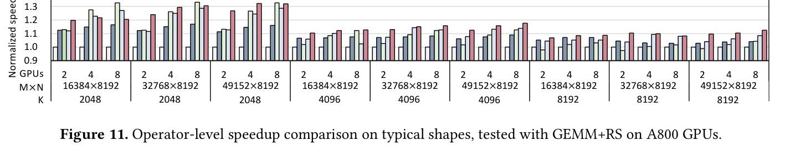

图 11 展示了更细的 shape-level 结果。在 A800 的 GEMM+RS 上，除了部分 `K=2048` 的小 K 情况，FlashOverlap 基本稳定优于 baseline。论文解释，小 K 时 fusion-based 方法可能因为减少 memory access 占优，而 FlashOverlap 的主要优势在更大的 K 或更合适的通信/计算比例上更明显。

### 📈 End-to-end：真实任务 1.05-1.13x speedup
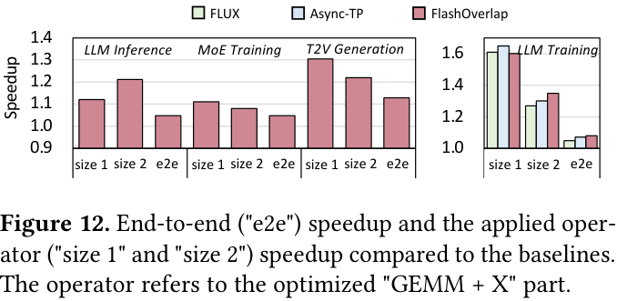

图 12 展示端到端结果。FlashOverlap 在不同任务上带来 1.05-1.13x speedup。这个数字看起来没有 operator-level 最高 1.65x 那么大，但更符合系统论文里的真实贡献：FlashOverlap 只替换 GEMM+X 这部分 operator，因此端到端收益取决于该部分在整体任务中的占比。

T2V generation 收益较高，因为其 input token 数大，对应 GEMM+communication 占比高；LLM training 中，随着 K 增大，FlashOverlap 相比其他 overlap 方法更有优势。

### 🔍 理论上限与 heatmap
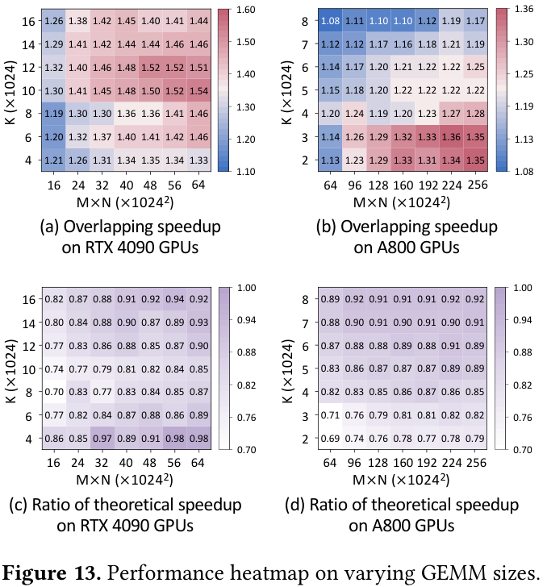

图 13 很适合理解 FlashOverlap 的适用区域。横轴 `M x N` 决定通信数据量，纵轴 `K` 影响计算/通信比例。speedup 在计算和通信 latency 接近的区域更高，因为 overlap 的空间最大。

论文还计算了 theoretical upper bound：若重叠完美，总 latency 接近 `max(compute, communication)` 外加不可避免的首尾部分。FlashOverlap 在多数场景能达到理论 speedup 的 80% 以上，在论文摘要中报告整体可达 69%-98% theoretical performance。

### 🧪 消融：固定 group size 与预测搜索都不够好
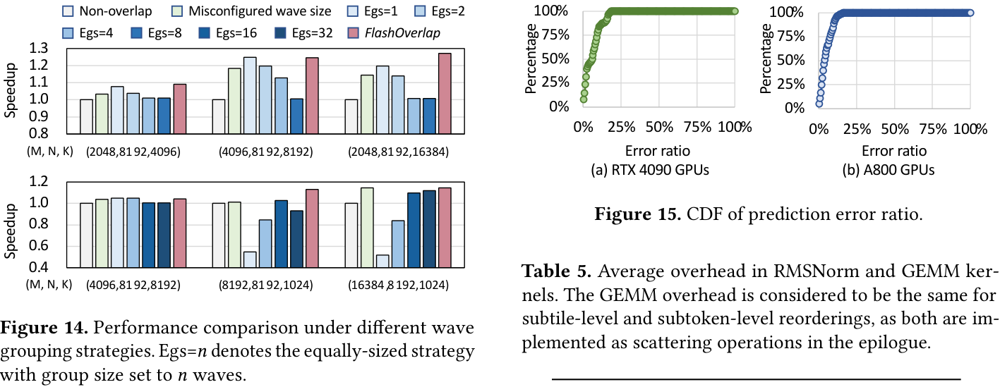

图 14 展示了为什么 tuning 必要。固定 group size 并不稳定：A800 上为了避免通信碎片化往往需要更大 group，4090 上则可能更偏好 group size 1。等大小 group 也不一定好，因为时间线头尾的冷启动和长尾对 overlap latency 影响不同。FlashOverlap 的 predictive search 能根据 shape/hardware/primitive 自动选择 partition。

图 15 显示预测误差较低：RTX 4090 与 A800 上平均 error ratio 分别为 3.41% 和 3.44%；搜索到的 partition 能达到最优 partition 的 99% 以上性能。

表 5 则说明 reordering overhead。post-communication reordering 融合进 RMSNorm 时，A800 上 tile/subtile/subtoken 分别带来约 7.46%、7.93%、8.45% 额外 latency；GEMM epilogue 中的 pre-communication reordering overhead 很小，A800 上 tile 为 0.07%，subtile/subtoken 为 0.67%。因此，reordering 虽然不是免费，但被融合后开销可控。

### ⚙️ Ascend NPU：验证通信库无关的可适配性
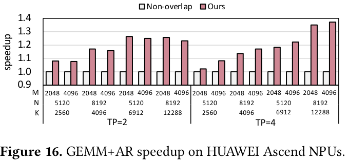

图 16 展示 FlashOverlap 在 HUAWEI Ascend 910B 上的结果。作者用 TBE GEMM 和 HCCL 通信作为基础，在典型 LLM GEMM shapes、TP=2/4 下测试 GEMM+AR，最高达到 1.37x speedup。这部分对论文的“adaptable”主张很重要：FlashOverlap 并不是只绑定 NVIDIA NCCL/CUTLASS 思路，而是可以迁移到 HCCL 类通信库。

## 💡 亮点总结
- ✨ 问题定义清晰：同时追求 tile-wise overlapping、interference-free computation 和 communication agnosticism。
- ✨ Signaling 设计克制：用 signal 表达数据依赖，不切碎 GEMM main loop，也不把通信 primitive 写死进 GEMM。
- ✨ Reordering 很关键：通过允许中间通信顺序“暂时不正确”，换取连续地址和 NCCL API 可用性。
- ✨ Tuning 不靠蛮力：用 wave group 作为可调粒度，并通过 bandwidth curve 与 GEMM profile 做预测搜索。
- ✨ 实验覆盖面较好：A800、4090、Ascend 910B，AR/RS/A2A，operator-level 与端到端任务都有覆盖。

## ⚖️ 局限性与思考
首先，FlashOverlap 的收益依赖计算和通信 latency 比例。当通信占比太小，或者计算/通信无法形成有效重叠窗口时，端到端收益自然有限。论文中的 e2e speedup 为 1.05-1.13x，也说明它是针对特定 bottleneck 的局部优化，而不是全系统万能加速器。

其次，reordering 虽然被融合后开销可控，但仍需要后续 element-wise operator 能容纳 post-communication remapping。如果某些 operator chain 不适合融合，或者后续算子对数据顺序有更严格要求，集成复杂度会上升。

第三，预测搜索依赖硬件、通信 primitive、GEMM config 和 bandwidth curve 的 profile。论文讨论了 thermal throttling 和 resource contention，但如果实际生产中资源竞争快速变化，预测精度可能下降。好在 reordering 保证 correctness，但性能 optimality 可能受影响。

第四，当前实现基于 CUTLASS templated GEMM，虽然 main loop 尽量不变，但把 pre-communication reordering 集成到 epilogue 仍然需要适配 GEMM kernel 框架。对已有 closed-source kernel 或高度定制 kernel，接入成本未必很低。

最后，FlashOverlap 聚焦“相邻 GEMM+communication”的 data-dependent overlap。它与多数据流调度、pipeline overlap、MoE expert scheduling 等更高层系统优化是正交关系。真实大模型训练系统可能需要把 FlashOverlap 作为底层 operator 技术，再与上层并行策略协同。

## ✅ 结语
FlashOverlap 的核心贡献不是简单说“计算通信可以重叠”，而是给出了一个很工程化的答案：如何在不牺牲 GEMM 性能、不重复实现通信库、不放弃细粒度 overlap 的情况下实现重叠。

我认为这篇论文对 AI Infra 的启发在于，未来大模型系统的性能优化会越来越多地发生在 operator 和通信库之间的边界层。GEMM、NCCL/HCCL、CUDA stream、epilogue fusion、tile scheduling 这些原本相对分离的层次，需要被重新组合。FlashOverlap 用 signaling 和 reordering 搭了一座桥：让计算 kernel 知道什么时候可以通信，让通信库仍然以熟悉的方式工作。
