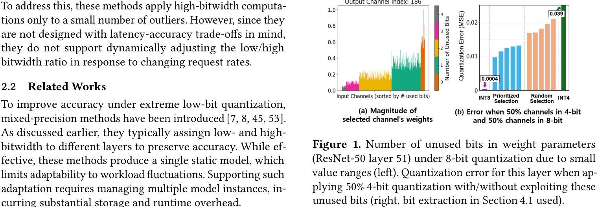
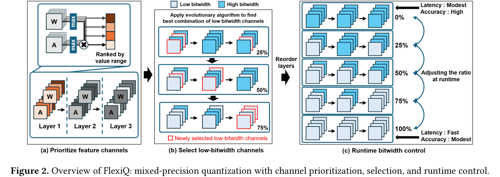
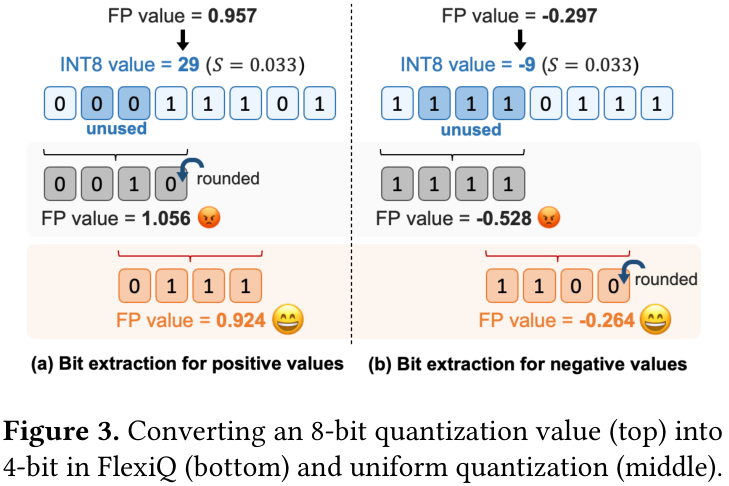
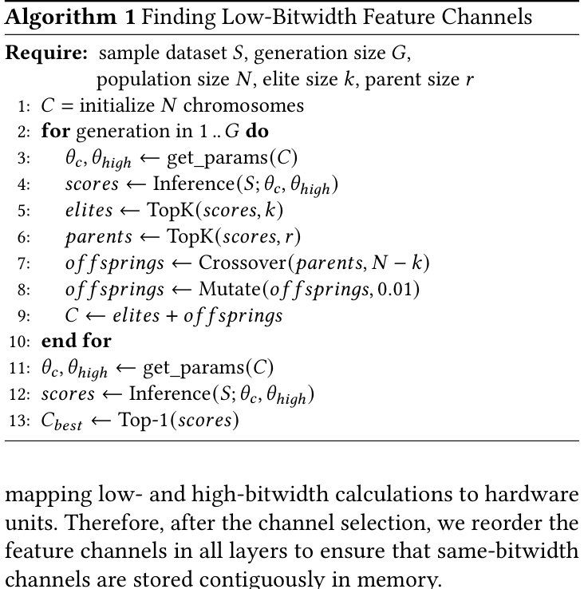
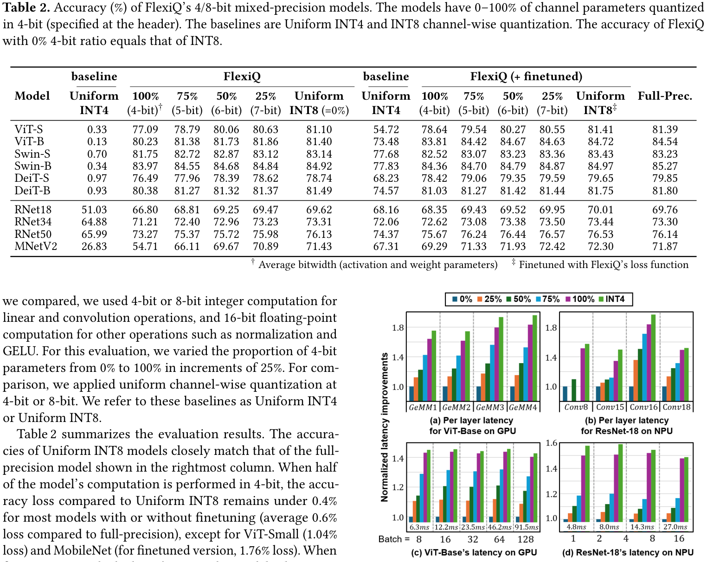
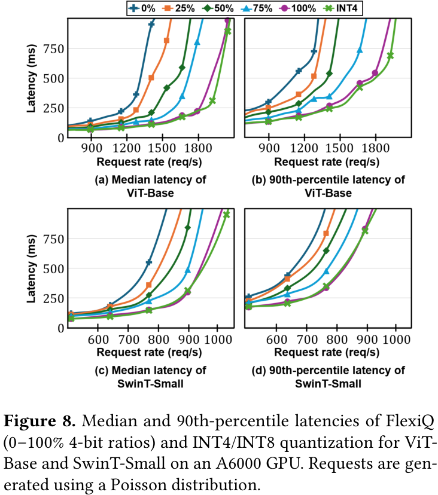
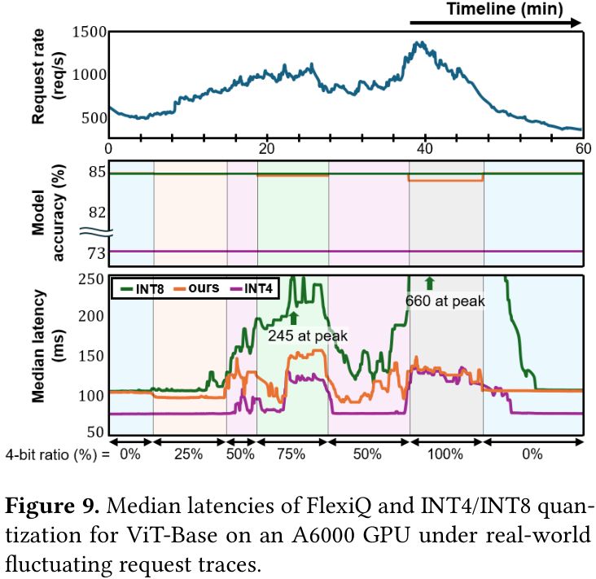
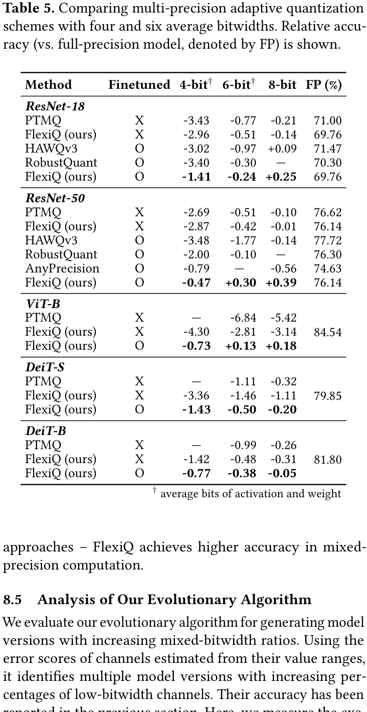
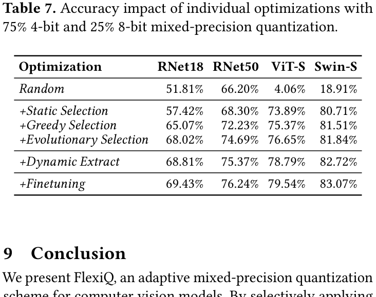

## 🌟 引言
FlexiQ: Adaptive Mixed-Precision Quantization for Latency/Accuracy Trade-Offs in Deep Neural Networks 是一篇面向深度学习推理系统的 EuroSys 2026 论文。它关注的问题很实际：当线上推理请求量波动时，我们能不能不总是加机器，而是让同一个量化模型在“更快”和“更准”之间动态切换？

传统量化通常把模型固定到某个 bitwidth，例如 INT8 或 INT4。INT8 精度相对稳，但延迟和吞吐未必足够；INT4 更快，但在极低比特下容易造成明显精度损失。FlexiQ 的思路不是简单地给不同层分配不同精度，而是在更细的 feature channel 维度做 4/8-bit 混合计算，并且可以在运行时调整 4-bit channel 的比例。

> 一句话总结：FlexiQ 把量化精度控制从“固定 bitwidth”推进到“可运行时调节的 channel-level mixed precision”，用特征通道值域中的 unused bits 来降低 4-bit 量化误差，并在 NPU/GPU 上实现动态延迟-精度权衡。

论文链接：[arXiv:2510.02822](https://arxiv.org/abs/2510.02822)

## 📌 论文基本信息
- 标题：FlexiQ: Adaptive Mixed-Precision Quantization for Latency/Accuracy Trade-Offs in Deep Neural Networks
- 作者：Jaemin Kim, Hongjun Um, Sungkyun Kim, Yongjun Park, Jiwon Seo
- 会议：EuroSys 2026
- 研究领域：机器学习系统、模型量化、混合精度推理、NPU/GPU 推理优化
- 核心问题：如何在推理请求波动时，动态调整低比特计算比例，在尽量少损失精度的情况下获得更低延迟。

## 🧩 背景与动机
深度神经网络推理通常运行在 GPU、NPU 等硬件加速器上。线上系统的难点不只是单次推理慢，而是请求量经常波动：低峰期可以追求精度，高峰期则需要更低延迟和更高吞吐。如果每次负载升高都靠扩容硬件，成本会很高。

量化是降低推理成本的常用手段。INT8 通常比较稳，INT4 则更激进，但低比特量化常常带来明显精度下降。已有 mixed-precision 方法多数在 layer 级别分配 bitwidth，或者支持运行时切换整体 bitwidth；它们不太适合细粒度、连续地调节 latency/accuracy trade-off。

FlexiQ 的关键观察来自视觉模型中的 feature channel 值域差异。论文发现，即使已经使用 8-bit quantization，同一个输出通道内部、按输入 feature channel 分组后，很多参数组的值域仍然很小，因此高位 bit 实际上没有被充分使用。

🔍 图 1 展示了 FlexiQ 的核心动机：部分 channel 在 8-bit 表示中存在 unused bits。如果直接截取最高 4 bit，误差可能很大；但如果跳过这些 unused bits，保留真正承载信息的有效 bit，就能让 4-bit 计算更接近原始 8-bit/FP32 结果。

这也是 FlexiQ 与普通 INT4 量化的关键差别：它不是粗暴地把所有数都压成 4 bit，而是先判断哪些 channel 适合低比特计算，再用 bit-lowering 方法尽量保留有效信息。

## 🛠️ 方法详解
FlexiQ 的整体流程可以分成三个层次：

- 先从高比特量化模型出发，估计每个 feature channel 使用低比特计算时的误差风险。
- 再用 evolutionary algorithm 选择适合 4-bit 的 channel，并形成 25%、50%、75%、100% 等不同低比特比例的模型版本。
- 最后在运行时根据请求负载切换 4-bit channel 比例，从而调节延迟和精度。

🧠 图 2 是理解 FlexiQ 的主图。左侧先根据 activation 与 weight 的 value range 对 feature channel 排序；中间用进化算法逐步选择更多低比特 channel；右侧展示运行时控制：0% 4-bit 时精度最高、延迟较高，100% 4-bit 时延迟最低、精度较弱，中间比例则提供连续的 trade-off。

### ⚙️ Effective Bit Extraction：低比特不是简单截断
FlexiQ 的 bit-lowering 方法是论文中最核心的技术点之一。以 8-bit 到 4-bit 为例，朴素做法可能直接取最高 4 bit，但如果某个 channel 的高位基本不用，这种截取会浪费 bit budget。

FlexiQ 会根据 channel 的值域找到 unused bits，然后从真正有效的位置提取 4 bit。这样名义上仍然是 4-bit 计算，但有效保留的信息可能接近 5-bit 或 6-bit。

🖼️ 图 3 给出了直观例子。普通 uniform lowering 直接截取高位会带来约 10% 误差；FlexiQ 跳过 unused bits 后再提取 bit，误差降低到 4% 以下。这个设计让低比特 channel 不只是“少算”，而是在少算的同时尽量保留信息。

### ⚙️ Channel Selection：为什么需要进化算法
选择哪些 channel 用 4-bit 并不是简单排序问题。单个 layer 中某个 channel 的量化误差看起来很小，但经过后续层传播后可能被放大。因此论文把 channel selection 视为组合优化问题，并用 evolutionary algorithm 近似求解。

⚙️ Algorithm 1 的核心思想是：把每个 channel 是否使用低比特表示成 chromosome 中的 bit flag；通过 mutation 在 layer 内探索更优 channel，通过 crossover 调整不同 layer 间的低比特比例。fitness 则用 mixed-bit 模型相对 high-bit model 的输出距离来衡量。

这个设计比 greedy selection 更稳，因为它不仅考虑 channel 自身值域，也间接考虑跨层误差放大。

### ⚙️ 运行时控制与硬件实现
FlexiQ 在 GPU 上实现了基于 CUTLASS 和 MMA 指令的 mixed-bit GeMM kernel，在 NPU 上扩展了 DNNWeaver v2 风格的 systolic array。为了让运行时切换足够便宜，论文做了 layout optimization：低 4-bit 比例下选中的 channel 是高比例下的子集，并让同精度 channel 在内存中连续存放。

实际切换时，系统只需要更新每层的 `max_4bit_ch` 这类变量，决定前多少 channel 走 4-bit，剩余 channel 走 8-bit。论文报告 GPU 上切换耗时低于数微秒，自定义 NPU 上更新指令内存低于 0.3 微秒。

## 📈 实验结果
论文在 11 个视觉模型上评估 FlexiQ，包括 ResNet-18/34/50、MobileNetV2、ViT-S/B、DeiT-S/B、SwinT-S/B 等，数据集包括 CIFAR 和 ImageNet。评价重点不是单一精度点，而是 4-bit ratio 从 0% 到 100% 变化时的准确率与延迟曲线。

### 📊 精度：50% 4-bit 通常只带来很小损失

📊 表 2 是论文最关键的精度结果。0% 4-bit 等价于 INT8；当 50% channel 使用 4-bit 时，大多数模型相对 INT8 的精度损失都很小。论文总结称，50% 4-bit 模型相对 full precision 平均只损失约 0.6% 准确率。

更重要的是，在 100% 4-bit 且经过 finetuning 后，FlexiQ 相比 Uniform INT4 平均提升 6.6% 准确率。这说明 FlexiQ 的收益并不只是来自“混一点 8-bit”，它的 bit extraction 与 channel selection 对极低比特场景也有实际帮助。

### 📈 延迟：4-bit 比例越高，吞吐压力越容易被吸收
论文在 A6000 GPU 和自定义 NPU 上评估 latency。结果显示，在 GPU 上混合精度 GeMM 延迟基本随 4-bit 比例增加而下降；100% 4-bit 的 FlexiQ 接近 Uniform INT4，并相对 8-bit GeMM 达到约 1.43x speedup。

📈 图 8 进一步把 layer/model latency 放到 serving 场景里看：请求按照 Poisson 分布生成，报告 median 和 90th-percentile latency。FlexiQ 100% 4-bit 能支持比 INT8 高 1.57x 的 request rate，同时保持接近的 90th-percentile latency。

### 📈 动态负载：FlexiQ 能随请求量波动切换精度

图 9 是这篇论文最能体现“adaptive”价值的实验。请求率在 500 到 1500 req/s 之间波动时，FlexiQ 通过动态提高 4-bit ratio，把 median latency 稳定在 100 到 150 ms 区间；而 INT8 在高峰时 latency 可上升到 660 ms。与此同时，FlexiQ 的平均准确率为 84.64%，几乎接近 INT8 的 84.72%。

这说明 FlexiQ 的定位不是替代所有高精度推理，而是在高峰负载下提供一种“自动降一点精度，换取显著延迟稳定性”的系统机制。

### 📊 与其他 adaptive quantization 方法对比

📊 表 5 对比了支持多精度或运行时 bitwidth 调整的方法，包括 PTMQ、RobustQuant、AnyPrecision，以及作为参考的 HAWQv3。FlexiQ 在 4-bit 和 6-bit 平均 bitwidth 下通常有更好的 relative accuracy。论文认为，原因在于 FlexiQ 的控制粒度是 feature channel，而不是整个模型或整个 layer。

这个结论很重要：如果只在 layer 级别做 mixed precision，一旦某层被选成 4-bit，整层输出可能与 8-bit 偏离较大；而 FlexiQ 在层内只选择部分 channel 低比特计算，误差更平滑。

### 🔍 消融实验：每个模块是否真的有贡献

🔍 表 7 说明 FlexiQ 的收益不是单个技巧造成的。以 75% 4-bit、25% 8-bit 为设置，论文逐步叠加以下优化：

- Static Selection：基于值域的 bit extraction 已经显著提升随机选择下的精度。
- Greedy Selection：按误差估计选择 channel，平均进一步提升约 3.5%。
- Evolutionary Selection：考虑跨层误差放大，平均进一步提升约 5.2%。
- Dynamic Extract：运行时调整 bit extraction 位置，额外带来约 1.1%。
- Finetuning：再带来约 0.65% 的收益。

这组消融比较清楚地支撑了论文主张：FlexiQ 的关键不是“用了 4/8-bit 混合”这么简单，而是值域感知 bit-lowering、channel selection、运行时调节和硬件布局一起构成了完整系统。

## 💡 亮点总结
- ✨ 细粒度 trade-off：FlexiQ 在 feature channel 维度控制 bitwidth，比 layer-wise mixed precision 更细，也更适合平滑调节精度和延迟。
- ✨ 利用 unused bits：它不是简单截断到 4-bit，而是根据 channel 值域跳过 unused bits，提高低比特表示的有效精度。
- ✨ 真正考虑 serving 负载：论文不仅报告 accuracy，还评估了 Poisson 请求、真实波动 trace、median/90th-percentile latency。
- ✨ 有硬件实现：作者实现了自定义 NPU 和 GPU CUDA kernel，而不是停留在算法模拟。
- ✨ 运行时切换开销很低：通过 layout optimization，改变 4-bit ratio 基本只需更新每层边界变量。

## ⚖️ 局限性与思考
FlexiQ 的贡献很系统，但它也有一些边界。

首先，FlexiQ 主要针对计算机视觉模型设计和验证。论文虽然做了 Qwen2.5-0.5B 与 OPT-350m 的 LLM case study，但也明确指出 LLM 上还需要结合 SmoothQuant 等方法进一步研究。因此它不能直接等价为“通用 LLM 量化方案”。

其次，FlexiQ 为了支持 0% 到 100% 的动态比例，默认保存 8-bit 参数，内存 footprint 等价于 8-bit 模型。它的速度收益来自计算路径，而不是像纯 INT4 那样直接把权重存储减半。

第三，GPU 实现依赖 Tensor Core 与 CUDA Core 的吞吐平衡。论文在 A100 上观察到性能收益不如其他 GPU，原因是 mixed-bit kernel 的 bit-shifting 和 accumulation 需要 CUDA Core 配合，硬件比例会影响整体效率。

最后，FlexiQ 的 channel selection 需要 calibration data、evolutionary search 和可选 finetuning。虽然论文报告搜索时间仍在常见 PTQ 流程范围内，但工程落地时仍需要额外工具链支持。

## ✅ 结语
FlexiQ 的价值在于，它把量化从“离线压缩模型”进一步推向“在线可调系统能力”。在推理服务中，负载波动是常态，而 FlexiQ 提供了一种很有工程味道的选择：低峰时更准，高峰时更快，并且这种切换可以在同一个模型和运行时里完成。

我的理解是，FlexiQ 最值得关注的地方不是某个单点指标，而是它把三个层面接了起来：量化误差分析、channel-level mixed precision 搜索、以及 NPU/GPU 运行时实现。对于关注 AI Infra、模型部署和推理系统的人来说，这篇论文很适合作为“动态量化服务系统”的参考样例。
