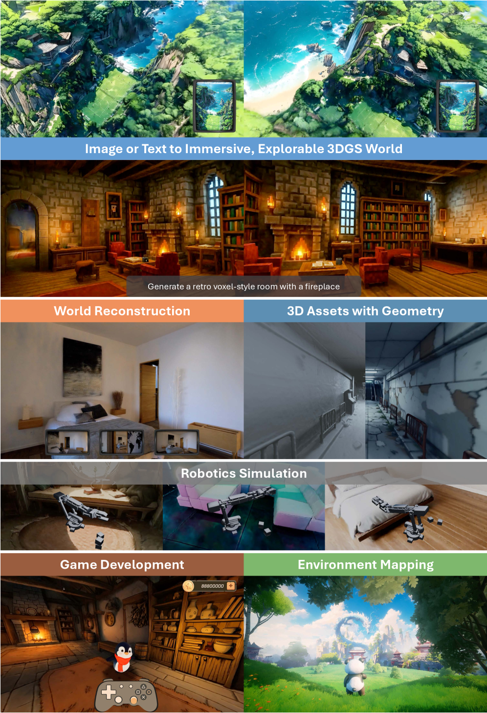
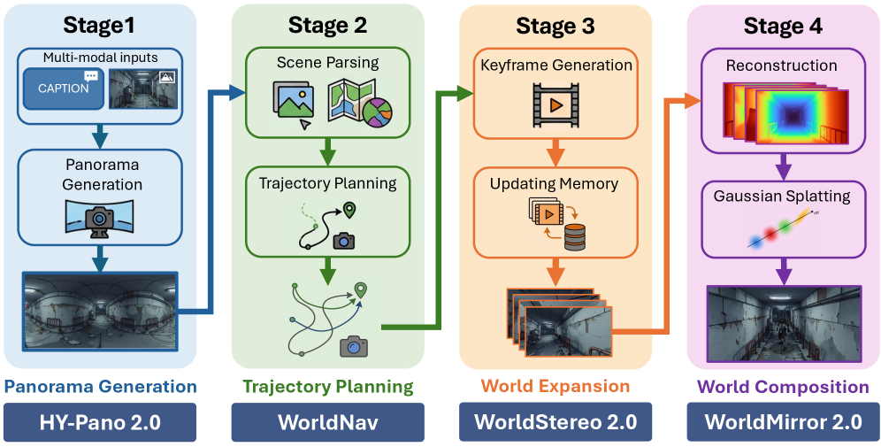
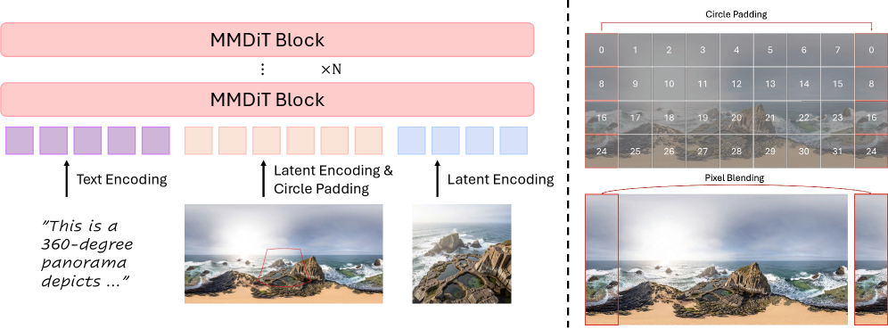
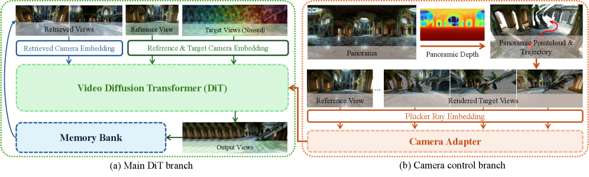
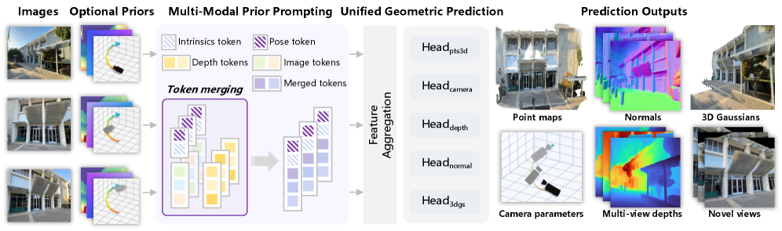

# HY-World 2.0 论文解析：面向 3D 世界重建、生成与仿真的一致多模态世界模型

## 📖 论文信息

- **标题**：[HY-World 2.0: A Multi-Modal World Model for Reconstructing, Generating, and Simulating 3D Worlds](https://arxiv.org/abs/2604.14268)
- **GitHub**：[Tencent-Hunyuan/HY-World-2.0](https://github.com/Tencent-Hunyuan/HY-World-2.0)
- **作者**：Team HY-World, Chenjie Cao, Xuhui Zuo, Zhenwei Wang, Yisu Zhang, Junta Wu, Zhenyang Liu, Yuning Gong, Yang Liu, Bo Yuan, Chao Zhang, Coopers Li, Dongyuan Guo, Fan Yang, Haiyu Zhang, Hang Cao, Jianchen Zhu, Jiaxin Lin, Jie Xiao, Jihong Zhang, Junlin Yu, Lei Wang, Lifu Wang, Lilin Wang, Linus, Minghui Chen, Peng He, Penghao Zhao, Qi Chen, Rui Chen, Rui Shao, Sicong Liu, Wangchen Qin, Xiaochuan Niu, Xiang Yuan, Yi Sun, Yifei Tang, Yifu Sun, Yihang Lian, Yonghao Tan, Yuhong Liu, Yuyang Yin, Zhiyuan Min, Tengfei Wang, Chunchao Guo
- **单位**：Tencent Hunyuan
- **arXiv**：arXiv:2604.14268 (cs.CV)

## ✦ 核心洞察与挑战

### 核心问题
- **问题一**：当前 3D 世界模型存在"生成 vs 重建"的二元割裂——生成模型擅长从文本/单图合成可探索 3D 场景但缺乏严格重建精度，重建模型能从多视角图像/视频恢复精确 3D 结构但无法补全未见区域。
- **问题二**：视频生成方法用于世界扩展时，跨视角几何一致性难以保证，相机控制精度受限。
> **关键判断**：HY-World 2.0 的核心主张是——将"世界生成"与"世界重建"统一在同一个离线 3D 世界模型范式下，通过四阶段管线（全景生成→轨迹规划→世界扩展→世界组合）实现文本/单图到高保真可导航 3DGS 场景的端到端合成，同时支持从多视角图像/视频进行通用 3D 重建。

### 传统方案局限
- **局限一**：HY-World 1.0 的全景生成依赖精确相机内参（焦距、FoV），元数据缺失或不准确时产生明显投影畸变。
- **局限二**：此前可控视频生成方法（WorldStereo）在 keyframe 空间中生成时视觉保真度不足，且缺乏一致的多视角几何记忆机制。
- **局限三**：WorldMirror 1.0 在高分辨率下性能严重退化——高分辨率下 AUC@30 从 86.13 跌至 66.29，无法推广到不同尺度的实际场景。
> **关键判断**：HY-World 2.0 对每个模块都进行了系统性升级：HY-Pano 2.0 用 MMDiT 隐式学习透视-全景映射，WorldStereo 2.0 引入 Keyframe-VAE 和 Spatial-Stereo Memory，WorldMirror 2.0 引入 Normalized Position Encoding 和显式法向量监督，在每个环节都刷新了开源 SOTA。

## 研究动机

3D 世界模型是 AI 的变革性范式——它让智能体能够模拟、理解并与复杂 3D 环境交互，在虚拟现实、具身机器人和视频游戏等领域展现出巨大潜力。

Tencent Hunyuan 的 HY-World 系列探索了两种主要范式：HY-World 1.0 建立了离线 3D 世界生成的基础，明确建模可探索 3D 世界的内在 3D 一致性；HY-World 1.5 推进了在线视频驱动的世界建模，实现了实时交互。

然而，当前的 3D 世界建模仍存在根本性割裂：生成模型和重建模型各自为战，闭源系统（如 Marble）展示了一体化的强大能力，但开源社区缺乏一个真正统一生成与重建的多模态基础世界模型。HY-World 2.0 正是为填补这一空白而生——它是**首个系统性地将世界生成与世界重建统一在离线 3D 世界模型范式下的开源框架**。

## 方法论（主要模块简介）

- **HY-Pano 2.0（全景生成）**：MMDiT 架构，隐式学习透视→全景的空间映射，无需相机内参；通过 circular padding + pixel blending 消除 360° 全景边界拼接伪影。
- **WorldNav（轨迹规划）**：从全景出发，通过几何感知初始化（MoGe2）和语义 grounded 分析（Qwen3-VL + SAM3）构建 NavMesh，生成 Regular / Surrounding / Reconstruct-Aware / Wandering / Aerial 五类轨迹。
- **WorldStereo 2.0（世界扩展）**：Keyframe-VAE + Global-Geometric Memory（GGM）+ Spatial-Stereo Memory（SSM++）+ DMD 蒸馏，实现相机精确控制与跨视角几何一致。
- **WorldMirror 2.0（世界重建）**：前馈统一 3D 预测模型，通过 Normalized Position Encoding、显式法向量监督和 Depth Mask Prediction，同时预测点云/深度/法向量/相机参数。
- **WorldLens（交互式渲染）**：引擎无关 3DGS 渲染平台，支持自动 IBL 光照、高效碰撞检测和角色交互。

---

## 🌟 引言

2026 年 4 月，Tencent Hunyuan 发布了 **HY-World 2.0**（arXiv:2604.14268），这是首个将世界生成（从文本/单图合成可导航 3DGS）与世界重建（从多视角图像/视频恢复 3D 结构）统一在离线 3D 世界模型范式下的开源系统性框架。

HY-World 2.0 支持多种输入模态（文本、单视图、多视图、视频），根据可用条件自适应切换行为：

- **稀疏输入时（文本/单图）**：执行世界生成，通过四阶段管线合成高保真可导航 3DGS 世界
- **丰富视觉观测时（多视图/视频）**：执行世界重建，恢复几何一致且精确的 3D 结构

最终在开源基准上达到 SOTA，结果可比肩闭源模型 Marble。

## 🧩 背景与动机

### 1.1 生成与重建的二元割裂

当前 3D 世界建模的最大问题在于**生成与重建的割裂**：

**生成方法**（如 HY-World 1.0、Marble、FlashWorld）擅长从文本或单图合成令人印象深刻的可探索场景，但通常难以保持严格的重建精度——生成内容与输入条件的忠实度受限。

**重建方法**（如 VGGT、Depth Anything 3、WorldMirror 1.0）专注于从密集多视图或视频中恢复精确的 3D 结构（深度、法向量、点云），但缺乏为未见区域补充合理内容的生成先验。

HY-World 2.0 的核心贡献是**终结这一割裂**：在同一个框架下，既能做世界生成（从稀疏输入合成完整 3D 世界），也能做世界重建（从密集观测恢复精确几何），且两者相互增强——世界重建模块（WorldMirror 2.0）是世界生成的最终组成模块之一。

### 1.2 从 1.0 到 2.0 的核心升级

| 模块 | HY-World 1.0 | HY-World 2.0 |
|------|-------------|--------------|
| 全景生成 | 依赖精确相机内参的显式几何翘曲 | MMDiT 隐式映射，无需相机参数 |
| 轨迹规划 | 简单几何分析 | WorldNav：几何+语义联合解析，5 类轨迹 |
| 世界扩展 | 视频扩散模型 | WorldStereo 2.0：Keyframe-VAE + SSM++ |
| 世界重建 | WorldMirror 1.0 | WorldMirror 2.0：归一化位置编码 + 法向量监督 |
| 渲染平台 | – | WorldLens：引擎无关 IBL 渲染 |

## 🛠️ 方法详解

### 2.1 四阶段管线总览

HY-World 2.0 的四阶段管线将多模态输入转换为沉浸式 3D 世界：

1. **全景初始化**（HY-Pano 2.0）：将任意文本或图像输入转换为高保真 360° 全景
2. **轨迹规划**（WorldNav）：解析并理解初始化后的世界，导出最优信息丰富的观测路径
3. **世界扩展**（WorldStereo 2.0）：沿规划路径，用记忆驱动的视频模型扩展世界观测
4. **世界组合**（WorldMirror 2.0 + 3DGS）：重建 3D 环境并优化为可交互的 3DGS 资产

### 2.2 Stage I：HY-Pano 2.0 全景生成

**核心思想**：用 Multi-Modal Diffusion Transformer（MMDiT）替代显式几何翘曲，直接在统一 latent 空间内学习透视→全景的空间映射，无需相机内参。

**数据策略**：混合真实世界全景（高质量纹理和自然结构先验）与 Unreal Engine 合成资产（精确几何标签和多样化场景配置），通过严格过滤消除低质量样本（拼接伪影、设备遮挡等）。

**关键技术——无缝全景**：

- **Circular Padding（Latent 空间）**：对 latent 特征施加周期边界条件，消除去噪过程中的边界不连续
- **Pixel Blending（Pixel 空间）**：在等距矩形边缘沿用线性像素混合策略

两者结合实现 360° 无缝 wrap-around 过渡。

### 2.3 Stage II：WorldNav 轨迹规划

WorldNav 的目标是为后续世界扩展生成最优相机路径，同时输出精确的文本指令引导下游生成过程。

**Scene Parsing**：首先用 MoGe2（LSMR 优化对齐单目深度，42 视图采样）构建全景点云 $\mathbf{P}^{pan}$；用 Qwen3-VL + SAM3 做语义解析和可导航性分析，生成 NavMesh。

**五类轨迹**：

1. **Regular Trajectories**：沿主路径直行，最大化覆盖率
2. **Surrounding Trajectories**：绕物体环绕，补充侧面细节
3. **Reconstruct-Aware Trajectories**：聚焦重建质量较差区域
4. **Wandering Trajectories**：穿越导航网格的随机游走
5. **Aerial Trajectories**：俯视轨迹，覆盖屋顶等上方空间

消融实验证明：逐级引入这五类轨迹，场景完整性逐步提升（Figure 19）。

### 2.4 Stage III：WorldStereo 2.0 世界扩展

WorldStereo 2.0 是世界扩展的核心——在规划路径上生成多视角一致的 keyframes，最终馈入 WorldMirror 2.0 做 3D 重建。

**三阶段训练策略**：

1. **Domain Adaptation**：相机引导的 keyframe 生成。Keyframe-VAE（空间压缩）替代 Video-VAE（时空压缩），更好保留高频细节，减少大视角变化下的伪影。
2. **Middle Training**：引入记忆机制。Global-Geometric Memory（GGM）以全景点云为全局几何参考；Spatial-Stereo Memory（SSM++）通过空间拼接（而非时序拼接）检索参考视图，增强几何一致性。
3. **Post-Train**：DMD（Distribution Matching Distillation）蒸馏，将多步生成压缩为单步推理。

**关键消融**：Spatial-stereo concatenation（F）远优于 Temporal concatenation（F*），DMD 蒸馏保持性能的同时大幅加速推理。

### 2.5 Stage IV：世界组合与 3DGS 优化

**WorldMirror 2.0** 是统一前馈 3D 预测模型，从生成的 keyframes 重建 3D 结构：

**三大改进**：

1. **Normalized Position Encoding**：标准 RoPE 在不同分辨率间一致性急剧下降（<0.7），归一化 RoPE 在任意分辨率间保持 >0.95 的相似度，解决了高分辨率泛化难题
2. **Explicit Normal Supervision**：显式法向量监督，深度估计的法向量与真值法向量对齐
3. **Depth Mask Prediction**：预测深度 mask，过滤不可靠区域

**3DGS 优化**：Voxel Downsample + Adaptive Densification + MaskGaussian，将 Gaussian 数量从 6.0M 降至 1.383M（-77%），PSNR 仅下降 0.16dB。

### 2.6 WorldLens 交互式渲染平台

WorldLens 是高性能 3DGS 渲染平台，具有引擎无关架构、自动 IBL 光照、高效碰撞检测和训练-渲染协同设计，支持虚拟角色在生成世界中的实时碰撞导航。

## 📈 实验结果

### 3.1 全景生成（HY-Pano 2.0）

| Metric | DiT360 | Matrix3D | HY-World 1.0 | **HY-Pano 2.0** |
|--------|--------|----------|-------------|------------------|
| CLIP-T (↑) | 0.248 | 0.238 | 0.250 | **0.258** |
| Q-Align Qual (Persp) (↑) | 3.788 | 2.983 | 3.992 | **4.103** |
| Q-Align Aes (Equi) (↑) | 4.072 | 3.880 | 4.186 | **4.247** |

在 Text-to-Panorama（T2P）和 Image-to-Panorama（I2P）上，HY-Pano 2.0 在多数指标上排名第一。

### 3.2 相机控制（WorldStereo 2.0）

| Method | RotErr (↓) | TransErr (↓) | ATE (↓) | Q-Align (↑) |
|--------|------------|--------------|----------|-------------|
| SEVA | 1.690 | 1.578 | 2.879 | 3.232 |
| Gen3C | 0.944 | 1.580 | 2.789 | 3.353 |
| WorldPlay | 3.481 | 1.288 | 2.722 | 3.628 |
| WorldCompass | 3.452 | 1.068 | 2.379 | 3.615 |
| WorldStereo* | 0.762 | 1.245 | 2.141 | 4.149 |
| **WorldStereo 2.0** | **0.492** | **0.968** | **1.768** | **4.205** |

旋转误差降低 35%（0.762→0.492），绝对轨迹误差（ATE）降低 17%（2.141→1.768）。

### 3.3 世界重建（WorldMirror 2.0）

**ScanNet 精度**：

| Method | Acc (↓) | Comp (↓) |
|--------|---------|---------|
| VGGT | 0.046 | 0.057 |
| π³ | 0.048 | 0.072 |
| WorldMirror 1.0 | 0.043 | 0.055 |
| **WorldMirror 2.0** | **0.033** | **0.041** |

WorldMirror 2.0 将重建精度误差从 0.043 降至 0.033（降低 23%）。

**分辨率泛化**：WorldMirror 1.0 在高分辨率下 AUC@30 从 86.13 暴跌至 66.29；WorldMirror 2.0 从 86.48 略微下降至 86.89（几乎不变）。

### 3.4 与闭源 Marble 对比

在相同全景输入下，HY-World 2.0 相比 Marble：
- 更高保真度，严格遵循输入条件
- 更锐利的纹理
- 各视角间几何一致性更优
- 细节保留更好（栅栏、汽车、家具、山脉、 arcade 机）

### 3.5 管线效率

完整管线耗时约 **712 秒（~10 分钟）**：

| Stage | 全景 | 轨迹规划 | 世界扩展 | 重建对齐 | 3DGS |
|-------|------|---------|---------|---------|------|
| Time (s) | 15 | 182 | 286 | 102 | 127 |

## 💡 亮点总结

1. **首个统一生成与重建的开源 3D 世界模型**：HY-World 2.0 打破了生成模型和重建模型的二元割裂，用同一框架同时支持文本/单图→3DGS 全流程合成和多视角→通用 3D 预测
2. **四阶段管线设计**：全景生成（HY-Pano 2.0）→ 轨迹规划（WorldNav）→ 世界扩展（WorldStereo 2.0）→ 世界组合（WorldMirror 2.0），每阶段都有明确的目标和模块化接口
3. **HY-Pano 2.0 的免相机内参全景生成**：MMDiT 隐式学习透视→全景映射，通过 circular padding + pixel blending 消除边界伪影，数据规模和质量双升级
4. **WorldStereo 2.0 的 Keyframe-VAE + Spatial-Stereo Memory**：将视频生成空间转换为 keyframe 空间，Spatial-Stereo Memory 通过空间拼接而非时序拼接实现几何一致，旋转误差降低 35%
5. **WorldMirror 2.0 的分辨率泛化能力**：Normalized Position Encoding 解决 RoPE 在不同分辨率间的一致性崩溃，使 WorldMirror 2.0 在高分辨率下性能几乎不退化
6. **MaskGaussian 大幅压缩 3DGS**：Gaussian 数量减少 77% 而 PSNR 仅下降 0.16dB，为实时渲染铺平道路
7. **全量开源**：Tencent Hunyuan 发布了所有模型权重、代码和技术细节，为开源社区提供 3D 世界模型的完整基线

## ⚖️ 局限性与思考

1. **端到端 10 分钟延迟**：完整管线需要约 10 分钟，其中轨迹规划（182s）和世界扩展（286s）是主要瓶颈，远未达到实时
2. **对视频生成先验的依赖**：世界扩展阶段依赖视频扩散模型的生成先验，生成质量和一致性仍受限于底层扩散模型能力
3. **单图输入的模糊性**：单图输入缺乏多视角约束，世界生成可能存在歧义，生成结果的确定性和可控性有待提升
4. **与顶级闭源 Marble 的差距**：虽然定性的纹理和一致性更好，但量化指标上仍有差距，且 Marble 的 3DGS 质量仍具竞争力
5. **WorldLens 的角色定位**：WorldLens 主要服务于渲染交互而非核心建模，管线中角色支持等能力仍处于演示阶段

## ✅ 结语

HY-World 2.0 代表了 3D 世界建模领域的一次系统性整合——它不是简单地叠加多个模块，而是从全景生成、轨迹规划、世界扩展到 3D 重建的每一步都做了针对性升级，形成了一个真正的统一多模态世界模型。

最值得关注的突破在于：WorldMirror 2.0 解决了前馈 3D 重建在高分辨率下性能崩溃的难题（这是此前所有方法共同面临的瓶颈），以及 WorldStereo 2.0 通过 Keyframe-VAE 和 Spatial-Stereo Memory 在可控视频生成中实现了更精确的几何一致性。

Tencent Hunyuan 选择全量开源（代码、权重、技术细节全部公开），这为整个 3D 世界模型研究社区提供了一个可复现、可对比、可改进的坚实基线。

---

**论文信息**：Team HY-World et al., "HY-World 2.0: A Multi-Modal World Model for Reconstructing, Generating, and Simulating 3D Worlds", arXiv:2604.14268, 2026.
**arXiv**：https://arxiv.org/abs/2604.14268
**GitHub**：https://github.com/Tencent-Hunyuan/HY-World-2.0
**Project Page**：https://3d-models.hunyuan.tencent.com/world/