## 🌟 引言
Laminar: A Scalable Asynchronous RL Post-Training Framework 是一篇面向大规模 LLM 强化学习后训练的系统论文，作者来自 The University of Hong Kong 和 ByteDance Seed。它关注的不是新的奖励函数或 RL 算法，而是一个更底层、更工程化的问题：当 RL post-training 扩展到数百甚至上千张 GPU 时，系统为什么会被 rollout generation 的长尾拖住？

论文的核心判断是：现有 RL 训练框架普遍受限于 batch-level 或 iteration-level 的全局同步。尤其在 reasoning 和 agentic tasks 中，不同 trajectory 的生成长度和环境交互时间差异极大，短 trajectory 已经完成，少数长 trajectory 仍然占住 rollout GPU，导致整个系统出现严重 bubble。Laminar 的解决方案是把同步粒度降到 trajectory level，让每条 trajectory 按自己的节奏生成、入 buffer、被训练消费。

> 一句话总结：Laminar 通过 fully decoupled architecture、CPU relay workers 和 dynamic repack mechanism，把大规模 RL post-training 从“全局同步等待慢 rollout”改造成“trajectory-level asynchronous pipeline”，在 1024 GPU 集群上实现最高 5.48x 训练吞吐提升，并缩短收敛时间。

论文链接：[arXiv:2510.12633](https://arxiv.org/abs/2510.12633)

## 📌 论文基本信息
- 标题：Laminar: A Scalable Asynchronous RL Post-Training Framework
- 作者：Guangming Sheng, Yuxuan Tong, Borui Wan, Wang Zhang, Chaobo Jia, Xibin Wu, Yuqi Wu, Xiang Li, Chi Zhang, Yanghua Peng, Haibin Lin, Xin Liu, Chuan Wu
- 机构：The University of Hong Kong, ByteDance Seed
- 年份：2025
- 研究领域：AI Infra、LLM Post-training、RLHF/RLVR 系统、分布式训练、异步 RL
- 核心问题：如何在大规模 RL 后训练中消除 rollout trajectory 生成长尾和全局权重同步瓶颈，同时尽量控制 policy staleness。

## 🧩 背景与动机
LLM 的 RL post-training 通常包含两个阶段：rollout generation 和 actor training。Rollout 阶段让模型根据 prompt 生成 response，或与外部环境进行多轮交互；training 阶段则对 trajectory 打分、构造 experience，并更新 actor model。

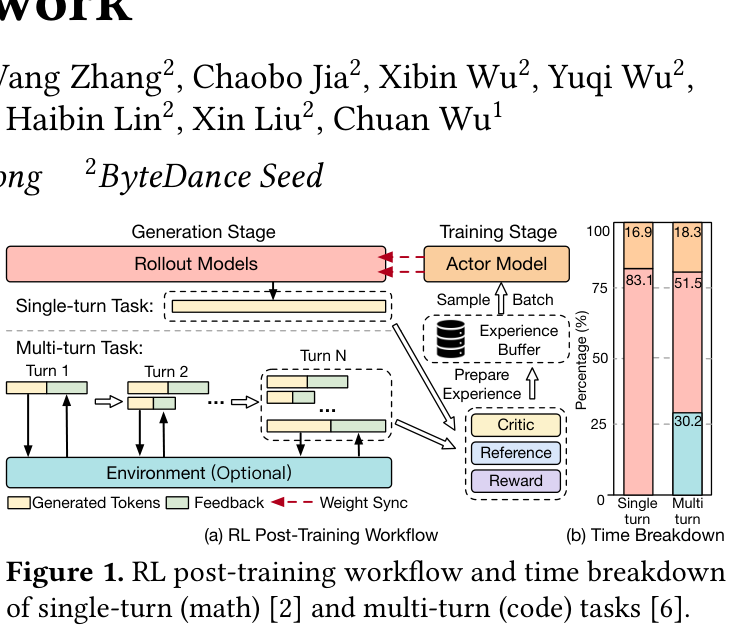

🔍 图 1 说明了论文最基本的动机：在 reasoning 和 agentic workloads 中，generation stage 往往占据主要时间。论文报告，在单轮数学任务中 generation 可占总时间 83.1%；在多轮代码任务中，generation、weight sync 和 prepare experience 共同构成明显瓶颈。

真正麻烦的是 trajectory 的长尾分布。数学题的 response length 可能相差一个数量级；多轮工具调用还会引入 code sandbox、API 请求队列、外部执行负载等不可控延迟。

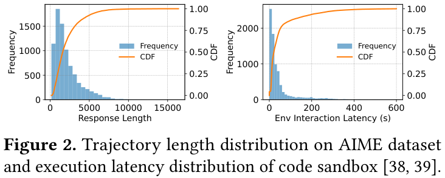

🖼️ 图 2 很直观地展示了这种 skewness：一部分 trajectory 很快完成，但尾部 trajectory 非常长。对于 LLM decoding 而言，GPU 通常需要较大 decode batch 才能维持高吞吐；当 batch 中只剩少数长 trajectory 时，GPU 利用率会迅速下降。

现有异步 RL 系统试图通过 generation/training overlap 缓解问题，但它们大多依赖全局 weight synchronization。例如 one-step staleness、stream generation 或 partial rollout 都仍然需要按固定节奏同步 actor 和 rollout 权重。这样会带来两个问题：

- 如果 staleness bound 太小，长尾 trajectory 仍然造成 pipeline bubble。
- 如果 staleness bound 太大，训练数据来自更旧 policy，可能影响收敛。

Laminar 的关键观点是：问题不该通过静态 staleness bound 调参解决，而应该打破 rollout 之间的全局锁步。

## 🛠️ 方法详解
Laminar 的系统设计围绕 trajectory-level asynchrony 展开。每条 trajectory 可以独立生成、独立进入 experience buffer，trainer 则持续从 buffer 采样训练。Actor 的权重更新不再要求所有 rollout 同步等待。

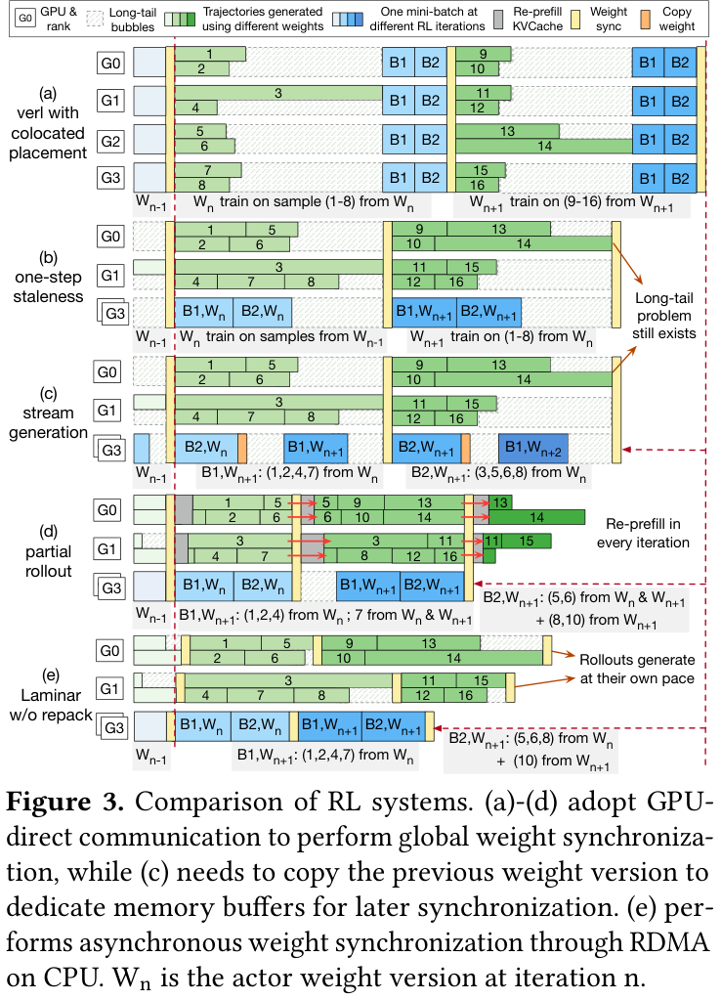

🧠 图 3 是理解 Laminar 的关键。传统 synchronous 或 bounded-staleness pipeline 中，短 trajectory 会被慢 trajectory 拖住；partial rollout 虽然能中断长 trajectory，但会引入 re-prefill 和 KVCache 重建开销。Laminar 则让 rollout 独立运行：完成的 trajectory 先进入 buffer，未完成的 trajectory 继续生成，trainer 不需要等待一个完整 batch 的所有 trajectory。

### ⚙️ Fully Decoupled Architecture：把 actor、rollout、data、relay 拆开
Laminar 的总体架构由四类模块组成：

- Rollout Module：包含 rollout manager 和大量 rollout replicas，负责 trajectory generation，并监控长尾、故障和 repack。
- Data Module：包含 prompt pool、partial response pool 和 experience buffer，分别管理初始任务、未完成 trajectory 状态和已完成经验。
- Relay Workers：运行在 CPU 上，作为分布式参数服务，负责 actor 到 rollout 的异步权重同步。
- Trainer：从 experience buffer 采样 trajectory，执行 RL 算法更新 actor。

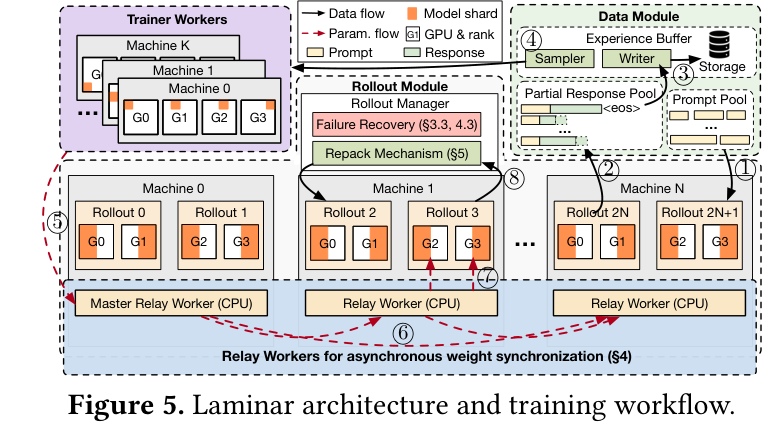

⚙️ 图 5 中，数据流和参数流被明确拆开。Rollout 生成中的 partial response 会持续写入 partial response pool，这既支持恢复，也支持在线分析；completed trajectory 写入 experience buffer；trainer 从 buffer 采样训练。Actor 更新后的权重先发给 master relay，再由 relay tier 在 CPU/RDMA 路径中异步广播，rollout 可以随时从本机 relay 拉取最新权重。

这个设计的意义在于：trainer 不需要等待所有 rollout 更新，rollout 也不需要在全局同步点一起停下来。

### ⚙️ Relay Workers：用 CPU 参数服务替代 GPU 全局同步
已有系统多用 GPU-direct/NCCL 做全局权重同步，但在 Laminar 的轨迹级异步场景中，这种做法会带来 GPU memory buffer 压力和通信 kernel 竞争。Laminar 转而使用 CPU relay workers：actor 只把新权重发给 master relay，随后立即继续训练；master relay 通过 RDMA pipeline broadcast 把权重分发到其他 relay。

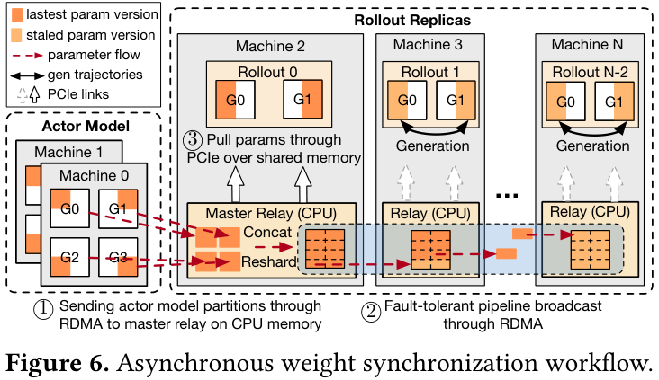

📡 图 6 展示了这条参数路径：actor model partition 先进入 master relay 的 CPU memory，之后经 RDMA 广播到各机器 relay；rollout 再通过 PCIe 从本机 relay 拉取参数。这条路径牺牲了一点 CPU/host memory 复杂度，但换来了 actor/rollout GPU 的解耦，避免在 GPU 侧增加额外参数 buffer。

论文还强调 relay broadcast 的 fault tolerance：如果某个 relay 或 rollout machine 失败，rollout manager 可以快速重建 broadcast chain，健康 rollout 的 generation 不需要停。

### ⚙️ Dynamic Repack：把长尾 trajectory 合并到少数 rollout 上
即使 actor 和 rollout 解耦，单个 rollout 内部仍可能被少数长 trajectory 拖住。Laminar 的第二个关键机制是 repack：把多个 underutilized rollout 上尚未完成的长尾 trajectory 合并到少数 destination rollout 上，释放其他 rollout 去同步新权重并生成 fresh trajectory。

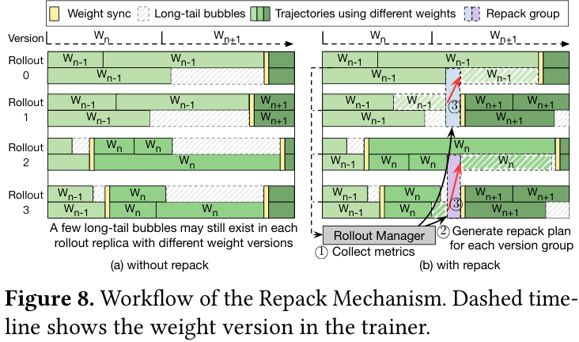

🧩 图 8 展示了 repack 的核心流程。Rollout manager 定期收集各 rollout 的状态，并按当前 weight version 分组；在同一 version group 内识别 underutilized rollouts；随后制定 repack plan，把 source rollout 中未完成的 trajectory 迁移到 destination rollout，释放 source rollout。

判断“是否 underutilized”不能依赖固定剩余请求数阈值，因为 RL workload 会动态变化。Laminar 使用 KVCache utilization 作为轻量指标。

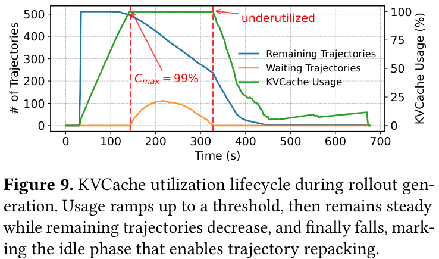

📊 图 9 说明了这个指标的合理性：rollout 初期 KVCache usage 上升，随后在接近上限时保持稳定；当等待 trajectory 被耗尽，只剩少数长尾 trajectory 时，KVCache usage 开始下降。Laminar 将这个下降阶段视为 idle phase，并触发 repack 候选。

Algorithm 1 将 repack 建模为 Best-Fit 风格的 bin packing 问题：source 是 underutilized rollout，destination 是能容纳迁移 trajectory 的 rollout；目标是在不超过 KVCache threshold 和 decode batch upper bound 的前提下，尽量释放更多 rollout。

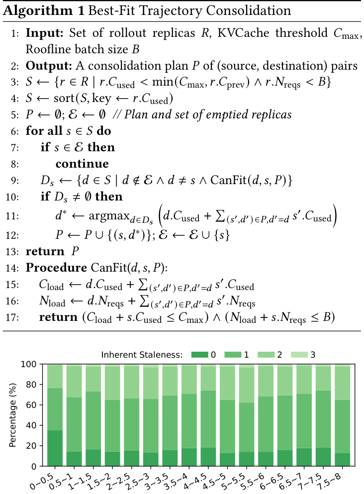

### 🧠 Inherent Staleness：不再手动设置静态 staleness bound
Laminar 没有要求用户配置固定的 staleness bound。论文定义了 inherent staleness：如果 trajectory 用 model version K 生成，完成时 actor 已经到 version M，则 staleness 为 M-K。

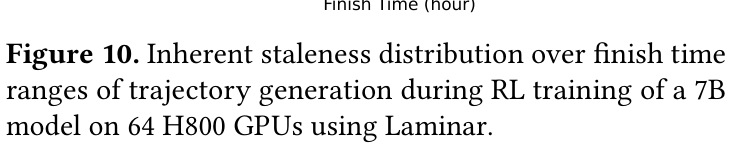

图 10 显示，在 64 H800 GPUs 上训练 7B model 时，Laminar 的 inherent staleness 通常低于 3。这说明 trajectory-level asynchrony 并不等价于“无限 stale 数据乱飞”，系统通过及时更新 rollout 和 repack 让 staleness 自然保持较低。

## 📈 实验结果
Laminar 在 128 台机器、1024 张 NVIDIA H800-80GB GPU 的集群上评估。模型包括 Qwen2.5 7B、32B、72B；任务包括 DAPO-Math-17k 上的数学推理和多轮 tool-calling。Baselines 包括 verl、one-step staleness、stream generation 和 AReaL。

### 📊 端到端训练吞吐
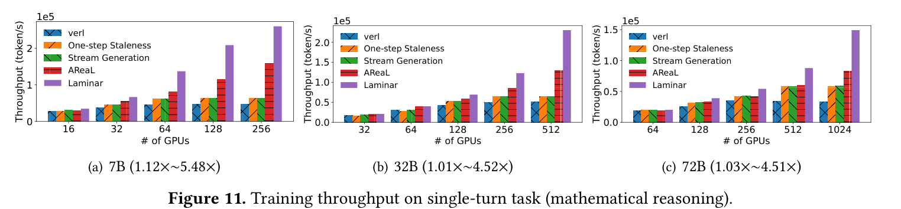

📊 图 11 是主要 throughput 结果。Laminar 在不同模型规模和 GPU 数量下都领先：相对 verl 平均 2.56x、最高 5.49x；相对 one-step staleness 平均 1.98x；相对 stream generation 平均 1.93x；相对 AReaL 平均 1.39x。

这组结果最重要的含义不是某个单点速度，而是 scalability。随着 GPU 数量增加，传统系统受全局同步和长尾 rollout 限制，新增 GPU 很难转化为有效吞吐；Laminar 因为 rollout/actor/relay/data 解耦，更能把额外 GPU 用起来。

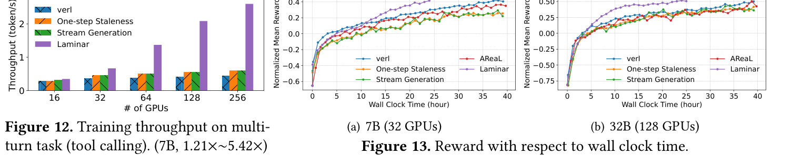

📈 图 12 显示，在多轮 tool-calling 任务中，Laminar 同样取得最高 5.42x 的吞吐提升。图 13 则从 reward 随 wall-clock time 提升的角度验证了“快”是否真的转化为训练进展：Laminar 在数学推理任务上相对最佳 baseline 约快 1.77x（7B）和 1.59x（32B）达到收敛。

这点很关键，因为异步 RL 系统常见风险是吞吐提高但 staleness 或 policy mismatch 伤害收敛。Laminar 的实验说明，其吞吐收益没有被收敛损失抵消。

### 📊 权重同步开销
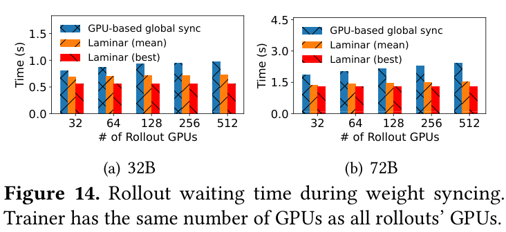

图 14 比较了 rollout 更新到最新权重时的等待时间。相比 GPU-based global synchronization，Laminar 在 64 到 1024 GPU 范围内都更低，平均和 best-case waiting time 最高分别降低 37% 和 47%。此外，actor 只需要把权重发给 master relay，因此 actor stall time 对 rollout 数量不敏感：论文报告 32B 和 72B 模型上分别约为 0.64s 和 1.40s。

### 📊 Repack 效率与故障恢复
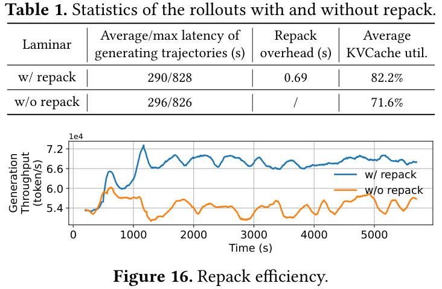

📊 表 1 和图 16 说明 repack 不是装饰性模块。启用 repack 后，generation throughput 提升 26%，平均 KVCache utilization 从 71.6% 提升到 82.2%，repack overhead 仅 0.69s，并没有增加 trajectory generation latency。

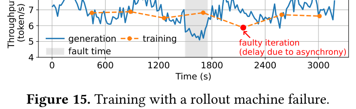

⚠️ 图 15 展示了 Laminar 的故障恢复实验。作者手动 kill 一台包含两个 rollout replica 的机器，generation throughput 立即下降，但 training throughput 没有全局崩溃；系统约 252s 完成新机器分配和 rollout 初始化，随后 generation/training throughput 恢复。这体现了 fully decoupled architecture 的另一个价值：大规模长任务中，局部失败不必变成全局重启。

## 💡 亮点总结
- ✨ 系统问题定位准确：Laminar 抓住了 RL post-training 中 rollout trajectory 长尾和全局权重同步这两个核心瓶颈。
- ✨ trajectory-level asynchrony：相比 batch-level 或 iteration-level overlap，它进一步降低了同步粒度。
- ✨ relay workers 设计务实：用 CPU host memory + RDMA 做参数服务，避免 GPU memory buffer 和 NCCL 同步竞争。
- ✨ repack 机制有明确资源信号：用 KVCache utilization 判断 rollout idle phase，比静态阈值更适合动态 RL workload。
- ✨ 评估规模扎实：实验覆盖 7B/32B/72B 和最高 1024 GPUs，并报告吞吐、收敛、同步开销、repack、故障恢复。

## ⚖️ 局限性与思考
Laminar 是一篇强系统论文，但仍有一些边界需要注意。

首先，它主要优化的是 RL post-training 系统吞吐，并不直接提出新的 RL algorithm。其效果依赖于已有 GRPO/PPO 等算法和 reward pipeline 的稳定性。

其次，Laminar 引入了额外系统复杂度：relay worker tier、partial response pool、experience buffer、rollout manager、repack planning 和 failure recovery 都需要工程维护。对于小规模训练，这套架构未必划算。

第三，论文将 experience sampling 视为正交问题。Laminar 能更快产生大量 trajectory，但如何从更大的、不同 staleness 的 experience buffer 中采样，仍可能影响样本效率和最终模型表现。

第四，虽然 inherent staleness 通常较低，但它仍由系统动态决定。在更复杂的 agentic environments、更慢的外部工具或更极端的 reward 延迟下，staleness 分布是否仍然可控，需要更多场景验证。

最后，Laminar 的优势与 RDMA、H800 集群、host memory、vLLM/PyTorch/Ray/UCX 等基础设施紧密相关。换到资源受限或网络较弱的集群，relay broadcast 和 repack 的收益可能有所变化。

## ✅ 结语
Laminar 的价值在于，它把 LLM RL post-training 的扩展瓶颈从“算法层面的 staleness trade-off”重新表述为“系统层面的依赖解耦问题”。如果说同步 RL 框架像一列必须全员等齐才能发车的列车，那么 Laminar 更像一个持续流动的队列系统：trajectory 生成完就入 buffer，trainer 有数据就训练，rollout 空出来就更新权重，长尾任务被合并处理。

我的理解是，Laminar 对 AI Infra 的启发很强：未来大规模 RL 系统的核心不只是更快的 kernel 或更大的 batch，而是如何让训练、生成、参数同步、环境交互和故障恢复都变成可独立推进的异步流水线。这也是它比单纯“提高吞吐”更值得关注的地方。
