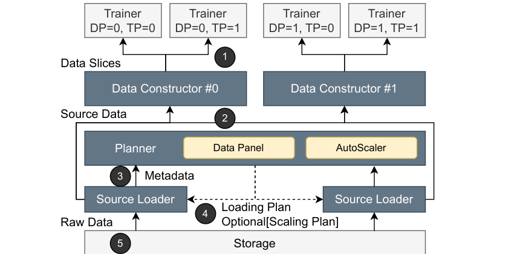
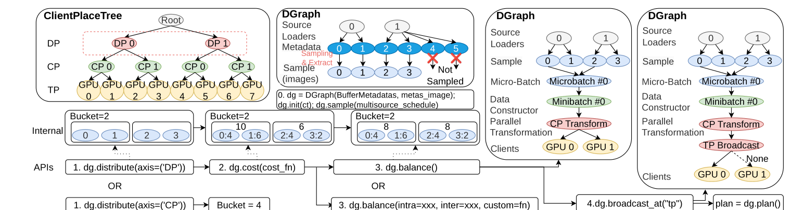
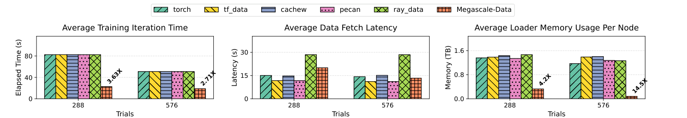
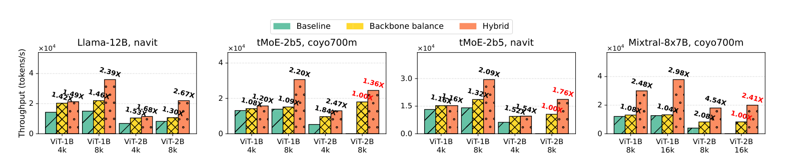
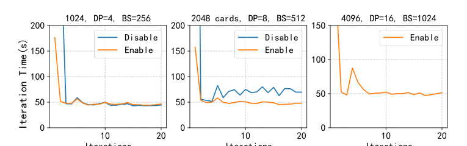

# MegaScale-Data 论文解析：当 DataLoader 成为 4096 GPU 训练的数据控制面

## 📖 论文信息

- **标题**：[MegaScale-Data: Scaling Dataloader for Multisource Large Foundation Model Training](https://doi.org/10.1145/3767295.3803568)
- **作者**：Juntao Zhao, Qi Lu, Wei Jia, Borui Wan, Lei Zuo, Junda Feng, Jianyu Jiang, Yangrui Chen, Shuaishuai Cao, Jialing He, Kaihua Jiang, Yuanzhe Hu, Shibiao Nong, Yanghua Peng, Haibin Lin, Chuan Wu
- **单位**：The University of Hong Kong；ByteDance Seed
- **会议**：EuroSys 2026

## ✦ 核心洞察与挑战

### 核心问题

- **样本数相同不代表计算量相同**：长短文本、图像分辨率和模态差异会让不同 DP rank、microbatch、pipeline stage 出现计算 straggler。
- **数据源状态被重复复制**：数百个数据源的 socket、schema、metadata、index 和 I/O buffer 被每个 loader worker 重复维护。

> 关键判断：大模型训练的数据瓶颈不只是“读得慢”，更是数据在错误的系统层级被重复处理、重复缓存和不均匀分配。

### 传统方案局限

- **Trainer-colocated DataLoader 缺少全局视角**：每个 rank 独立加载数据，无法理解 DP、CP、TP、PP 之间哪些数据应共享、切分或广播。
- **单源数据并行假设过强**：PyTorch DataLoader、tf.data、远程缓存/加载系统大多不擅长表达动态 mixture、多模态成本和混合并行拓扑。

> 关键判断：多源、多模态、混合并行训练需要一个独立的数据控制面，而不是继续堆更多 rank-local loader 和临时数据脚本。

## 研究动机

当训练扩展到数百个数据源和数千张 GPU 时，数据加载已经不再只是文件读取。它同时包含 source mixing、在线解码、tokenization、packing、padding、microbatch 构造、context parallel 切分、pipeline 数据传递和故障恢复。MegaScale-Data 的目标是把这些隐含在训练脚本里的数据组织逻辑抽象出来，用轻量 metadata 进行全局计划，再由分布式 actor 执行真实数据路径。

> 关键判断：DataLoader 应该从“每个 rank 的私有工具”升级为“metadata control plane + distributed data plane”。

## 方法论（主要模块简介）

- **Source Loader**：绑定具体数据源，维护源状态，执行 sample-level transformation，例如读取、JPEG 解码、tokenize。
- **Data Constructor**：面向 trainer 聚合多个 source，执行 batch-level 与 parallelism transformation，例如 packing、padding、CP slicing 和选择性广播。
- **Planner**：只处理 sample index、source signature、sequence length 等轻量 metadata，生成 loading plan，并驱动 AutoScaler 扩缩容。
- **DGraph + ClientPlaceTree**：前者描述样本从 source 到 consumer 的状态流，后者描述训练设备拓扑，两者共同决定数据应如何混合、平衡、切分和共享。

> 关键判断：MegaScale-Data 的核心不是单个更快的数据处理算子，而是把“数据语义”和“设备拓扑”同时纳入可编排的系统模型。

## 🌟 引言：DataLoader 不再只是训练脚本里的小组件

在经典视觉训练里，DataLoader 往往可以被粗略理解为“读文件 + augmentation + batch”。但在大语言模型、多模态模型和大规模 foundation model 训练中，输入流水线已经变成一个复杂系统：它需要从大量异构 source 中按策略混合数据，在线完成解码和 tokenization，再按照 DP、CP、TP、PP 等混合并行方式把样本切成不同 rank 能消费的形态。

MegaScale-Data 这篇 EuroSys 2026 论文抓住了一个很现实的系统问题：当训练规模达到上千 GPU，DataLoader 的架构假设本身会成为瓶颈。传统做法让每个 rank 启动一份 loader，各自维护所有 source 的访问状态，各自组织 batch。这在单源数据并行里还能工作，但在多源、多模态和混合并行场景下会同时制造负载不均、内存浪费和重复 I/O。

论文的贡献可以概括为一句话：**把 DataLoader 从 rank-local 组件重构为一个能理解 source、cost 和 device topology 的分布式数据控制面。**

## 🧩 背景与动机：为什么“每张 GPU 一份 DataLoader”不再成立

### 样本数平衡不是计算量平衡

在 LLM 训练中，attention 计算量近似随序列长度平方增长。论文给出一个直观例子：把 30-token 和 70-token 子序列拼成完整序列，相比两条 50-token 序列会带来约 16% 的额外计算。也就是说，即使每个 rank 拿到的样本数或 token 数看起来相近，microbatch 内部的组合仍可能让计算时间明显不同。

VLM 场景更复杂。Image encoder 的成本受图像分辨率、视觉 token 数影响，language backbone 的成本又取决于融合后的上下文长度。一个 batch 可能对 encoder 很重，对 backbone 相对轻；另一个 batch 则可能相反。随机分样会把这种不均衡扩散到 DP rank、pipeline stage 和 collective communication 中，最终表现为 GPU 等待。

### 多源状态和混合并行状态都在重复

多源训练的另一个问题是内存。每个 worker 往往要为每个 source 维护 socket、schema、metadata、索引和 I/O buffer。现代 LFM 训练可能包含数百个 source，这部分状态会随 source 数线性膨胀。

更麻烦的是混合并行。CP、TP、PP 组里的多个 rank 经常消费同一个 batch 或同一序列的不同切片。如果每个 rank 都独立运行 loader，相同数据会被重复读取、重复解码、重复驻留在主机内存中。论文还指出，一些多模态中间结果不能简单离线化，例如 OCR 中间结果存储膨胀最高可达 200 倍，因此在线预处理仍然必要。

## 🛠️ 方法详解：把数据加载拆成可编排的数据控制面

### 1. Source Loader、Data Constructor 与 Planner 三角色解耦

MegaScale-Data 基于 Ray actor 实现，将传统 monolithic DataLoader 拆成三个角色。Source Loader 靠近数据源，负责 sample-level 读取与转换；Data Constructor 靠近 trainer，负责 batch-level 组装、并行切分和选择性广播；Planner 作为控制层，只处理 metadata，生成全局 loading plan。

🖼️ **图 7 的关键点**在于区分实线数据路径和虚线控制路径。真实数据并不全部经过中心节点，而是由 Source Loader 和 Data Constructor 在分布式数据面中传递；Planner 只汇总轻量 metadata，生成 loading plan 和 scaling plan。这种设计让系统既有全局决策能力，又避免中心节点搬运大 tensor。

从系统效果看，这一拆分同时消除两类冗余：source 状态不必复制到每个 rank；同一 CP/TP/PP 组需要共享的数据也不必由多个 rank 各自重新读取和预处理。

### 2. DGraph：用 metadata 描述样本生命周期

`DGraph` 是 MegaScale-Data 的数据语义抽象。它不直接搬运图片或 token tensor，而是记录样本在不同阶段的 metadata 状态、依赖关系和 lineage。一个节点可以代表某个样本在 Source Loader、microbatch、minibatch、CP transform 后的状态，边则代表 transformation 或逻辑依赖。

🧠 **图 8 展示了两个抽象如何协同**：ClientPlaceTree 描述训练拓扑，例如 DP、CP、TP 的层次关系；DGraph 描述数据从 source 到 microbatch、minibatch、parallel transformation 再到 client 的状态变化。这样 Planner 可以在不触碰大数据本体的情况下，先根据 sequence length、source signature、模态类型等 metadata 做分桶、成本估计和负载平衡。

### 3. ClientPlaceTree：让 DataLoader 理解设备拓扑

`ClientPlaceTree` 把 trainer device mesh 表示为层次树，显式表达哪些 rank 属于 DP、CP、TP 或 PP 关系。它回答的是“谁需要哪些数据”这个问题：哪些 rank 应拿不同 microbatch，哪些 rank 只是同一序列的不同切片，哪些数据可以由 trainer 侧广播，而不需要每个 rank 重新取数。

DGraph 负责表达“数据经历什么状态”，ClientPlaceTree 负责表达“数据应该送到哪里”。两者结合后，数据策略不再散落在训练代码的特殊分支中，而是变成可声明、可组合、可推理的编排计划。

### 4. 声明式 primitives：用少量代码表达复杂编排

论文提供了一组编排 primitives：

- `mix(schedule)`：按 step、epoch 或 substep 调整 source 权重，支持 curriculum learning。
- `distribute(axis, group_size)`：沿 DP、CP 或 WORLD 维度分桶。
- `cost(costfn)`：根据 metadata 估计 encoder/backbone 的计算和内存成本。
- `balance(method)`：使用 greedy bin packing 或 Karmarkar-Karp 等策略平衡 bucket 与 microbatch。
- `broadcast_at(dim)`：声明 trainer 侧广播，避免其它 rank 重复取数。
- `plan()`：把策略编译成可执行 loading plan。

这里的价值不只是减少代码行数，而是让负载平衡、source mixing、并行切分和广播位置第一次有了统一的语义层。对于 VLM，用户可以分别建模 image encoder 和 language backbone 的成本，再用 hybrid balancer 同时减少跨模块不均衡。

### 5. MultiSource AutoScaler：按 source 成本和 mixture 动态伸缩

MegaScale-Data 的 AutoScaler 分为离线和在线两阶段。离线阶段为每个 source 建模 `(P, T, M)`：预处理延迟、编排/传输成本和内存占用。系统结合 worker parallelism、source parallelism 和 data parallelism，为不同 source 生成资源档位。

在线阶段，Planner 观察数据混合比例的移动平均。当某个 source 的采样权重持续上升，系统会创建新的 Source Loader actor，在线 reshard 数据分片，并把新 actor 纳入后续计划；权重下降时则回收资源。因为 Planner 本来就掌握未来的 mixture schedule，这种伸缩可以在队列真正拥塞前发生。

### 6. 生产级容错与弹性

论文还讨论了生产部署中的容错。Planner 和 Data Constructor 使用 Ray GCS 与 checkpoint 恢复；Source Loader 配有 hot-standby shadow loader。为避免频繁快照大 buffer，系统采用低频数据快照加高频 Planner 状态，并通过 deterministic replay 补齐间隔。

训练拓扑发生变化时，ClientPlaceTree 会重建，Data Constructor 对 resident data 执行 elastic resharding。部署上，Source Loader 和 Constructor 优先作为 accelerator pod sidecar 使用闲置 CPU/DRAM；资源不足时，再扩展到远端 CPU pod。

## 📈 实验结果：收益主要来自架构拆分和负载编排

论文使用 Llama-12B、tMoE-25B、Mixtral-8×7B 与 ViT-1B/2B，在最多 4096 张 NVIDIA L20 GPU 上评测；数据集包括 5 个 source 的 coyo700m 和 306 个 source 的 navit_data。对比系统包括 PyTorch DataLoader、tf.data、cachew、Pecan 和 Ray Data。

### 数据处理系统对比

📊 **图 12 是系统架构收益的核心证据。** 在 288/576 GPU 设置下，MegaScale-Data 最高带来 3.63× 训练 iteration 加速，同时将 loader 内存降低到最高 13.5×。值得注意的是，它的 fetch latency 并不总是最低，因为分布式编排会引入协调开销；但这些开销被训练计算覆盖，最终 iteration time 反而明显下降。

这说明论文优化的不是孤立的“读数据 latency”，而是端到端训练迭代中的有效数据供给。对于昂贵 GPU 训练来说，后者才是更重要的指标。

### 负载编排收益

📈 **图 13 展示了 orchestration 的核心价值。** 在不同模型、context length 和数据组合下，负载编排最高带来 4.54×、平均 1.77× throughput 提升。context 越长，样本异质性越强，平衡空间也越大；论文报告 4k、8k、16k context 的平均加速分别为 1.71×、2.63× 和 3.09×。

在 Llama-12B + ViT-2B、PP=9/DP=8/CP=2/TP=4 的案例中，iteration time 从 37.24 秒降低到 15.91 秒，达到 2.34× 加速。我的理解是，这个结果说明 MegaScale-Data 的优势并不来自某个单点优化，而是来自“在 load time 就把 batch 组织得更适合后续计算图”。

### 组件消融与规模扩展

组件消融表明，disaggregation 单独能显著降低内存，但会增加约 10% 延迟；加入 orchestration 后得到约 2.7× 端到端加速；AutoScaler 继续降低内存；两个 shadow loader 在故障场景中以额外内存换取 1.08× ETTR 改善。

⚙️ **图 20 则强调 actor 架构的扩展性。** 1k GPU 时，直接传输基线和 actor 架构差距不大；2k GPU 时，基线 fetch latency 增长到 MegaScale-Data 的约 10 倍；4k GPU 时，基线因连接瓶颈崩溃，而 Data Constructor 的层次转发仍能维持吞吐。这也是论文把 Data Constructor 独立出来的重要原因：它不只是 batch 组装器，也是大规模通信 fan-out 的缓冲层。

### 对训练语义的影响

论文还检查了训练 loss。无 CP 时，平衡配置与 baseline 的 loss 基本重合；启用 CP 后出现轻微波动，但仍正常收敛。作者将差异归因于全局平衡改变了 sequence partition，使分布式 GEMM 与求和的浮点顺序发生变化。

这个结果很重要：数据编排并不是完全“透明”的系统优化。它可能改变浮点执行顺序和随机性边界，因此在生产训练中需要和算法侧共同定义可接受的收敛一致性。

## 💡 亮点总结

- **架构创新明确**：把 DataLoader 从每个 rank 的本地工具升级为分布式数据控制面。
- **同时处理两类冗余**：source redundancy 和 hybrid-parallel redundancy 都被纳入架构设计。
- **负载模型更贴近训练真实成本**：不再只按样本数或 token 数平衡，而是引入 encoder/backbone、模态、context length 等成本。
- **工程完整度高**：动态 mixture、AutoScaler、fault tolerance、elastic resharding 和 sidecar deployment 都进入系统闭环。
- **实验规模有说服力**：评测覆盖多模型、多数据源和最多 4096 GPU，并以训练 iteration 为核心指标。

## ⚖️ 局限性与思考

首先，MegaScale-Data 的效果依赖 cost model。对于新模态、新模型结构或复杂 MoE routing，成本函数可能需要重新拟合；如果 cost estimation 偏差较大，balancer 可能做出错误分配。

其次，Planner 虽然只处理 metadata，并采用分组和层次通信降低开销，但它仍然承担中心化控制逻辑。在更极端规模或更动态的数据混合策略下，metadata plane 是否会成为新瓶颈，还需要进一步验证。

第三，论文主要用局部 loss 曲线说明编排不会破坏收敛，但缺少完整训练到最终质量的对照。对于 foundation model 训练来说，最终指标、数据顺序、随机性和长周期稳定性都值得更细评估。

最后，MegaScale-Data 带有明显的工业生产系统特征。它与 Ray、Kubernetes sidecar、内部数据源、训练框架拓扑都有较强耦合。跨云、跨存储后端、跨训练框架的复现成本，可能比论文中的 API 抽象看起来更高。

## ✅ 结语

MegaScale-Data 的核心启示是：当训练进入多源、多模态和混合并行时代，DataLoader 已经不能继续作为每个 rank 的私有组件。它需要理解数据来自哪里、每个样本会消耗多少计算、哪些设备消费相同内容，以及训练计划何时改变 mixture。

换句话说，GPU 吃不饱不一定是存储太慢，也可能是 batch 组织错了。MegaScale-Data 把这个看似局部的数据加载问题，提升为可声明、可伸缩、可容错的集群级数据编排问题。这是它最值得关注的地方。
