## 🌟 引言
MegaScale-MoE: Large-Scale Communication-Efficient Training of Mixture-of-Experts Models in Production 是一篇来自 ByteDance Seed 和 Peking University 的 EuroSys 2026 论文。它关注的是一个非常工业界的问题：MoE 模型虽然通过 sparse activation 降低了每 token 计算量，但在真正的大规模训练中，通信往往会反过来成为主要瓶颈。

论文并不是提出一个新的 MoE 架构，而是分享一个生产级训练系统 MegaScale-MoE 的设计、实现与部署经验。它的目标很明确：在数百亿到数千亿参数的 MoE 训练中，通过更合适的并行策略、通信计算重叠和通信压缩，把现代 GPU 的计算能力真正用起来。

> 一句话总结：MegaScale-MoE 面向生产级 MoE 训练，把通信优化贯穿到并行策略选择、operator scheduling、kernel 内 tile-level overlap 和低精度通信压缩中，在 1,440 张 NVIDIA Hopper GPU 上训练 352B MoE 模型达到 1.41M tokens/s，相比 Megatron-LM 提升 1.88x。

论文链接：[arXiv:2505.11432](https://arxiv.org/abs/2505.11432)

## 📌 论文基本信息
- 标题：MegaScale-MoE: Large-Scale Communication-Efficient Training of Mixture-of-Experts Models in Production
- 作者：Chao Jin, Ziheng Jiang, Zhihao Bai, Zheng Zhong, Juncai Liu, Xiang Li, Ningxin Zheng, Xi Wang, Cong Xie, Qi Huang, Wen Heng, Yiyuan Ma, Wenlei Bao, Size Zheng, Yanghua Peng, Haibin Lin, Xuanzhe Liu, Xin Jin, Xin Liu
- 机构：Peking University, ByteDance Seed
- 会议：EuroSys 2026
- 年份：arXiv 2025，会议版本 2026
- 研究领域：AI Infra、LLM Training、MoE、Distributed Training、Communication-Compute Overlap
- 核心问题：如何在生产环境中高效训练数百亿到数千亿参数 MoE 模型，降低通信瓶颈对 GPU 计算效率的侵蚀。

## 🧩 背景与动机
MoE 模型通过 gating/router 将 token 动态分配给少量 experts，每个 token 只激活部分参数。因此，MoE 可以在不线性增加每 token FLOPs 的情况下扩大模型容量。这也是 Switch Transformer、GLaM、Mixtral、DeepSeek 等模型路线受到关注的重要原因。

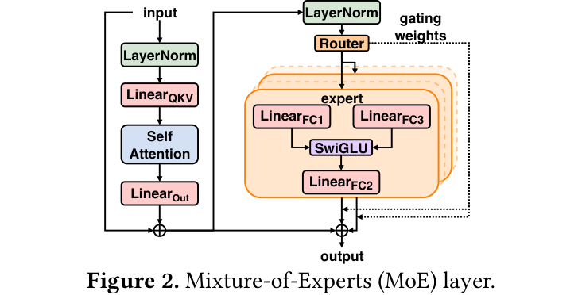

🧠 图 2 展示了典型 MoE layer：attention 后接 router，token 根据 gating weights 被路由到不同 experts，再经过 expert FFN 计算。这个结构带来了 sparse computation，但也引入了 token dispatch 和 combine 所需的额外通信。

论文指出，在真实生产训练中，通信已经成为 MoE 训练的核心瓶颈。例如作者观察到，在 NVIDIA Hopper GPU 上训练内部模型时，forward pass 中通信占 43.6% 时间，整个训练过程通信占 32%。

更麻烦的是，GPU 的算力增长速度明显快于通信带宽增长。随着 FP8/BF16 等低精度训练普及，纯计算时间进一步缩短，通信占比反而更高。

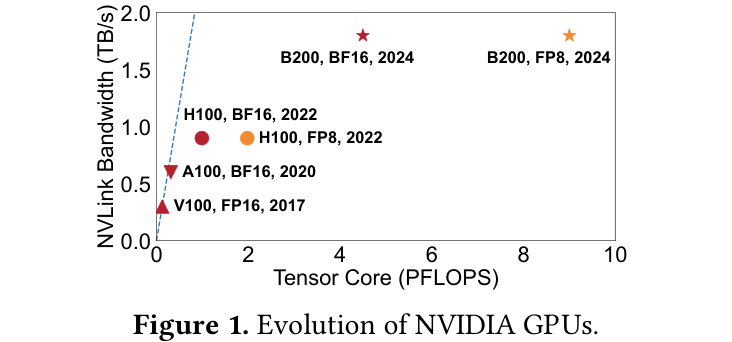

📈 图 1 说明了这个趋势：Tensor Core 算力从 V100 到 H100/B200 大幅提升，但互联带宽并没有同比例增长。因此，MoE 系统不能只依赖更快 GPU，而必须系统性降低通信量、隐藏通信、压缩通信。

## 🛠️ 方法详解
MegaScale-MoE 的优化可以概括为三条主线：

- 通信更少：为 attention 和 FFN/expert 选择不同的并行策略，减少 critical path 上的通信量。
- 通信更隐蔽：在 inter-operator 和 intra-operator 两个层面把通信与计算重叠。
- 通信更轻：通过 BF16/FP8 通信压缩减少参数同步开销，同时尽量保持收敛稳定。

### ⚙️ 并行策略：Attention 用 SP，FFN 用 EP，跨节点用 PP
论文首先分析了大规模 MoE 训练的并行策略设计空间。

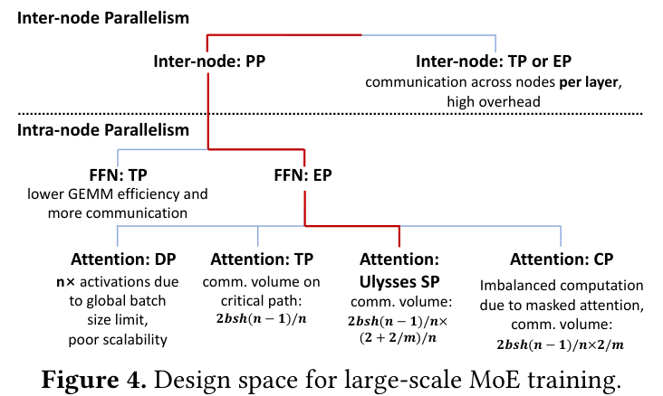

🔍 图 4 是 MegaScale-MoE 的核心设计图之一。作者的选择可以概括为：

- Inter-node：采用 pipeline parallelism，而不是跨节点 TP 或 EP，避免每层跨节点通信。
- Attention：采用 Ulysses-style sequence parallelism，而不是 tensor parallelism 或 data parallelism。
- FFN/Experts：采用 expert parallelism，而不是 tensor parallelism。

为什么 attention 选择 SP？因为 TP attention 会在 critical path 上引入 activation all-gather/reduce-scatter；而 SP 沿 sequence 维度切分，尤其在 grouped-query attention 下，可以显著降低通信量。论文给出的通信量公式显示，SP 相对 TP 多了一个约 `(2 + 2/m) / n` 的缩放项，其中 `m` 是 query heads 与 key-value heads 的比例。

不过 SP 会复制 attention 参数，带来额外参数同步和显存开销。论文的判断是：在 MoE 模型中，专家参数占据大头，attention 参数复制带来的额外开销相对可控。

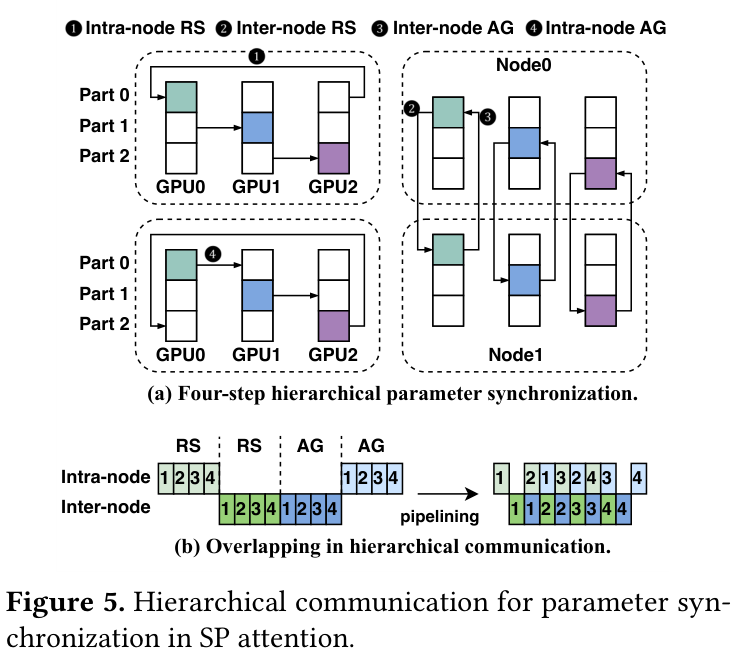

📡 图 5 展示了 SP 参数同步如何通过 intra-node / inter-node reduce-scatter 和 all-gather 层次化执行。由于节点内 NVLink 和节点间网络带宽不对称，实际同步开销并没有因为 SP 复制参数而线性恶化。

### ⚙️ Expert Parallelism：根据 top-k 改变通信模式
对 MoE FFN 来说，MegaScale-MoE 选择 EP 而不是 TP。原因是 TP 会切分 expert hidden dimension，降低 GEMM 效率；EP 则让每个 expert 的计算保持更完整。

但 EP 的 token dispatch / combine 需要通信。典型实现依赖两次 all-to-all，并配合 scatter/gather 操作。MegaScale-MoE 根据 top-k 和并行规模的关系选择更高效的通信模式：当 top-k 大于并行规模 n 时，用 all-gather + reduce-scatter 替代传统 all-to-all。

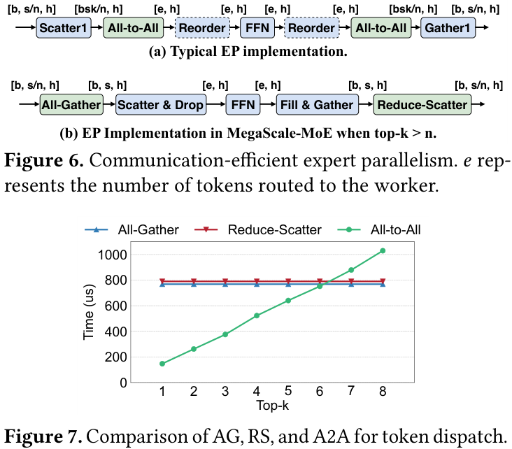

📊 图 6 对比了典型 EP 与 MegaScale-MoE 的实现：MegaScale-MoE 通过 All-Gather 收集 token，本地 Scatter & Drop 只保留本 worker 需要的 token；expert 计算完成后再 Fill & Gather，并用 Reduce-Scatter 得到最终结果。图 7 表明，在 Mixtral-8x7B 上，当 top-k > 6 时，基于 all-gather 的实现比 all-to-all 更高效。

此外，论文还实现了自定义 CUDA scatter/gather operator，避免直接使用通用 `torch.scatter_add` / `torch.gather` 带来的额外开销。

### ⚙️ Inter-operator overlap 与 selective activation rematerialization
降低通信量之后，MegaScale-MoE 进一步尝试把通信隐藏到计算中。第一层是 inter-operator overlap：把 MoE layer 的 forward/backward 拆成更细的 computation 和 communication operators，然后在不同 CUDA streams 上异步执行。

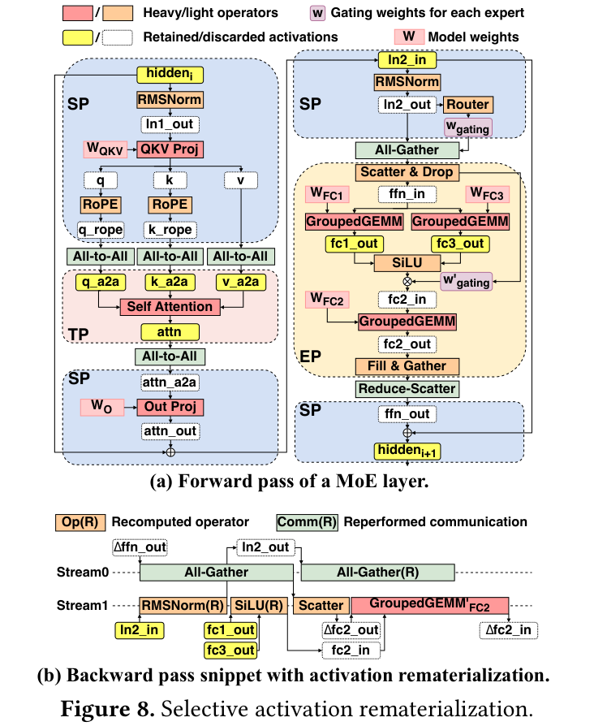

🧠 图 8 展示了一个很实用的设计：MegaScale-MoE 不保存所有 forward activations，而是选择性保留代价高的 activation，对一些 activation 在 backward 中重新计算或重新通信。关键在于，这些 rematerialization 操作会被调度到其他通信或计算之下隐藏掉。

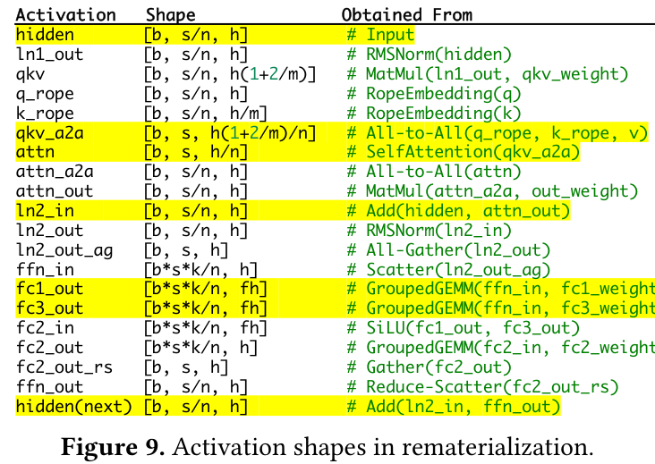

📊 图 9 列出了 MoE layer 中关键 activation 的 shape。论文将单层 activation 总量从 `(2n + 2k + 3kf + 12 + 5/m)bsh/n` 降到 `(2kf + 4 + 2/m)bsh/n`，整体约减少 50% activation memory，同时保持训练速度基本不变。

### ⚙️ Intra-operator overlap：把通信融合到 kernel 内
Inter-operator overlap 仍然无法完全隐藏 forward critical path 上的通信。例如 token dispatch 之后才能进行 expert GroupedGEMM，二者存在直接依赖。MegaScale-MoE 的做法是 intra-operator overlap：把通信和计算切成 tiles，在 device memory 上用 barrier/signals 做 tile-level 通知，避免 CPU host 控制带来的随机 bubble。

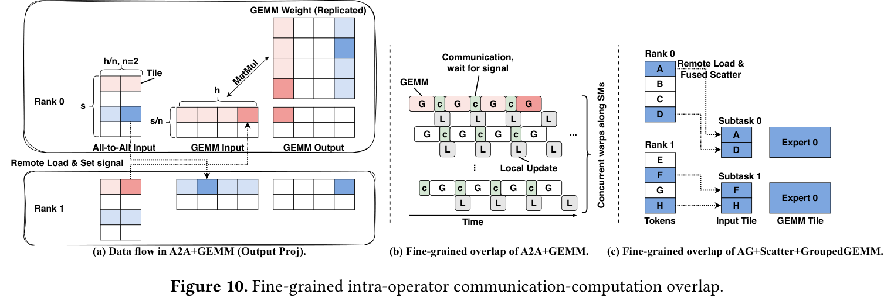

⚙️ 图 10 展示了两个关键场景：

- A2A + GEMM / GEMM + A2A：本地数据 GEMM 和远程数据通信同时开始，远程 tile 到达后通过 signal 通知 GEMM 继续计算。
- AG + Scatter + GroupedGEMM：针对 MoE token dispatch，先按 expert 和 source rank 排序 token，使每个 computation tile 尽量依赖更少 source ranks，从而减少等待。

这个设计的意义在于：通信不再只是“某个 operator 前后的黑盒”，而是进入了 GEMM/GroupedGEMM 的 tile 调度内部。

### ⚙️ 通信压缩：BF16/FP8 不是只用于计算，也用于同步
MegaScale-MoE 还通过通信压缩进一步降低参数/梯度同步成本。

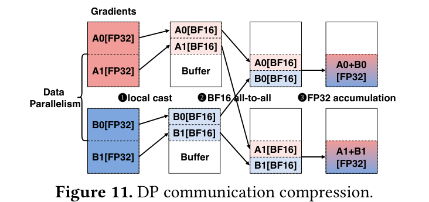

📉 图 11 展示了 BF16 mixed precision 下的 DP gradient compression。系统在本地保留 FP32 梯度累积，但通信前将 accumulated gradients cast 到 BF16，用 all-to-all 在 DP group 内传输，再在本地用 FP32 聚合。这样做将 gradient communication overhead 减半，同时避免在 ring reduce 中反复用 BF16 累加造成精度损失。

对 FP8 training，MegaScale-MoE 也将部分 BF16 reduce-scatter 替换为 FP8 communication，并使用对应量化策略和 FP32 reduction 来保持稳定性。

## 📈 实验结果
论文评估覆盖内部 352B MoE、Mixtral-8x7B、Mixtral-8x22B、Hunyuan-Large、Phi-3.5-MoE、DeepSeek-MoE 等多种模型。主要测试在 NVIDIA H800 上进行，也包含 A100 和 H20 的比较。

### 📊 352B MoE 强/弱扩展：1.41M tokens/s，最高 1.88x
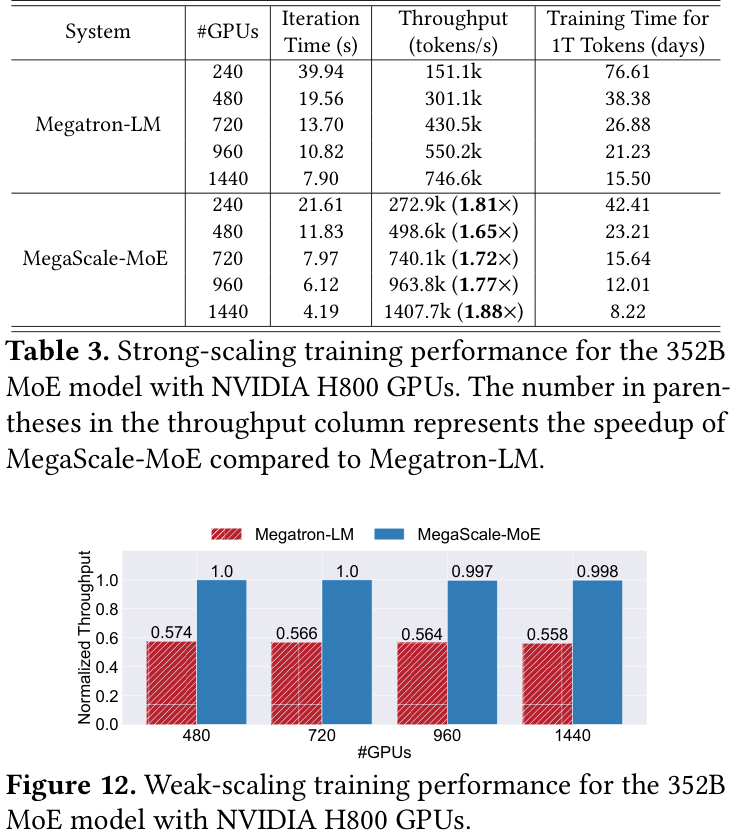

📊 表 3 是最重要的端到端结果。在 352B MoE、sequence length 8192、vocab size 65536 的训练中，MegaScale-MoE 从 240 到 1440 GPUs 都显著快于 Megatron-LM：

- 240 GPUs：272.9k tokens/s，1.81x。
- 720 GPUs：740.1k tokens/s，1.72x。
- 1440 GPUs：1407.7k tokens/s，1.88x。

在 1440 GPUs 上，训练 1T tokens 的估算时间从 Megatron-LM 的 15.50 天降到 8.22 天。图 12 的 weak-scaling 结果也很有意思：Megatron-LM normalized throughput 随 GPU 数增加下降到约 0.558，而 MegaScale-MoE 基本保持在 1.0 左右，说明其通信隐藏和并行策略更适合扩展。

### 📊 不同 GPU 上的 performance breakdown
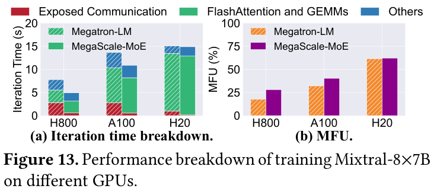

图 13 说明 MegaScale-MoE 在不同 GPU 上都能降低 exposed communication，并提高 MFU。一个值得注意的观察是：GPU 计算能力越强，MoE 的 MFU 不一定越高，因为 routing、scatter、gather 等 memory-intensive operations 会受到内存带宽约束，而不是 Tensor Core 算力约束。

这呼应了论文的整体动机：MoE 训练不是只堆算力，通信和 memory movement 是核心瓶颈。

### 🔍 消融：SP+EP、inter-op overlap、intra-op overlap 分别贡献多少
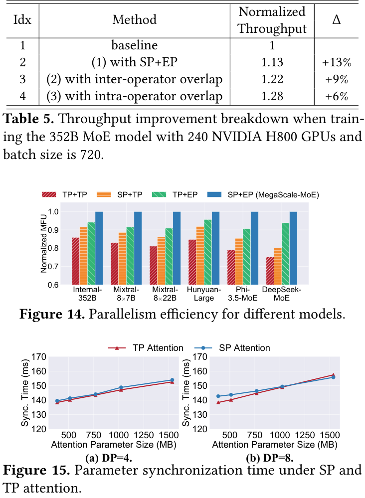

🔍 表 5 将 MegaScale-MoE 的收益拆开：

- baseline：TP for attention + TP for FFN，无通信计算重叠。
- SP + EP：带来 13% throughput 提升。
- inter-operator overlap：额外提升 9%。
- intra-operator overlap：再额外提升 6%。

图 14 进一步说明 SP+EP 在六个 MoE 模型上都优于 TP+TP、SP+TP、TP+EP，MFU 提升 14.9%-32.9%。图 15 则支持一个关键判断：SP attention 虽然复制参数，但与 TP attention 的参数同步时间仅相差 0.3%-3.1%，额外开销可控。

### 🧪 Intra-operator overlap 与 SAR 的效果
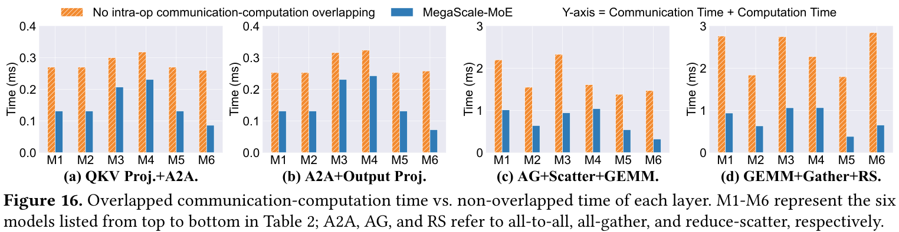

🧪 图 16 展示四类关键组合 operator：QKV Proj+A2A、A2A+Output Proj、AG+Scatter+GEMM、GEMM+Gather+RS。MegaScale-MoE 在六个模型上将通信+计算组合时间降低 1.2-4.7x，并使 training iteration time 降低 7.1%-12.9%。

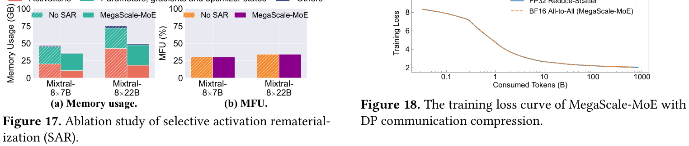

📊 图 17 显示，Selective Activation Rematerialization 在 Mixtral-8x7B 和 Mixtral-8x22B 上分别减少 activation memory 45.5% 和 57.2%，整体内存减少 21.3% 和 35%，MFU 差异控制在 0.5% 以内。图 18 则显示 BF16 all-to-all DP communication compression 与 FP32 reduce-scatter 的 loss curve 几乎一致，说明通信压缩没有明显破坏训练稳定性。

### 📈 收敛与生产经验
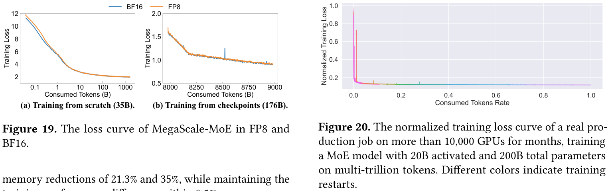

📈 图 19 比较了 BF16 和 FP8 下的 loss 曲线，包括从头训练 35B MoE 和从 checkpoint 继续训练 176B MoE，二者收敛趋势基本一致。图 20 来自真实生产任务：一个 200B total、20B activated 的 MoE 模型，使用超过 10,000 GPUs 训练数月，loss 持续稳定下降。

这部分非常有价值，因为它把论文从“实验室 benchmark”推到了“生产系统经验”：MegaScale-MoE 已在公司内部承担大多数大规模 MoE 训练任务，支持万卡级训练和数月级任务。

## 💡 亮点总结
- ✨ 生产级问题意识：论文直接从 352B/200B/万卡级训练出发，关注真实通信瓶颈，而不是小规模模拟。
- ✨ 并行策略与 MoE 结构匹配：attention 用 SP，experts 用 EP，跨节点用 PP，把不同模块的通信/计算特性拆开处理。
- ✨ 重叠层次完整：既有 inter-operator scheduling，也有 kernel 内 tile-level intra-operator overlap。
- ✨ 显存优化不牺牲速度：Selective activation rematerialization 把可隐藏的 recompute/recommunication 放到非关键路径。
- ✨ 通信压缩谨慎：BF16/FP8 通信压缩保留 FP32 本地累积/聚合，尽量降低收敛风险。
- ✨ 结果有规模说服力：352B 模型 1440 H800 上 1.41M tokens/s，真实生产任务超过 10,000 GPUs。

## ⚖️ 局限性与思考
MegaScale-MoE 是一篇很扎实的系统论文，但也有一些边界。

首先，很多优化高度依赖 NVIDIA GPU、NVLink/NVSwitch、Hopper FP8 能力和生产集群网络拓扑。迁移到不同硬件、不同互联或不同通信库时，收益需要重新验证。

其次，系统复杂度很高。SP/EP/PP 组合、自定义 CUDA scatter/gather、intra-op overlap kernels、tile-level signaling、communication compression、selective rematerialization 都需要较强工程团队维护。

第三，论文主要聚焦训练吞吐和收敛稳定性，对容错、弹性调度、checkpoint 与多租户集群调度讨论较少。而在万卡级数月训练中，这些也是生产系统绕不开的问题。

第四，MoE 的 expert load balance 主要通过 auxiliary loss 和 token dropping 处理。对于更复杂的 routing 分布、domain mixture 或动态专家热点，系统层和算法层如何共同优化仍值得继续研究。

最后，MegaScale-MoE 强调生产经验，但部分模型和集群细节由于商业环境限制无法完全公开复现。因此它更适合作为系统设计参考，而不是可以直接一键复现的开源 baseline。

## ✅ 结语
MegaScale-MoE 的核心价值在于，它清楚展示了大规模 MoE 训练真正困难的地方：不是模型能不能放进显存，而是通信、内存移动和 kernel 调度是否能跟上现代 GPU 的算力增长。

我的理解是，这篇论文对 AI Infra 的启发主要有两点。第一，MoE 训练系统必须按模块定制并行策略，不能简单沿用 dense LLM 的 TP/DP/PP 组合。第二，通信优化已经进入 kernel 内部，未来大规模训练系统的竞争力会越来越依赖 communication-computation co-design，而不是单纯依赖更快的 collective 或更大的 GPU 集群。
