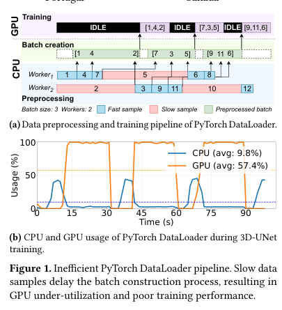
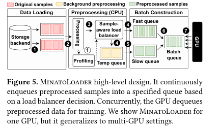
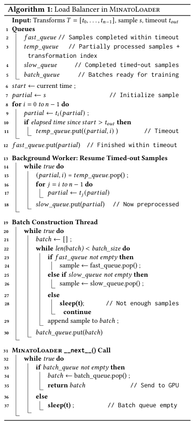
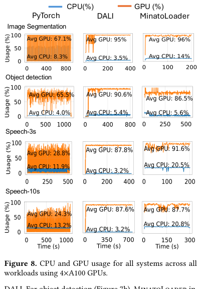
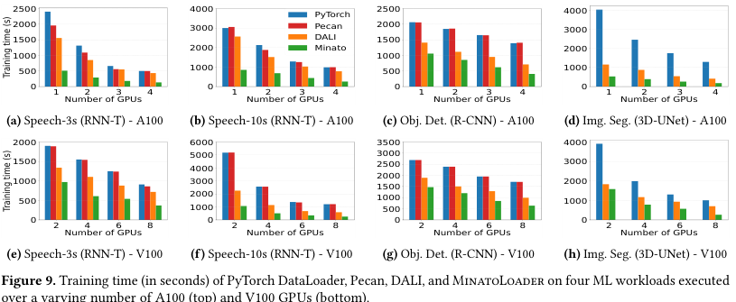
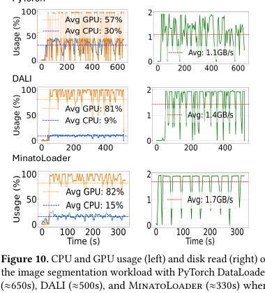
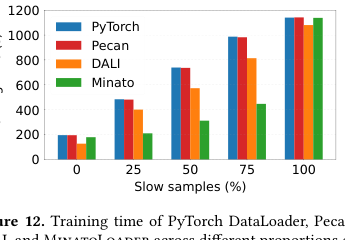

## 🌟 引言
MinatoLoader: Accelerating Machine Learning Training Through Efficient Data Preprocessing 是一篇 EuroSys 2026 论文，作者来自 McGill University、INESC TEC 和 University of Minho。它讨论的是一个在机器学习训练系统里很现实、但经常被模型计算光环遮住的问题：GPU 明明很强，训练却可能卡在数据预处理上。

这篇论文的核心观点是：数据加载瓶颈并不只是“CPU worker 不够多”，更关键的是不同样本的预处理耗时存在长尾差异。传统 DataLoader 往往要等一个 batch 内所有样本都准备好，因此单个慢样本就可能拖住整个 batch，最终让 GPU 空等。

> 一句话总结：MinatoLoader 把数据加载从“按 batch 等待最慢样本”改成“按样本预处理速度动态调度”，通过快慢样本分流、后台慢任务处理和 worker 动态调节，缓解训练中的数据预处理瓶颈。

论文链接：[arXiv:2509.10712](https://arxiv.org/abs/2509.10712)

## 📌 论文基本信息
- 标题：MinatoLoader: Accelerating Machine Learning Training Through Efficient Data Preprocessing
- 作者：Rahma Nouaji, Stella Bitchebe, Ricardo Macedo, Oana Balmau
- 会议：EuroSys 2026
- 研究领域：机器学习系统、数据加载、数据预处理、训练加速、单机多 GPU 调度
- 核心问题：当样本预处理耗时高度不均匀时，如何持续向 GPU 提供 ready batch，减少 GPU idle time。

## 🧩 背景与动机
现代训练流水线通常把数据读取、解码、增强和格式转换放在 CPU 侧，把模型训练放在 GPU 侧。理想情况下，CPU 预处理和 GPU 训练应该形成稳定流水线：GPU 消耗一个 batch 时，CPU 已经提前准备好后续 batch。

但实际情况没有这么优雅。PyTorch DataLoader 虽然能启动多个 worker 并行处理样本，但 batch 创建仍然会受到慢样本影响。一个 batch 中只要有一个样本还没处理完，其他已经完成的样本也只能等着。

🖼️ 图 1 很好地说明了这个问题。上半部分展示 PyTorch DataLoader 的流水线：蓝色快样本较早完成，红色慢样本拖住 batch 创建；下半部分展示 3D-UNet 训练时 CPU/GPU 使用率，GPU 平均利用率只有约 57.4%，CPU 平均使用率约 9.8%。这说明训练慢并不是 GPU 算不动，而是 GPU 经常没有数据可算。

论文进一步观察到，不同样本的预处理耗时可能差异很大。例如图像分割和目标检测 workload 中，样本级预处理耗时从几十毫秒到数秒不等。这种差异来自输入尺寸、数据压缩格式、随机增强和 transformation 组合等因素，很难用简单静态规则准确预测。

因此，MinatoLoader 要解决的不是传统意义上的“提高单个 transformation 速度”，而是一个系统调度问题：如何避免慢样本占据 batch 创建的关键路径。

## 🛠️ 方法详解
MinatoLoader 是 PyTorch DataLoader 的 drop-in replacement，设计目标是在不要求用户重写训练代码的前提下，提高单机多 GPU 训练中的数据供应效率。

它的系统设计可以概括为三件事：

- 识别快慢样本：用 timeout 判断样本是否能在合理时间内完成预处理。
- 解耦 batch 创建：快样本优先进入 fast queue，慢样本转入后台继续处理。
- 动态调度 worker：根据队列状态和 CPU 使用率调整数据加载 worker 数量。

🧠 图 5 是理解 MinatoLoader 的关键。它把数据加载过程拆成几个队列和 worker 角色：

- Data Loading 阶段从存储后端取样本。
- Preprocessing 阶段由 CPU worker 应用 transformation。
- Sample-aware load balancer 判断样本是否超时。
- Fast queue 保存及时完成的样本。
- Temp queue / Slow queue 处理被中断或后台完成的慢样本。
- Batch queue 提前构建 ready batch，供 GPU 直接消费。

这个设计的本质，是把慢样本从“当前 batch 的阻塞点”移到“后台可恢复任务”。换句话说，MinatoLoader 并不是不处理慢样本，而是不让慢样本卡住 GPU 当前最需要的数据流。

### ⚙️ Load Balancer：快慢样本如何被区分
MinatoLoader 的核心逻辑由 Algorithm 1 给出。它对每个样本逐步应用 transformation，并监控累计耗时。如果样本在 timeout 内完成，就进入 fast queue；如果超过 timeout，就记录当前处理进度，把部分处理结果放入 temp queue，后续由后台 worker 从中断处继续处理。

⚙️ 这里有两个细节值得注意。

第一，慢样本不是被丢弃，而是被“暂停并恢复”。系统记录已经完成到哪个 transformation，后台 worker 可以从该位置继续处理，避免重复执行已经完成的预处理。

第二，batch 构建线程优先从 fast queue 取样本，不够时再从 slow queue 补齐。这样 GPU 更容易持续拿到已经准备好的 batch，训练流水线不必被某个慢样本锁死。

timeout 的选择也不是固定拍脑袋。论文先用轻量 profiling 估计样本预处理时间分布，默认采用 75th percentile 作为阈值；如果慢样本误判过多，可以调整到 90th percentile，并在运行过程中持续更新。这让 MinatoLoader 能适应不同 workload 的耗时分布。

## 📈 实验结果
论文使用 MLPerf 中的三个代表性 workload：

- 图像分割：3D-UNet
- 目标检测：Mask R-CNN
- 语音识别：RNN-T，包括 Speech-3s 和 Speech-10s 变体

对比系统包括 PyTorch DataLoader、NVIDIA DALI、Pecan 和 MinatoLoader。测试平台包含 4×A100 和 8×V100。

### 📊 GPU 利用率：MinatoLoader 是否真的让 GPU 更忙
论文报告，在 4×A100 上，MinatoLoader 将平均 GPU 利用率从 PyTorch DataLoader 的约 46.4% 提升到约 90.45%。这个提升很关键，因为它说明 MinatoLoader 的收益不是只来自局部代码优化，而是确实减少了 GPU 等数据的时间。

📊 图 8 中，PyTorch DataLoader 的 GPU 曲线存在明显断续，说明训练经常被数据供应打断。DALI 通过把部分预处理搬到 GPU 上改善了利用率，但会占用宝贵 GPU 资源。MinatoLoader 的 GPU 使用率更接近持续高位，同时 CPU 使用率也更高一些，符合它“用 CPU 调度换 GPU 连续训练”的设计目标。

### 📈 训练时间：收益是否能跨 workload 和硬件成立
论文在 A100 与 V100 两类 GPU 上测试不同 GPU 数量下的训练时间。总体结果显示，MinatoLoader 相比 PyTorch DataLoader 和 Pecan 最高可将训练时间缩短 7.5×，平均 3.6×；相比 DALI 最高 3×，平均 2.2×。

📈 图 9 的价值在于它展示了扩展性。随着 GPU 数量增加，传统 DataLoader 更容易暴露数据供应不足的问题；如果数据预处理跟不上，增加 GPU 反而会放大等待成本。MinatoLoader 通过提前构建 batch 和后台处理慢样本，在多 GPU 场景中保持了更稳定的训练时间优势。

### 📊 内存受限场景：不是只靠缓存吃红利
很多数据加载优化依赖缓存，但真实训练中数据集可能远大于内存。论文构造了一个 230GB 数据集，并把内存限制到 80GB，模拟数据无法完全缓存的场景。

📊 图 10 显示，PyTorch DataLoader 在内存受限时 GPU 使用率下降明显，DALI 也会出现较多波动；MinatoLoader 仍然能维持较高 GPU 利用率，并保持稳定磁盘读取。这说明它的核心收益不只是“多缓存一些数据”，而是来自在线调度和队列解耦。

### 🔍 什么时候 MinatoLoader 最有效
MinatoLoader 的优势并不是无条件成立。论文通过改变慢样本比例，分析了不同样本耗时分布下的训练效果。

🔍 图 12 很清楚地揭示了适用边界：当慢样本比例处于中间区间时，MinatoLoader 优势最明显；当所有样本都很快或所有样本都同样慢时，快慢样本分流带来的空间会变小。这也说明 MinatoLoader 针对的是“样本级耗时不均匀”这个结构性问题，而不是泛化到所有数据加载瓶颈的银弹。

## 💡 亮点总结
✨ 第一，论文把 DataLoader 瓶颈从“worker 数量不足”重新表述为“样本级预处理耗时差异导致 batch 阻塞”。这个问题定义很有启发性。

✨ 第二，MinatoLoader 的设计是系统级的：timeout 分类、快慢队列、后台慢样本恢复、batch 预构建、CUDA stream prefetch 和 worker 动态调节共同构成完整 pipeline。

✨ 第三，它保持了 PyTorch DataLoader 的使用接口，降低了接入成本。对工程系统来说，drop-in replacement 往往比理论上更优但侵入性很强的方案更容易落地。

✨ 第四，实验覆盖多个 workload、两类 GPU、不同 GPU 数量和内存受限场景，能够较好支撑“通用数据加载器”的主张。

## ⚖️ 局限性与思考
⚠️ MinatoLoader 的收益依赖样本预处理耗时存在明显差异。如果所有样本都很快，瓶颈不在 DataLoader；如果所有样本都同样慢，快慢分流也没有太多发挥空间。

⚠️ 它默认允许一定程度的样本重排。论文说明在常规训练中这种重排不会破坏准确率，但对于 curriculum learning 或严格顺序敏感任务，可能需要禁用重排，而这会削弱 MinatoLoader 的主要优势。

⚠️ 当前评估重点是单机多 GPU。论文讨论了分布式训练可扩展性，但跨节点环境会引入网络、远程存储、全局数据划分和多机同步问题，仍需要更系统的验证。

⚠️ timeout 阈值虽然可以自适应，但仍是系统中的关键策略参数。不同 workload 下误判快慢样本的代价、队列容量和 worker 调度策略，都会影响实际部署效果。

## ✅ 结语
MinatoLoader 的启发在于，它没有把数据预处理瓶颈简单归因于 CPU 不够快，而是抓住了 batch 同步等待和样本级耗时差异之间的结构性矛盾。

对 ML Infra 来说，这类工作很有现实价值：当模型和 GPU 越来越强，训练系统的瓶颈会越来越多地出现在数据供应、预处理流水线和资源协同上。MinatoLoader 给出的答案是，把 DataLoader 从被动等待变成主动调度。优化训练效率，不只要看 GPU kernel，也要看数据如何准时抵达 GPU。
