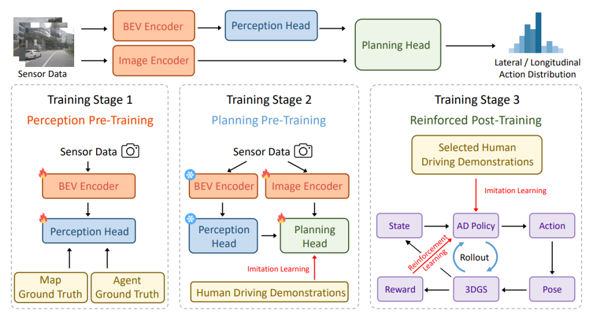

# RAD 论文解析：用 3DGS 光真实仿真做端到端驾驶强化学习

> 论文：[RAD: Training an End-to-End Driving Policy via Large-Scale 3DGS-based Reinforcement Learning](https://huggingface.co/papers/2502.13144)  
> 作者：Hao Gao, Shaoyu Chen, Bo Jiang 等  
> 发表：NeurIPS 2025 / arXiv，2025  
> 领域：端到端自动驾驶、规划、强化学习/多模态模型相关方向

## 🌟 引言

端到端自动驾驶大量依赖 imitation learning，但 IL 存在两个老问题：只学到相关性而非因果策略，以及开环评测无法反映真实闭环错误累积。RAD 试图用光真实 3DGS 仿真提供可交互、可试错的训练场。

## 🧩 背景与动机

🔍 这篇工作的背景可以放在自动驾驶范式迁移中理解：从模块化流水线，到多任务联合，再到更强的端到端训练。它要解决的不是单一 perception 指标，而是驾驶系统在闭环规划、长尾场景、实时推理或可扩展训练上的瓶颈。

我的理解是，这类论文最值得关注的地方不在“端到端”这个标签本身，而在它具体选择了什么中间表示、训练信号和系统接口。真正有价值的端到端方法，应该让信息流更顺、更贴近规划目标，而不是简单把模块边界藏进一个大网络里。

## 🛠️ 方法详解

⚙️ RAD 先进行感知预训练和规划预训练，再在 3DGS 构建的逼真环境中做 reinforced post-training。奖励设计强调安全关键事件，同时用 IL 正则约束策略不过度偏离人类驾驶行为。这个组合让模型既能探索 OOD 场景，又不至于变成不自然的奖励黑客。

从图 1 可以看出，论文的核心设计通常围绕输入表示、任务交互和规划输出展开。相比传统流水线，这类方法更强调跨任务共享、闭环反馈或统一 token/query 表示；相比纯黑盒控制，它又尽量保留可解释的结构，让模型失败时能追踪原因。

## 📈 实验结果

📊 论文报告 RAD 相比 IL-only 在闭环指标上更强，尤其碰撞率显著下降。这个结果支持一个重要判断：高保真闭环环境能把“看起来会开”的模型，继续训练成“犯错后能纠正”的策略。

实验分析时我更关注两个问题：第一，指标提升是否直接对应驾驶安全和规划质量；第二，方法是否把计算、延迟、训练成本也纳入讨论。自动驾驶论文如果只在开环误差上好看，但闭环碰撞、违规或实时性不稳定，工程价值会明显打折。

## 💡 亮点总结

✨ 这篇论文的主要亮点可以概括为三点：

- 它围绕自动驾驶的核心瓶颈提出了明确的结构设计，而不是只做模型规模扩展。
- 它把表示学习、任务协同和规划目标联系起来，体现了端到端系统设计的整体性。
- 它通过关键图表和实验结果说明该设计确实影响了驾驶质量、效率或泛化能力。

## ⚖️ 局限性与思考

⚠️ 3DGS 环境构建成本、动态对象建模、传感器物理真实性仍是挑战；如果仿真覆盖不足，RL 仍可能过拟合到数字世界。

更进一步看，自动驾驶里的端到端路线仍需要面对三类问题：数据覆盖是否足够、闭环训练是否可靠、部署时能否满足安全与实时约束。因此，这篇论文更适合作为理解某条技术路线的关键节点，而不是最终答案。

## ✅ 结语

RAD 的核心价值是把 3DGS 光真实仿真与端到端驾驶 RL 后训练连接起来，向缩小 sim-to-real gap 迈出一步。
