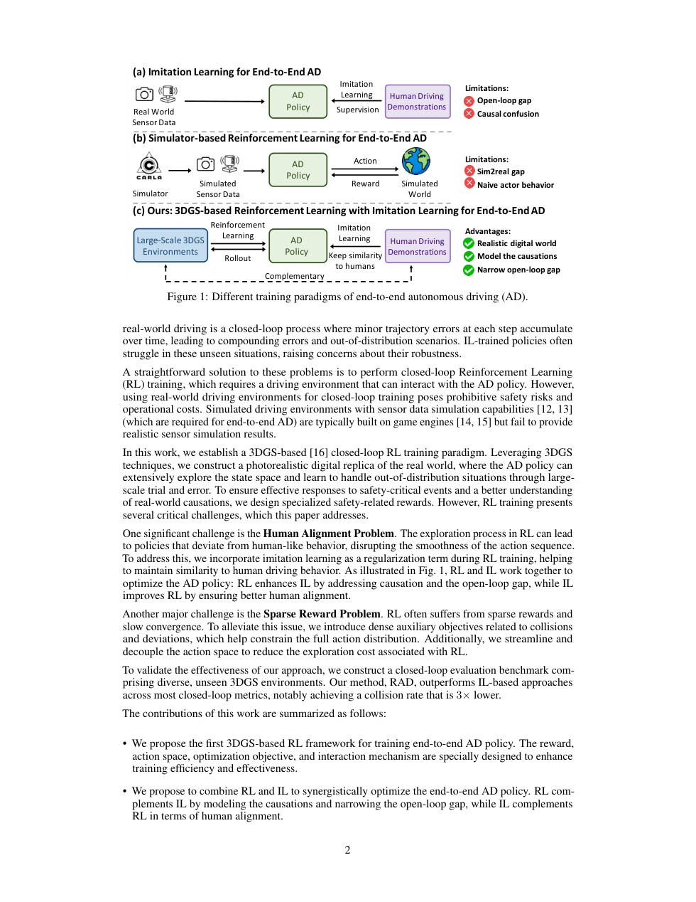
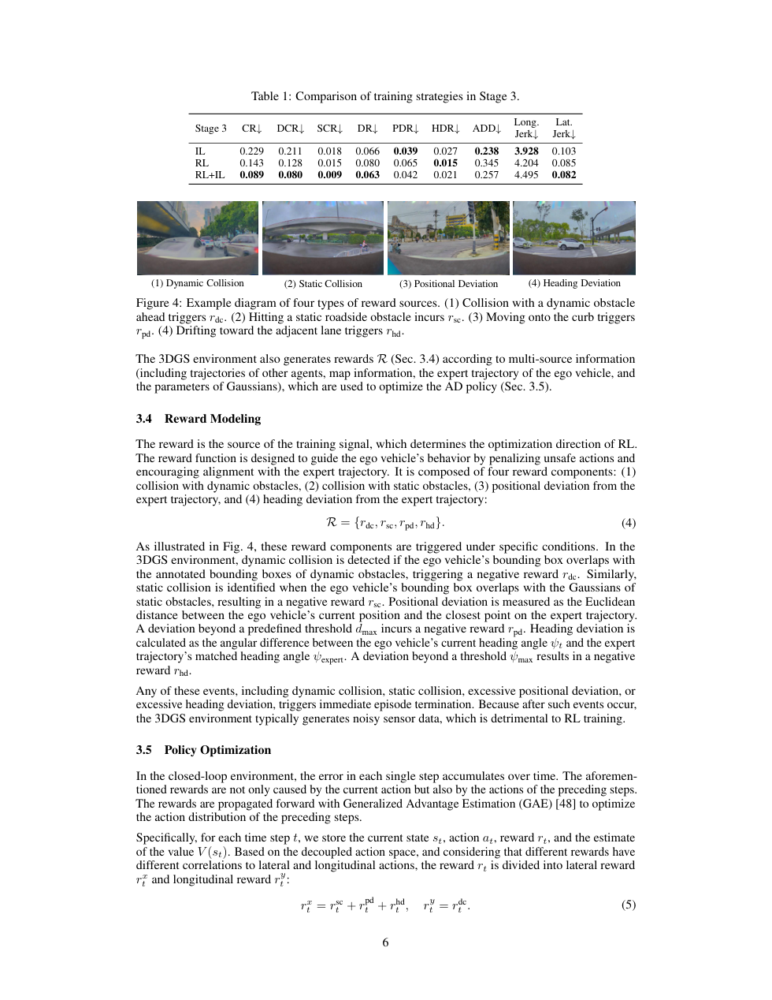

# RAD 论文解析：用 3DGS 光真实仿真做端到端驾驶强化学习

> 论文：[RAD: Training an End-to-End Driving Policy via Large-Scale 3DGS-based Reinforcement Learning](https://huggingface.co/papers/2502.13144)  
> 作者：Hao Gao, Shaoyu Chen, Bo Jiang, Bencheng Liao 等  
> 发表：NeurIPS 2025 / arXiv 2025  
> 关键词：3D Gaussian Splatting、强化学习后训练、端到端驾驶、Sim-to-Real、闭环评测

## 🌟 引言

RAD 关注的是 imitation learning 在端到端自动驾驶中的两个核心问题：causal confusion 和 open-loop gap。IL 模型可能学到错误相关性，例如把刹车归因于红绿灯之外的背景特征；开环评测则只比较预测轨迹和专家轨迹距离，无法反映模型闭环驾驶时错误如何累积。

RAD 的思路是构建基于 3D Gaussian Splatting 的光真实数字环境，让端到端策略在接近真实视觉质量的环境中进行强化学习后训练。它不是从零开始 RL，而是在感知预训练和规划预训练之后，通过 RL 进一步提升闭环安全性。

## 🧩 背景与核心问题

🔍 传统 CARLA 这类仿真器具备可交互性，但视觉真实感和真实道路分布存在差距；真实数据有高保真视觉，却无法轻易闭环试错。3DGS 提供了一个中间选择：从真实采集数据重建可渲染环境，使 agent 能在更接近真实的视觉中交互。

论文 Figure 1 展示了 RAD 的三阶段训练路线：先预训练感知，再预训练规划，最后在 3DGS 环境中做 reinforced post-training。这对应了一个很务实的观点：自动驾驶 RL 不必完全替代 IL，而可以作为 IL 后训练阶段，专门修正闭环失败行为。

## 🛠️ 方法详解

⚙️ RAD 的训练分三步。第一步是 perception pretraining，让模型具备基础场景理解能力。第二步是 planning pretraining，通过 imitation learning 学习人类轨迹，获得合理初始策略。第三步是 reinforced post-training，模型在 3DGS 光真实环境中闭环控制车辆，根据安全、舒适、路线完成等反馈优化策略。

这一设计的关键在 reward 与 regularization 的平衡。如果只靠 RL 奖励，策略可能学到不自然甚至 reward hacking 的行为；如果只靠 IL，则无法纠正分布偏移。RAD 通过结合模仿约束和强化学习反馈，让策略既保持人类驾驶先验，又能在错误状态下探索恢复动作。

🧠 我的理解是，RAD 的技术价值不只是用了 3DGS，而是把“真实视觉数据”和“闭环可交互训练”连接起来。它试图补上自动驾驶训练中长期缺失的一环：既真实又可试错的环境。

## 📈 实验结果与图表分析

📊 Hugging Face 论文页和项目说明中提到，RAD 在相同闭环评测下相比 IL-only 策略将碰撞率降低约三倍。论文还提供可视化实验，比较 RAD 与 IL-only 在关键场景中的行为差异。

实验结果说明 reinforced post-training 主要改善的是闭环安全，而不只是开环轨迹误差。换句话说，RAD 让模型从“模仿专家轨迹”进一步变成“在环境反馈下修正自己”。这对自动驾驶非常重要，因为真实部署中模型必然会遇到偏离训练数据的状态。

## 💡 亮点总结

✨ RAD 的亮点包括：

- 将 3DGS 光真实重建用于端到端驾驶 RL 闭环训练。
- 采用感知预训练、规划预训练、RL 后训练的渐进式路线，避免从零 RL 的不稳定。
- 用闭环碰撞率和可视化案例强调 RL 后训练对安全行为的实际影响。

## ⚖️ 局限性与思考

⚠️ RAD 仍面临 3DGS 环境构建成本、动态对象建模和物理真实性问题。3DGS 擅长渲染静态或准静态场景，但真实交通中车辆、行人和复杂交互不断变化。如果数字环境覆盖不足，RL 仍可能过拟合到重建场景。此外，光真实不等于行为真实，其他交通参与者的策略建模同样关键。

## 🔬 进一步拆解：RAD 为什么强调后训练而不是从零 RL

端到端驾驶从零做 RL 很难，原因包括奖励稀疏、探索危险、动作空间连续和视觉输入复杂。RAD 选择在 IL 预训练之后做 reinforced post-training，本质上是把 RL 用在最擅长的位置：修正 IL 在闭环状态下暴露出的错误。

IL 预训练提供了基本驾驶先验，让策略一开始就能沿路行驶；RL 后训练则让模型在碰撞、偏航、跟车距离等反馈下学习纠错。3DGS 环境提供了比传统仿真更接近真实视觉的数据分布，使策略在训练中看到更真实的纹理、道路和环境外观。

这条路线的工程启发很强：未来自动驾驶训练可能不是“IL 或 RL 二选一”，而是先用大规模真实驾驶数据建立基础能力，再用高保真闭环环境进行安全关键后训练。

## 🧭 阅读建议：读这篇论文时应关注什么

如果把这篇论文作为精读材料，我建议不要只看 abstract 和主结果表，而是按三条线阅读。第一条线是表示：论文如何把原始传感器、地图、agent 状态或语言信息转成模型可处理的内部变量；这决定了方法的归纳偏置。第二条线是训练信号：模型到底从 imitation、reinforcement、world model、diffusion objective 还是多任务监督中获得能力；这决定了它能否处理分布偏移和长尾状态。第三条线是评测：开环误差、闭环驾驶分数、碰撞率、违规率、FPS 和消融实验分别回答不同问题，不能只看一个指标。

对自动驾驶论文来说，最值得警惕的是“指标漂亮但系统边界不清”。一篇真正有价值的工作，应该能说明它在哪些场景有效、依赖哪些输入假设、失败时可能来自哪个模块，以及它离真实部署还有哪些距离。按照这个标准看，上述论文都不是最终答案，但它们各自在表示、训练或系统架构上推进了端到端自动驾驶的一块拼图。

另外，RAD 对“评测方式”的启发也很强。开环轨迹误差无法衡量策略在连续交互中的恢复能力，而强化学习后训练天然要求闭环评测。未来端到端驾驶论文如果只报告开环指标，很难说明系统是否真的更安全。

## ✅ 结语

RAD 的核心价值是把 3DGS 光真实仿真和端到端驾驶强化学习后训练结合起来，为缓解 open-loop gap 和 sim-to-real gap 提供了新的实验路径。
