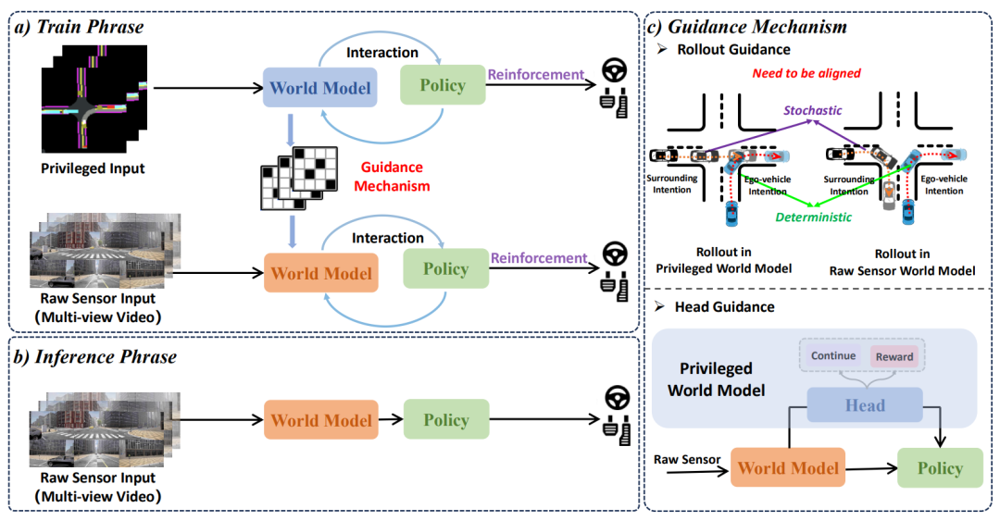

# Raw2Drive 论文解析：从原始传感器训练对齐世界模型的端到端 RL

> 论文：[Raw2Drive: Reinforcement Learning with Aligned World Models for End-to-End Autonomous Driving](https://huggingface.co/papers/2505.16394)  
> 作者：Zhenjie Yang, Xiaosong Jia, Qifeng Li, Xue Yang, Maoqing Yao, Junchi Yan  
> 发表：NeurIPS 2025 / arXiv，2025  
> 领域：端到端自动驾驶、规划、强化学习/多模态模型相关方向

## 🌟 引言

模型基 RL 在自动驾驶中常依赖 BEV、语义图等特权输入，但真正部署时系统面对的是原始摄像头/传感器。Raw2Drive 解决的正是这个断层：如何把特权世界模型的训练效率迁移到原始传感器策略。

## 🧩 背景与动机

🔍 这篇工作的背景可以放在自动驾驶范式迁移中理解：从模块化流水线，到多任务联合，再到更强的端到端训练。它要解决的不是单一 perception 指标，而是驾驶系统在闭环规划、长尾场景、实时推理或可扩展训练上的瓶颈。

我的理解是，这类论文最值得关注的地方不在“端到端”这个标签本身，而在它具体选择了什么中间表示、训练信号和系统接口。真正有价值的端到端方法，应该让信息流更顺、更贴近规划目标，而不是简单把模块边界藏进一个大网络里。

## 🛠️ 方法详解

⚙️ 论文先训练 auxiliary privileged world model 与使用特权信息的 neural planner；随后训练 raw sensor world model，并通过 rollout guidance 与 head guidance 让其在动态预测和任务头上对齐特权模型。最终 raw sensor policy 在被指导的世界模型中训练，部署时丢弃特权输入。

从图 1 可以看出，论文的核心设计通常围绕输入表示、任务交互和规划输出展开。相比传统流水线，这类方法更强调跨任务共享、闭环反馈或统一 token/query 表示；相比纯黑盒控制，它又尽量保留可解释的结构，让模型失败时能追踪原因。

## 📈 实验结果

📊 论文强调 Raw2Drive 是 CARLA Leaderboard 2.0 / Bench2Drive 上少见的 RL-based end-to-end 方法，并达到强性能。实验结论是：特权信息不必在推理时存在，也可以作为训练期教师，帮助原始视频策略获得闭环能力。

实验分析时我更关注两个问题：第一，指标提升是否直接对应驾驶安全和规划质量；第二，方法是否把计算、延迟、训练成本也纳入讨论。自动驾驶论文如果只在开环误差上好看，但闭环碰撞、违规或实时性不稳定，工程价值会明显打折。

## 💡 亮点总结

✨ 这篇论文的主要亮点可以概括为三点：

- 它围绕自动驾驶的核心瓶颈提出了明确的结构设计，而不是只做模型规模扩展。
- 它把表示学习、任务协同和规划目标联系起来，体现了端到端系统设计的整体性。
- 它通过关键图表和实验结果说明该设计确实影响了驾驶质量、效率或泛化能力。

## ⚖️ 局限性与思考

⚠️ 方法仍依赖仿真环境与特权模型质量；如果 privileged stream 自身存在偏差，guidance 也会传递偏差。真实多传感器、长时间驾驶和开放场景仍需验证。

更进一步看，自动驾驶里的端到端路线仍需要面对三类问题：数据覆盖是否足够、闭环训练是否可靠、部署时能否满足安全与实时约束。因此，这篇论文更适合作为理解某条技术路线的关键节点，而不是最终答案。

## ✅ 结语

Raw2Drive 的核心价值是把“特权世界模型训练效率”和“原始传感器端到端部署”通过双流对齐连接起来。
