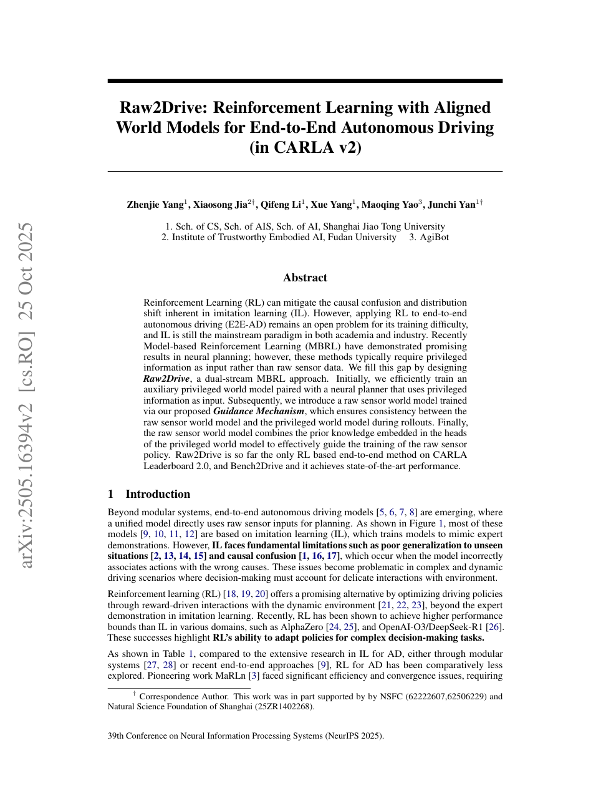
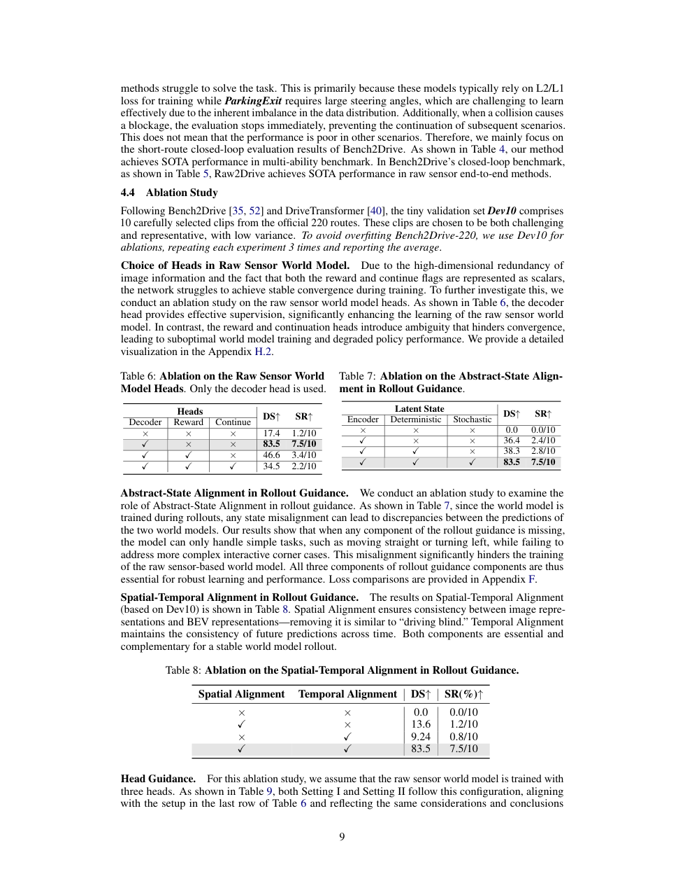

# Raw2Drive 论文解析：从原始传感器训练对齐世界模型的端到端 RL

> 论文：[Raw2Drive: Reinforcement Learning with Aligned World Models for End-to-End Autonomous Driving](https://huggingface.co/papers/2505.16394)  
> 作者：Zhenjie Yang, Xiaosong Jia, Qifeng Li, Xue Yang, Maoqing Yao, Junchi Yan  
> 发表：arXiv 2025  
> 关键词：模型基强化学习、原始传感器、特权信息、世界模型对齐、CARLA v2

## 🌟 引言

Raw2Drive 是 Think2Drive 后更进一步的工作。模型基 RL 在自动驾驶中很有吸引力，但很多成功方法依赖 privileged information，例如 BEV 语义图、精确地图或仿真器状态。这些信息训练时好用，部署时却不一定可得。Raw2Drive 的核心问题是：能否让模型最终只依赖原始传感器输入，同时仍然享受特权世界模型带来的训练效率？

论文提出 dual-stream MBRL：先训练 privileged world model 和 privileged planner，再用它们指导 raw sensor world model，最后训练只依赖原始传感器的策略。

## 🧩 背景与核心问题

🔍 RL 可以缓解 IL 的 causal confusion 和 distribution shift，但直接从多视角图像训练 RL 仍非常困难。高维视觉输入会让世界模型难以学习，奖励信号也更难传导。特权输入能简化训练，却造成训练/部署不一致。

Raw2Drive 的目标就是填补这个 gap：训练时允许使用 privileged stream 作为老师，推理时只保留 raw sensor stream。这样既不牺牲部署形式，又能利用结构化信息提升训练稳定性。

## 🛠️ 方法详解

⚙️ Raw2Drive 分三步。第一步，训练 auxiliary privileged world model 和 neural planner。这个分支使用结构化特权输入，学习环境动态更容易。第二步，训练 raw sensor world model。论文提出 guidance mechanism，包括 rollout guidance 和 head guidance，使原始传感器世界模型在 imagined rollout 和预测头上对齐特权世界模型。第三步，在 raw sensor world model 中训练 raw sensor policy，部署时不再需要 privileged input。

🧠 这个设计像是一个驾驶学校：特权模型是教练，它看得到更完整的道路结构；学生模型只能看摄像头，但训练时不断被教练纠正对世界动态的理解。最终学生上路时不带教练，却已经学到了更稳定的驾驶策略。

## 📈 实验结果与图表分析

📊 论文摘要强调 Raw2Drive 是 CARLA Leaderboard 2.0 和 Bench2Drive 上少见的 RL-based end-to-end 方法，并达到 SOTA 表现。实验重点不只是分数，而是证明 raw-sensor RL 可以通过特权对齐变得可训练。

消融实验通常会验证 privileged guidance 的必要性：如果没有 rollout/head guidance，raw world model 更难学习长期动态，策略训练也更不稳定。这个结果支持论文的主张：特权信息最有价值的使用方式不一定是部署时输入，而是训练期的对齐教师。

## 💡 亮点总结

✨ Raw2Drive 的亮点包括：

- 明确解决模型基 RL 中 privileged input 与 raw sensor deployment 的矛盾。
- 通过双流世界模型和 guidance 机制，把结构化知识迁移给原始传感器模型。
- 在更复杂的 CARLA v2 / Bench2Drive 设置中验证 RL-based E2E driving 的潜力。

## ⚖️ 局限性与思考

⚠️ Raw2Drive 仍依赖仿真环境和特权世界模型的质量。如果 privileged stream 自身有偏差，guidance 也可能把偏差传递给 raw stream。其次，原始传感器世界模型是否能覆盖真实道路中的开放长尾场景仍待验证。最后，CARLA 中的传感器和交通行为复杂度与现实仍有差距。

## 🔬 进一步拆解：Guidance 机制为什么重要

Raw2Drive 的 raw sensor world model 面临两个难点：输入维度高，且必须预测驾驶相关动态。直接训练它很容易学到不稳定 latent dynamics。privileged world model 则因为输入结构化，能更快学到可靠转移规律。Guidance 机制就是把后者作为训练参照。

Rollout guidance 关注的是未来潜在轨迹是否一致。如果 raw model 在 rollout 中很快偏离 privileged model，策略在其上训练就会不可靠。Head guidance 则关注预测头输出，例如 reward、termination 或任务相关状态是否与特权模型一致。两者结合，既约束动态过程，也约束决策反馈。

这套设计说明，特权信息最好的用途不一定是直接喂给最终策略，而是塑造一个更可靠的训练世界。对于真实车端系统，这一点很重要：部署时输入越简单越稳，训练时则可以尽可能利用额外信息。

## 🧭 阅读建议：读这篇论文时应关注什么

如果把这篇论文作为精读材料，我建议不要只看 abstract 和主结果表，而是按三条线阅读。第一条线是表示：论文如何把原始传感器、地图、agent 状态或语言信息转成模型可处理的内部变量；这决定了方法的归纳偏置。第二条线是训练信号：模型到底从 imitation、reinforcement、world model、diffusion objective 还是多任务监督中获得能力；这决定了它能否处理分布偏移和长尾状态。第三条线是评测：开环误差、闭环驾驶分数、碰撞率、违规率、FPS 和消融实验分别回答不同问题，不能只看一个指标。

对自动驾驶论文来说，最值得警惕的是“指标漂亮但系统边界不清”。一篇真正有价值的工作，应该能说明它在哪些场景有效、依赖哪些输入假设、失败时可能来自哪个模块，以及它离真实部署还有哪些距离。按照这个标准看，上述论文都不是最终答案，但它们各自在表示、训练或系统架构上推进了端到端自动驾驶的一块拼图。

## ✅ 结语

Raw2Drive 的核心价值在于把“特权世界模型的训练效率”和“原始传感器端到端部署”连接起来，是自动驾驶模型基 RL 走向实用化的重要一步。
