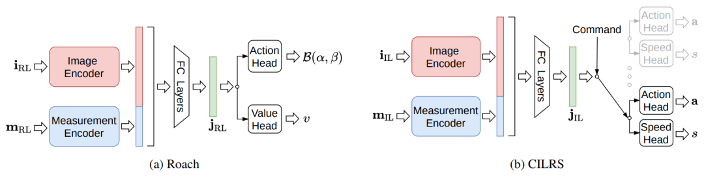

# Roach 论文解析：用强化学习 Coach 教会端到端城市驾驶

> 论文：[End-to-End Urban Driving by Imitating a Reinforcement Learning Coach](https://openaccess.thecvf.com/content/ICCV2021/html/Zhang_End-to-End_Urban_Driving_by_Imitating_a_Reinforcement_Learning_Coach_ICCV_2021_paper.html)  
> 作者：Zhejun Zhang, Alexander Liniger, Dengxin Dai, Fisher Yu, Luc Van Gool  
> 发表：ICCV 2021，2021  
> 领域：端到端自动驾驶、规划、强化学习/多模态模型相关方向

## 🌟 引言

端到端驾驶常依赖人类示范做 imitation learning，但人类轨迹不是密集的 on-policy 教练信号，模型一旦偏离专家分布就容易失控。Roach 的思路很直接：先在仿真里训练一个更强、更稳定的 RL 专家，再让视觉学生模仿它。

## 🧩 背景与动机

🔍 这篇工作的背景可以放在自动驾驶范式迁移中理解：从模块化流水线，到多任务联合，再到更强的端到端训练。它要解决的不是单一 perception 指标，而是驾驶系统在闭环规划、长尾场景、实时推理或可扩展训练上的瓶颈。

我的理解是，这类论文最值得关注的地方不在“端到端”这个标签本身，而在它具体选择了什么中间表示、训练信号和系统接口。真正有价值的端到端方法，应该让信息流更顺、更贴近规划目标，而不是简单把模块边界藏进一个大网络里。

## 🛠️ 方法详解

⚙️ Roach 的 Coach 使用 CARLA 中可获得的鸟瞰语义和结构化状态，通过强化学习学习连续控制；Student 只使用单目摄像头输入，通过行为克隆和特征监督学习 Coach 的决策。这个师生设计把训练期特权信息转化为部署期可用的视觉策略能力。

从图 1 可以看出，论文的核心设计通常围绕输入表示、任务交互和规划输出展开。相比传统流水线，这类方法更强调跨任务共享、闭环反馈或统一 token/query 表示；相比纯黑盒控制，它又尽量保留可解释的结构，让模型失败时能追踪原因。

## 📈 实验结果

📊 论文在 NoCrash-dense 和 CARLA Leaderboard 上展示出强泛化能力，尤其强调从新城镇、新天气迁移时，RL Coach 提供的监督比普通规则专家或人类示范更有效。实验的重点不是 RL 直接部署，而是 RL 作为高质量教师改善 IL。

实验分析时我更关注两个问题：第一，指标提升是否直接对应驾驶安全和规划质量；第二，方法是否把计算、延迟、训练成本也纳入讨论。自动驾驶论文如果只在开环误差上好看，但闭环碰撞、违规或实时性不稳定，工程价值会明显打折。

## 💡 亮点总结

✨ 这篇论文的主要亮点可以概括为三点：

- 它围绕自动驾驶的核心瓶颈提出了明确的结构设计，而不是只做模型规模扩展。
- 它把表示学习、任务协同和规划目标联系起来，体现了端到端系统设计的整体性。
- 它通过关键图表和实验结果说明该设计确实影响了驾驶质量、效率或泛化能力。

## ⚖️ 局限性与思考

⚠️ 方法依赖仿真环境和特权信息，现实数据上能否构造同等质量的 Coach 是难点；同时 Student 的表现仍受感知误差和仿真到现实迁移影响。

更进一步看，自动驾驶里的端到端路线仍需要面对三类问题：数据覆盖是否足够、闭环训练是否可靠、部署时能否满足安全与实时约束。因此，这篇论文更适合作为理解某条技术路线的关键节点，而不是最终答案。

## ✅ 结语

Roach 的核心价值是提出“RL 专家教 IL 学生”的端到端驾驶范式，让强化学习成为更好的监督源。
