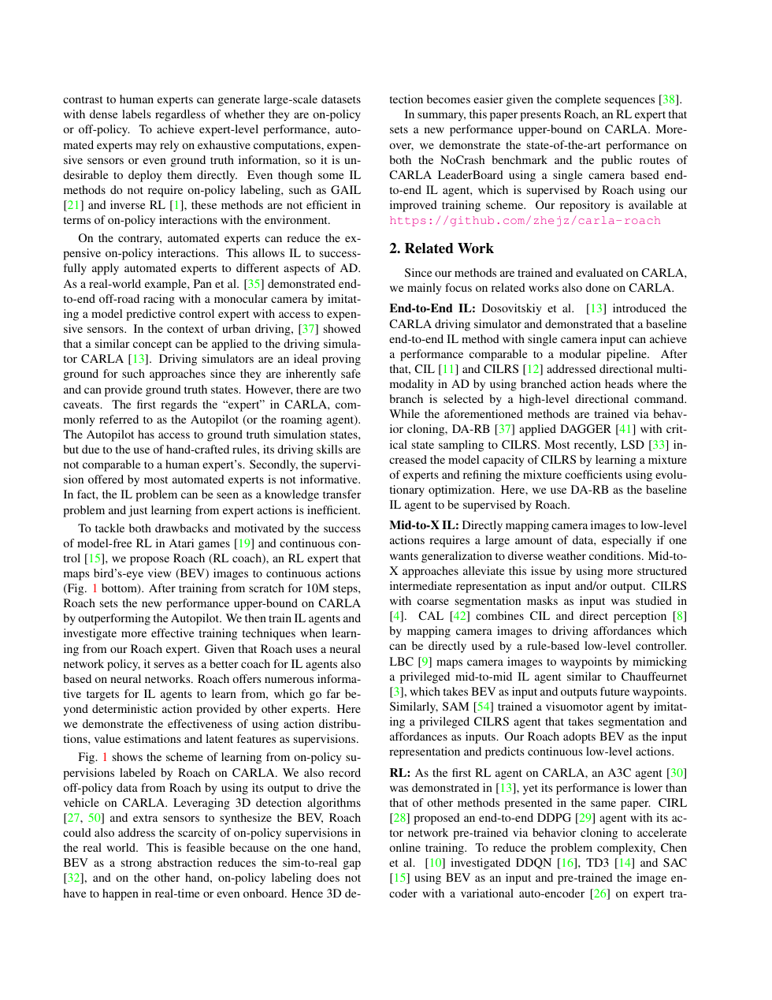
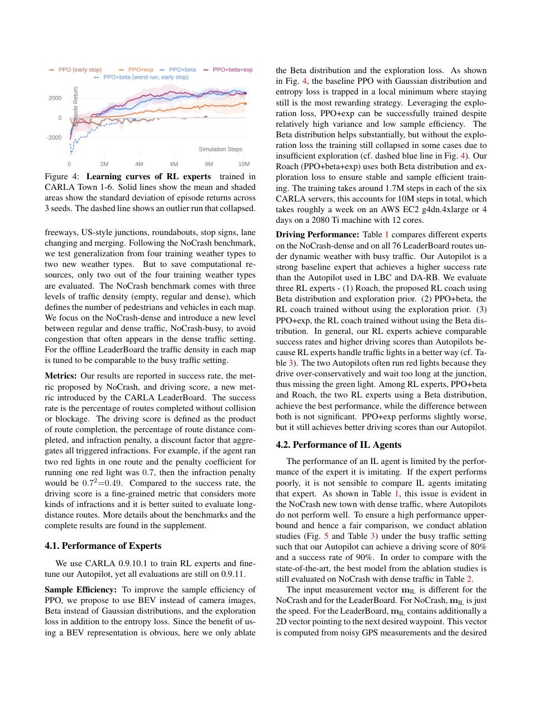

# Roach 论文解析：用强化学习 Coach 教会端到端城市驾驶

> 论文：[End-to-End Urban Driving by Imitating a Reinforcement Learning Coach](https://www.research-collection.ethz.ch/handle/20.500.11850/517031)  
> 作者：Zhejun Zhang, Alexander Liniger, Dengxin Dai, Fisher Yu, Luc Van Gool  
> 发表：ICCV 2021  
> 关键词：强化学习、模仿学习、CARLA、师生蒸馏、端到端驾驶

## 🌟 引言

Roach 是自动驾驶强化学习方向的一篇经典论文。它的核心观点很有意思：人类是好司机，但未必是好老师。端到端模型需要的是密集、稳定、on-policy 的监督信号，而人类示范通常稀疏且只覆盖正常驾驶分布。当模型犯错偏离轨迹时，人类数据并不会告诉它如何恢复。

Roach 选择先在仿真器中训练一个强化学习专家 Coach，再让只看摄像头的学生模型去模仿这个 Coach。这样，RL 并不直接部署到车上，而是作为更强的监督源，为 imitation learning 提供高质量教学信号。

## 🧩 背景与核心问题

🔍 城市驾驶场景中，纯 imitation learning 容易遇到 distribution shift：训练时只看专家轨迹，测试时一旦偏离专家状态，就会遇到训练集中没有见过的状态，错误继续放大。另一方面，直接训练视觉 RL 又非常困难，因为图像输入维度高、奖励稀疏、探索成本大。

Roach 的折中思路是：训练时让 Coach 使用仿真器中的特权 BEV 信息，先学到强策略；部署时让 Student 只依赖单目摄像头，通过模仿 Coach 获得接近专家的能力。

## 🛠️ 方法详解

⚙️ Roach 包含两个阶段。第一阶段是 RL Coach 训练。Coach 输入 bird's-eye-view semantic image，包括道路、车道、车辆、行人等结构化信息，并输出连续低层控制。由于 Coach 拥有特权信息，状态更紧凑，RL 学习难度大幅降低。

第二阶段是 Student 模仿。Student 输入普通前视摄像头图像，学习 Coach 的动作和中间表示。这里的关键不是简单行为克隆人类驾驶，而是模仿一个已经在仿真器中通过探索学会纠错的 RL 专家。Coach 还能生成 on-policy/off-policy 数据，覆盖更多偏离正常轨迹后的恢复状态。

🧠 这套设计本质上把“训练期可用但部署期不可用”的特权信息蒸馏进视觉模型，是后续很多 privileged learning 驾驶方法的重要来源。

## 📈 实验结果与图表分析

📊 Roach 在 CARLA NoCrash-dense 和 CARLA Leaderboard 上进行评测。根据论文摘要，Student 在新城镇和新天气的 NoCrash-dense 上达到 78% success rate，并在 CARLA Leaderboard public routes 上取得当时 SOTA 表现。

这些实验说明两个结论。第一，RL Coach 自身建立了较强的仿真驾驶上界。第二，模仿 Coach 的视觉 Student 明显优于普通 imitation baseline，证明“老师的质量”对端到端驾驶非常关键。消融结果通常也显示，去掉特征蒸馏或只模仿动作会降低泛化能力。

## 💡 亮点总结

✨ Roach 的重要性在于它重新定义了 RL 在端到端驾驶中的角色。RL 不一定要直接上车，也可以先作为专家教师；特权信息不一定要部署时存在，也可以通过蒸馏转化为视觉策略能力。

## ⚖️ 局限性与思考

⚠️ Roach 的主要限制来自仿真依赖。Coach 的能力建立在 CARLA 可提供真实语义 BEV 的前提下，现实世界中构建等价特权状态并不容易。其次，仿真到现实的 visual gap 仍会影响 Student。最后，CARLA 成功不等同于真实道路安全，尤其是对罕见交通参与者和非标准行为的覆盖仍有限。

但从研究脉络看，Roach 很关键：它把 RL、IL、privileged learning 三者结合起来，为后续 Think2Drive、Raw2Drive 这类世界模型 RL 方法奠定了思路。

## 🔬 进一步拆解：Coach 到 Student 的知识到底是什么

Roach 中 Student 学到的不只是动作标签。Coach 在 BEV 特权输入上训练得到的策略，隐含了对道路结构、动态障碍、交通规则和恢复动作的理解。Student 通过模仿 Coach，把这些结构化知识压缩进视觉特征中。

这和普通 imitation learning 的区别很大。普通 IL 的监督来自专家轨迹，数据主要覆盖专家正常驾驶状态；Roach 的 Coach 可以在仿真器中生成更多 on-policy/off-policy 行为，包含偏离轨迹后的恢复过程。因此 Student 看到的是更适合训练机器策略的监督，而不是单纯复制人类轨迹。

从今天看，Roach 的思想仍然很现代：训练期使用更强信息源，部署期保持输入简洁。这一思路后来在 privileged world model、teacher-student distillation、raw sensor policy training 中反复出现。

## 🧭 阅读建议：读这篇论文时应关注什么

如果把这篇论文作为精读材料，我建议不要只看 abstract 和主结果表，而是按三条线阅读。第一条线是表示：论文如何把原始传感器、地图、agent 状态或语言信息转成模型可处理的内部变量；这决定了方法的归纳偏置。第二条线是训练信号：模型到底从 imitation、reinforcement、world model、diffusion objective 还是多任务监督中获得能力；这决定了它能否处理分布偏移和长尾状态。第三条线是评测：开环误差、闭环驾驶分数、碰撞率、违规率、FPS 和消融实验分别回答不同问题，不能只看一个指标。

对自动驾驶论文来说，最值得警惕的是“指标漂亮但系统边界不清”。一篇真正有价值的工作，应该能说明它在哪些场景有效、依赖哪些输入假设、失败时可能来自哪个模块，以及它离真实部署还有哪些距离。按照这个标准看，上述论文都不是最终答案，但它们各自在表示、训练或系统架构上推进了端到端自动驾驶的一块拼图。

## ✅ 结语

Roach 的核心价值是提出“RL 专家指导 IL 学生”的端到端驾驶训练范式，让强化学习成为更高质量的监督来源。
