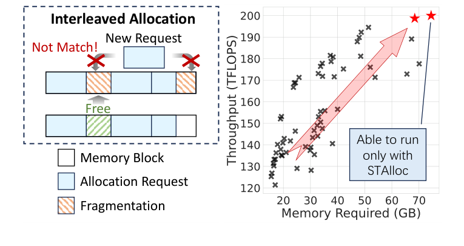
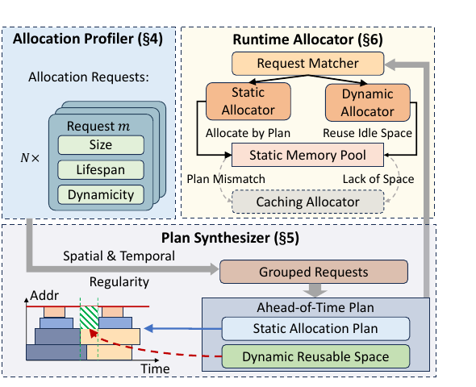
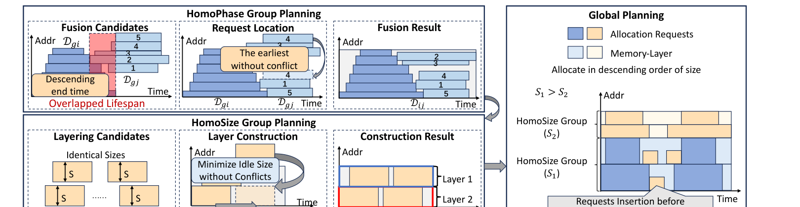
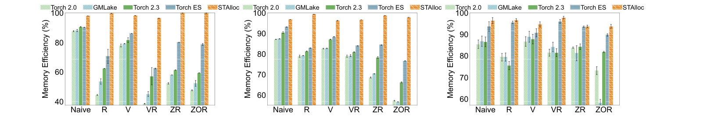
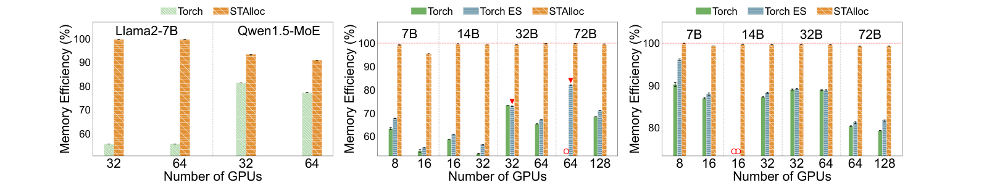
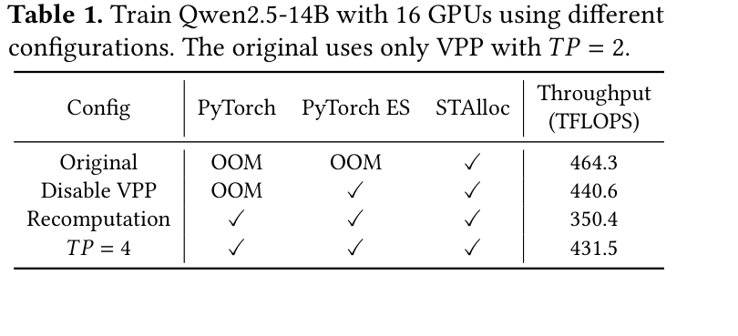
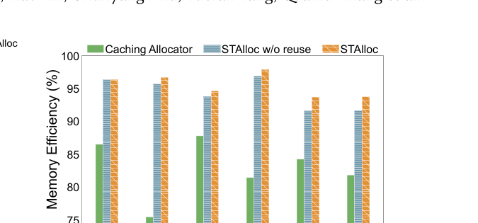

# STAlloc 论文解析：用张量生命周期规划 GPU 显存，而不是等碎片发生

## 📖 论文信息

- **标题**：[STAlloc: Enhancing Memory Efficiency in Large-Scale Model Training with Spatio-Temporal Planning](https://doi.org/10.1145/3767295.3769335)
- **GitHub**：[infinigence/STAlloc](https://github.com/infinigence/STAlloc)
- **作者**：Zixiao Huang, Junhao Hu, Hao Lin, Chunyang Zhu, Yueran Tang, Quanlu Zhang, Zhen Guo, Zhenhua Li, Shengen Yan, Zhenhua Zhu, Guohao Dai, Yu Wang
- **单位**：Tsinghua University；Infinigence AI；Shanghai Jiao Tong University
- **会议**：EuroSys 2026

## ✦ 核心洞察与挑战

### 核心问题

- **OOM 不等于活跃张量占满 HBM**：PyTorch caching allocator 等在线分配器可能产生严重碎片，论文观察到最高 43% 显存被浪费。
- **训练优化会加剧碎片**：recomputation、Virtual Pipeline、ZeRO、offload 会打乱 allocation/free 顺序，让原本阶段性的生命周期变成交错模式。

> 关键判断：显存碎片的根因不是缺少更复杂的 best-fit，而是 allocator 在分配时不知道张量未来何时释放。

### 传统方案局限

- **在线 allocator 只看当前 free block**：它能找到眼前最合适的空块，却无法从全局时间轴判断这次分配会不会制造长期空洞。
- **虚拟内存整理有运行时成本**：动态 MoE 等场景可能频繁触发映射/重映射操作，碎片降低了，但训练吞吐反而大幅下降。

> 关键判断：大模型训练虽然由动态图框架执行，但固定训练配置下的 memory request 在相邻 iteration 间高度重复，可以被提前规划。

## 研究动机

STAlloc 的动机是把 GPU 显存分配从“运行时临场决策”改成“稳定主干离线规划 + 动态尾部在线兜底”。对于 size、phase、lifespan 高度重复的请求，系统提前生成静态地址计划；对于 MoE expert activation 等动态请求，系统预先找出静态计划里的可复用时空区域，运行时再做局部分配。

> 关键判断：稳定的大头适合 ahead-of-time planning，不确定的尾部适合 online allocation；两者混合比纯在线或纯静态都更贴近大模型训练。

## 方法论（主要模块简介）

- **Allocation Profiler**：采集 size、allocation/free timestamp、forward/backward phase、microbatch、module 和动态性。
- **Plan Synthesizer**：利用 HomoPhase 与 HomoSize 分组，把 NP-hard 的动态存储规划拆成可处理的局部计划和全局合并。
- **Runtime Allocator**：静态请求按计划返回地址，动态请求优先复用静态计划空洞，异常或未见过请求 fallback 到 PyTorch caching allocator。

> 关键判断：STAlloc 本质上是一个 spatio-temporal allocator，它把张量的空间大小和时间生命周期同时纳入显存地址规划。

## 🌟 引言：显存碎片也是训练系统的吞吐瓶颈

大模型训练中的 OOM 经常被解释为“模型太大”或“batch 太大”。但 STAlloc 这篇论文指出，框架报告的 reserved memory 和真正活跃 tensor 占用之间可能存在很大差距。PyTorch caching allocator 为了减少 `cudaMalloc` 开销，会预留大块显存并按 best-fit 切分；当 allocation 与 free 交错发生时，空闲显存可能被切成很多无法满足新请求的小块。

🔍 **图 1 很好地解释了论文主线**：左侧示意图说明，显存明明有空闲块，但它们不连续，无法满足新请求；右侧散点图则说明更高吞吐的训练配置往往需要更多显存，一旦碎片推高实际占用，这些配置会直接 OOM。此时用户不得不关闭 Virtual Pipeline、增加 tensor parallelism 或启用 recomputation，吞吐随之下降。

STAlloc 的核心观点是：大模型训练不是完全不可预测的动态程序。固定模型、batch、并行度和优化策略后，张量的 size、phase 和 lifespan 在 iteration 之间非常稳定。既然 allocator 的输入高度重复，就不应每次都在线“猜”地址，而应提前规划大部分稳定请求。

## 🧩 背景与动机：训练优化为什么会让 allocator 更困难

Recomputation、tensor offload、ZeRO 和 Virtual Pipeline 本来都是为了降低理论显存或提高吞吐，但它们会改变张量生命周期：

- recomputation 让 activation 在 forward 后尽快释放，backward 时重新生成；
- Virtual Pipeline 增加交错 microbatch 和 stage 调度；
- offload 在 CPU/GPU 间移动 tensor；
- ZeRO 改变参数、梯度和 optimizer state 的驻留方式。

论文观察到，启用这些技术后 allocation request 数量可增加约 30%，分配与释放从较规则的阶段性序列变成复杂交错模式。在线 best-fit 只知道“现在有什么空块”，不知道“这个 tensor 何时释放”，因此可能把短命 tensor 放到不合适的位置，留下后续无法合并的空洞。

这也是 STAlloc 和传统 defragmentation 方法的分水岭：它不等碎片产生后再搬迁或映射，而是利用训练的周期性，在碎片出现前就规划地址布局。

## 🛠️ 方法详解：离线规划稳定主干，在线处理动态尾部

### 1. 三阶段架构：Profiler、Plan Synthesizer、Runtime Allocator

🖼️ **图 5 是理解 STAlloc 的架构主图。** 左上角 Allocation Profiler 记录每个 request 的 size、lifespan 和 dynamicity；下方 Plan Synthesizer 根据时空规律生成 `Static Allocation Plan` 和 `Dynamic Reusable Space`；右上角 Runtime Allocator 在训练时先通过 Request Matcher 判断请求是否能匹配静态计划，能匹配就直接返回预定地址，不能匹配则尝试动态复用空间，仍不满足时 fallback 到 caching allocator。

这个 fallback 设计非常重要。STAlloc 并不假设训练完全静态，而是让大部分稳定请求走低碎片路径，让动态请求仍保留正确性和兼容性。

### 2. Allocation Profiler：记录训练语义而不是只记录地址

Profiler 会将一次 allocation 和对应 free 合并为 memory request event，记录 size、allocation/free timestamp、forward/backward phase、microbatch ID、发起请求的 module，以及是否来自 MoE expert 等动态层。

这些语义比裸 trace 更有价值。单看地址和时间，系统很难知道两个请求为什么会重复；而 module、phase、microbatch 可以揭示跨 iteration 稳定的生命周期模式。论文还将 tensor 分为三类：persistent tensor 生命周期很长；scoped tensor 通常从 forward 保留到 backward；transient tensor 和算子中间结果则非常短命。

### 3. Plan Synthesizer：把 NP-hard 问题拆成可处理的分组规划

静态地址规划属于 Dynamic Storage Allocation 问题，是 NP-hard。大模型单个 iteration 的请求数可以超过 $10^5$，直接求全局最优并不可行。STAlloc 的做法是利用两类规律降低复杂度：HomoPhase 负责时间维度，HomoSize 负责空间维度。

⚙️ **图 6 展示了 Plan Synthesizer 的核心逻辑。** HomoPhase Group 将 allocation/free 发生在相同计算 phase 的请求归组，组内 tensor 生命周期高度重叠，因此连续紧密排列通常接近局部最优。系统还会尝试融合相邻 phase group，并用 time-memory product（TMP）判断融合是否减少时空气泡。

HomoSize Group 则聚合 size 相同的请求，并按开始时间构建 memory layer。同一 layer 中的请求生命周期不重叠，因此可以复用同一地址范围。全局规划按 size 从大到小进行，小请求优先填入大请求局部计划留下的空隙，避免过早切碎大块空间。

### 4. 动态请求：提前找空间，运行时再决定

MoE expert activation 的大小取决于 token routing，无法在离线阶段绑定精确地址。STAlloc 根据 module 和 phase 聚合动态请求，推断其出现时间窗口，然后扫描静态计划在这些窗口内未使用的地址区域，形成 `Dynamic Reusable Space`。

运行时，Static Allocator 处理稳定请求；Dynamic Allocator 优先在 reusable space 中寻找位置；计划不匹配、空间不足或未见过的请求退回 PyTorch caching allocator。这个混合范式让 STAlloc 在 dense model 和 MoE model 上都能工作，而不是为了追求纯静态计划牺牲动态模型支持。

## 📈 实验结果：碎片下降最终转化为可运行的高吞吐配置

论文在 NVIDIA A800、H200 和 AMD MI210 上评测，覆盖 GPT-2、Llama2-7B、Qwen1.5-MoE、Qwen2.5 7B/14B/32B/72B，以及 recomputation、Virtual Pipeline、ZeRO、offload 等组合。基线包括 PyTorch caching allocator、PyTorch expandable segments 和 GMLake。

### 总体显存效率

📊 **图 8 是总体结果的核心证据。** 对 dense model，STAlloc 的 memory efficiency 超过 95%，最高达到 100%；而 PyTorch 2.3 在不同组合下为 57.1%–90.6%，GMLake 为 45.1%–88.1%，PyTorch expandable segments 为 62.4%–93.2%。对动态 MoE，STAlloc 仍达到 93.7%–97.8% memory efficiency，平均 fragmentation ratio 约 4.3%。

论文总结的总体结论是：STAlloc 平均减少 85.1% 碎片显存，最高 100%，最多节省 56.3 GB GPU memory，并且对端到端吞吐几乎没有可见开销。

### 跨 GPU 平台和规模扩展

📈 **图 9 说明 STAlloc 的收益不是单节点偶然现象。** 在 H200 recomputation 实验中，STAlloc 达到 99.1% memory efficiency，相对 PyTorch 和 expandable segments 分别减少约 98.5% 和 98.4% 碎片，平均节省 37.9 GB，最多 56.3 GB。Virtual Pipeline 场景中，STAlloc 在所有配置上都超过 99% efficiency；随着模型和集群扩大，PyTorch 与 expandable segments 的效率分别下降 10.9 和 15.0 个百分点，而 STAlloc 只波动约 0.7 个百分点。

这说明 STAlloc 的时空规划并没有被更大模型和更多 GPU 轻易破坏，它抓到的是 iteration-level 的稳定结构，而不是某个小模型的巧合模式。

### 显存收益如何变成吞吐收益

🚀 **表 1 是最有工程意义的结果。** 在 Qwen2.5-14B、16 GPU 案例中，原始 Virtual Pipeline 配置只有 STAlloc 能运行，吞吐为 464.3 TFLOPS。PyTorch 和 PyTorch ES 为避免 OOM，必须关闭 VPP、启用 recomputation 或把 TP 从 2 提高到 4，吞吐分别降为 440.6、350.4 和 431.5 TFLOPS。

因此，STAlloc 的最大价值不是让 allocator hot path 快一点，而是扩展了“可运行训练配置”的空间。显存碎片减少后，用户可以保留吞吐更高的并行策略，而不是为了绕过 OOM 退回更慢配置。

### 静态计划和动态复用分别贡献什么

🔍 **图 13 的消融结果表明**，静态计划贡献了约 91% 的总碎片削减，因为静态 allocation 占总量 73.4%–99.3%。启用 Dynamic Reusable Space 后，又额外减少约 22.9% 碎片，尤其在 recomputation 场景中更有效：activation 在 forward 后释放，动态 tensor 可以复用静态池里的时空空洞。

同配置下，STAlloc 与 vanilla PyTorch 2.3 的吞吐差异小于 0.05%。这支持了论文的关键主张：离线规划降低碎片，运行时路径不应引入新的训练开销。

## 💡 亮点总结

- **问题抓得准**：STAlloc 把 OOM 从“理论显存不足”重新解释为“在线 allocator 缺少生命周期信息”。
- **方法结构清晰**：HomoPhase 和 HomoSize 分别利用时间规律与空间规律，把不可解的全局规划拆成可落地的局部规划。
- **兼容动态图现实**：动态请求不强行静态化，而是用 reusable space + fallback 保证正确性。
- **指标有工程意义**：不仅报告 fragmentation ratio，还展示了高吞吐配置能否运行。
- **系统落地较完整**：通过 PyTorch `PluggableAllocator` 接入，论文报告实现约 3100 行代码，并覆盖 NVIDIA/AMD 与 Megatron-LM/Colossal-AI。

## ⚖️ 局限性与思考

首先，STAlloc 依赖代表性 profile。sequence length、microbatch、并行度、routing 分布或控制流明显变化后，静态计划匹配率可能下降，fallback 路径会增加。

其次，profile 与 plan synthesis 有前置成本。论文表 2 显示，不同配置的 profile 约需 79–362 秒，plan synthesis 约需 22–374 秒。对持续数天的大模型训练，这一成本通常可以摊薄；但对短任务、频繁改配置的实验探索并不一定划算。

第三，它主要面向 iteration 模式稳定的训练。高度动态推理、多租户共享 HBM、shape 长期漂移明显的 workload，未必适合直接套用这种静态规划范式。

最后，预先绑定地址可能与 CUDA Graph、通信 buffer、第三方 kernel workspace 或其它显存管理器产生复杂交互。论文展示了 PyTorch 生态里的可行性，但更广泛系统组合仍需要谨慎验证。

## ✅ 结语

STAlloc 揭示了显存碎片的另一个视角：它不只是空间被切碎，更是在线 allocator 丢失了时间信息。大模型训练虽然运行在动态图框架中，但固定配置下的张量生命周期高度重复；如果系统愿意在训练前花几分钟理解这些规律，就能在后续长时间训练中持续减少浪费。

对 AI Infra 来说，这篇论文的启示很直接：对于稳定、长时间运行的训练负载，最有效的运行时优化可能并不发生在运行时。离线规划稳定主干，在线处理动态尾部，往往比让每次分配都从零决策更高效。
