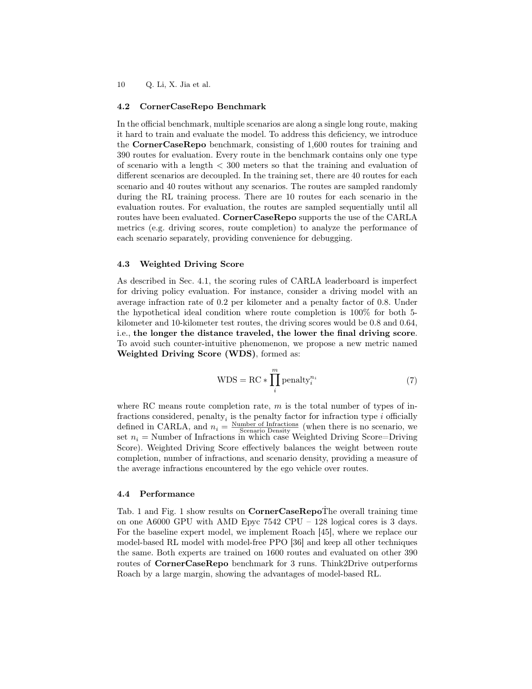
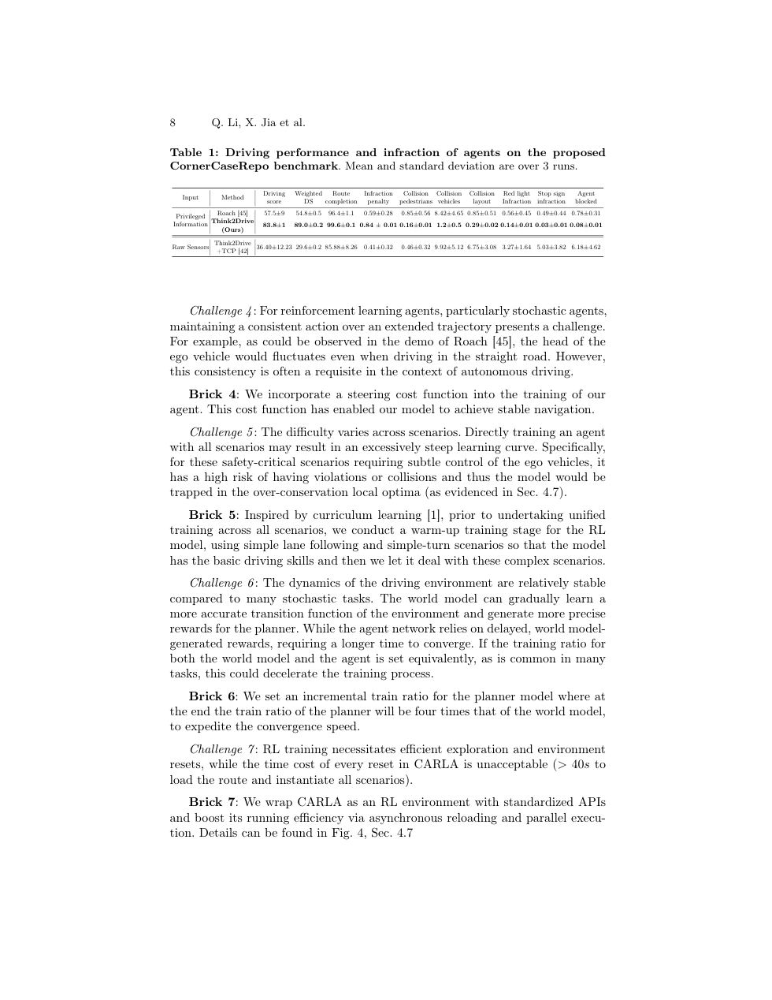

# Think2Drive 论文解析：在潜在世界模型中高效训练自动驾驶 RL

> 论文：[Think2Drive: Efficient Reinforcement Learning by Thinking in Latent World Model for Quasi-Realistic Autonomous Driving](https://huggingface.co/papers/2402.16720)  
> 作者：Qifeng Li, Xiaosong Jia, Shaobo Wang, Junchi Yan  
> 发表：ECCV 2024  
> 关键词：模型基强化学习、世界模型、CARLA v2、Corner Case、端到端驾驶

## 🌟 引言

Think2Drive 解决的是自动驾驶强化学习中最棘手的问题之一：闭环试错有价值，但在真实仿真器中太慢。强化学习可以缓解 imitation learning 的分布偏移和 causal confusion，但如果每一步都要在 CARLA 这类复杂仿真器里交互，训练成本会非常高，尤其是在 CARLA v2 引入更多复杂事件和 corner cases 之后。

这篇论文的答案是模型基强化学习：先学习一个潜在世界模型，再让策略在 latent space 中“思考”和训练。换句话说，自动驾驶 agent 不必每次都回到慢速物理仿真器中试错，而是在学到的环境模型里进行大量快速 rollout。

## 🧩 背景与核心问题

🔍 传统无模型 RL 的问题是样本效率低，而自动驾驶场景中的失败事件又往往稀有但关键。CARLA v2 增加了更接近现实城市驾驶的事件组合，意味着简单规则规划或过拟合策略很难覆盖所有情况。

Think2Drive 关注两个目标：第一，能否在有限算力下训练出可处理复杂事件的驾驶策略；第二，世界模型是否能提供足够可靠的 imagined experience，让策略真正学会闭环纠错，而不是只在幻觉环境里自我欺骗。

## 🛠️ 方法详解

⚙️ Think2Drive 的核心是 latent world model。模型学习从当前 latent state 和动作预测未来 latent state、奖励和终止信号。策略网络不直接在原始仿真环境中完成所有探索，而是在世界模型生成的潜在轨迹上优化。

论文还加入了若干自动驾驶专用设计。第一，世界模型不是为了生成高保真图像，而是为了保留决策相关状态，因此 latent 表示要服务控制。第二，训练过程强调 parallel imagination，使多个 imagined rollout 可以并行产生，提高样本效率。第三，针对 CARLA v2 中复杂事件，模型需要把道路结构、交通参与者交互和违规/碰撞反馈纳入奖励建模。

🧠 我的理解是，Think2Drive 的重点不是“世界模型能不能预测所有视觉细节”，而是“它能不能预测足以影响驾驶决策的动态规律”。对 RL 来说，世界模型的价值体现在策略改进，而不是图像重建质量。

## 📈 实验结果与图表分析

📊 论文报告 Think2Drive 能在单张 GPU 上约 3 天完成训练，并在 CARLA v2 及 CornerCaseRepo 等复杂基准上优于无模型 RL 基线。结果图中通常会同时关注 route completion、driving score、collision/violation 等指标。

这里最重要的结论是效率和闭环表现同时提升。若模型只提升训练速度但牺牲安全性，意义有限；若只在小规模场景上成功，也无法说明世界模型路线可扩展。Think2Drive 的实验价值在于展示模型基 RL 可以在更复杂的 quasi-realistic driving benchmark 上工作。

## 💡 亮点总结

✨ Think2Drive 的亮点有三点。

- 把模型基 RL 引入 CARLA v2 复杂自动驾驶任务，证明 latent world model 可用于闭环驾驶训练。
- 用 imagined rollout 大幅降低与慢速仿真器交互的成本。
- 将训练效率、复杂事件处理和驾驶安全指标放在同一评估框架中讨论。

## ⚖️ 局限性与思考

⚠️ 世界模型路线的风险也很清楚：如果模型在关键交互上预测错误，策略会在错误世界中学到错误动作。尤其是长尾交通行为、突发动态障碍和极端天气，可能超出训练分布。另一个问题是，CARLA v2 仍然是仿真环境，和真实道路之间存在视觉、动力学和行为分布差异。

因此，Think2Drive 更适合作为自动驾驶 RL 的训练效率突破，而不是直接证明现实可部署。它为后续 Raw2Drive、RAD 这类更接近原始传感器或光真实环境的工作提供了基础。

## 🔬 进一步拆解：世界模型训练的关键不是还原画面

在自动驾驶场景中，世界模型很容易被误解为“生成未来图像”。Think2Drive 更关心的是决策相关预测：如果采取某个动作，未来状态、奖励、碰撞风险和任务进展会怎样变化。只要 latent state 能保留这些信息，它不必生成视觉上完美的未来帧。

这一区分非常重要。图像级预测会把大量容量花在纹理、光照和背景细节上，而驾驶策略真正需要的是道路拓扑、其他 agent 动态、自车可行空间和违规反馈。Think2Drive 用 latent world model 把训练重点放在控制相关因素上，因此能获得更高样本效率。

不过，世界模型误差会随着 rollout 长度积累。短期预测准确不代表长期决策可靠，所以论文中的训练效率提升必须和闭环驾驶分数一起看。只有当 imagined rollout 改善真实仿真器表现时，世界模型才真正服务了 RL。

## 🧭 阅读建议：读这篇论文时应关注什么

如果把这篇论文作为精读材料，我建议不要只看 abstract 和主结果表，而是按三条线阅读。第一条线是表示：论文如何把原始传感器、地图、agent 状态或语言信息转成模型可处理的内部变量；这决定了方法的归纳偏置。第二条线是训练信号：模型到底从 imitation、reinforcement、world model、diffusion objective 还是多任务监督中获得能力；这决定了它能否处理分布偏移和长尾状态。第三条线是评测：开环误差、闭环驾驶分数、碰撞率、违规率、FPS 和消融实验分别回答不同问题，不能只看一个指标。

对自动驾驶论文来说，最值得警惕的是“指标漂亮但系统边界不清”。一篇真正有价值的工作，应该能说明它在哪些场景有效、依赖哪些输入假设、失败时可能来自哪个模块，以及它离真实部署还有哪些距离。按照这个标准看，上述论文都不是最终答案，但它们各自在表示、训练或系统架构上推进了端到端自动驾驶的一块拼图。

## ✅ 结语

Think2Drive 的核心价值在于证明自动驾驶 RL 可以通过潜在世界模型变得高效可训练，为复杂闭环驾驶策略学习提供了一条可行路线。
