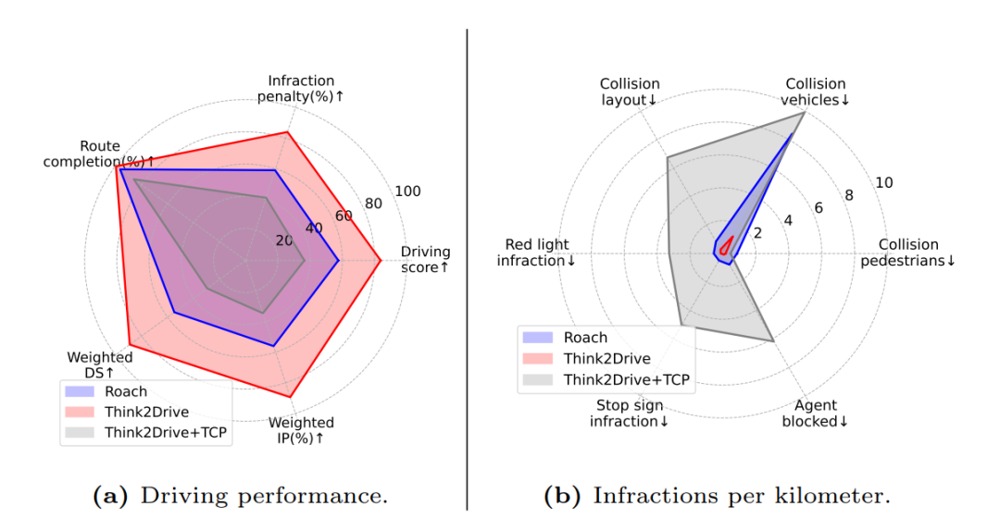

# Think2Drive 论文解析：在潜在世界模型中高效训练自动驾驶 RL

> 论文：[Think2Drive: Efficient Reinforcement Learning by Thinking in Latent World Model for Quasi-Realistic Autonomous Driving](https://huggingface.co/papers/2402.16720)  
> 作者：Qifeng Li, Xiaosong Jia, Shaobo Wang, Junchi Yan  
> 发表：ECCV 2024 / arXiv，2024  
> 领域：端到端自动驾驶、规划、强化学习/多模态模型相关方向

## 🌟 引言

强化学习适合解决模仿学习的分布偏移，但在自动驾驶仿真器中直接试错成本很高。Think2Drive 的关键问题是：能否先学一个可用于想象推演的世界模型，再在潜在空间里训练驾驶策略。

## 🧩 背景与动机

🔍 这篇工作的背景可以放在自动驾驶范式迁移中理解：从模块化流水线，到多任务联合，再到更强的端到端训练。它要解决的不是单一 perception 指标，而是驾驶系统在闭环规划、长尾场景、实时推理或可扩展训练上的瓶颈。

我的理解是，这类论文最值得关注的地方不在“端到端”这个标签本身，而在它具体选择了什么中间表示、训练信号和系统接口。真正有价值的端到端方法，应该让信息流更顺、更贴近规划目标，而不是简单把模块边界藏进一个大网络里。

## 🛠️ 方法详解

⚙️ Think2Drive 构建 latent world model 学习环境转移，让策略不必每一步都回到 CARLA 中慢速交互。论文还围绕驾驶任务加入若干 domain-specific bricks，用于提升探索、稳定性和样本效率，并在复杂 corner cases 上训练规划器。

从图 1 可以看出，论文的核心设计通常围绕输入表示、任务交互和规划输出展开。相比传统流水线，这类方法更强调跨任务共享、闭环反馈或统一 token/query 表示；相比纯黑盒控制，它又尽量保留可解释的结构，让模型失败时能追踪原因。

## 📈 实验结果

📊 论文报告其能在单张 GPU、约 3 天训练内处理 CARLA v2 的 39 类常见事件，并在 CornerCaseRepo 等基准上优于无模型 RL 基线。这里的关键结论是：世界模型不是为了生成漂亮视频，而是为了把闭环驾驶训练变成可承受的计算问题。

实验分析时我更关注两个问题：第一，指标提升是否直接对应驾驶安全和规划质量；第二，方法是否把计算、延迟、训练成本也纳入讨论。自动驾驶论文如果只在开环误差上好看，但闭环碰撞、违规或实时性不稳定，工程价值会明显打折。

## 💡 亮点总结

✨ 这篇论文的主要亮点可以概括为三点：

- 它围绕自动驾驶的核心瓶颈提出了明确的结构设计，而不是只做模型规模扩展。
- 它把表示学习、任务协同和规划目标联系起来，体现了端到端系统设计的整体性。
- 它通过关键图表和实验结果说明该设计确实影响了驾驶质量、效率或泛化能力。

## ⚖️ 局限性与思考

⚠️ 潜在世界模型的可靠性决定上限；如果模型错误地预测关键交互，策略可能在 imagined rollout 中学到错误经验。真实道路中的分布复杂度也远高于 CARLA。

更进一步看，自动驾驶里的端到端路线仍需要面对三类问题：数据覆盖是否足够、闭环训练是否可靠、部署时能否满足安全与实时约束。因此，这篇论文更适合作为理解某条技术路线的关键节点，而不是最终答案。

## ✅ 结语

Think2Drive 的价值在于证明模型基 RL 可以显著降低自动驾驶闭环训练成本，为后续世界模型驾驶研究打下基础。
