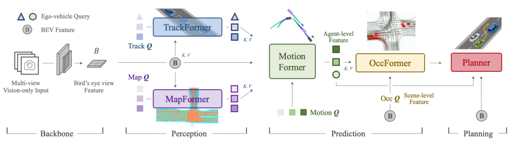
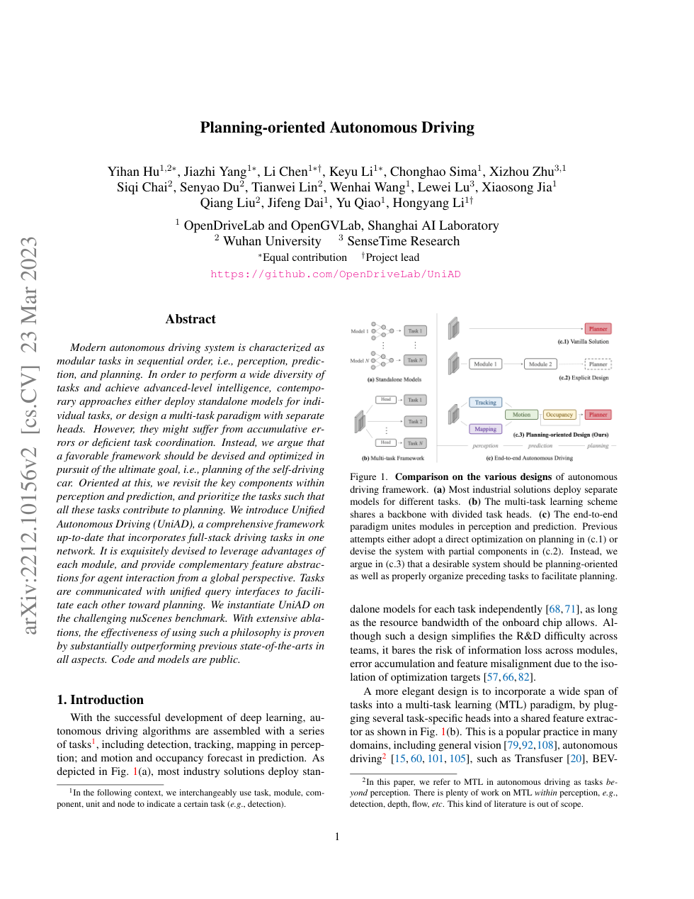
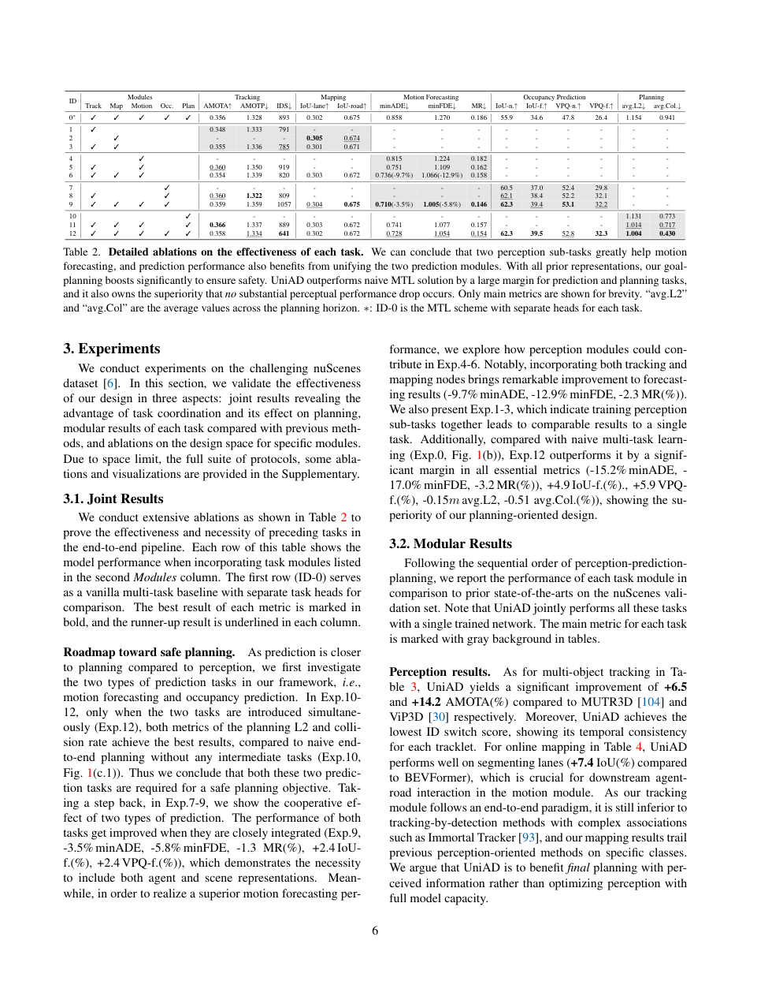

# UniAD 论文解析：以规划为导向统一感知、预测与规划

> 论文：[Planning-oriented Autonomous Driving](https://openaccess.thecvf.com/content/CVPR2023/html/Hu_Planning-Oriented_Autonomous_Driving_CVPR_2023_paper.html)  
> 作者：Yihan Hu, Jiazhi Yang, Li Chen 等  
> 发表：CVPR 2023 Best Paper  
> 关键词：端到端自动驾驶、规划导向、多任务学习、Transformer、nuScenes

## 🌟 引言

UniAD 是端到端自动驾驶领域很重要的一篇论文。它并不是简单地把感知、预测、规划几个模块拼到一个大网络里，而是提出了一个更明确的系统设计原则：自动驾驶最终服务的是自车规划，因此感知和预测任务也应该围绕规划目标来组织。

传统自动驾驶系统往往采用模块化流水线：先检测目标，再构建地图，再预测其他交通参与者运动，最后规划自车轨迹。这个设计工程上清晰，但问题也明显：前面模块的误差会层层传递，规划模块通常只能看到被压缩后的中间结果，无法回到原始传感器特征中纠错。UniAD 试图把这些任务统一到一个可端到端训练的框架中，同时保留中间任务的可解释性。

## 🧩 背景与核心问题

🔍 论文的核心问题可以概括为：如何在一个统一网络中协调感知、预测和规划，使所有中间任务真正服务于最终驾驶决策？

早期端到端方法经常直接从图像回归控制量或轨迹，这类方法结构简洁，但黑盒程度高，也难以定位错误。另一类多任务方法虽然共享 backbone，但每个任务头仍然相对独立，任务之间缺少显式协同。UniAD 的贡献在于将这些中间任务重新排序和连接：tracking、mapping、motion forecasting、occupancy prediction 依次提供不同层次的交通世界表征，最终由 planning module 消化这些表征生成自车轨迹。

## 🛠️ 方法详解

🧠 UniAD 的方法可以拆成五个相互衔接的模块。

首先是 TrackFormer，它负责建模动态目标。与单帧检测不同，tracking query 携带跨时间信息，使系统知道哪些目标是持续存在的交通参与者。其次是 MapFormer，它在线生成道路结构和车道级地图信息，为规划提供静态约束。接下来 MotionFormer 根据动态目标和地图关系预测多智能体未来运动。OccFormer 进一步把未来空间占用显式化，帮助 planner 判断哪些区域可能在未来被占用。最后是 planning head，结合自车状态、导航信息和前面模块的输出，预测未来自车轨迹。

⚙️ 这里最关键的是统一 query 接口。query 不只是 Transformer 的内部变量，而是模块之间传递驾驶语义的载体。track query 表示动态 agent，map query 表示地图元素，motion/occupancy query 表示未来交互和空间风险。这样的设计让任务间的信息不是通过硬编码接口传递，而是在端到端训练中学习如何服务规划。

## 📈 实验结果与图表分析

📊 UniAD 在 nuScenes 上报告了 detection、tracking、mapping、motion forecasting、occupancy prediction 和 planning 等多个任务指标。论文的重点不是某一个单项指标刷高，而是证明统一规划导向框架能让多个任务共同提升。

从实验表可以读出两层含义。第一，UniAD 在规划指标上相对传统串行或弱耦合方法更强，说明前置任务围绕规划目标组织是有效的。第二，中间任务指标没有因为统一框架而明显牺牲，这意味着论文并不是用更差的感知换更好的规划，而是在任务协同中获得整体收益。消融实验也支持这一点：去掉 motion、occupancy 或不同 query 连接方式，都会削弱最终规划表现。

## 💡 亮点总结

✨ UniAD 的结构性创新主要有三点。

- 它提出 planning-oriented 的系统哲学，把最终规划目标置于所有任务的上层约束。
- 它使用统一 query 接口连接多任务模块，让动态目标、地图、运动预测和占用预测能在同一个语义空间里协同。
- 它保留了可解释中间任务，因此比纯黑盒端到端更容易诊断错误，也更接近工程系统需要。

## ⚖️ 局限性与思考

⚠️ UniAD 并不是完全意义上的“无中间表示”端到端系统。它仍然依赖清晰设计的中间任务，训练流程复杂，对标注和评测体系也有较高要求。如果迁移到更开放的真实道路场景，地图、占用、预测模块的误差仍可能影响规划。另外，UniAD 主要是在 nuScenes 开环范式下评测，闭环驾驶中的恢复能力还需要更多验证。

我的理解是，UniAD 的最大价值不是告诉我们“所有东西都应该端到端”，而是给出了一个折中答案：端到端优化可以和可解释模块并存，关键是中间任务必须围绕最终规划目标重新组织。

## 🔬 进一步拆解：为什么 UniAD 不是简单多任务学习

很多多任务网络会共享 backbone，然后在末端接 detection、map、motion、planning 等 heads。UniAD 和这类方法的差异在于任务之间存在明确的信息递进。tracking 输出不是孤立结果，而是 motion forecasting 的基础；map 输出不仅用于评估地图质量，也参与未来轨迹和占用判断；occupancy prediction 则把多智能体未来行为转换成 planner 更容易消费的空间风险。

这种设计让 UniAD 具备较强的错误可追踪性。如果规划失败，可以检查是目标跟踪错了、地图结构错了、运动预测错了，还是 occupancy 风险估计错了。对真实工程系统来说，这一点比单纯的端到端黑盒更重要。

同时，UniAD 也说明端到端并不必然意味着取消所有中间语义。更合理的理解是：中间语义仍然存在，但它们不再是彼此割裂的工程接口，而是在统一训练目标下共同服务规划。

## 🧭 阅读建议：读这篇论文时应关注什么

如果把这篇论文作为精读材料，我建议不要只看 abstract 和主结果表，而是按三条线阅读。第一条线是表示：论文如何把原始传感器、地图、agent 状态或语言信息转成模型可处理的内部变量；这决定了方法的归纳偏置。第二条线是训练信号：模型到底从 imitation、reinforcement、world model、diffusion objective 还是多任务监督中获得能力；这决定了它能否处理分布偏移和长尾状态。第三条线是评测：开环误差、闭环驾驶分数、碰撞率、违规率、FPS 和消融实验分别回答不同问题，不能只看一个指标。

对自动驾驶论文来说，最值得警惕的是“指标漂亮但系统边界不清”。一篇真正有价值的工作，应该能说明它在哪些场景有效、依赖哪些输入假设、失败时可能来自哪个模块，以及它离真实部署还有哪些距离。按照这个标准看，上述论文都不是最终答案，但它们各自在表示、训练或系统架构上推进了端到端自动驾驶的一块拼图。

## ✅ 结语

UniAD 的核心价值在于把端到端自动驾驶从“直接回归轨迹”推进到“规划导向的全栈任务协同”，因此它仍是理解现代端到端自动驾驶架构绕不开的基准论文。
