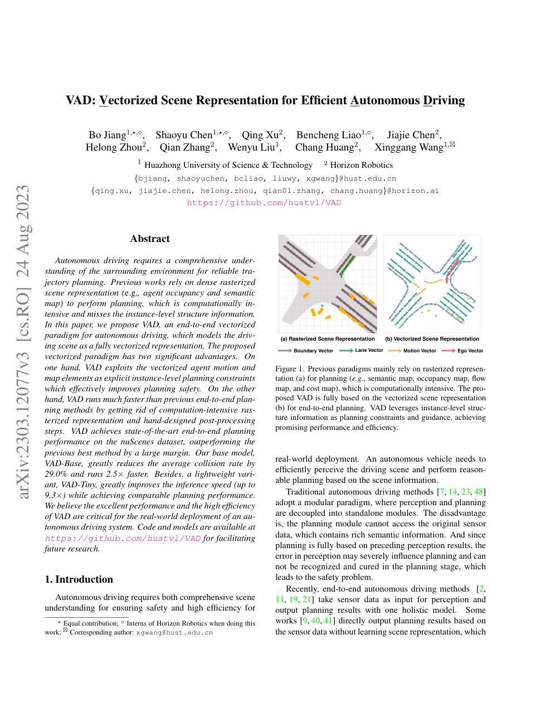
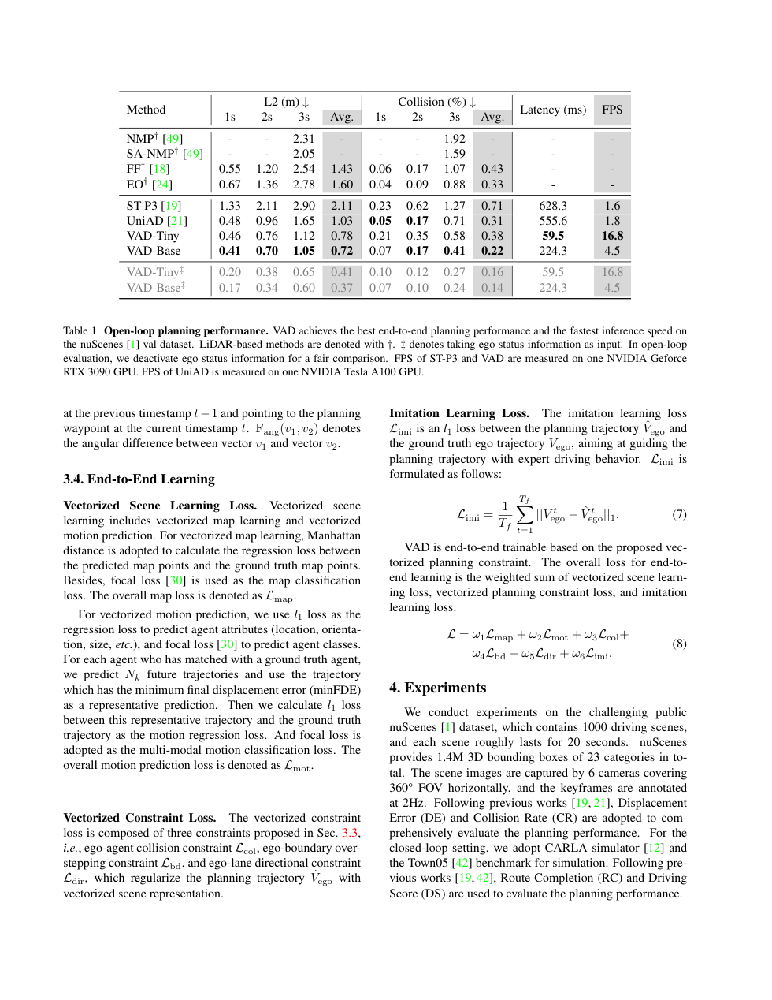

# VAD 论文解析：全矢量化场景表示如何提升端到端规划效率

> 论文：[VAD: Vectorized Scene Representation for Efficient Autonomous Driving](https://openaccess.thecvf.com/content/ICCV2023/html/Jiang_VAD_Vectorized_Scene_Representation_for_Efficient_Autonomous_Driving_ICCV_2023_paper.html)  
> 作者：Bo Jiang, Shaoyu Chen, Qing Xu, Bencheng Liao 等  
> 发表：ICCV 2023  
> 关键词：端到端自动驾驶、矢量化表示、规划约束、实时推理、nuScenes

## 🌟 引言

VAD 讨论的是端到端自动驾驶中一个很实际的问题：驾驶规划到底需要什么样的场景表示？许多方法把多视角图像投影到 BEV，并在 BEV 上构建稠密的语义图、占用图、cost map 或 flow map。这类光栅化表示直观，但计算开销大，而且会把车道线、道路边界、目标运动等实例级结构压平到像素网格中。

VAD 的核心观点是：规划任务不一定需要完整的稠密 BEV 图，它更需要可交互、可约束、可解释的结构对象。因此论文提出 fully vectorized scene representation，用 agent motion vector、lane vector、boundary vector 和 ego vector 表示驾驶场景。

## 🧩 背景与核心问题

🔍 VAD 要解决两个问题。第一，稠密 BEV 光栅表示计算重，不利于车端实时部署。第二，光栅图虽然保存空间分布，却弱化了道路元素和智能体运动的实例结构，规划器很难直接利用这些结构作为安全约束。

论文 Figure 1 对比了 rasterized representation 和 vectorized representation。前者把环境画成图，后者把环境抽象成一组几何向量。对规划来说，后者更接近真实决策所需信息：哪里是车道方向、哪里是边界、哪些交通参与者未来会经过哪些区域。

## 🛠️ 方法详解

⚙️ VAD 的 pipeline 可以分为四个阶段：图像 backbone 和 BEV encoder 先得到视觉特征；Vectorized Scene Learning 将 agent 与 map 信息编码为 query；Planning 模块使用 ego query 与 agent/map query 交互；训练阶段再加入显式 vectorized planning constraints。

agent query 负责表示周围交通参与者及其运动向量，map query 表示车道和边界等道路元素，ego query 表示自车未来轨迹。与稠密 BEV 不同，VAD 的 planning head 不需要从大尺寸 feature map 中搜索可行区域，而是直接与结构化向量交互。论文还设计了碰撞约束、边界约束、车道方向约束等损失项，把向量几何关系转化为训练信号。

🧠 我的理解是，VAD 的关键不只是“压缩表示”，而是把规划所需的归纳偏置写进表示形式里。车道方向、边界和 agent motion 本身就是规划约束，模型越早看到这些结构，越容易学到安全轨迹。

## 📈 实验结果与图表分析

📊 论文在 nuScenes 上比较了端到端规划指标、碰撞率和推理速度。根据论文摘要，VAD 相比之前最佳方法平均碰撞率降低 48.4%，推理速度最高提升 9.3 倍。这两个结果非常关键，因为它们分别对应安全性和部署效率。

从实验表看，VAD 的收益来自两个方向：一方面，矢量化 agent/map 表示减少了无效计算；另一方面，显式规划约束改善了安全相关指标。消融实验验证 motion module、map module 和 planning constraints 都不是装饰项，去掉任何一类结构都会削弱结果。

## 💡 亮点总结

✨ VAD 的亮点在于它把端到端规划从“稠密空间理解”转向“结构对象交互”。这种路线对工业部署特别有价值，因为自动驾驶系统既要安全，也要实时。相比更大的模型或更密的特征图，VAD 选择让表示更贴近任务本质。

## ⚖️ 局限性与思考

⚠️ VAD 的局限在于它仍依赖 BEV encoder 和高质量的结构学习。当场景出现非标准道路、施工临时引导、异形障碍物或语义复杂事件时，仅靠固定类型的向量结构可能不够。另一个问题是，向量化表示把环境抽象得更紧凑，也可能丢失一些细粒度视觉线索。

但整体来看，VAD 给端到端驾驶提供了一个非常务实的方向：不是所有信息都值得光栅化，规划真正需要的是能参与决策的结构。

## 🔬 进一步拆解：矢量化表示如何改变规划约束

VAD 最值得细读的是它如何把场景元素转化为规划约束。车道方向向量可以约束轨迹朝向，边界向量可以约束轨迹不要越界，agent motion vector 可以约束自车不要与其他交通参与者未来轨迹冲突。相比在 BEV 网格中学习隐式 cost，这种向量约束更接近传统规划中的几何规则。

这也是 VAD 安全性提升的重要原因：模型不是只靠数据自己悟出“不能撞车、不能压边界”，而是在训练目标中直接看到这些结构化约束。对端到端模型来说，这种显式约束能减少学习难度，也能提高样本利用率。

不过，矢量化表示也需要上游正确识别道路元素和 agent 运动。一旦 map query 或 agent query 本身错误，规划约束也会被误导。因此 VAD 的工程落地通常需要和稳定的感知、地图更新、异常检测机制结合。

## 🧭 阅读建议：读这篇论文时应关注什么

如果把这篇论文作为精读材料，我建议不要只看 abstract 和主结果表，而是按三条线阅读。第一条线是表示：论文如何把原始传感器、地图、agent 状态或语言信息转成模型可处理的内部变量；这决定了方法的归纳偏置。第二条线是训练信号：模型到底从 imitation、reinforcement、world model、diffusion objective 还是多任务监督中获得能力；这决定了它能否处理分布偏移和长尾状态。第三条线是评测：开环误差、闭环驾驶分数、碰撞率、违规率、FPS 和消融实验分别回答不同问题，不能只看一个指标。

对自动驾驶论文来说，最值得警惕的是“指标漂亮但系统边界不清”。一篇真正有价值的工作，应该能说明它在哪些场景有效、依赖哪些输入假设、失败时可能来自哪个模块，以及它离真实部署还有哪些距离。按照这个标准看，上述论文都不是最终答案，但它们各自在表示、训练或系统架构上推进了端到端自动驾驶的一块拼图。

## ✅ 结语

VAD 的核心价值是用全矢量化场景表示同时提升端到端规划的安全性和效率，是理解车端可部署端到端方案的重要基线。
