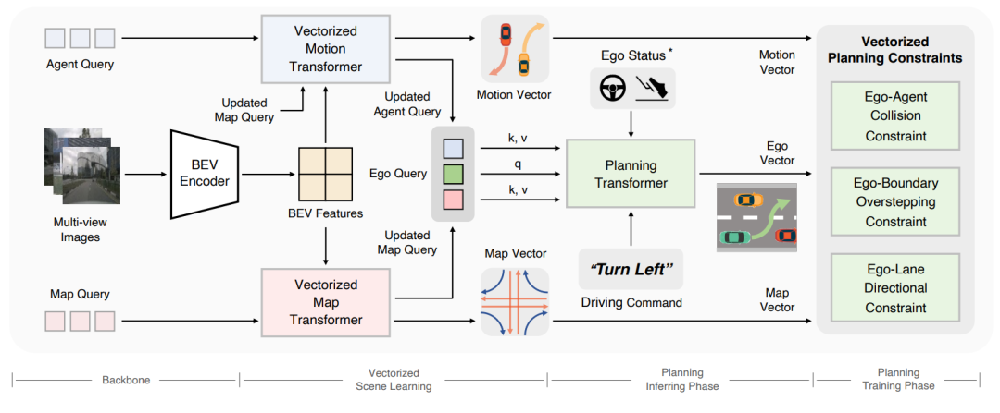

# VAD 论文解析：全矢量化场景表示如何提升端到端规划效率

> 论文：[VAD: Vectorized Scene Representation for Efficient Autonomous Driving](https://openaccess.thecvf.com/content/ICCV2023/html/Jiang_VAD_Vectorized_Scene_Representation_for_Efficient_Autonomous_Driving_ICCV_2023_paper.html)  
> 作者：Bo Jiang, Shaoyu Chen, Qing Xu 等  
> 发表：ICCV 2023，2023  
> 领域：端到端自动驾驶、规划、强化学习/多模态模型相关方向

## 🌟 引言

许多端到端规划方法依赖稠密 BEV 表示，虽然直观，但计算重、内存占用高，而且容易丢掉车道线、边界、智能体轨迹等实例级结构。VAD 的出发点是：驾驶规划真正需要的是可交互、可约束的结构对象，而不一定是完整光栅图。

## 🧩 背景与动机

🔍 这篇工作的背景可以放在自动驾驶范式迁移中理解：从模块化流水线，到多任务联合，再到更强的端到端训练。它要解决的不是单一 perception 指标，而是驾驶系统在闭环规划、长尾场景、实时推理或可扩展训练上的瓶颈。

我的理解是，这类论文最值得关注的地方不在“端到端”这个标签本身，而在它具体选择了什么中间表示、训练信号和系统接口。真正有价值的端到端方法，应该让信息流更顺、更贴近规划目标，而不是简单把模块边界藏进一个大网络里。

## 🛠️ 方法详解

⚙️ VAD 将驾驶场景表示为全矢量化对象：智能体运动、地图元素和自车规划都通过 query 建模。模型一方面让这些 query 在 Transformer 中交互，隐式利用结构关系；另一方面引入碰撞、边界、车道方向等矢量化规划约束，显式提升安全性。

从图 1 可以看出，论文的核心设计通常围绕输入表示、任务交互和规划输出展开。相比传统流水线，这类方法更强调跨任务共享、闭环反馈或统一 token/query 表示；相比纯黑盒控制，它又尽量保留可解释的结构，让模型失败时能追踪原因。

## 📈 实验结果

📊 论文在 nuScenes 端到端规划评测中展示了安全性和速度优势。相较依赖稠密光栅表示的方法，VAD 重点改善碰撞率和推理效率，说明结构化矢量表示不仅是压缩，更是更贴近规划任务的归纳偏置。

实验分析时我更关注两个问题：第一，指标提升是否直接对应驾驶安全和规划质量；第二，方法是否把计算、延迟、训练成本也纳入讨论。自动驾驶论文如果只在开环误差上好看，但闭环碰撞、违规或实时性不稳定，工程价值会明显打折。

## 💡 亮点总结

✨ 这篇论文的主要亮点可以概括为三点：

- 它围绕自动驾驶的核心瓶颈提出了明确的结构设计，而不是只做模型规模扩展。
- 它把表示学习、任务协同和规划目标联系起来，体现了端到端系统设计的整体性。
- 它通过关键图表和实验结果说明该设计确实影响了驾驶质量、效率或泛化能力。

## ⚖️ 局限性与思考

⚠️ VAD 的效果依赖高质量地图/agent 表示与 query 交互设计；面对长尾开放世界场景时，矢量化对象是否足够覆盖所有语义仍是问题。

更进一步看，自动驾驶里的端到端路线仍需要面对三类问题：数据覆盖是否足够、闭环训练是否可靠、部署时能否满足安全与实时约束。因此，这篇论文更适合作为理解某条技术路线的关键节点，而不是最终答案。

## ✅ 结语

VAD 的核心价值是证明端到端规划可以更轻、更结构化：用矢量对象表达驾驶场景，比稠密 BEV 更适合实时规划。
