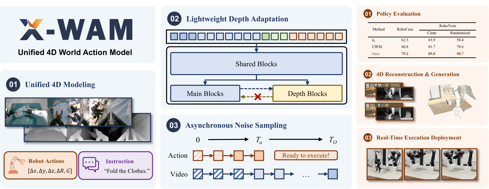
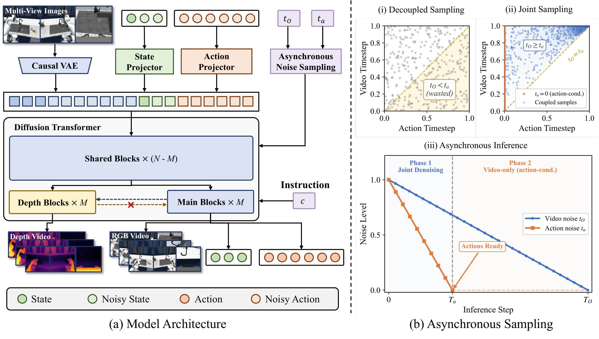
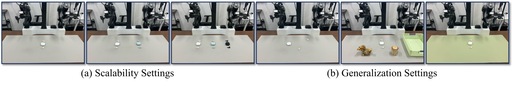
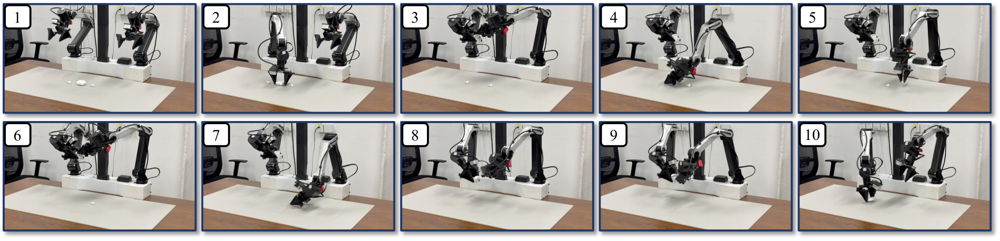

# Unified 4D World Action Modeling from Video Priors with Asynchronous Denoising 论文解析：X-WAM 如何把动作决策、视频生成与 4D 重建放进同一个世界模型

> 论文：[Unified 4D World Action Modeling from Video Priors with Asynchronous Denoising](https://arxiv.org/abs/2604.26694)  
> 作者：Jun Guo, Qiwei Li, Peiyan Li, Zilong Chen, Nan Sun, Yifei Su, Heyun Wang, Yuan Zhang, Xinghang Li, Huaping Liu  
> 机构：Tsinghua University, Xiaomi Robotics, Peking University, CASIA  
> 版本：arXiv:2604.26694v2，2026-05-07  
> 领域：Embodied AI、World Action Model、Robotics、Video Diffusion、4D Reconstruction  
> 核心问题：如何让一个机器人世界模型既能快速输出可执行动作，又能生成具有空间一致性的未来 RGB-D 视频和 4D 世界表示？

## ✦ 核心洞察与挑战

### 核心问题

- **机器人需要同时“行动”和“想象”**：policy 只输出动作不够，world model 只生成未来视频也不够；真正可用的 embodied model 需要同时预测可执行动作和未来世界状态。
- **2D 未来帧缺少几何约束**：已有统一 WAM 多停留在 RGB pixel-space，能生成未来图像，却难以保证 depth、多视角一致性和 3D 空间结构。
- **动作实时性与视频质量天然冲突**：动作是低维控制信号，通常少量 denoising step 就够；视频是高维信号，需要更多 step 才能保持清晰和时序一致。

> 关键判断：X-WAM 的目标不是单纯提升视频生成质量，而是把“可执行动作 + 未来视频 + 深度 + 4D 重建”统一成一个可部署的机器人世界模型。

### 传统方案局限

- **VLA / Policy Model**：控制链路短，但主要学习 observation-to-action 映射，缺少对未来物理演化、遮挡变化和空间接触关系的显式建模。
- **2D WAM / Video World Model**：能够利用视频先验预测未来观测和动作，但空间信息被隐含在 RGB 中，无法稳定支持几何精确的 4D reconstruction。
- **朴素 RGB-D 融合**：把 depth 拼成额外 token 会扩大序列长度并增加 attention 成本；把 depth 拼到 channel 又会偏离预训练视频模型熟悉的分布。
- **独立 timestep 采样**：训练时独立采样 action/video 噪声会产生推理阶段不会出现的 `t_O < t_a` 状态，导致异步推理时视频分支处在未训练好的条件分布中。

> 关键判断：传统方案的问题不只是“没有 3D”，还包括 3D 融合太重、动作被视频生成拖慢，以及训练噪声分布与异步推理状态不一致。

## 研究动机

X-WAM 想解决的是一个统一建模问题：机器人不只需要知道下一步怎么动，也需要理解动作会如何改变三维世界。对于长程、精细、双臂或多视角操作，动作成功与否往往取决于物体深度、接触关系、手眼相对位姿和多视角空间一致性，这些信息很难只靠 2D RGB 未来帧隐式学出来。

论文的核心动机是：既然大规模视频扩散模型已经具备强视觉先验，那么是否可以在不破坏这些先验的前提下，为其补上 3D 空间监督和实时动作解码能力？X-WAM 的回答是，将 depth 预测做成轻量分支，并把 action/video 的 denoising 节奏显式拆开：动作先可执行，视频继续生成，二者仍处在同一个统一模型中。

> 关键判断：X-WAM 的动机不是把视频模型简单搬到机器人上，而是让视频先验、空间监督和实时动作解码在一个框架里协同。

## 方法论（主要模块简介）

- **Unified 4D World Action Model**：以预训练视频 Diffusion Transformer 为主干，把多视角 RGB、机器人状态、动作 token 和语言指令放入同一序列，联合预测未来 RGB video、depth video、proprioceptive state 和 robot action。
- **Lightweight Depth Adaptation**：复制主干最后若干 DiT blocks 形成 depth branch；深度分支通过 unilateral attention 读取主分支特征，但主分支不读取 depth branch，从而保留预训练视频先验。
- **Asynchronous Noise Sampling**：推理时动作只用较少 step 快速去噪并立即执行，视频继续完成更多 step；训练时用联合噪声采样保证 `t_O >= t_a`，让训练分布贴近异步推理分布。
- **4D reconstruction and deployment loop**：模型输出的多视角 RGB-D 可进一步融合成点云/4D world representation，同时 action chunk 可以结合 Real-Time Chunking 接入真实机器人执行。

> 关键判断：这篇论文最有价值的设计，是把“4D 空间建模”和“动作实时性”同时纳入模型结构与噪声采样策略，而不是只在单一指标上做优化。

## 🌟 引言：从“会想象”的世界模型到“会行动”的 4D 世界模型

机器人世界模型有一个长期张力：如果模型只关注动作，它可能能快速控制机器人，但对未来世界变化缺少显式建模；如果模型只关注生成未来视频，它可能能“想象”很真实的画面，却不一定能输出可执行动作。World Action Model 试图把这两者合并，让模型同时预测未来观察和动作。但此前很多方法仍然主要工作在 2D 视频空间，缺少对真实三维几何的显式约束。

X-WAM 把问题往前推了一步：它希望统一建模 **视频、深度、机器人状态和动作**。更具体地说，模型输入多视角 RGB 观测、机器人 proprioceptive state 和语言指令，输出未来多视角 RGB-D 视频、未来状态和动作。这样，模型既可以作为 policy 执行动作，也可以作为 4D world model 生成未来场景并重建空间结构。



图 1 很好地概括了论文主线：左侧是统一 4D modeling，输入多视角图像、指令和动作；中间是轻量 depth adaptation；下方是 action/video 异步 denoising；右侧则把贡献落到三类评估：policy evaluation、4D reconstruction & generation、real-time execution deployment。

## 🧩 背景与动机：为什么已有 WAM 还不够

论文将当前 embodied AI 方法分成两类：

- **Policy model / VLA**：直接从视觉和语言输出机器人动作，优势是控制链路短、执行效率高，但通常缺少对未来物理演化的显式建模。
- **World model**：擅长生成未来观察或模拟环境动态，但很多方法不直接输出可执行动作，或者需要额外 planner / inverse dynamics 才能用于控制。

World Action Model 试图统一这两类能力。UWM、Motus、VideoVLA、Cosmos Policy 等工作已经证明，视频生成先验可以帮助动作预测。但论文指出两个关键缺口：

第一，**2D pixel-space 不足以支撑可靠操作**。机器人任务往往依赖空间关系、接触几何、物体深度和多视角一致性。如果模型只在 RGB 像素层面预测未来，很容易生成看起来合理但几何上不一致的未来。

第二，**视频生成与动作预测对 denoising 的需求不同**。视频是高维信号，需要较多去噪步数才能获得清晰结果；动作是低维控制信号，往往少量 step 就能恢复到可执行精度。如果强行让二者同步去噪，动作执行会被视频生成拖慢；如果训练时完全独立采样噪声，又会和推理阶段的异步状态不匹配。

因此，X-WAM 的问题可以概括为：**能否利用预训练视频扩散模型的强视觉先验，同时加入 3D 空间监督，并让动作分支快速可执行、视频分支继续高质量生成？**

## 🛠️ 方法详解：X-WAM 的三个关键设计

### 1. 统一 4D World Action Model

X-WAM 基于 Wan2.2-TI2V-5B 这类预训练视频 Diffusion Transformer。模型将多视角 RGB 图像通过 Causal VAE 编码为视频 latent，将机器人状态和动作通过 projector 编码为 token，并把语言指令作为条件输入。最终，Diffusion Transformer 同时预测：

- 未来 RGB video。
- 未来 depth video。
- 未来 proprioceptive states。
- 高频机器人动作。

这里有一个容易忽略但很重要的频率设计：论文中视频帧率为 3.75 FPS，而动作预测频率是视频帧率的 4 倍。这意味着模型不是“每帧一个动作”的简单视频模型，而是要在同一个时间窗口内同时支持低频视觉演化和高频控制输出。



图 2 左侧展示了模型如何把多视角图像、状态、动作和语言指令统一送入 DiT；右侧则展示了 ANS 的核心动机：传统 decoupled sampling 会产生 `t_O < t_a` 这类训练状态，但推理时动作通常先完成去噪，视频仍处于更高噪声水平，因此实际需要的是 `t_O >= t_a` 的联合噪声分布。

### 2. Lightweight Depth Adaptation：只让深度分支读主干，不让主干被扰动

直接引入 depth 的朴素方案有两个问题：

- **Sequence concatenation**：把 depth 作为额外 token 拼进序列，空间信息明确，但序列长度上升，attention 成本随之变高。
- **Channel concatenation**：把 RGB-D 拼成更多 channel，计算上更直接，但会改变预训练视频模型熟悉的输入分布。

X-WAM 的解决方式更克制：给一个有 `N` 个 DiT blocks 的主干复制最后 `M` 个 blocks，形成独立的 depth branch。前 `N-M` 层仍然共享，得到 hidden states 后，主分支继续预测 RGB/action/state，深度分支通过 cross-attention 读取主分支同层输入。

论文把这种结构称为 **unilateral attention**：depth branch 可以读 main branch，但 main branch 不读 depth branch。这个方向性很关键，因为它保留了预训练 RGB/video 主干的完整性，避免 depth 监督反过来污染视频生成和动作预测路径。

从公式角度看，深度分支每层更新可以理解为：

```text
DepthBlock_j 读取上一层 depth hidden state，并 cross-attend 到 main branch 的同层输入；
MainBlock_j 正常沿预训练主干前进，不被 depth token 影响。
```

训练时，depth branch 用 inverse depth 的 MSE loss 监督；推理时，如果只需要快速动作输出，depth branch 可以灵活关闭或减少参与，从而避免显著增加控制延迟。

### 3. Asynchronous Noise Sampling：动作先完成，视频继续生成

ANS 是本文另一个核心贡献。它解决的问题不是“怎么少跑几步”这么简单，而是 **训练分布是否覆盖推理时的异步状态**。

推理时，X-WAM 为动作和状态分配 `T_a` 个 denoising steps，为视频分配 `T_O` 个 steps，并满足 `T_a < T_O`。经过 `T_a` 次前向后，动作已经可以执行；如果还需要清晰未来视频，视频分支继续完成剩余的 `T_O - T_a` 步。此时动作已经是干净条件，视频仍在去噪，这就自然变成 action-conditioned world generation。

问题在于，如果训练时视频噪声 `t_O` 和动作噪声 `t_a` 独立采样，就会出现许多推理中不会发生的组合，例如 `t_O < t_a`：视频比动作更干净，但真实异步推理里动作通常先干净。X-WAM 因此设计了联合采样：

```text
case 1: t_a = 0, t_O ~ Uniform(0, 1)
case 2: t_a ~ Uniform(0, 1), t_O = t_a + (1 - t_a) * b, b ~ Beta(1.5, 1)
```

这个采样保证第二种情况下 `t_O >= t_a`，也就是视频噪声不少于动作噪声。直观理解是：训练时就让模型习惯“动作已经更清楚、视频还比较 noisy”的状态，推理时才不会因为分布错位导致视频质量下降或动作条件不稳定。

## 📈 实验结果：策略、4D 重建和真实机器人都要同时成立

### 1. Policy Evaluation：成功率不是唯一指标，但它先要过关

论文在 RoboCasa 和 RoboTwin 2.0 上比较 X-WAM 与 VLA/WAM baselines。

在 RoboCasa 24 个操作任务上：

- `pi0`：62.5%
- GR00T-N1.5：64.1%
- UWM：60.8%
- DreamZero：62.4%
- Cosmos Policy：67.1%
- **X-WAM：79.2%**

这说明 X-WAM 并不是为了 4D 重建牺牲控制性能。相反，显式深度建模和大规模预训练带来的空间结构感，反而提升了策略执行。

在 RoboTwin 2.0 的 50 个任务上：

- Motus：Clean 88.7%，Randomized 87.0%
- **X-WAM：Clean 89.8%，Randomized 90.7%**

Randomized 设置下提升更明显，说明 X-WAM 的空间建模可能对 pose、appearance、distractor 变化更有帮助。

### 2. 4D Reconstruction：不是后处理 depth，而是端到端学空间一致性

4D 重建实验在 RoboCasa 上比较 predicted RGB-D observation 与 simulator ground truth。指标分三类：

- RGB fidelity：PSNR、SSIM、LPIPS。
- Depth quality：AbsRel、delta1。
- Point cloud quality：Chamfer Distance。

关键结果是：

- DreamZero + Depth Anything 3：PSNR 21.12，CD 0.0680。
- Robot4DGen：PSNR 22.67，CD 0.0134。
- X-WAM w/o depth + DA3：PSNR 23.09，CD 0.0401。
- **X-WAM：PSNR 23.46，AbsRel 0.0349，delta1 0.9738，CD 0.0049。**

这里最有解释力的是 Chamfer Distance。X-WAM 不只是单视角 depth 数值更好，而是把多视角 depth lift 到统一 3D 坐标后仍然更一致。相比 DreamZero + DA3 的两阶段方案，CD 从 0.0680 降到 0.0049，说明端到端联合建模比“先生成 RGB，再用通用 monocular depth 估计器补深度”更适合机器人多视角空间建模。

### 3. Ablation：轻量 depth branch 和 ANS 各自贡献了什么

Depth architecture ablation 展示了一个很现实的 trade-off：

- No depth：SR 63.0%，latency 1033 ms。
- Sequence concatenation：SR 68.7%，latency 1888 ms。
- Channel concatenation：SR 64.2%，latency 1266 ms。
- **Interleaved branch：SR 67.8%，latency 1033 ms。**

Sequence concatenation 质量强，但延迟代价明显；interleaved branch 虽然不是所有指标最高，却在几乎不增加动作延迟的情况下显著提升空间建模质量。这就是论文所谓 lightweight 的含义：它不是追求最重的 3D 表达，而是在 unified policy 约束下找一个可部署的结构点。

ANS ablation 则说明异步推理如果训练不对齐，会损害重建质量：

- Sync train + Sync infer：latency 4665 ms。
- Decoupled train + Async infer：latency 1033 ms，但 PSNR 下降到 22.60，AbsRel 变差到 0.0430。
- **ANS train + Async infer：latency 1033 ms，PSNR 23.46，AbsRel 0.0349。**

也就是说，异步推理本身能带来约 4.5x 的动作延迟下降，但如果训练仍然独立采样噪声，视频分支会遇到没见过的条件状态；ANS 的价值就是把这种状态提前纳入训练分布。

## 🤖 真实机器人实验：从模拟指标走向闭环部署

论文附录还给出了真实双臂机器人耳机收纳实验。平台是 AC One dual-arm robot，包含一个全局主相机和两个 wrist cameras。任务看似简单，但实际上包含抓取耳机盒、打开盒盖、放入一只或多只耳机、关闭盒盖等长程双臂精细操作。



真实部署中，X-WAM 使用 8 个 denoising steps，在 NVIDIA RTX 5090 D 上单个 action chunk 约 300 ms，并结合 Real-Time Chunking 让推理计算与动作执行重叠。机器人以 15 Hz 控制频率运行，每个 chunk 执行 15 个动作，也就是约 1 秒动作序列。

在真实任务结果上，X-WAM 相比 XR-0 有更好的长程稳定性：

- Pack 2 earphones：XR-0 为 79.1%，X-WAM 为 93.8%。
- Pack 3 earphones：XR-0 为 63.9%，X-WAM 为 68.0%。
- Novel placements：XR-0 为 58.3%，X-WAM 为 70.8%。
- Unseen distractors：XR-0 为 66.7%，X-WAM 为 75.0%。

这些结果支持论文的核心论点：显式 4D 建模不是只改善生成可视化，它也能帮助真实机器人在几何敏感任务中获得更好的泛化。



图 4 展示的是代表性 rollout。它的价值不在于“画面好看”，而在于说明 X-WAM 可以把异步 denoising 的 action chunk 真正接入机器人闭环执行，而不是只停留在离线视频生成或模拟评测。

## 💡 亮点总结

### 1. 把 4D 空间监督接入 WAM，但尽量不破坏视频先验

X-WAM 没有简单粗暴地把 depth token 拼到序列里，而是复制后几层 DiT 做 depth branch，通过 unilateral attention 读取主干特征。这种设计很适合迁移大规模视频扩散模型：保留主干的视觉先验，同时给模型一个显式学习几何的出口。

### 2. 把动作实时性和视频生成质量解耦

动作和视频不应该被同一个 denoising clock 绑定。ANS 让动作先完成、视频继续生成，符合二者的信息维度差异。更重要的是，论文把推理异步性反映到训练噪声采样中，避免 train-test mismatch。

### 3. 评价维度比较完整

论文没有只报 policy success rate，也没有只报 video metrics，而是同时看：

- 仿真策略成功率。
- RGB / depth / point cloud 质量。
- ablation 下的延迟与质量 trade-off。
- 真实机器人部署中的 progress 和 completion time。

这种评价方式更符合 unified world action model 的定位：如果一个模型声称统一动作和世界，它就必须在动作、生成、几何和部署四个维度都给出证据。

## ⚖️ 局限性与思考

论文也明确指出两个主要局限。

第一，X-WAM 当前只处理固定长度 context window，没有像 DreamZero 一类方法那样使用历史条件、KV caching 或自回归 rollout。对于长程任务，如果当前观测不足以判断任务阶段，模型可能缺少足够历史信息。

第二，X-WAM 作为统一模型，推理延迟仍然高于专门的轻量 policy model。真实部署中 8 step 约 300 ms/action chunk，虽然 RTC 可以重叠计算和执行，但这仍然意味着机器人部分动作基于稍早之前的预测。对于高速或强接触任务，这个延迟可能成为风险。

我的理解是，X-WAM 更像是一个“统一模型方向的系统性原型”，而不是最终形态。它证明了 4D spatial awareness、video prior 和 action policy 可以在一个 diffusion framework 中协同，但后续还需要：

- 更长历史上下文建模。
- 更强推理加速或 distillation。
- 更低成本的 4D supervision。
- 更严格的真实机器人多任务评测。

## ✅ 结语

X-WAM 的核心价值在于，它没有把机器人世界模型简化成“生成未来视频”，也没有把策略学习简化成“直接输出动作”。它尝试用一个统一的扩散式 World Action Model 同时处理未来 RGB-D 视频、空间重建和可执行动作，并通过轻量 depth branch 与 ANS 解决空间建模成本和动作实时性的冲突。

如果说此前很多 WAM 还主要是在 2D 视频空间里学习“动作会让画面怎么变”，那么 X-WAM 更接近一个面向机器人操作的 4D 世界模型：它关心画面，也关心深度；关心生成质量，也关心动作什么时候能执行。这种统一范式仍然有延迟和长程上下文问题，但它为 embodied AI 中“可执行世界模型”的下一步提供了很清晰的结构参考。
