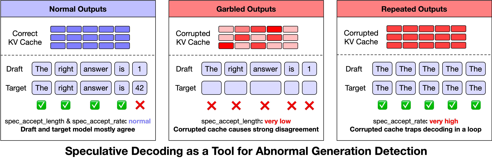
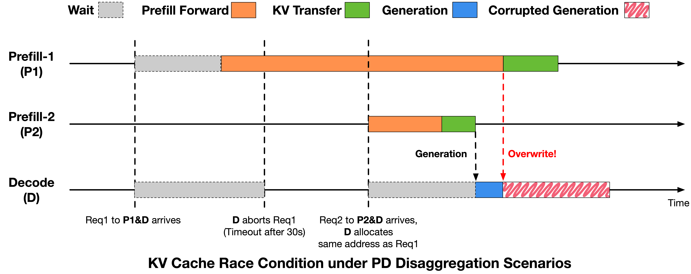
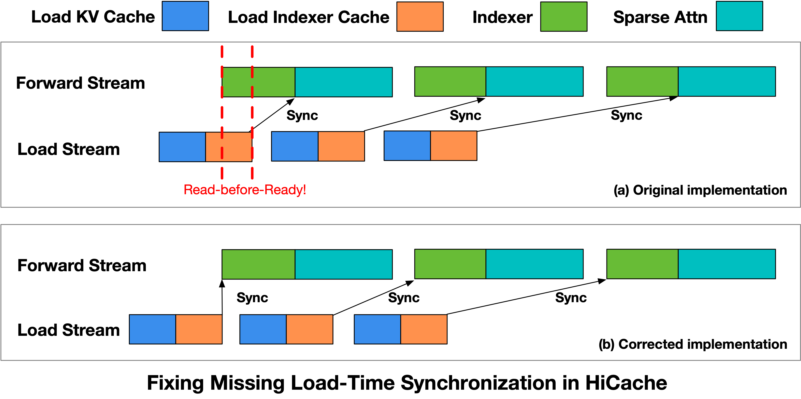
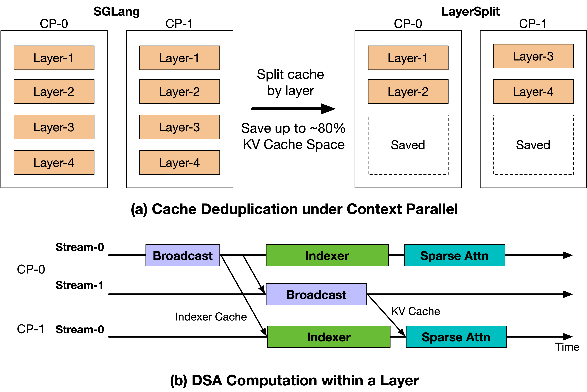
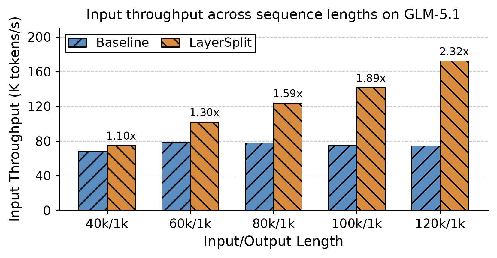

# Scaling Pain 解读：GLM-5 Coding Agent Serving 的异常输出、KV Cache 竞态与 LayerSplit 优化

> 原文：[Scaling Pain of Coding Agent Serving: Lessons from Debugging GLM-5 at Scale](https://z.ai/blog/scaling-pain)  
> 发布方：z.ai  
> 原文日期：2026-04-30  
> 主题：Coding Agent 推理系统、长上下文 serving、KV Cache、一致性、Speculative Decoding、HiCache、LayerSplit

## 🌟 引言：这篇文章真正讲的不是“模型变差”，而是“系统状态错了”

这篇 z.ai 的博客很值得细读，因为它讨论的是大模型服务进入 Coding Agent 场景后，一个经常被低估的问题：**线上模型输出质量异常，不一定来自模型能力本身，也可能来自推理基础设施的状态一致性错误。**

原文描述了 GLM-5 系列在复杂 Coding Agent 任务中出现的三类异常：乱码、复读，以及偶发的生僻字输出。这些现象乍看像长上下文推理中的“质量下降”，但排查后发现，它们只在高并发、长上下文、Prefill/Decode 压力较高的线上 serving 条件下触发；在标准离线推理中，用同样请求反复跑数百次也无法稳定复现。

这就把问题从“模型是不是不行”转成了更工程化的问题：**在大规模推理系统中，模型看到的 KV Cache、请求状态、显存复用和异步数据传输是否仍然一致？**

我的理解是，这篇文章最核心的价值有三点：

- 它展示了如何把模型质量异常还原为系统级 race condition。
- 它说明 Speculative Decoding 不只是性能优化，也可以成为线上异常检测信号。
- 它提出 LayerSplit，针对 Coding Agent 长上下文和高 prefix reuse 的负载特征优化 Prefill 侧 KV Cache 存储。

## 🔍 1. 问题背景：Coding Agent Serving 为什么比普通聊天更难

普通聊天请求通常输入较短，生成长度也相对可控；Coding Agent 请求则完全不同。它可能包含仓库上下文、历史对话、工具调用结果、错误日志、文件内容和长程任务状态。原文提到，Coding Agent 工作负载的输入长度平均超过 70K tokens，并且具有较高的 prefix cache reuse。

这会让推理系统遇到两个明显压力：

- **Prefill 压力上升**：长输入意味着 Prefill 阶段要处理大量 prompt token，TTFT 容易被 Prefill 排队拖慢。
- **KV Cache 压力上升**：长上下文和 prefix reuse 让 KV Cache 变成关键资源，显存容量、cache swap-in、跨节点传输都会影响稳定性。

在这种环境下，系统会引入很多复杂优化：PD 分离、超时 Abort、HiCache、多级缓存、Context Parallel、Speculative Decoding、Prefix Cache 等。每个优化单独看都合理，但它们组合起来后，会形成非常复杂的异步状态机。一旦请求生命周期、KV Cache 生命周期和显存复用时序不一致，模型读到的就不再是“正确的历史上下文”。

这就是所谓 Scaling Pain：规模上来之后，原本隐藏的工程假设开始失效，而且表现形式不是系统崩溃，而是更隐蔽的“模型输出异常”。

## 🧪 2. 从线下复现到异常识别：为什么排查这么难

原文的排查过程很典型。团队先收集线上 bad cases，在本地用同样请求反复回放，但没有复现异常。这说明异常大概率不是 deterministic model behavior：如果是模型本身对某些输入稳定失败，本地重复推理应该能复现。

随后他们用脱敏后的线上日志进行全量回放，并尽量保留原始并发分布和请求时序。起初仍然无法复现，直到进一步调整 PD 分离比例，并提高系统负载，模拟高峰期 Prefill backlog 和 Decode 侧 KV Cache 压力后，才出现约每 10,000 次请求 3 到 5 次的异常。

这一步很关键，因为它说明异常满足两个特征：

- 与 request content 的关系弱。
- 与 system pressure 和 serving state 的关系强。

也就是说，异常不是“某个 prompt 让模型崩了”，而更像“某个高负载状态让推理链路读错了状态”。

## 📈 3. Speculative Decoding：从加速器变成异常检测器

原文最有启发的地方之一，是把 Speculative Decoding 的内部指标用于异常检测。

Speculative Decoding 原本是性能优化：draft model 先生成一批候选 tokens，target model 验证并接受其中前缀，从而减少 target model 的逐 token 调用成本。按理说，它不改变最终输出分布；但在这次排查中，它的 acceptance 行为成了判断异常的窗口。

原文重点观察两个指标：

- `spec_accept_length`：target model 连续接受 draft token 的前缀长度。
- `spec_accept_rate`：draft token 被接受的比例。

异常输出对应两种模式：

- 乱码和生僻字通常伴随极低的 `spec_accept_length`，说明 draft model 的候选几乎被 target model 全部拒绝。这暗示 target model 看到的 KV Cache 状态与 draft model 预期严重不一致。
- 复读通常伴随异常偏高的 `spec_accept_rate`，说明生成过程可能进入一种高置信度但错误的重复循环。

因此，他们上线了一套异常监控逻辑：当生成长度超过 128 tokens 后，如果 `spec_accept_length` 持续低于 1.4，或 `spec_accept_rate` 超过 0.96，就主动中止当前生成，并把请求交回负载均衡器重试。

这套策略的意义不只是“止损”。更重要的是，它提供了可用于消融实验和回归验证的自动化检测信号。没有这个信号，乱码和生僻字很难靠正则、字符集或模型判别高效检测。

## ⚙️ 4. BugFix #1：PD 分离下的 KV Cache 复用竞态

第一个核心 bug 发生在 PD disaggregation，也就是 Prefill 和 Decode 分离执行的架构中。

为了控制尾延迟，系统引入了 timeout-based Abort：如果 Prefill 阶段迟迟没有完成，Decode 侧会终止这个请求，并回收它占用的 KV Cache 资源。问题在于，Abort 信号没有正确传播到 Prefill 侧，Decode 侧也没有足够信息判断这块 KV Cache 是否真的可以安全释放。

可以把这个 race condition 拆成一个时间线：

1. Req1 被分配到 Prefill-1 和 Decode。
2. Prefill-1 因排队或调度延迟，没有及时完成 Prefill。
3. Decode 等不到 Req1 的 KV Cache，触发 timeout Abort。
4. Decode 回收 Req1 的 KV Cache 槽位，并把同一显存区域分配给新请求 Req2。
5. Req2 的 Prefill-2 写入自己的 KV Cache，Decode 开始正常生成。
6. 但 Req1 在 Prefill-1 侧的 RDMA 写入仍然没有停止。
7. Req1 的迟到写入覆盖了已经属于 Req2 的 KV Cache 区域。
8. Req2 Decode 时读到被污染的 KV Cache，于是输出乱码、复读或异常字符。

这个问题非常典型：内存复用在逻辑上已经发生，但旧请求的异步写入还在物理上进行。系统从“请求生命周期”角度认为 Req1 已结束，从“数据传输生命周期”角度 Req1 还没结束，两套生命周期没有同步。

### 4.1 修复思路：KV Cache 释放必须等待写入安全点

修复方案是建立显式时序约束：Decode 触发 Abort 后，要通知 Prefill；Prefill 只有在 RDMA 写入尚未开始，或所有已提交写入都完成后，才能返回“可释放”确认。Decode 必须收到确认后，才能回收并复用对应 KV Cache 槽位。

原文给出的效果是：该修复上线后，异常发生率从约万分之十几下降到万分之三以下。

这里的工程教训很清楚：在 PD 分离架构中，KV Cache 的所有权不能只由 Decode 侧判断。只要 Prefill 侧仍可能写入，显存区域就不能被安全复用。否则模型质量问题会表现为随机、低频、难复现的输出异常。

## 🧩 5. BugFix #2：HiCache 中的 read-before-ready

第二个 bug 来自 HiCache。Coding Agent 的长上下文和高 prefix reuse 让多级 KV Cache 很重要：系统会把历史 prefix cache 放在 CPU 或其他层级中，需要时再 swap-in 到 GPU。为了提升吞吐，加载和计算会重叠执行。

问题在于，原实现没有保证“数据加载完成后才被使用”。这会导致 read-before-ready：Forward Stream 提前读取尚未完成加载的 cache。

原文将 HiCache 读路径拆为两个 stream：

- Load Stream：负责加载 KV Cache 和 Indexer Cache。
- Forward Stream：执行 Index 计算和 Sparse Attention。

理论上，Indexer 计算必须等对应 Indexer Cache 完成加载后才能开始。但原始实现中，这个依赖没有被显式保证。于是 Forward Stream 可能先于 Load Stream 读取数据，导致 Index 计算基于不完整或未初始化的数据执行，后续 Sparse Attention 也会被污染。

### 5.1 修复思路：重构流水线原子性

修复方案是在 Indexer 算子启动前引入显式同步点，确保需要的 Indexer Cache 已加载完成。Forward Stream 只有在数据就绪后才开始计算。

原文称，该修复上线后，在相同负载下，由这个执行时序不一致导致的异常完全消失，并已通过 PR #22811 提交给 SGLang 社区。

这个 bug 和第一个 bug 本质相同：都不是数学精度问题，而是状态可见性和时序一致性问题。模型参数没有变，但模型读取的上下文状态错了。

## 🏗️ 6. LayerSplit：从修 bug 回到 Prefill 瓶颈

修复两个 race condition 后，文章回到更根本的性能瓶颈：长上下文 Coding Agent Serving 中，Prefill 阶段已经成为主导因素。

为了降低 TTFT，系统引入 timeout Abort；为了缓解 KV Cache 容量压力，引入 HiCache。Bug 修完后，真正的问题变成：如何提升 Prefill 吞吐，同时降低 Prefill 侧 KV Cache 显存压力？

原文提出的方案是 LayerSplit：一种按层切分 KV Cache 存储的方案。

### 6.1 为什么已有 Context Parallel 会浪费 KV Cache 显存

在长上下文 Prefill 中，Context Parallel 是常用并行方式。多个 GPU 分担上下文计算，但如果每张 GPU 都保存所有层的 KV Cache，就会形成冗余存储。对于 70K、100K 甚至更长上下文，这种冗余会迅速把显存容量变成瓶颈，进而限制 GPU 利用率。

LayerSplit 的思路是：每张 GPU 不再保存所有层的 KV Cache，而只保存部分层。这样单卡显存压力明显下降。

在计算时，持有某一层 KV Cache 的 rank 会在 Attention 前把该层 cache 广播给其他相关 rank。为了控制通信成本，系统让 KV Cache 广播与 indexer 计算重叠，使通信尽可能被计算掩盖。原文还提到，最终额外引入的主要是 Indexer Cache 广播，其规模约为 KV Cache 的 1/8，因此总体开销较低。

### 6.2 性能结果：长上下文越长，收益越大

原文在 90% cache hit rate 条件下，测试 40K 到 120K tokens 的请求长度。结果显示 LayerSplit 带来 10% 到 132% 的吞吐提升，而且上下文越长收益越明显。

这符合直觉：上下文越长，KV Cache 显存压力越大，冗余存储越浪费；LayerSplit 减少单卡 KV Cache footprint 后，更容易释放 GPU 计算资源，让 Prefill 吞吐提升。

## 🧠 7. 我的理解：这篇文章给推理系统的三个启发

### 7.1 模型质量问题可能是系统一致性问题

大模型线上服务中，输出异常经常被归因于模型能力、采样参数或长上下文退化。但这篇文章提醒我们：当系统复杂到包含 PD 分离、KV Cache 复用、RDMA、HiCache、Speculative Decoding、Context Parallel 时，任何状态一致性漏洞都可能以“模型质量异常”的形式出现。

这类问题最难排查，因为它低频、压力相关、请求内容无关，而且通常不会导致进程崩溃。系统看起来还在服务，只是偶尔输出坏结果。

### 7.2 性能优化必须配套 correctness monitoring

Speculative Decoding 在这里被用作异常信号，非常漂亮。它提供了一个内部一致性视角：draft 和 target 对同一上下文的 token 预测关系是否正常。如果 KV Cache 被污染，这种关系会异常偏离。

这说明 serving 系统需要更多“语义层面的健康指标”，而不是只看 QPS、TTFT、TPOT、GPU utilization、error rate。输出质量异常可能发生在系统指标看似正常的时候。

### 7.3 长上下文 Agent 让 Prefill 成为第一性瓶颈

普通聊天时代，Decode 往往是长尾；但 Coding Agent 时代，长输入和高 prefix reuse 把 Prefill 推到前台。Prefill 的排队、KV Cache 容量、cache swap-in、Context Parallel、显存复用，都直接影响用户体验和系统稳定性。

LayerSplit 的意义就在于，它不是泛泛提升吞吐，而是针对 Coding Agent 的真实 workload 特征做优化：长上下文、高 cache hit、高 Prefill 压力。

## ⚠️ 8. 仍值得追问的问题

这篇博客已经给出很有价值的一线经验，但读完后仍有几个问题值得继续追踪：

- 异常检测阈值是否对不同模型、不同 draft model、不同解码策略都稳定？例如 `spec_accept_length < 1.4` 和 `spec_accept_rate > 0.96` 可能是 GLM-5 当前系统中的经验阈值。
- LayerSplit 在更低 prefix cache hit rate 下收益如何？90% hit rate 很符合 Coding Agent 的高复用场景，但普通 workload 未必有同样收益。
- LayerSplit 引入的广播机制在不同网络拓扑下表现如何？如果跨节点通信压力更高，overlap 是否仍能充分掩盖开销？
- 异常输出是否还有其他未覆盖来源？原文中第一个修复后异常下降但没有完全归零，说明复杂 serving 系统中可能还存在其他低频路径。

## ✅ 9. 总结

这篇 z.ai 博客的核心信息可以概括为一句话：**当 LLM 应用进入高并发、长上下文 Coding Agent 阶段，推理系统必须同时追求性能和状态正确性；否则底层 KV Cache 一致性问题会直接表现为模型输出质量异常。**

它把一次线上异常排查讲成了很有价值的系统案例：先用压力复现证明问题来自 serving state，再用 Speculative Decoding 指标建立异常检测，随后定位两个 KV Cache 相关竞态，最后通过 LayerSplit 优化长上下文 Prefill 瓶颈。

对做 LLM serving、Agent infra、长上下文推理系统的人来说，这篇文章最值得带走的经验是：**Scaling 不只是把 GPU 堆起来，也不是只做吞吐优化；真正可靠的规模化，需要把每一次生成背后的模型状态都维护正确。**
