## 🌟 引言
Zeppelin: Balancing Variable-length Workloads in Data Parallel Large Model Training 是一篇 EuroSys 2026 论文，研究的是长上下文 LLM 训练中一个非常现实的系统问题：当训练样本长度差异很大时，传统数据并行和上下文并行为什么会出现严重负载不均衡，以及应该如何从模型模块、通信拓扑和硬件 NIC 利用率一起优化。

这篇论文的切入点很清晰：大模型训练不再只是“把 batch 切均匀”这么简单。Transformer 中 MLP、LayerNorm 等线性模块的计算随 token 数线性增长，而 attention 的计算随序列长度近似二次增长；与此同时，分布式 attention 的通信量又随序列长度线性变化。这意味着，一个对 linear modules 均衡的 sequence layout，可能对 attention 非常低效；一个对 attention 均衡的 layout，又可能让 linear modules 或 NIC 资源失衡。

> 一句话总结：Zeppelin 通过层次化 sequence partitioning、attention engine、communication routing layer 和 remapping layer，把 variable-length LLM training 的负载均衡从单一指标优化升级为“模型结构 + 网络拓扑 + 硬件资源”的联合系统设计。

论文链接：[arXiv:2509.21841](https://arxiv.org/abs/2509.21841)

## 📌 论文基本信息
- 标题：Zeppelin: Balancing Variable-length Workloads in Data Parallel Large Model Training
- 作者：Chang Chen, Tiancheng Chen, Jiangfei Duan, Qianchao Zhu, Zerui Wang, Qinghao Hu, Peng Sun, Xiuhong Li, Chao Yang, Torsten Hoefler
- 会议：EuroSys 2026
- 研究领域：AI Infra、LLM Training、Data Parallelism、Context Parallelism、Distributed Systems、Long Context Training
- 核心问题：在长且可变长度 sequence 的大模型数据并行训练中，如何同时平衡 attention 计算、linear module 计算、跨节点通信和 NIC 利用率。

## 🧩 背景与动机
现代 LLM 训练正在同时走向两个趋势：上下文越来越长，训练数据的 sequence length 分布越来越不规则。论文用多个数据集展示了这种现实情况，包括 ArXiv、GitHub、FineWeb、OpenWebMath、StackExchange 和 ProLong64k。

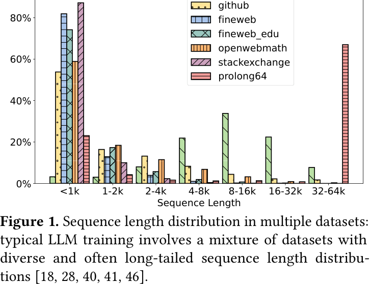

🔍 图 1 说明，LLM 训练面对的并不是单一长度输入，而是短文本、代码文件、论文、长文档混合在一起的长尾分布。短序列很多，长序列少但代价极高。简单 padding 会浪费 token；简单 packing 又可能带来复杂 attention mask 和冗余 attention 计算。

已有方法大致有三类：

- Input-balanced packing：让每个 rank 拿到相似 token 数，适合 MLP、LayerNorm 等线性模块，但对 quadratic attention 不一定均衡。
- Even context parallelism：把每条 sequence 平均切到多个设备上，attention 计算更平衡，但短 sequence 也要通信，通信开销偏大。
- Hybrid DP：短 sequence 用 DP，长 sequence 用 CP，试图减少通信，但可能引入更多 micro-batches，并导致 NIC 利用率不均。

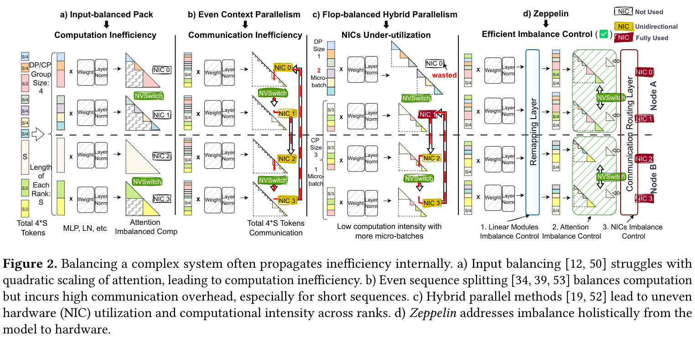

🧠 图 2 是 Zeppelin 的问题陈述图。它指出，“均衡”不是一个单维概念：某个策略可能在 token 数上均衡，却让 attention 做大量冗余计算；可能在 FLOPs 上均衡，却让 NIC 空闲；也可能减少通信，却降低 micro-batch 的计算强度。

论文进一步用 attention cost 分布证明这种矛盾。

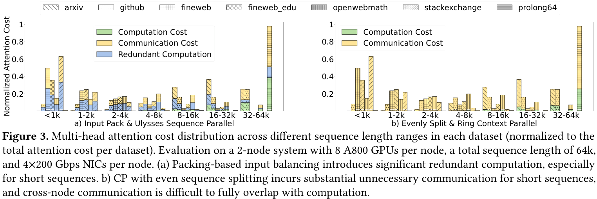

📊 图 3 展示了两种典型策略的代价。Packing-based input balancing 在短序列上会产生明显 redundant computation；evenly split + ring context parallel 虽然计算均衡，但短序列的 computation-to-communication ratio 很低，通信很难被计算掩盖。

因此，Zeppelin 要解决的问题不是“选择一个更好的 balance metric”，而是承认不同模块和硬件资源有不同 scaling behavior，并分别处理。

## 🛠️ 方法详解
Zeppelin 的整体设计由四个组件构成：

- Sequence Partitioner：根据 sequence length 和硬件拓扑，把序列分成 local、intra-node、inter-node 三类。
- Attention Engine：按 inter-node、intra-node、local 的顺序调度 attention queue，并尽量 overlap computation 和 communication。
- Communication Routing Layer：打破静态 GPU-NIC 绑定，用多 NIC 分摊跨节点传输。
- Remapping Layer：在 attention-optimized layout 和 linear-module-optimized layout 之间转换。

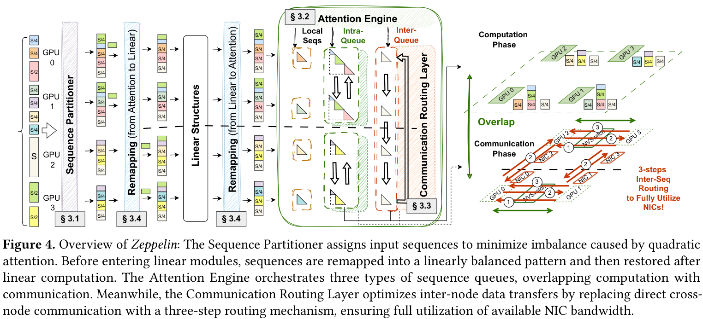

🧠 图 4 很完整地展示了 Zeppelin 的核心思想。输入 sequence 先经过 Sequence Partitioner；进入 linear modules 前后由 remapping layer 调整布局；attention engine 管理 local、intra-node、inter-node queues；communication routing layer 则把跨节点通信拆成 intra-node dispatch、multi-NIC inter-node transfer 和 intra-node combine 三步。

### ⚙️ Sequence Partitioner：按通信层次给 sequence 分区
Zeppelin 首先分析不同 sequence length 下 attention computation、linear computation、intra-node communication 和 inter-node communication 的成本关系。

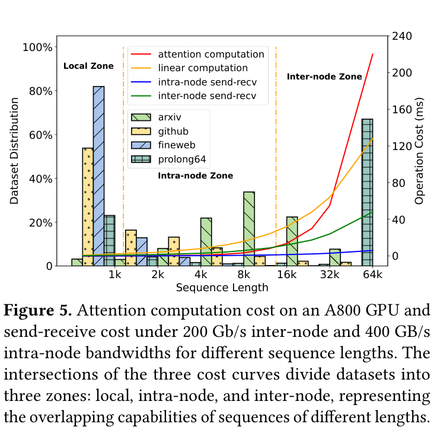

📈 图 5 是 partitioning 的依据。短序列的计算量太小，不适合跨设备通信，最好 local 执行；中等长度序列可以用 intra-node 通信与计算 overlap；超长序列则有足够计算量来掩盖 inter-node communication。

基于这个观察，Zeppelin 使用两级 partitioning：

- Inter-node partitioning：先决定哪些 sequence 需要跨节点分片，哪些只在节点内处理，并把工作放进 node-level buckets。
- Intra-node partitioning：再在每个节点内，把 sequence 分配到 GPU-level buckets，并按照 attention 的二次计算成本做更细粒度切分。

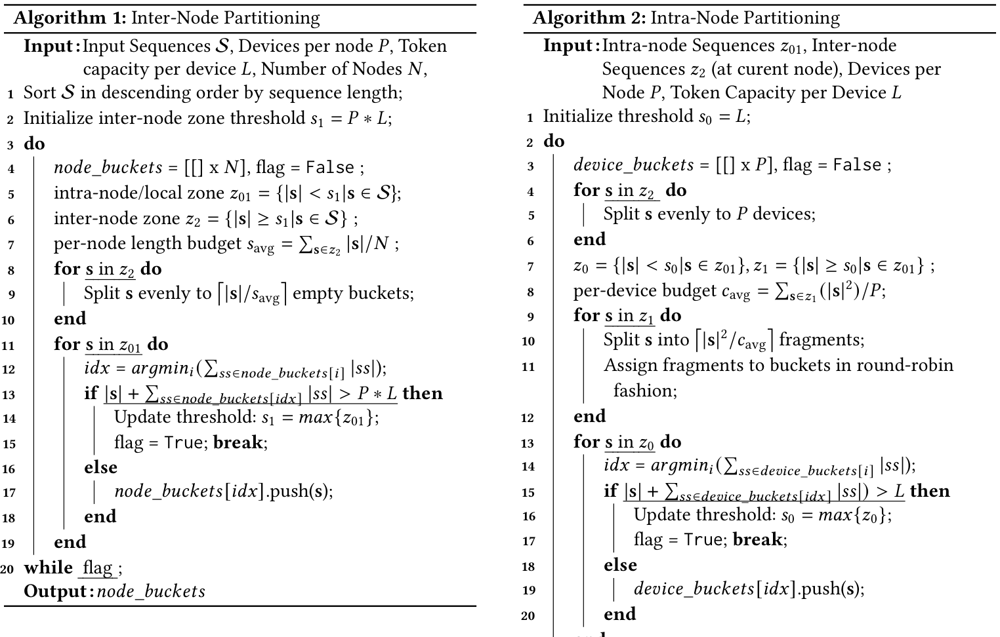

⚙️ Algorithm 1 和 Algorithm 2 的关键不是简单按 token 数均分，而是分别考虑节点容量、设备容量、sequence length 的平方代价，以及通信层次。长序列会被拆分以平衡 quadratic attention；短序列则尽量放在单卡或节点内，避免不必要通信。

### ⚙️ Attention Engine：三类队列按拓扑层次执行
Sequence partitioning 后，每个 device 会收到三类 sequence：inter-node、intra-node、local。Attention Engine 将它们映射到不同 ring communication groups，并按 inter-node -> intra-node -> local 的顺序执行。

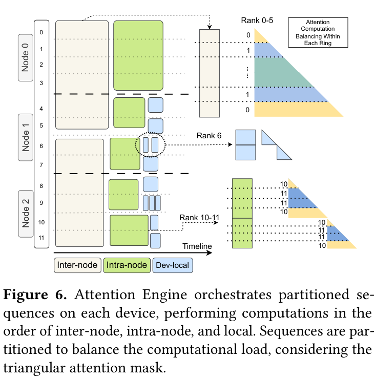

🖼️ 图 6 说明，Zeppelin 不是把所有 sequence 混进一个 global ring，而是用多个 queue 匹配不同通信层级。先执行 inter-node queue 可以尽早启动最慢通信；intra-node queue 随后利用节点内高带宽；local queue 最后执行，避免阻塞依赖通信的任务。

论文还考虑 causal attention 的下三角 mask：为了让 ring 内 rank 计算均衡，sequence 会进一步拆成 2G 个等长 chunks，并把第 i 个和第 2G-i-1 个 chunk 分给同一 rank，从而平衡三角 attention 的计算负载。

### ⚙️ Communication Routing Layer：让所有 NIC 都忙起来
在现代多 GPU 节点中，每个 GPU 往往通过 PCIe switch 连接到某个 NIC。但 distributed attention 的通信模式是动态的：某些 GPU 正在处理 local 或 intra-node sequences，自己的 NIC 可能空闲；另一些 GPU 却在跨节点传输中成为瓶颈。

Zeppelin 的 routing layer 将一次跨节点 send-recv 拆成三步：

- Intra-node dispatch：源 rank 先把数据分发给本节点多个 proxy ranks。
- Multi-NIC inter-node transfer：多个 proxy ranks 通过多个 NIC 并行跨节点传输。
- Intra-node combine：目标节点 proxy ranks 再把数据汇总到目标 rank。

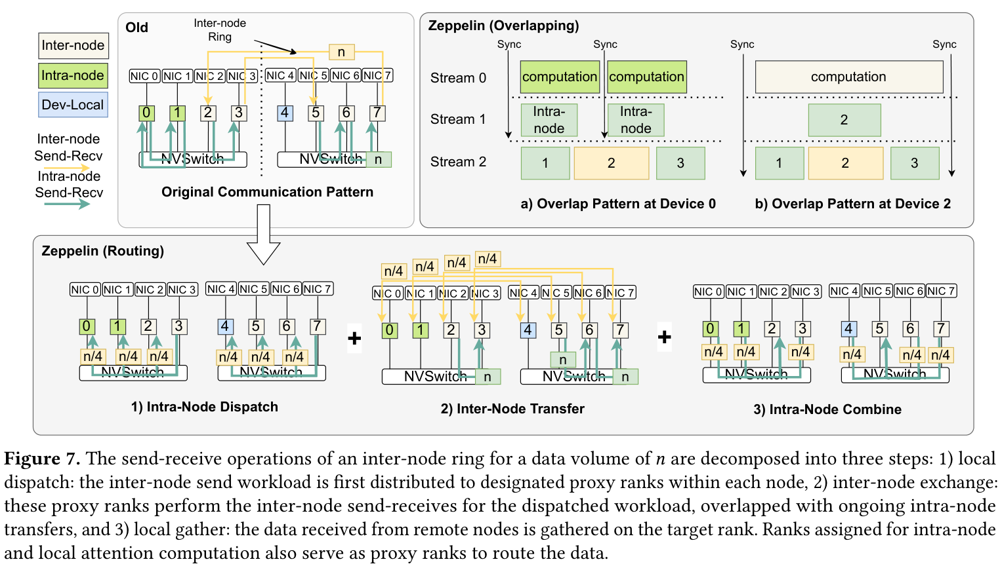

📡 图 7 展示了这个 routing 过程。它的本质是用很快的 intra-node bandwidth 换取对慢速 inter-node bandwidth 的并行化，让原本单 NIC 或少数 NIC 承担的跨节点通信分摊到更多 NIC 上。

论文给出的通信代价公式可以理解为：原本的 `b_inter * n` 被替换为 intra-node dispatch cost、multi-NIC inter-node transfer cost 和 intra-node combine cost 的组合。由于 intra-node 带宽通常比 inter-node 高一个数量级，即使使用少量 proxy ranks，也能明显缓解跨节点通信瓶颈。

### ⚙️ Remapping Layer：attention 均衡和 linear 均衡不是同一个布局
Zeppelin 最后处理一个容易被忽略的问题：对 attention 最优的 sequence layout，并不一定对 linear modules 最优。Attention 的成本与 sequence length 二次相关，而 MLP、LayerNorm、投影等 linear modules 更关心每个 rank 的 token 数是否均衡。

因此，Zeppelin 在进入 linear modules 前，把 attention-optimized layout 转换成 token-balanced layout；linear 结束后再变回 attention layout。论文将 remapping 形式化为一个 transfer matrix 优化问题，目标是在给定网络 cost matrix 的情况下，最小化把当前 token distribution 变成目标均衡分布的通信成本。

我的理解是，remapping layer 是 Zeppelin 很“系统”的地方：它没有试图用一个 layout 统一解决所有模块，而是接受 Transformer 内部不同模块有不同最优数据布局。

## 📈 实验结果
论文在三个 GPU clusters 上评估 Zeppelin：

- Cluster A：A800-80G，8 GPUs/node，4 个 200Gbps RoCE NICs/node。
- Cluster B：H800，8 GPUs/node，8 个 RoCE NICs/node。
- Cluster C：H200，8 GPUs/node，8 个 400Gbps CX7 NICs/node。

模型包括 LLaMA 3B、7B、13B、30B dense，以及 8x550M MoE。数据集包括 ArXiv、GitHub 和 ProLong64k。Baselines 包括 Transformer Engine CP、LLaMA CP 和 Hybrid DP。

### 📊 端到端吞吐：平均 2.80x，加速最高 6.60x
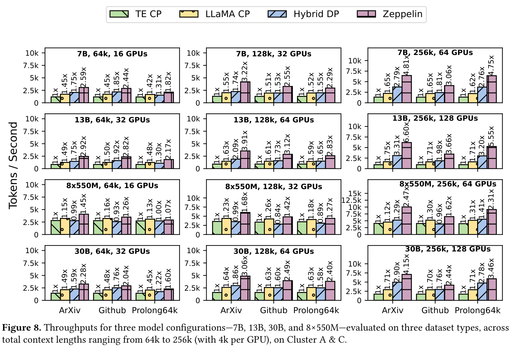

📊 图 8 是论文的主结果。Zeppelin 在多种模型、context length 和数据分布下都优于 baselines，论文总结其相对 TE CP 平均 speedup 为 2.80x，最高达到 6.60x。

几个趋势值得注意：

- 在 7B dense model 上，Zeppelin 对 ArXiv、GitHub、ProLong64k 都有稳定提升。
- 对短序列占比较多的数据集，Zeppelin 能减少更多不必要通信，因此 speedup 更明显。
- 对 13B 和 30B 模型，结合 tensor parallelism 后，趋势与 7B 类似。
- 对 MoE 模型，Hybrid DP 的 FLOP-based assignment 会受到 expert routing 不确定性的影响；当 context length 变长、attention 成为主瓶颈时，Zeppelin 的优势更明显。

### 📈 可扩展性：GPU 数增多时仍能继续提升
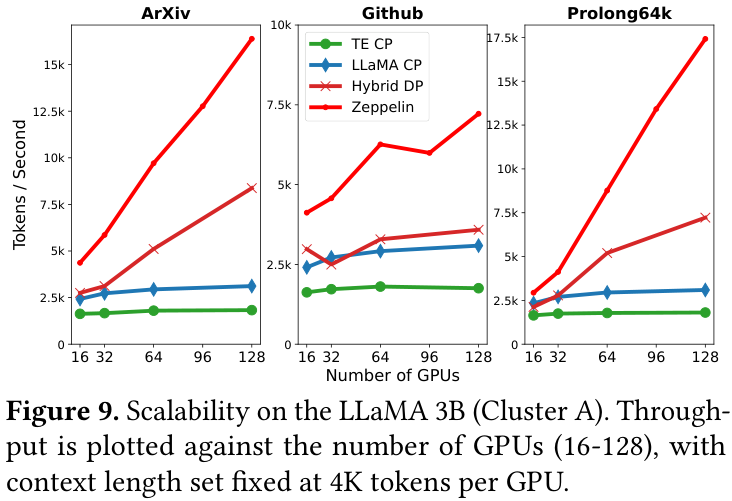

📈 图 9 显示，TE CP 在 scale up 时吞吐提升有限，主要受跨节点 ring attention 通信瓶颈限制。LLaMA CP 依赖 optimized all-gather，性能更好，但通信开销仍随总 sequence length 增长。Hybrid DP 能减少部分通信，但 coarse-grained parallelism 无法充分捕捉不同 sequence 的细粒度差异。

Zeppelin 的优势在于 per-sequence partitioning 和 hierarchy-aware execution，因此在不同数据集上都表现出更好的 scaling behavior。

### 📊 不同 GPU-NIC 架构下的适应性
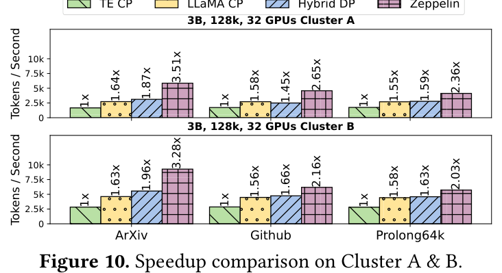

图 10 比较了不同 GPU-NIC affinity 架构下的表现。Cluster B 由于 H800 架构计算能力更强，整体 throughput 更高；但 Zeppelin 在 Cluster A 上的相对 speedup 更大，因为 Cluster A 的 computation-to-communication ratio 更适合 Zeppelin 通过 overlap 和 routing 缓解通信瓶颈。

这说明 Zeppelin 的收益和硬件拓扑强相关，但它的设计并不是只绑定某一种 GPU 节点形态。

### 🔍 消融实验：routing、attention engine、remapping 分别贡献什么
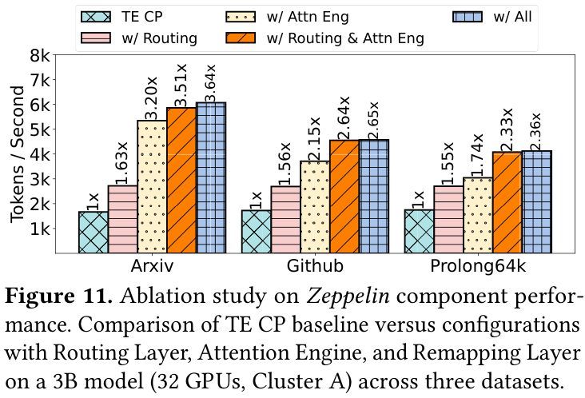

🔍 图 11 拆解了 Zeppelin 的三个主要模块：

- 只加入 Communication Routing Layer：约 1.6x speedup，说明多 NIC routing 能稳定缓解跨节点通信瓶颈。
- 加入 Attention Engine 和 sequence partitioning：进一步减少通信量，对 ArXiv 这类较均衡数据集可达到 3.2x。
- Routing + Attention Engine 组合：同时减少通信量并提升 NIC 利用率。
- 再加入 Remapping Layer：在 right-skewed 数据集上进一步提升，例如 ArXiv 上从 3.51x 到 3.64x。

这个消融说明 Zeppelin 的收益不是单一 trick，而是通信量减少、通信资源利用率提升和 linear module layout 修正共同作用。

### 🧪 Timeline：通信瓶颈如何被削弱
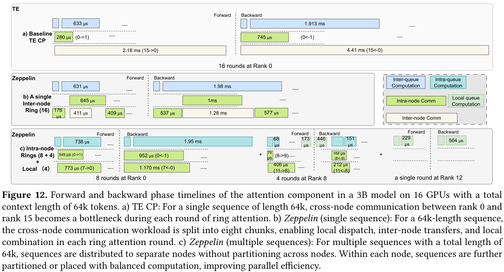

🧪 图 12 用 timeline 展示 Zeppelin 如何改变 attention 执行。TE CP 中，rank 0 和 rank 15 之间的跨节点通信在每个 ring round 中成为瓶颈；Zeppelin 对单条 64k sequence 将跨节点通信拆成多个 chunks，并通过 dispatch/transfer/combine 使用多个 NIC；对于多个小 sequence，Zeppelin 直接把 sequence 分到不同 node buckets，避免跨节点切分。

论文报告，在一个 timeline case 中，TE CP 的每轮跨节点通信约 2.18ms；Zeppelin routing 后 inter-node transfer 降到约 411us，forward phase communication cost 也明显降低。对于多个小 sequence 的情况，Zeppelin 将 per-round cost 从 TE CP 的 105.44ms 降到 21.504ms。

## 💡 亮点总结
- ✨ 问题建模扎实：Zeppelin 没有泛泛谈“负载不均衡”，而是区分 linear modules、quadratic attention、linear communication 和 GPU-NIC topology。
- ✨ 层次化 partitioning：local / intra-node / inter-node 三类 sequence 映射到硬件带宽层次，符合真实集群结构。
- ✨ Attention Engine 细粒度：按 sequence 类型和 ring group 调度，而不是一刀切 global CP。
- ✨ Routing Layer 很工程：利用空闲 NIC 和 intra-node 高带宽，把跨节点通信从固定 GPU-NIC 路径中解耦出来。
- ✨ Remapping Layer 补齐闭环：让 attention 和 linear modules 各自使用更合适的数据布局，而不是强迫一个 layout 覆盖所有模块。

## ⚖️ 局限性与思考
Zeppelin 的贡献很清楚，但也有一些适用边界。

首先，它主要面向长上下文、variable-length sequence 明显的数据并行训练。如果训练数据长度较均匀，或 context length 不长，Zeppelin 的复杂 partitioning 和 remapping 收益可能会下降。

其次，Zeppelin 的优化强依赖硬件拓扑：intra-node bandwidth、inter-node bandwidth、GPU-NIC affinity、NIC 数量都会影响最终收益。迁移到不同集群时，需要重新评估 local/intra/inter thresholds 和 routing 策略。

第三，系统复杂度不低。Sequence partitioning、attention queue scheduling、routing proxy selection、remapping optimization 都需要和训练框架、通信库、attention kernel 深度集成。

第四，论文主要报告 throughput，而没有过多讨论这些动态 layout transformation 对 debug、profiling、fault recovery 和 checkpointing 的工程影响。对于生产系统来说，这些也会影响落地成本。

最后，MoE 场景下 expert routing 的动态性会让 FLOP 估计更困难。论文展示了 Zeppelin 在长 context 下仍有优势，但 MoE 训练中的 token dispatch、expert imbalance 与 Zeppelin remapping/routing 的进一步联动，仍然值得深入研究。

## ✅ 结语
Zeppelin 的核心价值在于，它把 variable-length LLM training 的负载均衡问题从“怎么把 token 或 FLOPs 分均匀”推进到“不同模块、不同长度区间、不同通信层次应该采用不同策略”。这是一种很系统的思路：短序列不该被迫跨节点通信，长序列应该利用足够计算掩盖通信，linear modules 需要 token-balanced layout，跨节点通信要尽可能吃满 NIC。

我的理解是，Zeppelin 对长上下文训练系统的启发很强：未来的训练框架不能只暴露 TP/PP/DP/CP 这些静态并行维度，还需要根据 batch 内 sequence length distribution 和硬件拓扑，在 iteration 级别动态选择数据布局与通信路径。换句话说，长上下文时代的训练系统会越来越像一个“实时调度器”，而 Zeppelin 正是这个方向上的一个完整样例。
